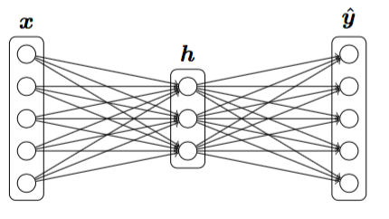
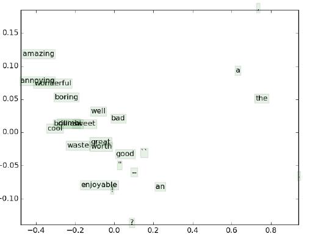
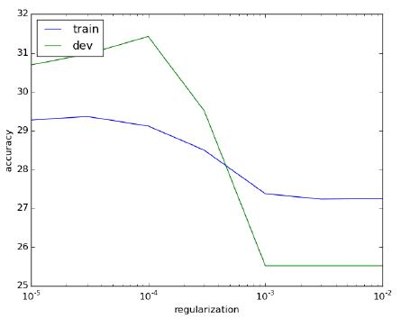

# 深度学习与自然语言处理(4)_ 斯坦福 cs224d 大作业测验 1 与解答

作业内容翻译：@胡杨(superhy199148@hotmail.com) && @胥可(feitongxiaoke@gmail.com)
解答与编排：[寒小阳](http://blog.csdn.net/han_xiaoyang) && [龙心尘](http://blog.csdn.net/longxinchen_ml)
时间：2016 年 6 月
出处：[`blog.csdn.net/han_xiaoyang/article/details/51760923`](http://blog.csdn.net/han_xiaoyang/article/details/51760923)

说明：本文为斯坦福大学 CS224d 课程的中文版内容笔记，已得到斯坦福大学课程@Richard Socher 教授的授权翻译与发表

## 0 前言

前面一个接一个的 Lecture，看得老衲自己也是一脸懵逼，不过你以为你做一个安安静静的美男子(总感觉有勇气做 deep learning 的女生也是一条汉纸)就能在 Stanford 这样的学校顺利毕业啦？图样图森破，除掉极高的内容学习梯度，这种顶尖大学的作业和考试一样会让你突(tong)飞(bu)猛(yu)进(sheng)。

说起来，怎么也是堂堂斯坦福的课，这种最看重前言研究在实际工业应用的学校，一定是理论和应用并进，对动手能力要求极强的，于是乎，我们把作业和小测验(MD 你这也敢叫小测验！！)也扒过来，整理整理，让大家都来体验体验。反正博主君自己每次折腾完这些大学的 assignment 之后，都会感慨一句，“还好不生在水生火热的万恶资本主义国家，才能让我大学和研究僧顺利毕业(什么？phd？呵呵…博主是渣渣，智商常年处于欠费状态，我就不参与你们高端人士的趴体了)”。

不能再 BB 了，直接开始做作业考试吧…

## 1 Softmax (10 分)

**(part a)** (5 分)
证明针对任何输入向量和常数 c，softmax 函数的输出不会随着输入向量偏移（也就是常数 c）而改变。即：

其中就是给每一个元素加上常数 c。注意：

提示：在实际应用中，经常会用到这个性质。为了稳定地计算 softmax 概率，我们会选择。（即将的每个元素减去最大的那个元素）。

> 博主：熬过了高中，居然又看见证明了，也是惊(ri)喜(le)万(gou)分(le)，答案拿来！！！

**解答：**

证明，针对所有维度：

**(part b)** (5 分)
已知一个 N 行 d 列的输入矩阵，计算每一行的 softmax 概率。在 q1_softmax.py 中写出你的实现过程，并使用[Python](http://lib.csdn.net/base/11 "undefined") q1_softmax.py 执行。

要求：你所写的代码应该尽可能的有效并以向量化的形式来实现。非向量化的实现将不会得到满分。

> 博主：简直要哭晕在厕所了，当年毕业设计也是加论文一星期都可以写完的节奏，这里一个 5 分的作业，还这么多要求…社会主义好…答案拿来！！！

```
import numpy as np

def softmax(x):
    """
        Softmax 函数
    """
    assert len(x.shape) > 1, "Softmax 的得分向量要求维度高于 1"
    x -= np.max(x, axis=1, keepdims=True)
    x = np.exp(x) / np.sum(np.exp(x), axis=1, keepdims=True)

    return x
```

## 2 神经网络基础（30 分）

**(part a)** (3 分)
推导 sigmoid 函数的导数，并且只以 sigmoid 函数值的形式写出来（导数的表达式里只包含，不包含 x）。证明针对这个问题没必要单独考虑 x。方便回忆：下面给出 sigmoid 函数形式：

> 旁白：我年纪轻轻干嘛要走上深度学习这条不归路，真是生无所恋了。

**答案**：。

**(part b)** (3 分)
当使用交叉熵损失来作为评价标准时,推导出损失函数以 softmax 为预测结果的输入向量的梯度。注意，

其中是一个 one-hot 向量，是所有类别的预测出的概率向量。（提示：你需要考虑的许多元素为 0，并且假设仅有第 k 个类别是 1）

**答案：**

或者等价于下面表达式，其中假设 k 是正确的类别

**(part c)** (6 分)
推导出单隐层神经网络关于输入的梯度（也就是推导出，其中 J 是神经网络的损失函数）。这个神经网络在隐层和输出层采用了 sigmoid 激活函数，是 one-hot 编码向量，使用了交叉熵损失。（使用 作为 sigmoid 梯度，并且你可以任意为推导过中的中间变量命名）



前向传播方程如下：

在编程问题中，我们假设输入向量（隐层变量和输出概率）始终是一个行向量。此处我们约定，当我们说要对向量使用 sigmoid 函数时，也就是说要对向量每一个元素使用 sigmoid 函数。和（其中 i=1，2）分别是两层的权重和偏移。

> 旁白：好好的 100 分总分，硬要被你这么 5 分 6 分地拆，人家 5 分 6 分是一道选择题，你特么是一整个毕业设计！！好吧，不哭，跪着也要把题目做完，代码写完。哎，博主还是太年轻，要多学习啊。

**答案**：令 ， ，于是可得：

**(part d)** (2 分)
上面所说的这个神经网络有多少个参数？我们可以假设输入是维，输出是，隐层单元有 H 个。

> 旁白：还有 part d！！！

**答案:** .

**(part e)** (4 分) 在 q2_sigmoid.py 中补充写出 sigmoid 激活函数的和求它的梯度的对应代码。并使用 python q2_sigmoid.py 进行测试，同样的，测试用例有可能不太详尽，因此尽量检查下自己的代码。

> 旁白：如果博主没有阵亡，就在走向阵亡的路上…

```
def sigmoid_grad(f):
    """ 
        计算 Sigmoid 的梯度 
    """
    #好在我有 numpy
    f = f * ( 1 - f )

    return f
```

**(part f)** (4 分)
为了方便 debugging，我们需要写一个梯度检查器。在 q2_gradcheck.py 中补充出来，使用 python q2_gradcheck.py 测试自己的代码。

> 旁白：做到昏天黑地，睡一觉起来又是一条好汉…

```
def gradcheck_naive(f, x):
    """ 
        对一个函数 f 求梯度的梯度检验 
        - f 输入 x，然后输出 loss 和梯度的函数
        - x 就是输入咯
    """ 
    rndstate = random.getstate()
    random.setstate(rndstate)  
    fx, grad = f(x)
    h = 1e-4

    # 遍历 x 的每一维
    it = np.nditer(x, flags=['multi_index'], op_flags=['readwrite'])
    while not it.finished:
        ix = it.multi_index

        old_val = x[ix]
        x[ix] = old_val - h
        random.setstate(rndstate)
        ( fxh1, _ ) = f(x)

        x[ix] = old_val + h
        random.setstate(rndstate)
        ( fxh2, _ ) = f(x)

        numgrad = (fxh2 - fxh1)/(2*h)
        x[ix] = old_val

        # 比对梯度
        reldiff = abs(numgrad - grad[ix]) / max(1, abs(numgrad), abs(grad[ix]))
        if reldiff > 1e-5:
            print "Gradient check failed."
            print "First gradient error found at index %s" % str(ix)
            print "Your gradient: %f \t Numerical gradient: %f" % (grad[ix], numgrad)
            return

        it.iternext() # Step to next dimension

    print "Gradient check passed!"
```

**(part g)** (8 分)
现在，在 q2 neural.py 中，写出只有一个隐层且激活函数为 sigmoid 的神经网络前向和后向传播代码。使用 python q2_neural.py 测试自己的代码。

> 旁白：一入 DL 深似海…

```
def forward_backward_prop(data, labels, params, verbose = False):
    """ 
        2 个隐层的神经网络的前向运算和反向传播
    """

    if len(data.shape) >= 2:
        (N, _) = data.shape

    ### 展开每一层神经网络的参数
    t = 0
    W1 = np.reshape(params[t:t+dimensions[0]*dimensions[1]], (dimensions[0], dimensions[1]))
    t += dimensions[0]*dimensions[1]
    b1 = np.reshape(params[t:t+dimensions[1]], (1, dimensions[1]))
    t += dimensions[1]
    W2 = np.reshape(params[t:t+dimensions[1]*dimensions[2]], (dimensions[1], dimensions[2]))
    t += dimensions[1]*dimensions[2]
    b2 = np.reshape(params[t:t+dimensions[2]], (1, dimensions[2]))

    ### 前向运算

    # 第一个隐层做内积
    a1 = sigmoid(data.dot(W1) + b1)    
    # 第二个隐层做内积
    a2 = softmax(a1.dot(W2) + b2)

    cost = - np.sum(np.log(a2[labels == 1]))/N

    ### 反向传播

    # Calculate analytic gradient for the cross entropy loss function
    grad_a2 = ( a2 - labels ) / N

    # Backpropagate through the second latent layer
    gradW2 = np.dot( a1.T, grad_a2 )
    gradb2 = np.sum( grad_a2, axis=0, keepdims=True )

    # Backpropagate through the first latent layer
    grad_a1 = np.dot( grad_a2, W2.T ) * sigmoid_grad(a1)

    gradW1 = np.dot( data.T, grad_a1 )
    gradb1 = np.sum( grad_a1, axis=0, keepdims=True )

    if verbose: # Verbose mode for logging information
        print "W1 shape: {}".format( str(W1.shape) )
        print "W1 gradient shape: {}".format( str(gradW1.shape) )
        print "b1 shape: {}".format( str(b1.shape) )
        print "b1 gradient shape: {}".format( str(gradb1.shape) )

    ### 梯度拼起来
    grad = np.concatenate((gradW1.flatten(), gradb1.flatten(), gradW2.flatten(), gradb2.flatten()))

    return cost, grad
```

## 3 word2vec(40 分+5 附加分)

**(part a)** (3 分)
假设你得到一个关联到中心词的预测词向量，并且这个词向量使用 skip-gram 方法生成，预测词使用的是 softmax 预测函数，它能够在`word2vec`模型中被找到。 

式中，代表第 w 个词，是词库中全体词汇的输出词向量。假设为交叉熵损失函数，且词是被预测的词汇（noe-hot/独热模型的标记向量中第个元素为 1），求解预测词向量 的所对应的梯度。
*提示：问题 2 中的标记法将有助于此问题的解答。比如：设为各个词汇使用 softmax 函数预测得到的向量，为期望词向量，而损失函数可以表示为：* 

其中，是全体输出向量形成的矩阵，*确保你已经规定好你的向量和矩阵的方向。*

> 旁边：是的，旁白我已经不知道写什么了，感谢党感谢祖国吧。

**解答：**设为词汇 softmax 预测结果的列向量，是同样形为列向量的独热标签，那么有： 

或者等同于：

**(part b)** (3 分)
条件仍然如前一题所描述，求解输出词向量的梯度（包括在内）

> 旁白：我还是安安静静在天朝搬砖吧

**解答：**

或者等同于：

**(part c)** (6 分)
仍然延续(part a)和(part b)，假设我们使用为预测的向量使用负采样损失的计算方式，并且设定期望输出词为。假设获得了个负样例（词），并且被记为，分别作为这些样例的标签。那么，对于一个给定的词，将其输出向量记作。这里，负采样损失函数如下： 

其中，为 sigmoid 激活函数。

当你完成上述操作之后，尝试简要描述这个损失函数比 softmax-CE 损失函数计算更为有效的原因（你可以给出递增式的学习率，即，给出 softmax-CE 损失函数的计算时间除以负采样损失函数的计算时间的结果）。

*注释：由于我们打算计算目标函数的最小值而不是最大值，这里提到的损失函数与 Mikolov 等人最先在原版论文中描述的正好相反。*

> 旁白：突然想起来，小时候好焦虑，长大后到底去清华还是去北大，后来发现多虑了。我想如果当初走了狗屎运进了贵 T 大贵 P 大，也一定完不成学业。

**解答：**

**(part d)** (8 分)
试得到由 skip-gram 和 CBOW 算法分别算出的全部词向量的梯度，前提步骤和词内容集合[wordc-m,…,wordc-1,wordc,wordc+1,…,wordc+m]都已给出，其中，是窗口的大小。将词的输入和输出词向量分别记为和。
*提示：可以随意使用函数（其中代表词汇）作为这一部分中或损失函数的占位符——你将在编程部分看到一个非常有用的抽象类，那意味着你的解决方法可以用这样的形式表达：*
回忆 skip-gram 算法，以为中心周边内容的损失值计算如下： 

其中，代表距离中心词的第 j 个词。
CBOW 略有不同，不同于使用作为预测向量，我们以为底，在 CBOW 中（一个小小的变体），我们计算上下文输入词向量的和: 

于是，CBOW 的损失函数定义为：

*注释：为了符合在诸如代码部分中的各种表达规范，在 skip-gram 方法中，令：。*

> 旁白：我诚实一点，这个部分真的是烦了课件抄下来的。

**解答：**为了表达得更为清晰，我们将词库中全部词汇的全部输出向量集合记作，给定一个损失函数，我们可以很容易获得以下引出结果：
 和 对于 skip-gram 方法，一个内容窗口的损失梯度为： 

同样地，对于 CBOW 则有：

**(part e)** (12 分)
在这一部分，你将实现 word2vec 模型，并且使用随机梯度下降方法（SGD）训练属于你自己的词向量。首先，在代码`q3_word2vec.py`中编写一个辅助函数对矩阵中的每一行进行归一化。同样在这个文件中，完成对 softmax、负采样损失函数以及梯度计算函数的实现。然后，完成面向 skip-gram 的梯度损失函数。当你完成这些的时候，使用命令：`python q3_word2vec.py`对编写的程序进行测试。
*注释：如果你选择不去实现 CBOW(h 部分)，只需简单地删除对 NotImplementedError 错误的捕获即可完成你的测试。*

> 旁白：前方高能预警，代码量爆炸了！

```
import numpy as np
import random

from q1_softmax import softmax
from q2_gradcheck import gradcheck_naive
from q2_sigmoid import sigmoid, sigmoid_grad

def normalizeRows(x):
    """ 
        行归一化函数 
    """

    N = x.shape[0]
    x /= np.sqrt(np.sum(x**2, axis=1)).reshape((N,1)) + 1e-30

    return x

def test_normalize_rows():
    print "Testing normalizeRows..."
    x = normalizeRows(np.array([[3.0,4.0],[1, 2]])) 
    # 结果应该是 [[0.6, 0.8], [0.4472, 0.8944]]
    print x
    assert (np.amax(np.fabs(x - np.array([[0.6,0.8],[0.4472136,0.89442719]]))) <= 1e-6)
    print ""

def softmaxCostAndGradient(predicted, target, outputVectors, dataset):
    """ 
        word2vec 的 Softmax 损失函数 
    """                                                   

    # 输入: 
    # - predicted: 预测词向量的 numpy 数组
    # - target: 目标词的下标 
    # - outputVectors: 所有 token 的"output"向量(行形式) 
    # - dataset: 用来做负例采样的，这里其实没用着 

    # 输出: 
    # - cost: 输出的互熵损失 
    # - gradPred: the gradient with respect to the predicted word 
    #        vector 
    # - grad: the gradient with respect to all the other word 
    #        vectors 

    probabilities = softmax(predicted.dot(outputVectors.T))
    cost = -np.log(probabilities[target])
    delta = probabilities
    delta[target] -= 1
    N = delta.shape[0]
    D = predicted.shape[0]
    grad = delta.reshape((N,1)) * predicted.reshape((1,D))
    gradPred = (delta.reshape((1,N)).dot(outputVectors)).flatten()

    return cost, gradPred, grad

def negSamplingCostAndGradient(predicted, target, outputVectors, dataset, 
    K=10):
    """ 
        Word2vec 模型负例采样后的损失函数和梯度
    """

    grad = np.zeros(outputVectors.shape)
    gradPred = np.zeros(predicted.shape)

    indices = [target]
    for k in xrange(K):
        newidx = dataset.sampleTokenIdx()
        while newidx == target:
            newidx = dataset.sampleTokenIdx()
        indices += [newidx]

    labels = np.array([1] + [-1 for k in xrange(K)])
    vecs = outputVectors[indices,:]

    t = sigmoid(vecs.dot(predicted) * labels)
    cost = -np.sum(np.log(t))

    delta = labels * (t - 1)
    gradPred = delta.reshape((1,K+1)).dot(vecs).flatten()
    gradtemp = delta.reshape((K+1,1)).dot(predicted.reshape(
        (1,predicted.shape[0])))
    for k in xrange(K+1):
        grad[indices[k]] += gradtemp[k,:]

     t = sigmoid(predicted.dot(outputVectors[target,:]))
     cost = -np.log(t)
     delta = t - 1

     gradPred += delta * outputVectors[target, :]
     grad[target, :] += delta * predicted

     for k in xrange(K):
         idx = dataset.sampleTokenIdx()

         t = sigmoid(-predicted.dot(outputVectors[idx,:]))
         cost += -np.log(t)
         delta = 1 - t

         gradPred += delta * outputVectors[idx, :]
         grad[idx, :] += delta * predicted

    return cost, gradPred, grad

def skipgram(currentWord, C, contextWords, tokens, inputVectors, outputVectors, 
    dataset, word2vecCostAndGradient = softmaxCostAndGradient):
    """ Skip-gram model in word2vec """

    # skip-gram 模型的实现

    # 输入: 
    # - currrentWord: 当前中心词所对应的串 
    # - C: 上下文大小(词窗大小) 
    # - contextWords: 最多 2*C 个词 
    # - tokens: 对应词向量中词下标的字典 
    # - inputVectors: "input" word vectors (as rows) for all tokens 
    # - outputVectors: "output" word vectors (as rows) for all tokens 
    # - word2vecCostAndGradient: the cost and gradient function for a prediction vector given the target word vectors, could be one of the two cost functions you implemented above

    # 输出: 
    # - cost: skip-gram 模型算得的损失值 
    # - grad: 词向量对应的梯度 

    currentI = tokens[currentWord]
    predicted = inputVectors[currentI, :]

    cost = 0.0
    gradIn = np.zeros(inputVectors.shape)
    gradOut = np.zeros(outputVectors.shape)
    for cwd in contextWords:
        idx = tokens[cwd]
        cc, gp, gg = word2vecCostAndGradient(predicted, idx, outputVectors, dataset)
        cost += cc
        gradOut += gg
        gradIn[currentI, :] += gp

    return cost, gradIn, gradOut

def word2vec_sgd_wrapper(word2vecModel, tokens, wordVectors, dataset, C, word2vecCostAndGradient = softmaxCostAndGradient):
    batchsize = 50
    cost = 0.0
    grad = np.zeros(wordVectors.shape)
    N = wordVectors.shape[0]
    inputVectors = wordVectors[:N/2,:]
    outputVectors = wordVectors[N/2:,:]
    for i in xrange(batchsize):
        C1 = random.randint(1,C)
        centerword, context = dataset.getRandomContext(C1)

        if word2vecModel == skipgram:
            denom = 1
        else:
            denom = 1

        c, gin, gout = word2vecModel(centerword, C1, context, tokens, inputVectors, outputVectors, dataset, word2vecCostAndGradient)
        cost += c / batchsize / denom
        grad[:N/2, :] += gin / batchsize / denom
        grad[N/2:, :] += gout / batchsize / denom

    return cost, grad

def test_word2vec():
    # Interface to the dataset for negative sampling
    dataset = type('dummy', (), {})()
    def dummySampleTokenIdx():
        return random.randint(0, 4)

    def getRandomContext(C):
        tokens = ["a", "b", "c", "d", "e"]
        return tokens[random.randint(0,4)], [tokens[random.randint(0,4)] \
           for i in xrange(2*C)]
    dataset.sampleTokenIdx = dummySampleTokenIdx
    dataset.getRandomContext = getRandomContext

    random.seed(31415)
    np.random.seed(9265)
    dummy_vectors = normalizeRows(np.random.randn(10,3))
    dummy_tokens = dict([("a",0), ("b",1), ("c",2),("d",3),("e",4)])
    print "==== Gradient check for skip-gram ===="
    gradcheck_naive(lambda vec: word2vec_sgd_wrapper(skipgram, dummy_tokens, vec, dataset, 5), dummy_vectors)
    gradcheck_naive(lambda vec: word2vec_sgd_wrapper(skipgram, dummy_tokens, vec, dataset, 5, negSamplingCostAndGradient), dummy_vectors)
    print "\n==== Gradient check for CBOW      ===="
    gradcheck_naive(lambda vec: word2vec_sgd_wrapper(cbow, dummy_tokens, vec, dataset, 5), dummy_vectors)
    gradcheck_naive(lambda vec: word2vec_sgd_wrapper(cbow, dummy_tokens, vec, dataset, 5, negSamplingCostAndGradient), dummy_vectors)

    print "\n=== Results ==="
    print skipgram("c", 3, ["a", "b", "e", "d", "b", "c"], dummy_tokens, dummy_vectors[:5,:], dummy_vectors[5:,:], dataset)
    print skipgram("c", 1, ["a", "b"], dummy_tokens, dummy_vectors[:5,:], dummy_vectors[5:,:], dataset, negSamplingCostAndGradient)
    print cbow("a", 2, ["a", "b", "c", "a"], dummy_tokens, dummy_vectors[:5,:], dummy_vectors[5:,:], dataset)
    print cbow("a", 2, ["a", "b", "a", "c"], dummy_tokens, dummy_vectors[:5,:], dummy_vectors[5:,:], dataset, negSamplingCostAndGradient)

if __name__ == "__main__":
    test_normalize_rows()
    test_word2vec()
```

(f) (4 分) 在代码`q3_sgd.py`中完成对随即梯度下降优化函数的实现。并且在该代码中运行测试你的实现。

> 旁白：想到这篇文章有可能会被无数可以智商碾压我的大神看到，就脸一阵发烫。

```
# 实现随机梯度下降

# 随机梯度下降每 1000 轮，就保存一下现在训练得到的参数
SAVE_PARAMS_EVERY = 1000

import glob
import os.path as op
import cPickle as pickle
import sys

def load_saved_params():
    """
        载入之前的参数以免从头开始训练
    """
    st = 0
    for f in glob.glob("saved_params_*.npy"):
        iter = int(op.splitext(op.basename(f))[0].split("_")[2])
        if (iter > st):
            st = iter

    if st > 0:
        with open("saved_params_%d.npy" % st, "r") as f:
            params = pickle.load(f)
            state = pickle.load(f)
        return st, params, state
    else:
        return st, None, None

def save_params(iter, params):
    with open("saved_params_%d.npy" % iter, "w") as f:
        pickle.dump(params, f)
        pickle.dump(random.getstate(), f)

def sgd(f, x0, step, iterations, postprocessing = None, useSaved = False, PRINT_EVERY=10, ANNEAL_EVERY = 20000):
    """ 随机梯度下降 """
    ###########################################################
    # 输入
    #   - f: 需要最优化的函数
    #   - x0: SGD 的初始值
    #   - step: SGD 的步长
    #   - iterations: 总得迭代次数
    #   - postprocessing: 参数后处理（比如 word2vec 里需要对词向量做归一化处理）
    #   - PRINT_EVERY: 指明多少次迭代以后输出一下状态
    # 输出: 
    #   - x: SGD 完成后的输出参数                   #
    ###########################################################

    if useSaved:
        start_iter, oldx, state = load_saved_params()
        if start_iter > 0:
            x0 = oldx;
            step *= 0.5 ** (start_iter / ANNEAL_EVERY)

        if state:
            random.setstate(state)
    else:
        start_iter = 0

    x = x0

    if not postprocessing:
        postprocessing = lambda x: x

    expcost = None

    for iter in xrange(start_iter + 1, iterations + 1):
        cost, grad = f(x)
        x = x - step * grad
        x = postprocessing(x)

        if iter % PRINT_EVERY == 0:
            print "Iter#{}, cost={}".format(iter, cost)
            sys.stdout.flush()

        if iter % SAVE_PARAMS_EVERY == 0 and useSaved:
            save_params(iter, x)

        if iter % ANNEAL_EVERY == 0:
            step *= 0.5

    return x
```

**(part g)** (4 分)
开始秀啦！现在我们将要载入真实的数据并使用你已经实现的手段训练词向量！我们将使用 Stanford Sentiment Treebank (SST)数据集来进行词向量的训练，之后将他们应用到情感分析任务中去。在这一部分中，无需再编写更多的代码；只需要运行命令`python q3 run.py`即可。
*注释：训练过程所占用的时间可能会很长，这取决于你所实现的程序的效率（**一个拥有优异效率的实现程序大约需要占用 1 个小时**）。努力去接近这个目标！*
当脚本编写完成，需要完成对词向量的可视化显示。相应的结果同样被保存下来，如项目目录中的图片`q3 word_vectors.png`所示。**包括在你作业中绘制的坐标图。**简明解释最多三个句子在你的坐标图中的显示状况。
**解答：**



**(part h)** 附加题（5 分）

在代码`q3_word2vec.py`中完成对 CBOW 的实现。*注释：这部分内容是可选的，但是在 d 部分中关于 CBOW 的梯度推导在这里并不适用！*

```
def cbow(currentWord, C, contextWords, tokens, inputVectors, outputVectors, 
    dataset, word2vecCostAndGradient = softmaxCostAndGradient):
    """
        word2vec 的 CBOW 模型
    """

    cost = 0
    gradIn = np.zeros(inputVectors.shape)
    gradOut = np.zeros(outputVectors.shape)

     D = inputVectors.shape[1]
     predicted = np.zeros((D,))

     indices = [tokens[cwd] for cwd in contextWords]
     for idx in indices:
         predicted += inputVectors[idx, :]

     cost, gp, gradOut = word2vecCostAndGradient(predicted, tokens[currentWord], outputVectors, dataset)
     gradIn = np.zeros(inputVectors.shape)
     for idx in indices:
         gradIn[idx, :] += gp

    return cost, gradIn, gradOut
```

## 4 情感分析（20 分）

现在，随着词向量的训练，我们准备展示一个简单的情感分析案例。随着词向量的训练，我们准备展示一个简单的情感分析。对于每条 Stanford Sentiment Treebank 数据集中的句子，将句子中全体词向量的平均值算作其特征值，并试图预测所提句子中的情感层次。短语的情感层次使用真实数值在原始数据集中表示，并被我们用以下 5 个类别来表示：

“超级消极”，“比较消极”，“中立”，“积极”，“非常积极”

对其分别进行从 0 到 4 的编码。在这一部分，你将学习用 SGD 来训练一个 softmax 回归机，并且通过不断地训练／调试验证来提高回归机的泛化能力。
**(part a)**（10 分）
实现一个句子的特征生成器和 softmax 回归机。在代码`q4_softmaxreg.py`中完成对这个任务的实现，并运行命令`python q4_ softmaxreg.py`，对刚才完成的功能函数进行调试。

```
import numpy as np
import random

from cs224d.data_utils import *

from q1_softmax import softmax
from q2_gradcheck import gradcheck_naive
from q3_sgd import load_saved_params

def getSentenceFeature(tokens, wordVectors, sentence):
    """ 
        简单粗暴的处理方式，直接对句子的所有词向量求平均做为情感分析的输入
    """

    # 输入: 
    # - tokens: a dictionary that maps words to their indices in the word vector list 
    # - wordVectors: word vectors (each row) for all tokens 
    # - sentence: a list of words in the sentence of interest 

    # 输出: 
    # - sentVector: feature vector for the sentence 

    sentVector = np.zeros((wordVectors.shape[1],))

    indices = [tokens[word] for word in sentence]
    sentVector = np.mean(wordVectors[indices, :], axis=0)

    return sentVector

def softmaxRegression(features, labels, weights, regularization = 0.0, nopredictions = False):
    """ Softmax Regression """
    # 完成加正则化的 softmax 回归 

    # 输入: 
    # - features: feature vectors, each row is a feature vector 
    # - labels: labels corresponding to the feature vectors 
    # - weights: weights of the regressor 
    # - regularization: L2 regularization constant 

    # 输出: 
    # - cost: cost of the regressor 
    # - grad: gradient of the regressor cost with respect to its weights 
    # - pred: label predictions of the regressor (you might find np.argmax helpful) 

    prob = softmax(features.dot(weights))
    if len(features.shape) > 1:
        N = features.shape[0]
    else:
        N = 1
    # A vectorized implementation of    1/N * sum(cross_entropy(x_i, y_i)) + 1/2*|w|²
    cost = np.sum(-np.log(prob[range(N), labels])) / N 
    cost += 0.5 * regularization * np.sum(weights ** 2)

    grad = np.array(prob)
    grad[range(N), labels] -= 1.0
    grad = features.T.dot(grad) / N
    grad += regularization * weights

    if N > 1:
        pred = np.argmax(prob, axis=1)
    else:
        pred = np.argmax(prob)

    if nopredictions:
        return cost, grad
    else:
        return cost, grad, pred

def accuracy(y, yhat):
    """ Precision for classifier """
    assert(y.shape == yhat.shape)
    return np.sum(y == yhat) * 100.0 / y.size

def softmax_wrapper(features, labels, weights, regularization = 0.0):
    cost, grad, _ = softmaxRegression(features, labels, weights, 
        regularization)
    return cost, grad

def sanity_check():
    """
    Run python q4_softmaxreg.py.
    """
    random.seed(314159)
    np.random.seed(265)

    dataset = StanfordSentiment()
    tokens = dataset.tokens()
    nWords = len(tokens)

    _, wordVectors0, _ = load_saved_params()
    wordVectors = (wordVectors0[:nWords,:] + wordVectors0[nWords:,:])
    dimVectors = wordVectors.shape[1]

    dummy_weights = 0.1 * np.random.randn(dimVectors, 5)
    dummy_features = np.zeros((10, dimVectors))
    dummy_labels = np.zeros((10,), dtype=np.int32)    
    for i in xrange(10):
        words, dummy_labels[i] = dataset.getRandomTrainSentence()
        dummy_features[i, :] = getSentenceFeature(tokens, wordVectors, words)
    print "==== Gradient check for softmax regression ===="
    gradcheck_naive(lambda weights: softmaxRegression(dummy_features,
        dummy_labels, weights, 1.0, nopredictions = True), dummy_weights)

    print "\n=== Results ==="
    print softmaxRegression(dummy_features, dummy_labels, dummy_weights, 1.0)

if __name__ == "__main__":
    sanity_check()
```

**(part b)**（2 分）
解释当分类语料少于三句时为什么要引入正则化（实际上在大多数[机器学习](http://lib.csdn.net/base/2 "undefined")任务都这样）。
**解答：**为了避免训练集的过拟合以及对未知数据集的适应力不佳现象。

**(part c)**（4 分）
在`q4 sentiment.py`中完成超参数的实现代码从而获取“最佳”的惩罚因子。**你是如何选择的？报告你的训练、调试和测试精度，在最多一个句子中校正你的超参数选定方法。** *注释：在开发中应该获取至少 30%的准确率。*
**解答：**参考值为 1e-4，在调试、开发和测试过程中准确率分别为 29.1%，31.4％和 27.6%

```
import numpy as np
import matplotlib.pyplot as plt

from cs224d.data_utils import *

from q3_sgd import load_saved_params, sgd
from q4_softmaxreg import softmaxRegression, getSentenceFeature, accuracy, softmax_wrapper

# 试试不同的正则化系数，选最好的
REGULARIZATION = [0.0, 0.00001, 0.00003, 0.0001, 0.0003, 0.001, 0.003, 0.01]

# 载入数据集
dataset = StanfordSentiment()
tokens = dataset.tokens()
nWords = len(tokens)

# 载入预训练好的词向量 
_, wordVectors0, _ = load_saved_params()
wordVectors = (wordVectors0[:nWords,:] + wordVectors0[nWords:,:])
dimVectors = wordVectors.shape[1]

# 载入训练集
trainset = dataset.getTrainSentences()
nTrain = len(trainset)
trainFeatures = np.zeros((nTrain, dimVectors))
trainLabels = np.zeros((nTrain,), dtype=np.int32)
for i in xrange(nTrain):
    words, trainLabels[i] = trainset[i]
    trainFeatures[i, :] = getSentenceFeature(tokens, wordVectors, words)

# 准备好训练集的特征
devset = dataset.getDevSentences()
nDev = len(devset)
devFeatures = np.zeros((nDev, dimVectors))
devLabels = np.zeros((nDev,), dtype=np.int32)
for i in xrange(nDev):
    words, devLabels[i] = devset[i]
    devFeatures[i, :] = getSentenceFeature(tokens, wordVectors, words)

# 尝试不同的正则化系数
results = []
for regularization in REGULARIZATION:
    random.seed(3141)
    np.random.seed(59265)
    weights = np.random.randn(dimVectors, 5)
    print "Training for reg=%f" % regularization 

    # batch optimization
    weights = sgd(lambda weights: softmax_wrapper(trainFeatures, trainLabels, 
        weights, regularization), weights, 3.0, 10000, PRINT_EVERY=100)

    # 训练集上测效果
    _, _, pred = softmaxRegression(trainFeatures, trainLabels, weights)
    trainAccuracy = accuracy(trainLabels, pred)
    print "Train accuracy (%%): %f" % trainAccuracy

    # dev 集合上看效果
    _, _, pred = softmaxRegression(devFeatures, devLabels, weights)
    devAccuracy = accuracy(devLabels, pred)
    print "Dev accuracy (%%): %f" % devAccuracy

    # 保存结果权重
    results.append({
        "reg" : regularization, 
        "weights" : weights, 
        "train" : trainAccuracy, 
        "dev" : devAccuracy})

# 输出准确率
print ""
print "=== Recap ==="
print "Reg\t\tTrain\t\tDev"
for result in results:
    print "%E\t%f\t%f" % (
        result["reg"], 
        result["train"], 
        result["dev"])
print ""

# 选最好的正则化系数
BEST_REGULARIZATION = None
BEST_WEIGHTS = None

best_dev = 0
for result in results:
    if result["dev"] > best_dev:
        best_dev = result["dev"]
        BEST_REGULARIZATION = result["reg"]
        BEST_WEIGHTS = result["weights"]

# Test your findings on the test set
testset = dataset.getTestSentences()
nTest = len(testset)
testFeatures = np.zeros((nTest, dimVectors))
testLabels = np.zeros((nTest,), dtype=np.int32)
for i in xrange(nTest):
    words, testLabels[i] = testset[i]
    testFeatures[i, :] = getSentenceFeature(tokens, wordVectors, words)

_, _, pred = softmaxRegression(testFeatures, testLabels, BEST_WEIGHTS)
print "Best regularization value: %E" % BEST_REGULARIZATION
print "Test accuracy (%%): %f" % accuracy(testLabels, pred)

# 画出正则化和准确率的关系
plt.plot(REGULARIZATION, [x["train"] for x in results])
plt.plot(REGULARIZATION, [x["dev"] for x in results])
plt.xscale('log')
plt.xlabel("regularization")
plt.ylabel("accuracy")
plt.legend(['train', 'dev'], loc='upper left')
plt.savefig("q4_reg_v_acc.png")
plt.show()
```

(d)（4 分）绘出在训练和开发过程中的分类准确率，并在 x 轴使用对数刻度来对正则化值进行相关设置。这应该自动化的进行。**包括在你作业中详细展示的坐标图`q4_reg_acc.png`。**简明解释最多三个句子在此坐标图中的显示情况。
**解答：**

