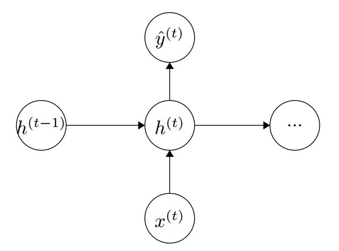
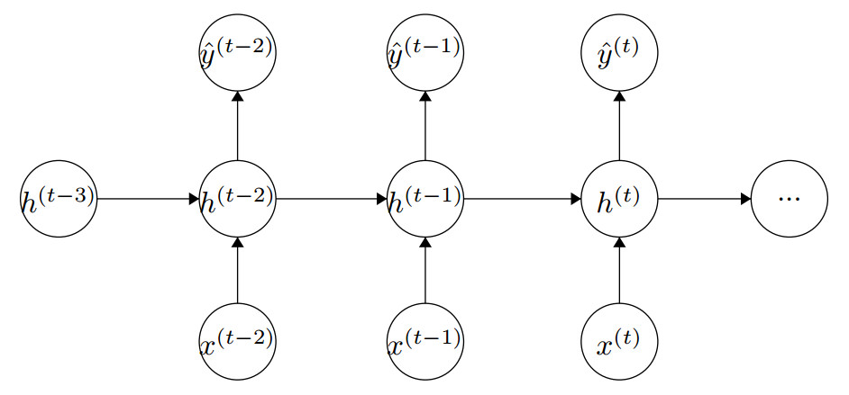

# 深度学习与自然语言处理(5)_ 斯坦福 cs224d 大作业测验 2 与解答

作业内容翻译：@胡杨(superhy199148@hotmail.com) && @[面包君](http://blog.csdn.net/breada) && Fantzy 同学
校正与调整：[寒小阳](http://blog.csdn.net/han_xiaoyang) && [龙心尘](http://blog.csdn.net/longxinchen_ml)
时间：2016 年 7 月
出处：[`blog.csdn.net/han_xiaoyang/article/details/51815683`](http://blog.csdn.net/han_xiaoyang/article/details/51815683)
[`blog.csdn.net/longxinchen_ml/article/details/51814343`](http://blog.csdn.net/longxinchen_ml/article/details/51814343)

说明：本文为斯坦福大学 CS224d 课程的中文版内容笔记，已得到斯坦福大学课程@Richard Socher 教授的授权翻译

### 0\. 前言

原本打算把作业和答案做个编排，一起发出来给大家看，无奈代码量有点大，贴上来以后文章篇幅过长，于是乎题目的代码解答放到了[百度云盘](https://pan.baidu.com/s/1c21Cvyo)，欢迎自行下载和运行或者调整。

### 1\. Tensorflow 与 softmax（20 分）

在本题中，我们会执行一个线性分类器，并会用到下面的交叉熵损失函数：

（请注意，这里行 的是行特征向量)。我们会通过 Tensorflow 的自动微分功能来训练数据。

**a.（4 分）**
在脚本`q1_softmax.py`中，通过 TensorFlow 来构造 softmax 函数。softmax 的公式如下：

请注意，你**不能**使用 Tensorflow 内建的`tf.nn.softmax`函数或者其他相关内建函数。这道题目做好的标准是你能够通过运行`[Python](http://lib.csdn.net/base/11 "undefined") q1_softmax.py`命令将这个函数跑起来（需要跑通一个测试用例。当然，不要求完全详尽的测试。）

**b. （4 分）**
在脚本`q1_softmax.py`中，通过 TensorFlow 来构造交叉熵损失函数（Cross Entropy Loss）。交叉熵损失函数的公式长这个样子：

在这里  是一个 one-hot 标签向量，是所有类目的数量。请注意，你**不能**使用 Tensorflow 内建的`cross-entropy`函数或者其他相关内建函数。这道题目做好的标准是你能够通过运行 Python `q1_softmax.py`脚本将这个函数跑起来（需要写一个测试用例。当然，这同样不要求完全详尽的测试。）

**c. （4 分）**
请仔细学习`model.py`脚本中的`model`类。并简要解释一下其中占位符变量 (place holder vaiables)和填充字典（feed dictionaries）函数的目的. 在`q1_classifier.py`中填充好`add_palceholders`和`creat_feed_dict`这两个函数.
**提示**: 请注意配置变量（configuration variables）在`config`类中已经储存好了，而在代码中你会用到它们。
**答案**：在 Tensorflow 计算图中，占位符变量是作为其输入节点而存在的。而填充字典函数说明了在计算的时候怎么给这些占位符（或者其他）变量赋值。

**d. （4 分）**
在脚本`ql_classifier.py`中的`add_model`函数里完成一个用 softmax 进行分类的基本流程。并在同一个脚本中的函数`add_loss_op`中补充好交叉熵损失函数。 请注意，使用本题之前提供的函数，而**不是** Tensorflow 内建函数。

**e. （4 分）**
在脚本`ql_classifier.py`中填充完成`add_training_op` 函数。 并解释为什么 Tensorflow 的自动微分功能能省去我们直接求梯度的工作。你可以在我们提供的数据上顺利运行`python ql_classifier.py`命令，并且确保能够跑通测试用例。这样你才能保证你的模型是合适的。
**提示**：请一定要使用在`config`类中定义的学习率.
**答案**：只要正确定义好了计算图，Tensorflow 就能自动应用反向传播算法来计算梯度。

### 2\. 神经网络在命名实体识别中的应用（35 分）

这一节中，我们会练习反向传播算法和训练深度神经网络，通过它们来实现命名实体识别。命名实体识别是指识别文本中具有特定意义的实体，主要包括人名、地名、机构名、专有名词等。
这其实就是一个 5 类分类问题（5 选 1 的单选题）。这 5 类包括上面这 4 类和 1 个非实体类——也就是不代表任何实体的类(大部词语都属于这类)。
这个模型是一个单隐藏层神经网络，它有一个类似我们在 word2vec 中看到的表示层。 这里我们不需要求平均值或者抽样，而是明确地将上下文定义为一个“窗口”，这个“窗口”包含目标词和它左右紧邻的词，是一个 3d 维度的行向量:

这里的 是 one-hot 行向量（|V|维），而 是嵌入矩阵，它的每一行 其实就代表一个特定的词 。我们然后做如下预测：

之后通过交叉熵损失函数来评估误差：

为了计算整个训练集的损失，我们在对每个训练样本计算 之后将其求和（或者求平均值）。
对于本题，令 作为词向量的长度。3 个向量组成了一个宽度为 的窗口。隐藏层有 100 个神经元,输出层有 5 个神经元.

**(part a)**
（5 分）请计算损失函数在下列模型各个参数上的梯度

，这里矩阵的维度分别是
**提示**：为了能够清晰的表示反向传播的过程，我们给您推荐两个小 trick：

*   使用激活函数的值来代替激活函数的微分。就像作业 1 中的函数一样，下面这个函数也可以起到相同的作用。

*   使用“残差向量”的形式来表示某一层的梯度。这意味着我们的链式法则，现在可以写成用括号括起来的向量(矩阵)乘法的形式，这将使您的分析过程大大简化。

值得注意的是，损失函数在模型各参数上的梯度应该化简到可以使用矩阵运算的形式。（通过作业 1，相信您已经掌握的很熟练了:)）

**答案：**
由提示公式可得：

可得偏微分如下：

我们令 ，可得：

**(part b)**（5 分）
神经网络的训练过程往往不是一帆风顺的，许多小问题都会影响模型的性能，例如神经网络中参数过多会导致训练太慢，神经元之间相关性太强会导致模型陷入局部最优。为了避免上述两种情况的发生，我们在(part a)损失函数的基础上增加一个高斯先验。可别小看这个高斯先验，它能使我们的模型参数/权重不会有那么夸张的幅度(更向 0 值靠拢)，同时又能保证大部分参数都有取值`（不会对起作用的特征产生太大影响）`，从而保证了模型在实际场景中的可用性`（泛化能力强一些）`。混合后的损失函数就长这样。

有了混合损失函数，下面就可以开始将似然函数求最大化了（就像上面我们对交叉熵求最大化那样），高斯先验在这个过程中就会变成一个平方项的形式（ 正则化项）。

要对似然函数求极大，我们所采用的方法是梯度上升，所以本题的任务还是请您来求一下梯度。与(part a)中不同的是，我们这里的损失函数多了一个由高斯先验得来的正则化项。所以，聪明的你，给我个答案吧。
**答案：**

将 和 的梯度代入即可。

**(part c)**（5 分）
在 part b 中我们了解到，如果神经元之间的相关性太强，模型就容易陷入局部最优，从而降低了模型的泛化能力。对此，我们的解决方法是使用 L2 正则化项对模型参数加以限制。在本题中，我们提供另外一种方法，叫做“参数随机初始化”。在众多参数随机初始化的方法中，我们使用最多的是 Xavier 方法。
Xavier 方法的原理是这样的：给定一个的矩阵和一个区间[]，从该范围中进行均匀采样作为，其中

好了，根据算法原理，请你在`q2_initialization.py`的`xavier_weight_init`中，用代码来实现一下吧。

**(part d)**（20 分）
在 q2_NER.py 中，我们实现了一个命名实体窗口(NER Window)模型。模型的输入是 sections（小编注：sections 在特定情况下可以看作是一句查询，每个 section 由一些 tokens 组成，即分词），输出就是命名实体的标签。您可以看一下代码，您刚刚推导的反向传播过程在代码中已经被实现了，是不是很神奇！？
以下工作需要您来完成：

*   您需要在`q2_NER.py`中实现命名实体窗口模型部分的代码，我们会根据算法正确性和程序是否可执行来进行打分。
*   您需要说明模型最佳的参数的值，主要有正则化项、特征维度、学习速率和 SGD 批量的大小等。您还需要说明模型在交叉验证集上的误差，本课程要求模型在交叉验证集上的误差不高于 0.2。
*   您需要将测试集的预测结果保存在`q2_test.predicted`文件中，格式为一行一个 label，我们会根据真实结果来评估您模型的泛化能力。
*   **提示 1**：在 debug 模式中，请将参数`max_epchs`设为 1，并且将`load_data`中`debug`参数设为`True`。
*   **提示 2**：请注意程序的时间复杂度，保证在 GPU 上不超过 15 分钟，CPU 上不超过 1 小时。

### 3.递归神经网络：语言建模(45 分)

在这一节，你将首次实现一个用于建立语言模型的递归神经网络。

语言模型的建立是 NLP 技术的核心部分，语言模型被广泛使用于语音识别，机器翻译以及其他各类系统。给出一串连续的词,关于预测其后面紧跟的词的建模方式是：

其中， 是词库中的某个词。

你的任务是实现一个递归神经网络，此网络利用隐层中的反馈信息对“历史记录”进行建模。关于形式化的表示如文献^([3])所描述:

其中， 是隐藏层的初始化向量， 是以 为 one-hot 行向量与嵌入矩阵 的乘积，这个 one-hot 行向量就是当前处理词汇的索引。具体的一些参数设置如下：

其中， 是词嵌入矩阵， 是输入词表征矩阵， 是隐藏转化矩阵，还有 是输出词表征矩阵。 是偏置值。 是词嵌入的维数， 代表词库的规模，然后 是隐层的维数。

输出向量是面向整个词库的概率分布，我们需要最优化交叉熵（非正则化的）的损失率：

其中， 是与目标词（这里表示为 ）对应的 one-hot 向量。正如注释[2]所描述的，它是一个对于单个样本点的损失率，然后我们对序列中全部样例的交叉熵损失值做求和（或求平均）计算，对数据集中的全部序列^([4])均采取上述操作以衡量模型的性能。

**(a) (5 分)**
通常地，我们使用*困惑度*来评估语言模型的性能，其定义形式如下：

即通过模型分布 得到词预测正确的逆概率。给出你是如何从交叉熵的损失率中得到困惑度的（*提示：不要忘了向量是 one-hot 形式的！*），因此如果要进行最小化操作（从算术上）意味着（从几何上讲）交叉熵损失率将被最小化，就得到了在训练集上的困惑度。**在这一部分要处理的是一个非常短小的问题-所以并不需要过大的困惑度！**
对于一个词库 中的词汇，如果你的模型做出的预测是完全随机的，你将如何预测你的困惑度呢？计算词库规模为 和 时对应的交叉熵损失率，并且将其作为基准牢记于心。

**解答：**使用的样例为 one-hot 模型，且假定是中唯一的非零元素。于是，记：

因此，上式可以被联立为如下形状：

这条公式展示了交叉熵在数学意义上的最小化目标，同时表达了困惑度在几何意义上的最小值。当模型的预测值完全随机化时，会有 。所给的向量 是 one-hot 模型，所对应困惑度的期望值是 。由于困惑度的对数即为交叉熵，那么交叉熵的期望值在面对上述两个词库规模时分别应为 和 。

**(b) (5 分)**
正如注释[2]所描述的操作，在时刻关于单点全部模型参数的梯度计算如下：

其中， 是词嵌入矩阵 中对应到当前处理词汇 的列，符号 表示时刻 该参数的显式梯度。（同样地， 的取值是固定的，而且你现在也不需要在早先的迭代时刻中实现反向传播算法——这是 c 小节的任务）。

此外，还要计算代表*前趋*隐层权值的导数：

**解答：**调用函数。

**(c) (5 分)**
下面为一步迭代的网络框图：

绘制下面三次迭代所“展开”的网络，并且计算迭代时后向传播的梯度：

这里 代表模型参数在 时刻的显式梯度。由于这些参数在前馈计算中要被多次使用，我们需要在每次迭代时都计算一下它们的梯度。

最好参考讲义[5]所描述的后向传播原理去将这些梯度表达成残差的形式：

（同样的表达方式在迭代时刻 以及更多的时候都同样适用）。

*注意一个训练样本的实际梯度是需要我们将直到时刻的整条后向路径都使用后向传播算法迭代完成后才能得到的。在练习中，我们通常只需截取固定数值的后向传播步骤即可。*

**解答：**

还是延续前一节的条件

**(d) (3 分)**
对于给定的,执行一轮前向传播计算需要多少操作？执行一轮后向传播又会如何呢？执行轮呢？对于维度参数组和,使用符号“大写-O”来表示你的答案（如公式 14）。是否该慎重考虑这一步？

回忆各个参数的设置：大小为，大小为，还有的大小为。计算花费的时间视矩阵而定。计算花费的时间，计算花费时间。后向传播和前向传播算法具有相同的时间复杂度，于是，计算轮的前向或后向传播复杂度仅通过与先前得到的复杂度值相乘即可。由于比较大的原因，计算的“较慢的一步”计算需花费时长。

**(e) (20 分)**
在代码`q3_RNNLM.py`中实现以上的模型。其中已经实现了数据加载器和其它的初始化功能代码。顺着已有代码的指引来补充缺失的代码。执行命令行`python q3_RNNLM.py`将运行该模型。注意，在运行过程中你**不能**用到 tensorflow 库的内置函数，如`rnn_cell`模块。

在`ptb－train`数据集中训练该模型，其中包含 Penn Treebank 中 WSJ 语料集的前 20 节语料。正如在 Q 2 部分中所说的，你应该最大限度地提高该模型在实际生产中数据集上的泛化性能（即最小化交叉熵损失率）。关于模型的性能，我们将通过未知但类似的句子集来进行评估。

撰写实验报告的一些要求：

> *   在你实验报告中，应包括最优超参数（如训练框架、迭代次数、学习率、反馈频率）以及在`ptb-dev`数据集上的困惑度。正常情况应当保持困惑度值低于 175。
> *   在报告中还应当包含最优模型的相关参数；方便我们测试你的模型。
> *   **提示：**在调试过程中把参数`max_epochs`的值设为 1。在`_init_`方法中通过设置参数关键字`debug=True`来开启对`load_data`方法的调用。
> *   **提示：**该模型代码在 GPU 上运行很快（低于 30 分钟），而在 CPU 上将耗时多达 4 小时。

**(f) (7 分)**
作业 1 和该作业中的 q2 部分所示的神经网络是判别模型：他们接收数据之后，对其做出预测。前面你实现的 RNNLM 模型是一个*生成式*模型，因为它建模了*数据*序列的分布状况。这就意味着我们不仅能用它去评估句子生成概率，而且还能通过它生成概率最优的语句！

训练完成后，在代码`q3 RNNLM.py` 中实现函数`generate_text()`。该函数首先运行 RNN 前向算法，在起始标记`<eos>`处建立索引，然后从每轮迭代的分布对新词进行采样。然后把该词作为下一步的输入，重复该操作直至该模型遇到一个结束标志（结束标志记为`</eos>`）。

撰写实验报告的一些要求：

> *   在你的实验报告中至少包含 2-3 条的生成语句。看看你是否能产生一些妙趣横生的东西！

**一些参考建议：**
如果你想用语言模型继续实验，非常欢迎你上传自己的文档和对其训练成果——有时会是一个令人惊喜的实验结果！（可从网站[`kingjamesprogramming.tumblr.com/`](http://kingjamesprogramming.tumblr.com/) 上获取以纪念版《圣经》和书籍《计算机程序设计与实现》为混合语料进行训练的伟大成果。）
[1]Optional (not graded): The interested reader should prove that this is indeed the maximum-likelihood objective when we let  for all .
[2]This is also referred to as Glorot initialization and was initially described in [`jmlr.org/proceedings/papers/v9/glorot10a/glorot10a.pdf`](http://jmlr.org/proceedings/papers/v9/glorot10a/glorot10a.pdf)
[3]这个模型可以参考 Toma Mikolov 的论文, 发表于 2010 年: [`www.fit.vutbr.cz/research/groups/speech/publi/2010/mikolov_interspeech2010_IS100722.pdf`](http://www.fit.vutbr.cz/research/groups/speech/publi/2010/mikolov_interspeech2010_IS100722.pdf)
[4]我们使用 Tensorflow 库函数计算此处的损失率。
[5][`cs224d.stanford.edu/lectures/CS224d-Lecture5.pdf`](http://cs224d.stanford.edu/lectures/CS224d-Lecture5.pdf)