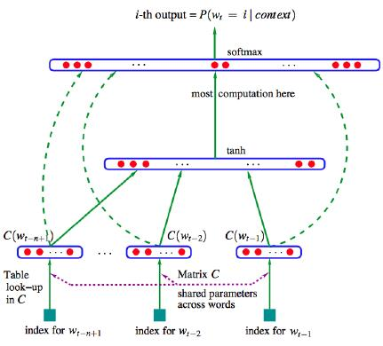
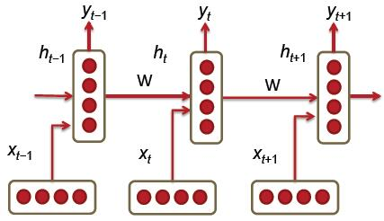
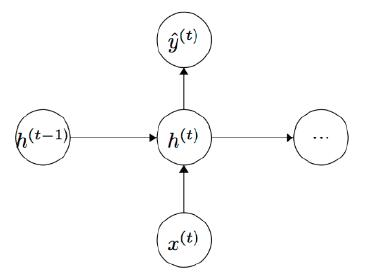
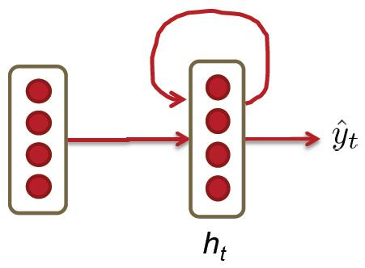
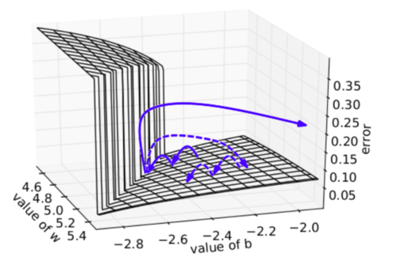
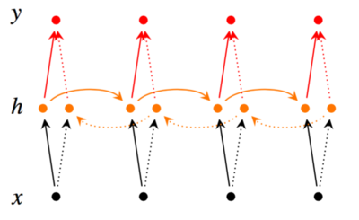
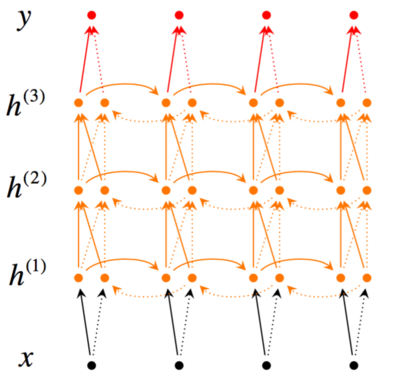
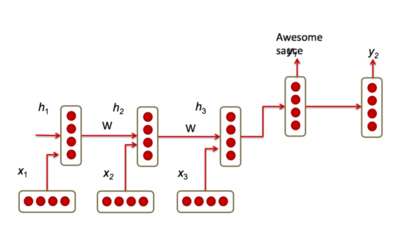
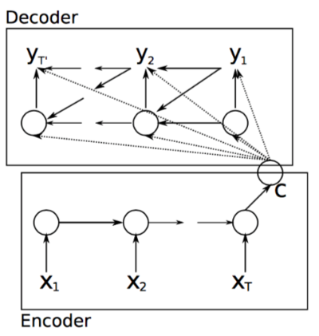
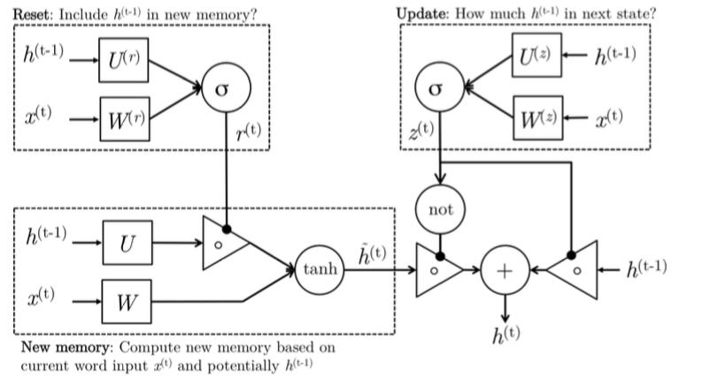

# 深度学习与自然语言处理(7)_ 斯坦福 cs224d 语言模型，RNN，LSTM 与 GRU

翻译：@胡杨(superhy199148@hotmail.com) && @胥可(feitongxiaoke@gmail.com)
校对调整：[寒小阳](http://blog.csdn.net/han_xiaoyang) && [龙心尘](http://blog.csdn.net/longxinchen_ml)
时间：2016 年 7 月
出处：[`blog.csdn.net/han_xiaoyang/article/details/51932536`](http://blog.csdn.net/han_xiaoyang/article/details/51932536)

说明：本文为斯坦福大学 CS224d 课程的中文版内容笔记，已得到斯坦福大学课程@Richard Socher 教授的授权翻译与发表

## 1.语言模型

语言模型用于对特定序列的一系列词汇的出现概率进行计算。一个长度为的词汇序列的联合概率被表示为。由于在得到具体的词汇之前我们会先知道词汇的数量，词汇的属性变化会根据其在输入文档中的位置而定，而联合概率的计算通常只考虑包含个前缀词的词窗口而非考虑全部的前缀词：

公式 1 在语音识别和机器翻译系统中对判定一组词序列是否为相应输入序列的正确生成结果有着极为重要的作用。在一个给定的机器翻译系统中，针对各个短语或句子的翻译任务，软件通常被要求生成一组替代词序列（例如：*“我已经”；“我曾有”；“我有”；“被我已经”；“被我占有”*）以及它们的得分以判定它们是否能组成最优的翻译序列。

在机器翻译任务中，模型通过计量和比较各个替换输出词序列之间的得分*优劣*，从它们中为输入短语寻找最佳的答案词序列。为了完成这项工作，模型需要经常在词排序和词选择两个任务模型之间切换。而上面提到的目标将通过为所有的候选词序列设置概率计算函数而达成，这个函数将比较这些候选词序列各自的得分。获得最高得分的候选词序列就是机器翻译任务的输出。例如：相比例句*“小的这只猫真是”*，机器会给例句*“这只猫真小”*更高的评分，相比*“放学后步行去房子”*，*“放学后步行回家”*会得到更高的得分。为了计算这些概率，将比较统计 n 元语言模型和词频模型的效果。比如，如果选择 2 元语言模型，语义 2 元组的词频通过统计当前词和其前面一个词，这就需要与 1 元语法模型的词频计算方法区分开来。公式 2 和 3 分别展示了 2 元语义模型和 3 元语义模型在处理这种关系时的做法。

公式 3 中表现出来的关系集中于基于上下文中固定窗口内容（例如：个前缀词范围）对后续词的预测。在某些情况下，仅仅抽取个前缀词作为窗口范围可能不足以很好地捕捉上下文信息。例如，当一篇文章在后段着重描写西班牙与法国的历史，而在前文中，当你读到“这两个国家走向了战争”这句话时，仅有此句的前文显然不能够让我们识别出这两个国家的命名实体。Bengio 等人提出了第一个大规模的深度学习自然语言处理框架，此框架能够通过*学习得到词汇的分布化表征*捕捉上面提到的这种上下文关系；图 1 展示了这种神经网络的框架。在这个模型中，输入词向量在隐层和输出层均得到使用。公式 4 展示了引入标准 tanh()函数的 softmax()分类函数中的各个参数，这个函数起到线性分类器的作用，,这一组短式代表全体前缀词的输入词向量。

然而，在所有传统的语言模型中，由于包含长窗口的语言记忆信息规模会随着系统的运行呈指数式的增长，所以面对较大型的词窗口，如果不将记忆信息单独抽离处理，上面的任务几乎是不可能完成的。

图 1

## 2.递归神经网络（RNN）

不同于传统的机器翻译模型仅仅考虑有限的前缀词汇信息作为语义模型的条件项，递归神经网络（RNN）有能力将语料集中的*全部*前序词汇纳入模型的考虑范围。
图 2 展示了 RNN 模型的架构，其中各个垂直矩形框代表每轮迭代的隐层，每个这样的隐层都拥有若干神经元，每个神经元都对输入向量执行线性矩阵操作而通过非线性操作输出结果（例如，tanh()函数）。在每一轮迭代中，前一步迭代的输出随着文档中下一条词汇的词向量而变化，，是隐层的输入且隐层将产生预测输出值和提供给下一层隐层的输出特征向量（见公式 5 和公式 6）。单独每个神经元的输入和输出情况如图 3 所示。

图 2

网络中各个参数的设置细节及含义如下：

> *   ：表示拥有数量词汇的语料中各个词汇对应的词向量。
> *   ：每一轮迭代中用于计算隐层输出特征的传递边
>     — ：在时刻的输入词向量。
>     — ：利用输入词向量作为条件计算得到的权重矩阵
>     — ：利用前一轮迭代的输出作为条件计算得到的权重矩阵
>     — ：在前一轮迭代中非线性函数的输出结果。并且为当迭代轮次为时的初始化隐层输出向量。
>     — ：为非线性分类函数（这里使用 sigmoid 分类函数）
> *   ：每一轮迭代针对全部词汇的输出概率分布。基本上，就是当前迭代时，给定文档全部前序文本权值以及观测词向量后预测得到的后续词。在这里，和中的变量代表全体语料的词典规模。

在递归神经网络中，损失函数通常被设定为之前提到的交叉熵错误率。公式 7 展示了在迭代中此函数在整个词库上的求和。

在规模为的语料集上，交叉熵错误率计算如下：

图 3

公式 9 用于表示困惑度关系；它的计算基于 2 的指数，指数值为公式 8 中显示的交叉熵错误率函数负对数。困惑度用于衡量在进行序列后续词预测时考虑更多条件项对低值函数的扰乱程度（相较于真实结果来说）

执行一层 RNN 网络所需要的内存与语料中的词汇数量成正比。例如，一个拥有 k 个词的句子将在内存中占用 k 个词向量的空间。另外，RNN 网络将维护两对和矩阵。尽管矩阵的规模可能非常大，但其大小不会随着语料的规模而变化（不同于传统的模型）。对一个迭代轮的 RNN 网络，将是个的矩阵而和语料规模无关。
图 4 是一些出版物中对 RNNs 神经网络模型的另外一种表示。它将 RNN 神经网络的每个隐层表示为一个环。

图 4

### 2.1 剃度弥散及梯度爆炸问题

从依次进行的步骤中得到循环神经网络中的传播权值矩阵，RNN 模型确保了实现的目标是通过多次迭代步长来传播内容信息的。通过以下的两个例句可以更深入的理解：

句 1：“简走进了房间。约翰也走近了房间。简对 ___ 说你好”

句 2：“简走进了房间。约翰也走近了房间。因为天色太晚了，人们在工作了一天后都回家了。简对 ___ 说你好”

上面的两个例子中，依据上下文，在空白处大部分都知道答案为“约翰”。第二个人在上下文中出现的相对词距对 RNN 模型中预测下一个词为“约翰”是非常重要的。通过我们对 RNNs 的了解，理论上该部分需要被给出。然而实验证明，RNNs 模型中句 1 空白部分的预测准确率要比句 2 的高。这是因为在后向传播阶段，梯度贡献值在初期的步长传播中逐步递减。因此对于长句，随着内容越长识别“约翰”为空白处词的概率越低。以后我们将讨论梯度递减问题背后的数学推理。
在某轮迭代中考虑公式 5、6，用于计算 RNN 错误率，我们对每一步迭代计算错误率总和。那么每一步的错误率均可通过前面所列的计算出来。

通过对公式 5、6 的结果进行链式规则求导而得到每一个迭代步长的错误率。式 11 展示了对应的求导过程。为对之前次迭代的偏导数。

式 12 展示了每次计算的关联关系；它是在 时间段内对所有潜在层的链式规则求导。

由于，故对于，Jacobian 矩阵中的为：

联立公式 10、11 和 12，得到如下所示：

公式 15 为式 13 的 Jacobian 矩阵范数。其中，和为两个矩阵范数的上边界。依据公式 15 来计算每次迭代中的部分梯度范数。

利用-范数来对以上两个矩阵进行范数计算。对于给定的 sigmoid 非线性函数,范数的值只能是 1。

当足够大且比 1 小或比 1 大时，指数很容易为较小或较大的值。由于词距较远的交叉熵误差通过来评估。当梯度消失时，在迭代中词距较远的词对于预测下一个词的贡献度将会逐渐下降。
在实验过程中，一旦梯度值增长很大，就会很容易探测到其引起的溢出（如：无穷与非数值）；这就是梯度爆炸问题。然而，当梯度值接近于零时。对于语料集中词距较远的词，它将大大降低模型的学习质量并且梯度还会不断衰减；这就是剃度弥散问题。
如果想要获取梯度消失问题的实际问题，你可以访问下面的[实例网站](http://cs224d.stanford.edu/notebooks/vanishing_grad_example.html)。

### 2.2 解决梯度爆炸和弥散

上文介绍了解了一些在深度神经网络中的梯度弥散和梯度爆炸的情况，我们现在开始尝试用一些启发性的手段解决这些问题。

为了解决梯度爆炸问题，Thomas Mikolov 首先提出了一个简单的启发性的解决方案，就是当梯度大于一定阈值的的时候，将它截断为一个较小的数。具体如算法 1 所述：

算法 1：当梯度爆炸时截断梯度（伪代码）

* * *

if  then

* * *

图 5 可视化了梯度截断的效果。它展示了一个小的 rnn（其中 W 为权值矩阵，b 为 bias 项）的决策面。这个模型是一个一小段时间的 rnn 单元组成；实心箭头表明每步梯度下降的训练过程。当梯度下降过程中，模型的目标函数取得了较高的误差时，梯度将被送到远离决策面的位置。截断模型产生了一个虚线，它将误差梯度拉回到离原始梯度接近的位置。

图 5：梯度爆炸，梯度截断可视化

为了解决梯度弥散的问题，我们介绍了两种方法。第一种方法是将随机初始化改为一个有关联的矩阵初始化。第二种方法是使用 ReLU（Rectified Linear Units）代替 sigmoid 函数。ReLU 的导数不是 0 就是 1.因此，神经元的梯度将始终为 1，而不会当梯度传播了一定时间之后变小。

### 2.3 深度双向 RNNs

如之前所说，在一个词序列中我们利用 RNNs 技术和过去的词来预测下一个词。其实同理我们也可以依据未来的词来做预测。Irsoy 等人设计了一个双向深度神经网络，在每一个时间节点 t，这个网络有两层神经元，一层从左向右传播，另一层从右向左传播。为了保证任何时刻 t 都有两层隐层，这个网络需要消耗两倍的存储量来存储权重和偏置等参数。最终的分类结果是由两层 RNN 隐层组合来产生最终的结果。图 6 展示了双向网络结构，公式 17 和 18 表示双向 RNN 隐层的数学含义。在这两个关系中唯一不同点是循环的方向不一样。公式 19 展示了通过总结过去和未来词的表示，使用类别的关系来预测下一个词预测。

图 6：一个双向 RNN 模型

图 7 展示了一个从较低层传播到下一层的多层双向 RNN。如图所示，在网络结构中，第 t 个时间里每一个中间神经元接受到前一个时间（同样的 RNN 层）传递过来的一组参数，以及之前 RNN 层传递过来的两组参数。这两组参数一个是从左到右的 RNN 输入，另一个是从右到左的 RNN 输入。

图 7：一个深度双向 3 层的 RNN

为了构建一个 L 层的 RNN，上述的关系将会参照公式 20 和公式 21 所修改，其中每一个中间神经元（第 i 层）的输入是 RNN 网络中同样的 t 时刻第 i-1 层的输出。其中输出，在每一个时刻值为通过所有隐层的输入参数传播的结果（如公式 22 所示）。

### 2.4 应用：RNN 翻译模型

传统的翻译模型十分复杂，他们由许多的应用在语言翻译流程的不同阶段的机器学习算法组成。在这一章，我们讨论 RNNs 代替传统机器翻译模块的潜在应用。考虑如图 8 所示的 RNN 例子。这里，德语 Echt dicke Kiste 被翻译为英语中的 Awesome sauce。首先 3 个时刻的隐层网络将德语编码为一些语言的特征()。最后两个时刻将解码为英语作为输出。公式 23 展示了编码阶段，公式 24 和公式 25 展示了解码阶段。

图 8：一个 RNN 翻译模型。首先 3 个 RNN 隐层属于资源语言模型编码器，最后两个属于目标语言模型解码器。

采用交叉熵函数的 RNN 模型（如公式 26 所示）在翻译结果上有很高的精度。在实践中，利用一些扩展方法到模型上可以提高翻译的准确率。

扩展 1：编码器和解码器训练不同的 RNN 权重。这个将使得两个单元解耦，同时两个 RNN 模块都会有更高的准确率。这意味着公式 23 和公式 24 的函数有不同的矩阵。

扩展 2：使用 3 个不同的输入来计算编码过程中每一个隐层状态：

• 之前的隐层状态（标准）

• 上一个编码器的隐层(图 9 中，)

• 之前预测的输出词，

图 9：带有 3 个解码神经元的输入的语言模型

结合上述 3 种输入将公式 24 中的解码阶段的 f 函数变为公式 27 中的 1 个。图 9 展示了这个模型。

扩展 3：如之前章节所讨论的那，使用多个 RNN 层来训练深层循环神经网络。因为深层次能学习到更多东西，因此往往能提升预测的准确率，当然，这也意味着必须使用大的语料库来训练模型。

扩展 4：如这一章之前提到的那样，训练双向编码器来提高精度。

扩展 5：给一个德语中的词序列 ABC，在英语中翻译为 XY，我们这里使用 CBA->XY 而不是 ABC->XY 来训练 RNN。这么做的目的是，因为 A 最有可能被翻译为 X，再加上考虑之前提到的梯度弥散的问题，翻转输入词的顺序能够减少输出阶段的误差比例。

## 3 门限循环单元(Gated Recurrent Units)

除了上述讨论的那些扩展方法，我们还可以使用更复杂的激活单元来提升 RNNs 的性能。到目前为止，我们介绍了使用了放射变换和逐点非线性，使得隐层状态从到。在这一节中，我们将讨论修改 RNN 的结构，使用门限激活函数的用法。我们知道虽然 RNNs 能够理论上支持很长的序列，但是训练这个网络十分的困难。门限循环单元可以使得 RNNs 拥有更多持久的记忆从而可以支持更长的序列。接下来我们会分析 GRU 使用和来产生下一个隐层状态。我们将深入理解这个结构背后的意义。

GRU 的 4 个基本运算状态如上述公式所述。通过上面的公式可以对整个模型有个清晰的认识(如图 10)。

1.  **新记忆产生：**一个新的记忆  是由过去的隐含状态和新的输入共同得到的。也就是说，这个阶段能够对新观察到的信息(词)和历史的隐层状态进行合理合并，根据语境向量总结这个新词以何种状态融合。

2.  **重置门：**重置信号会判定对结果的重要程度。如果和新的记忆的计算不相关，那么重置门能够完全消除过去的隐层信息(状态)。

3.  **更新门：**更新信号会决定以多大程度将向下一个状态传递。比如，如果，则几乎完全传递给。相反的，如果，新的前向传递给下一层隐层。

4.  **隐层状态：**使用过去隐层输入最终产生了隐层状态。新的记忆会根据更新门的判定区产生。

图 10：GRU 详细结构图

需要注意的是，训练 GRU 时，我们需要学习不同的参数，W, U, , , , 。我们在上文看到，他们遵循同样的后向传播过程。

## 4 长短期记忆神经网络 LSTM

长短期记忆是另外一种和 GRUs 不同的复杂的激活单元。它的作用是 GRUs 相似，但是在单元的结构上有一些不一样。在深入介绍 LSTM 设计之前，首先让我们来看一看它的数学方程。

图 11：LSTM 详细结构图

我们来按照下面的步骤理解 LSTM 结构以及它背后的意义：

1.  **新记忆产生：**这个状态和 GRUs 中的新记忆产生状态是一样的。我们必须使用输入词和过去隐层状态来产生新的记忆，包括了新词.

2.  **输入门：**在产生新记忆之前，我们需要判定一下我们当前看到的新词到底重不重要，这就是输入门的作用。输入门根据输入词和过去隐层状态共同判定输入值是否值得保留，从而判定它以何种程度参与生成新的记忆(或者说对新的记忆做一个约束)。因此，它可以作为输入信息更新的一个指标。

3.  **遗忘门：**这个门和输入门很类似。但是它不能决定输入词有效，它能对过去记忆单元是否对当前记忆单元的计算有用做出评估。

4.  **最终记忆产生：**这个阶段会根据遗忘门的作用结果，合理地忘记部分过去的记忆。再根据输入门的作用结果，产生新记忆。它将这两个结果加融合起来产生了最终的记忆。

5.  **输出门：**这是一个 GRUs 里没有显性存在的门。它的目的是从隐层状态分离最终的记忆。最终记忆包含了大量不必需要保存在隐层状态的信息，这个门限能够评估关于记忆哪部分需要显示在隐层状态中。用于评估这部分信息的中间信号叫做，它和的点乘组成最后的。