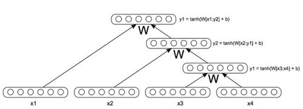

# 深度学习与自然语言处理(8)_ 斯坦福 cs224d RNN，MV-RNN 与 RNTN

原文作者：Richard Socher
翻译：@胥可 && @熊杰 && @杨帆 && @陈沛 && @Molly
校对调整：[寒小阳](http://blog.csdn.net/han_xiaoyang) && [龙心尘](http://blog.csdn.net/longxinchen_ml)
时间：2016 年 7 月
出处：[`blog.csdn.net/han_xiaoyang/article/details/52075160`](http://blog.csdn.net/han_xiaoyang/article/details/52075160)

说明：本文为斯坦福大学 CS224d 课程的中文版内容笔记，已得到斯坦福大学课程@Richard Socher 教授的授权翻译与发表

这篇课堂笔记将介绍不同类型的 RNN（递归神经网络），并介绍它在 NLP 领域的应用和优势。

## 1、递归神经网络

在这篇课笔记中，我们会一起学习一种新的模型，这种模型绝对是以前介绍的那种递归神经网络的加强版！递归神经网络(RNNs)十分适用于有层次的、本身就有递归结构的数据集。来，咱们一起看看一个句子，是不是就很符合上面的要求呢？比如这个句子，“三三两两的人静静地走进古老的教堂。”首先，咱们可以把这个句子分成名词短语部分和动词短语部分，“三三两两的人”和“静静地走进古老的教堂。”然后呢，在动词短语里面还包含名词短语部分和动词短语部分对不对？“静静地走进”和“古老的教堂”。也就是说，它是有明显的递归结构的。

语言的语法规则本身就有很强的递归性。所以，通过相应的模型，咱们可以把这种递归结构充分地利用起来。另外，使用 RNNs 对句子进行建模还有一个附加的好处，就是我们可以输入任意长度的句子了。这在 NLP 的神经网络中曾经是一个很令人头疼的事情，句子的长度是不同的，但我们必须得使用各种预处理技巧让句子对应的输入向量长度相等。(see Bengio et al., 2003; Henderson, 2003; Collobert & Weston, 2008)

我们现在假设当前任务是要把句子对应到一个向量，这个向量和单词本身对应的向量在同一个语义空间。也就是说，像“我昨天去了商场。”，“我们上周去购物了”，“他们去了商店”这样的句子对应的向量，互相之间的距离应该是很近的。我们之前已经训练过一元语言模型的词向量，我们也可以用同样的方法进行二元、三元等模型的训练。这种思路是行得通的，但是还有两点需要注意：（1）理论上讲，词汇可能的组合是无穷多的。存储和训练这样无穷多的数据显然是办不到的。（2）有一些词汇的组合，在语言中是有意义的，但是它们并不在我们的训练/提升语料库中。所以模型可能从来就没有学习到这些词组。

我们需要一个办法，在句子和句子中包含的词对应的词向量上，推出句子对应的（嵌入）向量的形式。首先我们来探讨一个颇有争议的问题。在我们已有的词向量空间里，用这些词向量来表示任意长度的句子是否可行和合理？尽管这个问题我们无法给出确切的答案，但从模型得出的结果来看，这好像是一个行之有效的方法。

首先，我们先谈一下从语义角度和语法角度理解一个句子的区别和不同。语义分析的目的是理解一个句子所表达的实际意义，通过将短语表示成结构化语义空间里的向量，使空间里相似含义的句子的距离会比较近，而不相关意思的的句子离得会非常远。与之相比，从语法角度来说，我们需要找到句子相对应的语法结构，弄清楚各个语句各部分间的依赖关系，词语间的相互作用，等等。语法分析的结果常常被表示为一棵解析树，如下图所示。

另外一个更为有价值的问题是，在语义分析的过程中，从语法角度的理解时候会有所帮助，或者说是必不可少的？好吧，尽管有各种反对的理由，目前我们还是按照如下流程来进行的语义分析：首先，我们需要先理解各个词；其次，我们需要知道各个词是如何组织在一起；最后，我们可以通过前两步的分析结果来理解一个短语或句子的实际意义。

现在让我们一起来学习下基于以上原则所设计出来的一个模型。假如我们有一个句子和与这个句子相关的解析树，就比如上面那个图，我们如何将这个句子编码，并且通过词向量来得出句子的情绪分值？其实，仅仅一个简单的递归神经网络模型就可以得到我们想要的结果。（练习题 3 就是一个相关题目）

### 1.1 一个简单的单层递归神经网络

下面我们来学习下图中的模型。我们首先来看下这个句子的解析树和词向量，由下而上的来逐步分析这棵树。结点 3（node 3）是图中最底层的结点，所以我们将和连接组合成一个 2d 维的向量，并将这个向量输入到网络中按如下公式计算：

由于，，同时，我们可以将看做是在相同向量空间中，关于 2 元语法短语“this assignment”的一个点。在这里，我们没有必要去探究如何表示这个点，只要关注如果从构成的词向量中导出就可以。

我们把输入 softmax 层计算得到其关于各情感分类的得分，这里所谓的情感分类就是一组离散分类，用来表示一些特定的含义。举个列子，比如说在正负情感分析中，我们可以把情感分成 5 类，0 表示强烈的负能量，1 表示负能量，2 表示中性，3 表示正能量，4 表示强烈的正能量。

现在，我们用同样的方式，用”I” 和 “love”作为输入来计算表示”I love”这条词组的。类似的，我们用作为输入，得到其关于情感分类的得分。 最后，最有意思的地方来了，我们需要找到一个方式来合并两个短语”I love” 和 “this assignment”。 这里我们并不是把这些单词的词向量连起来，而是合并这两条词组作为输入。换句话说，就是把表示这两条词组的向量合并起来计算:

现在我们在词向量空间中，得到了表示”I love this assignment”这个词组的向量。接着，我们可以把这个向量输入给 softmax 层来计算整句话的情感分类得分。当然，这个模型只有在训练之后才能给出合理的结果，这部分留作 PSet3 练习。

这里有个问题，我们无论是把单词连接成词组，还是把词组连接起来到更深层，与之相乘的都是同一个权重矩阵，于此同时我们还希望得到的向量尽可能的表达更多的内容，这样是不是太天真了。这个问题确实是存在的， 我们在接下来的例子中会做更细致的讲解。

### 1.2 Syntactically Untied (语义解绑) SU-RNN

就像上一节最后所提到的问题，用同样一个权重矩阵去合并动词跟名词和去合并介词短语及另外一个词向量似乎直观上讲不通。这样的草率处理可能会影响到模型的表现。

为了弥补这个缺点，我们可以通过针对这些不同的任务”语义解绑”权重矩阵。 也就是说，我们不必去考虑是否针对这类输入最佳的在其他类的输入上的表现是否会怎么样。我们弱化限制，使得并不需要处处相同。这样做一方面使得我们有更多的矩阵要去学习，但另一方面在模型的表现也会有显著的提升。

如下图所示, 注意到我们现在的模型根据输入的句法类别分别进行处理, 这里我们通过一个简单的概率上下文无关文法 (Probabilistic Context Free Grammar, PCFG) 来确定输入的句法类别. 其中 PCFG 大致通过对 Penn Tree Bank 进行汇总统计来学习这些分类规则, 如“The”通常是一个冠词 (DT) , 等等. 关于 PCFG 的内容无需进行更深入的理解, 你只需知道它确实很简单即可.

当前模型与之前模型相比, 最主要的不同是, 我们初始化权重矩阵 W 为单位矩阵. 通过这样做, W 会将两个输入的词向量进行均值计算, 但经过一段长时间的训练, 模型将会学习到哪个向量对于句子表达更加重要, 同时它可以通过对向量进行旋转或缩放来提高这种表现. 我们观察到下图中训练好的权重矩阵 W 确实学习到了单词的重要性. 举个例子, 对于冠词-名词短语 (DT-NP) 规则, 或者限定词接名词短语, 如 “The cat” 以及 “A man”, 我们的模型会将注意力放到名词短语而非限定词上. (因为图中对角线中红色代表更高的权重, 所以这是显而易见的). 这就是所谓的”软头词” (soft head word) 概念, 语言学家通过长时间的观察总结出来这些概念. 然而我们的模型通过观察数据自己就学习到了这点. 这太棒了.

通过这部分讨论我们看到, SU-RNN 确实比前一小节讨论的模型要更加强大, 但是 SU-RNN 的表达力似乎还有提升的空间. 一旦我们考虑到修饰词, 例如副词 “very”, 任何针对此单词及下一单词词向量进行插值的行为, 确实都很难说明 “very” 的本质含义.

作为一个副词, “very” 的字面意思是 “用于强调”, 我们怎么才能仅仅通过线性插值的方法, 来使得一个向量可以强调其后的其他向量? 我们怎么才能构建一个向量来 “缩放” 其他的向量? 事实是我们无法做到这一点. 我们需要采用另外一种形式的词与词之间的乘法操作才能做到. 这里我们有两种新的组合形式可以做到这一点, 其中一种利用了词矩阵 (word matrices) 的概念而另外一种利用了典型仿射上的二次形方程.

### 1.3 MV-RNN’s (矩阵-向量递归神经网络, Matrix-Vector Recursive Neural Networks)

现在我们讨论一下加强词的表示形式, 除了词向量外, 还往其中加入一个词矩阵(word matrices)! 现在单词 “very” 将拥有一个词向量  及一个词矩阵 , 通过这么做, 新的模型将不仅仅拥有表达嵌入词含义的能力, 它还拥有学习一个单词是如何 “修饰” 其他单词的能力, 新加入的词矩阵使我们拥有了这种新的能力. 将两个单词 a 和 b 喂到一个 RNN 网络中, 我们将得到他们的词矩阵 A 与 B, 接下来我们将向量 Ab 与 Ba 进行连接作为新的输入向量 x. 对于之前 “very” 的例子,  可以是一个单位矩阵与一个任意大于 1 的常量 s 的乘积, 因此可以将相邻的词向量缩放 s 的比例. 这正是我们之前期望的那种新的模型表现力. 虽然这种新的词的表达形式将会使得模型的特征空间增加额外的一个维度, 但是我们将从这种新的词的修饰能力中获益良多。下图是一个 MV-RNN 的例子。

通过观测模型的误差，我们看到即使 MV-RNN 仍不能表达一定的关系。我们注意到了有三类错误。

首先，否定正向的。当我们说一些正向的东西时，其中有一个词变成负向的，这个模型不能衡量一个词强大到足以翻转整个句子的情绪。图 7 给出了这样一个例子，交换的“most”“least”应该倒装句子的整个情绪，但 MV-RNN 不能实现这一点。

图 7：否定正向的例子

第二类错误是否定负向的例子。在我们说什么是不坏，或不沉闷，如图 8 所示，MV-RNN 不能领略到“not”可以减轻负向的情绪。

图 8：否定负向的例子

我们观察到的最后一类错误是“X 但是 Y 的结合”，如图 9 所示。这里的 X 可能是负向的，但如果 Y 是正向的，那么该模型的情感输出的句子应该是正向的！MV-RNNs 无法做到这一点。

图 9：使用递归神经网络可以准确分辨”X 但是 Y”的这种结合，但 MV-RNN 做不到

因此，我们必须寻找一个更具表现力的合成算法，将能够充分捕捉这些类型的高层次的组成。

### 1.4 RNTNs（递归神经张量网络，Recursive Neural Tensor Network）

最后介绍的这种 RNN，对上述的 3 类错误处理的很好。RNTN（递归神经张量网络）用一个词矩阵的概念，而且没有采用传统的仿射变换 pre-tanh/sigmoid 的概率。为了构成两个词向量或短语向量，我们以向量的形式连接起来，不去把它通过仿射函数处理变为一个非线性，我们首先把它通过一个二次型处理，然后变为非线性的，如：

注意 V 是 3 阶张量∈ 。我们计算切成张量输出向量。接着加上 Wx，然后进行一个非线性函数的变换。这个二次型表明，我们确实可以允许的乘法类型的词向量之间的相互作用，而不需要保持和学习词矩阵！

实验结果表明，RNTN 是唯一的能在这些非常难的数据集上表现很好的模型。

下一节我们将继续讲下一个在某些方面优于 RNTN 的模型，它不需要输入解析树！该模型是动态卷积神经网络（Dynamic Convolutional Neural Network），下节课见。