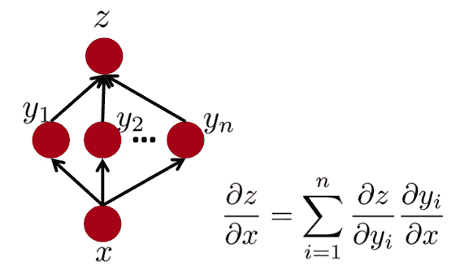
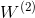

# CS224n 笔记 5 反向传播与项目指导

最后一次数学课，其实都是些很基础的推导而已。从四个不同的层面讲解反向传播，其中电路和有向图类比还是很直观新颖的解释。

## 任意层的通用公式

第层的残差：

其中是激活函数：

对于顶层来讲，残差就是根据某个损失函数得到的误差。对于底层来讲，激活函数不存在，或相当于。

是线性函数：

而是相同大小的向量之间的 element wise product()

正则化的损失函数关于第层的权值矩阵的梯度：

关于第层的偏置的梯度：

其中，是激活值：

这里偏置单元与普通神经元在数学上并无不同，只不过由于激活值，所以可以把激活值省略掉。

## 反向传播的电路解释

比如函数可视作如下加法器和乘法器电路：

定义 、 ，于是有 和。求

我们可以从输出到输入反向计算，先得到输出关于输出自己的导数：

然后得到关于的导数：

另一条路，关于的导数：

关于的导数：

关于的导数：

这种反向回溯的过程放到神经元中就是反向传播了：

反向传播时每通过一级，就用链式法则乘以这一级的导数。

另一个稍微复杂一点的例子：

其中，sigmoid 相关的元件可以合并为一个 sigmoid gate：

## 第三种理解：流程图

将上述电路视作有向无环流程图去理解链式法则，比如一条路径：

2 条路径：

推广到多条路径：

推广到更复杂的流程图：

只要找到 z 的所有父节点应用链式法则并求和即可。

神经网络可以视作流程图的一个实例：

任意流程图都可以执行反向传播：

现在有一些软件包（TensorFlow）可以自动从前向传播的 symbolic expression（符号表达式）推导梯度，适用于快速设计原型。（其实 matlab 里也可以）

## 第四种解释：实际神经网络中的误差信号

其实就是把上面这些解释综合起来的解释，对如下 2 层的网络来讲：

假设最后一层对的误差是：

于是对的导数是

通过线性乘法器，对的导数是权值与的乘积：

通过一个 sigmoid gate，对的导数是：

再通过一个线性乘法器，得到对的导数：

于是对的导数是 。

## 课程项目

接下来都是围绕着课程项目的指导与建议，就不啰嗦了。简单写写一些体会：

*   不要想着一上来就发明个新模型搞个大新闻

*   也不要浪费大部分时间在爬虫上面，本末倒置

*   把旧模型用于新领域\新数据也是不错的项目

*   先要按部就班地熟悉数据、熟悉评测标准、实现基线方法

*   再根据基线方法的不足之处思考深度学习如何能带来改进

*   再实现一个已有的较为前沿的模型

*   观察该模型犯的错误，思考如何改进

*   这时才能没准就福至心灵发明一个新方法

 [知识共享署名-非商业性使用-相同方式共享](http://www.hankcs.com/license/)：[码农场](http://www.hankcs.com) » [CS224n 笔记 5 反向传播与项目指导](http://www.hankcs.com/nlp/cs224n-backpropagation-and-project-advice.html)