# CS224n 笔记 6 句法分析

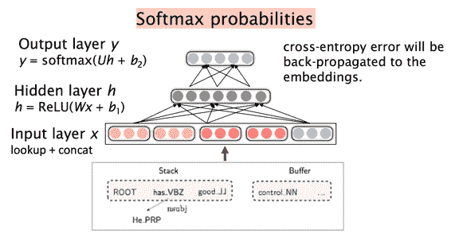句法分析还算熟悉，就跟着复习了神经网络句法分析的动机与手法，了解一下比较前沿的动向。

## 语言学的两种观点

如何描述语法，有两种主流观点，其中一种是短语结构文法，英文术语是：Constituency = phrase structure grammar = context-free grammars (CFGs)。

这种短语语法用固定数量的 rule 分解句子为短语和单词、分解短语为更短的短语或单词……一个取自 WSJ 语料库的短语结构树示例：

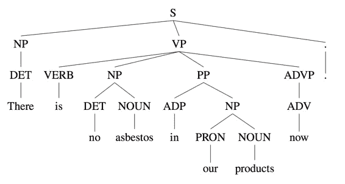

另一种是依存结构，用单词之间的依存关系来表达语法。如果一个单词修饰另一个单词，则称该单词依赖于另一个单词。一个由[HanLP](http://www.hankcs.com/nlp/parsing/neural-network-based-dependency-parser.html)输出的依存句法树如下：

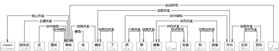

## 歧义

通过句法树可以表达歧义，一个确定的句法树对应句子的一个确定解读，比如对介词短语依附（attachment of prepositional phrases (PPs)）：

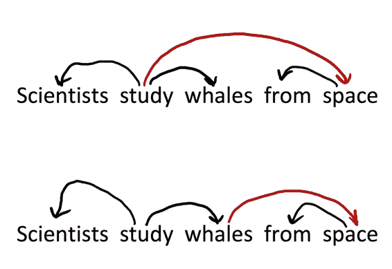

from space 这个介词短语到底依附谁？不同的答案导致对句子不同的理解。

### 依附歧义

很难确定如何把一个短语（介词短语、状语短语、分词短语、不定式）依附到其他成分上去，比如下列句子：

每个括号中都是一个短语，它们依附的对象各不相同。对于个短语来讲，组成的树形结构有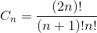。这是 Catalan 数，指数级增长，常用于树形结构的计数问题。

## 标注数据集的崛起：Universal Dependencies treebanks

虽然[上下文无关文法](http://www.hankcs.com/nlp/%E7%AC%AC3%E7%AB%A0-%E5%BD%A2%E5%BC%8F%E8%AF%AD%E8%A8%80%E4%B8%8E%E8%87%AA%E5%8A%A8%E6%9C%BA.html)中的语法集很容易写，无非是有限数量的规则而已，但人工费时费力标注的树库却茁壮成长了起来。在 1993 年首次面世的 Universal Dependencies treebanks 如今在 Google 的赞助下发布了 2.0，其授权大多是署名-相同方式共享，覆盖了全世界绝大多数语言（不包括简体中文）。

其官网是：[`universaldependencies.org/`](http://universaldependencies.org/)

GitHub 主页是：[`github.com/UniversalDependencies`](https://github.com/UniversalDependencies)

树库示例：

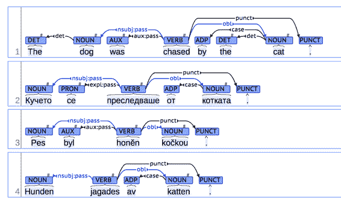

人们偏好树库多于规则的原因是显而易见的，树库虽然标注难度高，但每一份劳动都可被复用（可以用于词性标注命名实体识别等等任务）；而每个人编写的规则都不同，并且死板又丑陋。树库的多用性还是得其作为评测的标杆数据，得到了越来越多的引用。

### 依存文法与依存结构

这节课以及练习用的都是依存句法树，而不是短语结构树。这并不是随机选择，而是由于前者的优势。90 年代的句法分析论文 99%都是短语结构树，但后来人们发现依存句法树标注简单，parser 准确率高，所以后来（特别是最近十年）基本上就是依存句法树的天下了（至少 80%）。

不标注依存弧 label 的依存句法树就是短语结构树的一种：

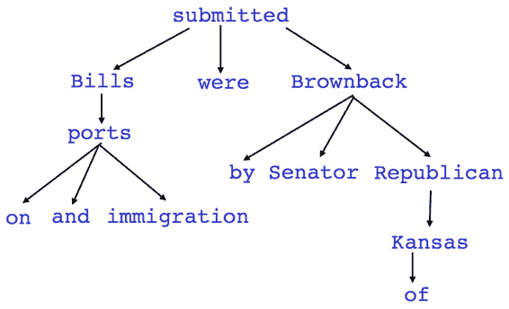

一旦标上了，两者就彻底不同了：

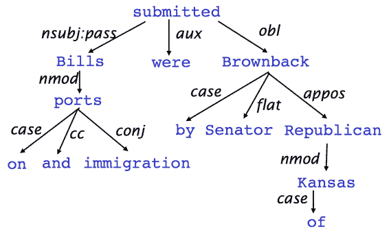

这里箭头的尾部是 head（被修饰的主题），箭头指向的是 dependent（修饰语）。

### 起源

> 语法依存的概念可以追溯到公元前 4 世纪印度语言学家 Panini 对语义、句法和形态依存的分类研究，但一般认为现代依存语法理论的创立者是法国语言学家 Lucien Tesnière（1893—1954）。L.Tesnière 的思想主要反映在他 1959 年出版的《结构句法基础》（Eléments de syntaxe structurale）一书中［Tesnière，1959］。
> 
> ——《统计自然语言处理》

课件中还有更详细的历史，不太感兴趣，跳过；只记录一点，第一个 computational 句法分析器也是依存句法分析器。

### 一些细节

人们画依存句法树的弧的方式不同，这门课是 head 指向 dependent（即箭头指向的词语是依赖者，箭头尾部的词语是被依赖者），我的偏好是反过来。

每个句子都有一个虚根，代表句子之外的开始，这样句子中的每个单词都有自己的依存对象了。

## 句法分析可用的特征

*   双词汇亲和（Bilexical affinities），比如 discussion 与 issues。

*   词语间距，因为一般相邻的词语才具有依存关系

*   中间词语，如果中间词语是动词或标点，则两边的词语不太可能有依存

*   词语配价，一个词语最多有几个依赖者。

## 依存句法分析

有几个约束条件：

*   ROOT 只能被一个词依赖。

*   无环。

英语中大部分句子是 projective 的，少数是 non-projective 的：

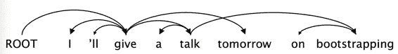

有个学生问是否可以将一个依存句法树还原成句子，答案是否定的。

文献中的依存句法分析方法有：

**Dynamic programming**

估计是找出以某 head 结尾的字串对应的最可能的句法树。

**Graph algorithms**

最小生成树。

**Constraint Satisfaction**

估计是在某个图上逐步删除不符合要求的边，直到成为一棵树。

**“Transition-based parsing” or “deterministic dependency parsing”**

主流方法，基于贪心决策动作拼装句法树。

### Arc-standard transition

动作体系的 formal 描述如下：

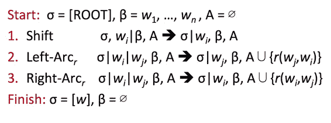

图解还是我自己整理的更清晰：[`www.hankcs.com/nlp/parsing/neural-network-based-dependency-parser.html/2#h2-6`](http://www.hankcs.com/nlp/parsing/neural-network-based-dependency-parser.html/2#h2-6)

课件上画得没有这么详细。

### MaltParser

无搜索，贪婪地下转移决策，线性复杂度，只损失了一点效果。加个 beam search 会上升一点。

### 传统特征表示

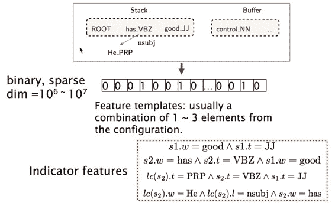

无非是栈和队列中单词、词性、依存标签的组合的特征函数，一个超长的稀疏 01 向量。

### 效果评估

评测指标是 UAS（不考虑标签只考虑弧）或 LAS（同时考虑标签和弧）：

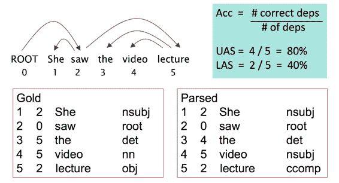

课件上有一页讲依存弧可以用来判断蛋白质的相互作用：

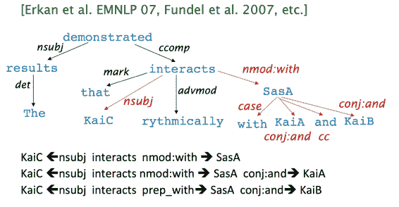

### 投射性

Manning 也跳过了这一张 PPT，大意就是 CFG 转换得到的依存树一定是投射性的，但依存理论允许非投射性的依存句法树（一些语义需要通过非投射性表达）。

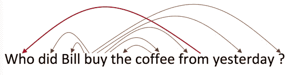

arc-standard 算法只能拼装投射性的句法树，但换个体系、加上后处理、采用 graph-based 方法就能得到非投射的句法树。

## 为什么需要神经网络句法分析器

传统特征表示稀疏、不完全、计算代价大（SVM 之类的线性分类器本身是很快的，而传统 parser 的 95%时间都花在拼装查询特征上了）。

### 神经网络依存句法分析器

从理论到代码的分析参考：[`www.hankcs.com/nlp/parsing/neural-network-based-dependency-parser.html`](http://www.hankcs.com/nlp/parsing/neural-network-based-dependency-parser.html) ，在线演示：[`hanlp.hankcs.com/`](http://hanlp.hankcs.com/?sentence=%E5%BE%90%E5%85%88%E7%94%9F%E8%BF%98%E5%85%B7%E4%BD%93%E5%B8%AE%E5%8A%A9%E4%BB%96%E7%A1%AE%E5%AE%9A%E4%BA%86%E6%8A%8A%E7%94%BB%E9%9B%84%E9%B9%B0%E3%80%81%E6%9D%BE%E9%BC%A0%E5%92%8C%E9%BA%BB%E9%9B%80%E4%BD%9C%E4%B8%BA%E4%B8%BB%E6%94%BB%E7%9B%AE%E6%A0%87%E3%80%82) 。

无非是传统方法拼接单词、词性、依存标签，新方法拼接它们的向量表示：

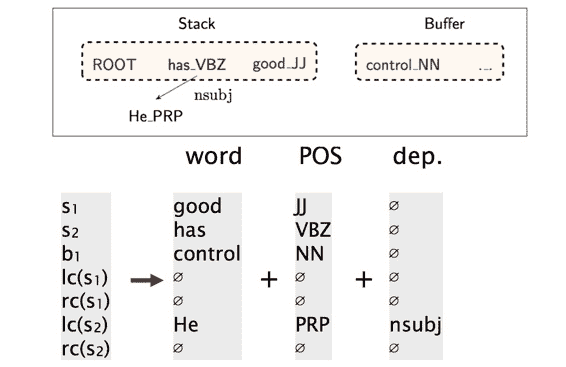

然后模型是一个司空见惯的三层神经网络：

事实上，在“深度学习”“神经网络”的喧嚣中冷静下来回顾一下，相较于传统的 graph-based 方法，花了这么多功夫得到的只是 0.1%的 LAS 提升：

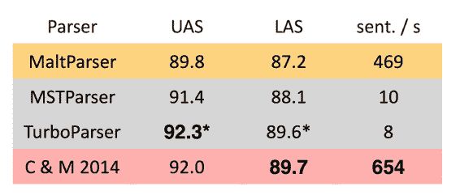

他们说速度上升很大啊，我的实际体验是取决于矩阵运算模块的加速比。如果用一些类似于 Eigen 之类高度优化的 C++并行矩阵运算库就很快，如果是手写的串行线性代数库就很慢。

### 为何需要非线性

以前的课上讲过，又讲了一遍，不啰嗦了。

有很多 S 形函数可选：

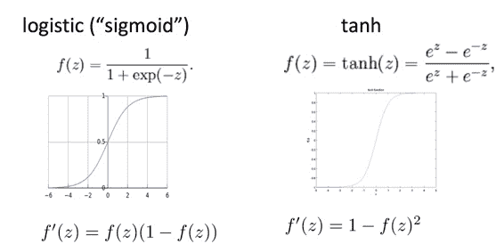

tanh 是 sigmod 的缩放偏移版：

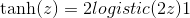

还有其他各种备选：

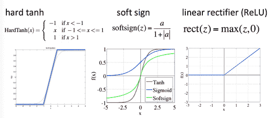

其中 ReLU 成为新贵，Manning 说他简直不敢相信这种疯狂的函数竟然效果最好（也许神经网络本来就是疯狂的）。ReLU 在反向传播时要么不反馈残差，要么原样反馈残差。

### 未来工作

Chen&Manning 的工作被许多人继续往前推进，走在最前沿的是 Google。趋势是：

*   更大更深调参调得更好（更昂贵）的神经网络

*   Beam Search

*   在决策序列全局进行类似 CRF 推断的方法（CRF 宝刀未老，老当益壮啊）

Google 的 SyntaxNet 中的 Parsey McParseFace 的效果：

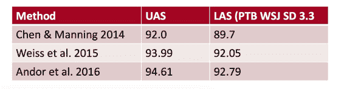

 财大气粗就是好。

 [知识共享署名-非商业性使用-相同方式共享](http://www.hankcs.com/license/)：[码农场](http://www.hankcs.com) » [CS224n 笔记 6 句法分析](http://www.hankcs.com/nlp/cs224n-dependency-parsing.html)