# CS224n 笔记 8 RNN 和语言模型

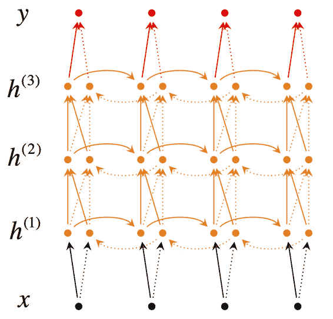这次课推导 RNN，介绍各种训练技巧和拓展变种。梯度消失的推导很详细，用 Python 演示很直观，也给出了用裁剪防止梯度爆炸的直观解释。笔记里还补充了用于机器翻译时的 5 项改进。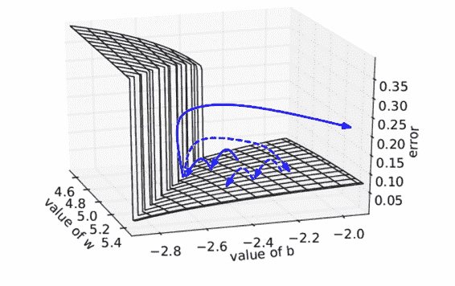

## 语言模型

语言模型就是计算一个单词序列（句子）的概率（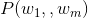）的模型。听上去很简单，做起来很难；听上去没什么用处，但用处非常多。比如在机器翻译中，判断译文序列中一种词序的自然程度高于另一种，判断一种用词选择优于另一种。

### 传统语言模型

为了简化问题，必须引入马尔科夫假设，句子的概率通常是通过待预测单词之前长度为的窗口建立条件概率来预测：

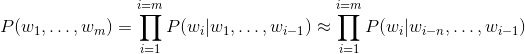

为了估计此条件概率，常用极大似然估计，比如对于 BiGram 和[TriGram](http://www.hankcs.com/nlp/segment/second-order-hidden-markov-model-trigram-chinese-participle.html)模型，有：

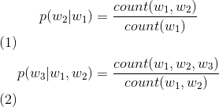

课件中写的 unigrams and bigrams (conditioning on one/two previous word(s))，是错误的。

在数据量足够的情况下，n-gram 中的 n 越大，模型效果越好。但实际上，数据量总是不如人意，这时候一些平滑方法就不可或缺。另外，这些 ngram 可能会占用上 G 的内存，在最新的研究中，一个 1260 亿的语料在 140G 内存的单机上花了 2.8 天才得到结果。

Bengio et al 提出了第一个大规模深度学习自然语言处理模型，只不过是用前个单词的词向量来做同样的事情（上文建模）而已，其网络结构如下：

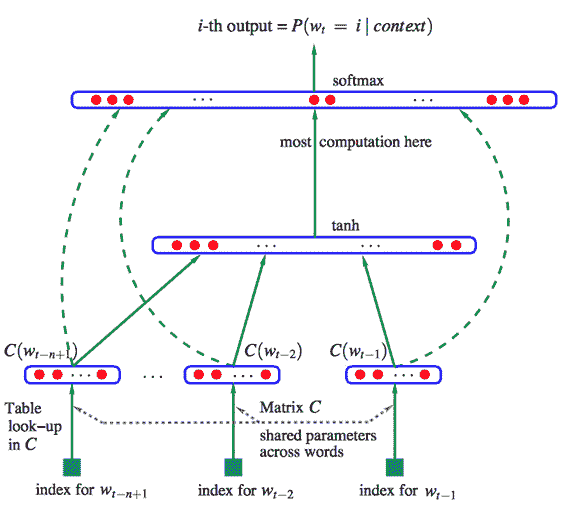

公式如下：

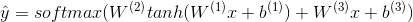

这里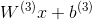就是前个单词词向量的线性运算，虽然这种模型名字里有“Neural”，但依然属于传统模型。

## Recurrent Neural Networks

新的语言模型是利用 RNN 对序列建模，复用不同时刻的线性非线性单元及权值，理论上之前所有的单词都会影响到预测单词。

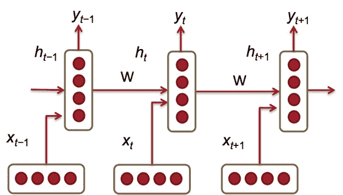

所需内存只与词表大小成正比，不取决于序列长度。

给定一个词向量序列： 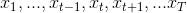 ，在每个时间点上都有隐藏层的特征表示：

其中，

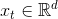：是时间时输入的单词的词向量。

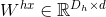：用来 condition 输入词向量的的权值矩阵。

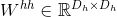：用来 condition 前一个时间节点隐藏层特征表示的权值矩阵。

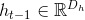: 前一个时间点 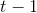 的非线性激活函数的输出， 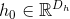 是时间点 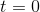 时的隐藏层初始状态。

: 非线性激活函数(sigmoid)

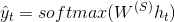：在时刻时输出的整个词表  上的概率分布，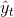是给定上文和最近的单词 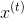预测的下一个单词。其中 ， 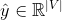。

另外，这里的  与拼接两个向量乘以权值矩阵的拼接是一样的。

未 unroll 的网络：

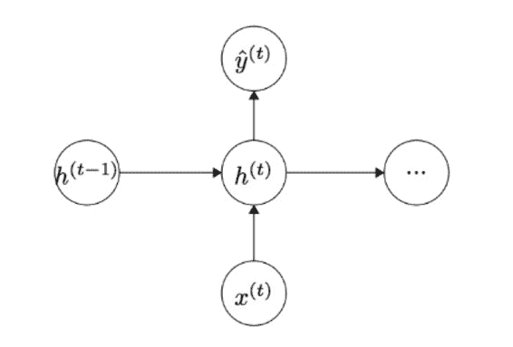

等效于

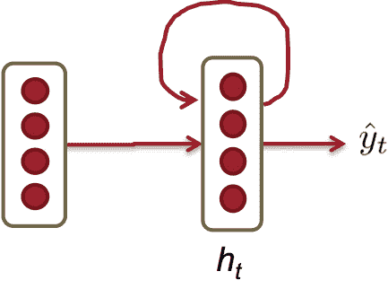

### 损失函数

分类问题中常见的交叉熵损失函数：

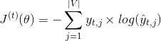

在大小为的整个语料上的交叉熵误差为：

如果以为底数会得到“perplexity 困惑度”，代表模型下结论时的困惑程度，越小越好：

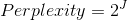

### 训练 RNN 很难

观察句子 1：

"Jane walked into the room. John walked in too. Jane said hi to ___"

以及句子 2：

"Jane walked into the room. John walked in too. It was late in the day, and everyone was walking home after a long day at work. Jane said hi to ___"

人类可以轻松地在两个空中填入“John”这个答案，但 RNN 却很难做对第二个。这是因为在前向传播的时候，前面的反复乘上，导致对后面的影响很小。

反向传播时也是如此。

整个序列的预测误差是之前每个时刻的误差之和：

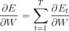

而每个时刻的误差又是之前每个时刻的误差之和，应用链式法则：

此处的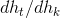指的是在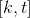时间区域上应用链式法则：

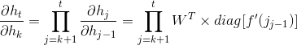

由于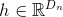，每个 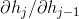 就是的[雅克比矩阵](https://zh.wikipedia.org/wiki/%E9%9B%85%E5%8F%AF%E6%AF%94%E7%9F%A9%E9%98%B5)（导数矩阵）：

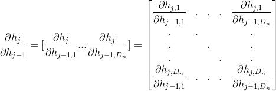

将这几个式子写在一起，得到：

这个式子最中间的部分最值得关注，因为它是一个连乘的形式，长度为时间区域的长度。记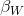 和 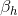分别为矩阵和向量的范数(L2)，则上述雅克比矩阵的范数满足：

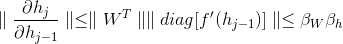

由于使用了 sigmoid 激活函数，所以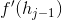的矩阵范数最大只能为 1，所以链式法则利用上式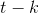次后得到一个更松弛的上界：

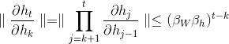

指数项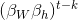在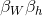显著地大于或小于 1 的时候，经过足够多的次乘法之后就会趋近于 0 或无穷大。小于 1 更常见，会导致很长时间之前的词语无法影响对当前词语的预测。

而大于 1 时，浮点数运算会产生溢出（NaN），一般可以很快发现。这叫做梯度爆炸。小于 1，或者下溢出并不产生异常，难以发现，但会显著降低模型对较远单词的记忆效果，这叫做梯度消失。

矩阵范数可参考：[1.4 向量和矩阵的范数.pdf](http://www.hankcs.com/wp-content/uploads/2017/06/1.4-%E5%90%91%E9%87%8F%E5%92%8C%E7%9F%A9%E9%98%B5%E7%9A%84%E8%8C%83%E6%95%B0.pdf "1.4 向量和矩阵的范数.pdf")

### 梯度消失实例

有个[IPython Notebook](http://cs224d.stanford.edu/notebooks/vanishing_grad_example.html)专门演示梯度消失，对于如下数据：

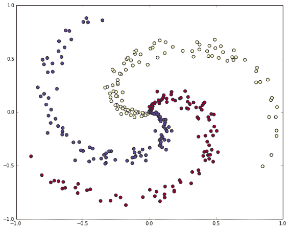

学习非线性的决策边界：

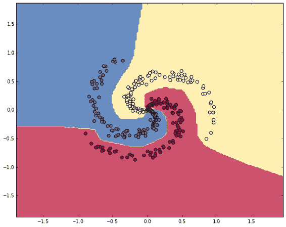

用经典的三层网络结构，得到蓝色的第一层梯度的长度和绿色的第二层梯度的长度，可视化：

sigmoid 激活函数下：

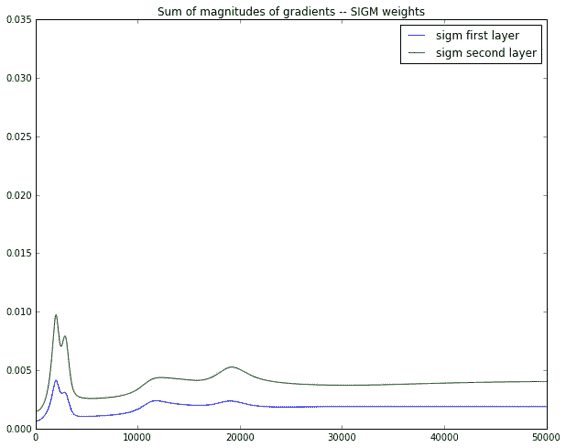

ReLU 激活函数下：

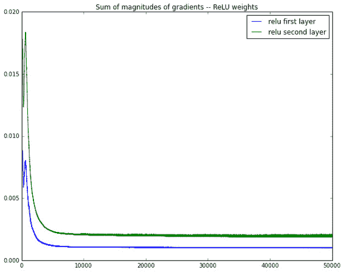

在这个例子的反向传播中，相邻两层梯度是近乎减半地减小。

### 防止梯度爆炸

一种暴力的方法是，当梯度的长度大于某个阈值的时候，将其缩放到某个阈值。虽然在数学上非常丑陋，但实践效果挺好。

其直观解释是，在一个只有一个隐藏节点的网络中，损失函数和权值 w 偏置 b 构成 error surface，其中有一堵墙：

每次迭代梯度本来是正常的，一次一小步，但遇到这堵墙之后突然梯度爆炸到非常大，可能指向一个莫名其妙的地方（实线长箭头）。但缩放之后，能够把这种误导控制在可接受的范围内（虚线短箭头）。

但这种 trick 无法推广到梯度消失，因为你不想设置一个最低值硬性规定之前的单词都相同重要地影响当前单词。

### 减缓梯度消失

与其随机初始化参数矩阵，不如初始化为单位矩阵。这样初始效果就是上下文向量和词向量的平均。然后用 ReLU 激活函数。这样可以在 step 多了之后，依然使得模型可训练。

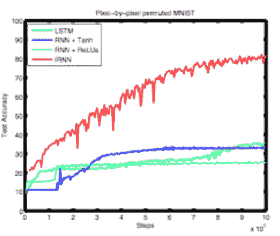

### 困惑度结果

相较于 NGram，RNN 的困惑度要小一些。

### 问题：softmax 太大了

词表太大的话，softmax 很费力。一个技巧是，先预测词语的分类（比如按词频分），然后在分类中预测词语。分类越多，困惑度越小，但速度越慢。所以存在一个平衡点：

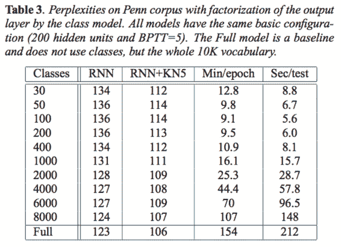

### 最后的实现技巧

记录每个的误差不要丢，反向传播的时候将其累加起来。

## 序列模型的应用

可以把每个词分类到 NER、实体级别的情感分析（饭菜味道不错，但环境不太卫生）、意见表达。

其中，意见挖掘任务就是将每个词语归类为：

DSE：直接主观描述（明确表达观点等）

ESE：间接主观描述（间接地表达情感等）

语料标注采用经典的 BIO 标注：

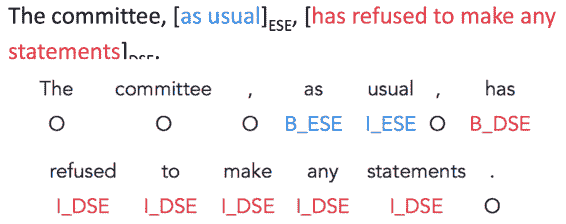

实现这个任务的朴素网络结构就是一个裸的 RNN：

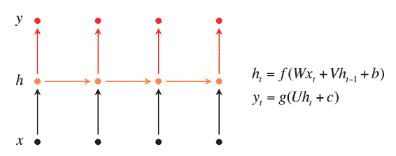

但是这个网络无法利用当前词语的下文辅助分类决策，解决方法是使用一些更复杂的 RNN 变种。

### Bidirectional RNNs

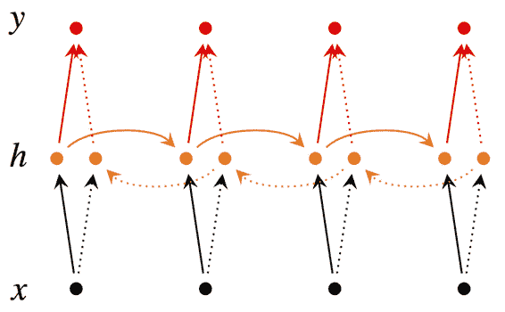

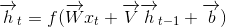

这里箭头表示从左到右或从右到左前向传播，对于每个时刻的预测，都需要来自双向的特征向量，拼接后进行分类。箭头虽然不同，但参数还是同一套参数（有些地方是两套参数[1]  G. Lample, M. Ballesteros, S. Subramanian, K. Kawakami, and C. Dyer, “Neural Architectures for Named Entity Recognition.,” HLT-NAACL, 2016.）。

### Deep Bidirectional RNNs

理解了上图之后，再加几个层，每个时刻不但接受上个时刻的特征向量，还接受来自下层的特征表示：

### 评测

评测方法是标准的 F1（因为标签样本不均衡），在不同规模的语料上试验不同层数的影响：

可见层数不是越多越好。

### 应用：RNN 机器翻译模型

传统机器翻译模型在不同的阶段用到大量不同的机器学习算法，这里讨论用 RNN 统一整个流水线。

比如将 3 个单词的德语翻译为 2 个单词的英语，用到如下 RNN：

其中：

用来处理输入的叫 encoder，生成输出的叫 decoder。训练时使用交叉熵损失函数，最大化对数似然：

但预测准确率不理想，有如下拓展方法：

1、encoder 和 decoder 使用不同的权值矩阵。也就是上述两个不再相同。

2、decoder 中的隐藏层的输入来自 3 个方面：

*   前一个时刻的隐藏层

*   encoder 的最后一个隐藏层()

*   前一个预测结果 

    这样导致 decoder 函数变为：

    

*   

3、使用深度 RNN

4、使用 bi-directional encoder

5、不再用作为训练实例，而是逆转原文词序：。因为 A 更可能翻译为 X，而梯度消失导致 A 无法影响输出，倒过来 A 离输出近一些。

## 回顾

*   RNN 是最好的 DeepNLP 模型之一

*   因为梯度消失和梯度爆炸，训练很难

*   可以用很多技巧来训练

*   下次课将介绍更强大的 RNN 拓展：LSTM 和 GRU

 [知识共享署名-非商业性使用-相同方式共享](http://www.hankcs.com/license/)：[码农场](http://www.hankcs.com) » [CS224n 笔记 8 RNN 和语言模型](http://www.hankcs.com/nlp/cs224n-rnn-and-language-models.html)