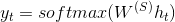
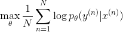
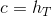
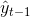
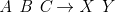
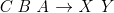
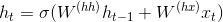
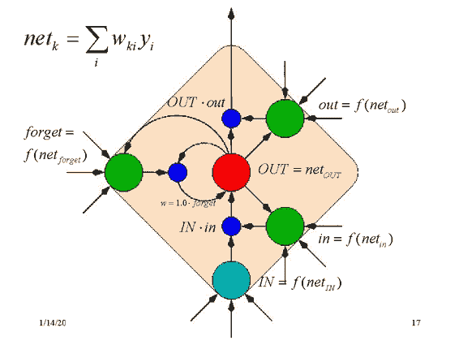

# CS224n 笔记 9 机器翻译和高级 LSTM 及 GRU

简单回顾了传统统计机器翻译中的难题，过渡到利用 GRU 和 LSTM 来救场，最后介绍了一些较新的改进工作。

## 机器翻译

对于情感分析这类还算简单的任务，你可以整理一个情感极性词典、编写一堆规则做出一个勉强能用的系统。但到了机器翻译这个高级应用，就无法完全依靠规则了。现代机器翻译手段都是基于统计的，在平行语料上学习语言知识。世界上第一个平行语料库是罗塞塔石碑：

图片来源：[wiki](https://zh.wikipedia.org/wiki/%E7%BE%85%E5%A1%9E%E5%A1%94%E7%9F%B3%E7%A2%91)

传统机器翻译系统非常复杂，因为不同阶段用到了不同的机器学习方法。

## 传统统计机器翻译系统

定义一些符号：

原文

译文

机器翻译定义为找到使如下条件概率最大的：

这里利用了贝叶斯公式。翻译模型在平行语料上训练得到，语言模型在未对齐的原文语料上训练（是非常廉价的）。

公式描述的翻译过程如下：

### 第一步：对齐

找到原文中的哪个句子或短语翻译到译文中的哪个句子或短语，[这个第一步已经够难了](http://www.hankcs.com/nlp/michael-collins-machine-translation.html)。

对齐时，原文中可能有部分词语没有对应的译文：

也可能在译文中有部分词语没有对应的原文，根据模型不同，可能有一对多的对齐方式：

也可能有多对一的对齐方式：

还可能有多对多的对齐方式：

所有的对齐方式数量是组合数级的。

有时候还要通过句法分析，来进行不同颗粒度的对齐：

### 对齐之后

原文中每个单词都有多个备选单词，导致了许多短语的组合方式：

### 解码：在海量假设中搜索最佳选择

这是一个特别复杂的搜索问题，涉及到许多语言模型。

### 传统机器翻译

这还只是传统机器翻译系统的冰山一角，有许多细节没有涉及到，还需要大量的人肉特征工程，总之是非常复杂的系统。其中每个环节都是独立不同的机器学习问题。这些独立的模型各自为政，并不以一个统一的优化目标为最终目标。

而深度学习则提供了一个统一的模型，一个统一的最终目标函数。在优化目标函数的过程中，得到一个 end to end 的完整的 joint 模型。传统机器翻译系统与深度学习是截然相反的，对齐模型、词序模型、语言模型……一堆独立的模型无法联合训练。

## 深度学习来救场

也许可以直接用 RNN 来接受原文，预测译文“下一个单词”：

红圈所示特征表示必须能捕捉整个原文短语的语义，但是 RNN 无法记住太久之前的事情，大概五六个单词就到极限了。所以这不是个实用的模型。

在这个最简单的模型中，

Encoder 是：

Decoder 是：

最小化所有训练实例上的交叉熵误差：

记号  一般代表接受的两个向量的权值不同。

softmax 分类器中必须有个代表句子终止的“单词”，不然模型会无休止地输出下去。

但神经网络机器翻译模型没有这么简单，必须加一些拓展。

1、编码器和解码器训练不同的权值矩阵

红蓝代表不同的权值。

2、decoder 中的隐藏层的输入来自 3 个方面：

*   前一个时刻的隐藏层

*   encoder 的最后一个隐藏层()

*   前一个预测结果 

    这样导致 decoder 函数变为：

    

这可以辅助训练 softmax 的权值矩阵，防止模型重复生成同一个单词。

上图还有一个复杂版本，表达的是同一个意思：

其中，带黑点的表示离散的向量表示，否则表示连续的向量空间。

3、使用深度 RNN

4、使用 bi-directional encoder

5、不再用作为训练实例，而是逆转原文词序：。因为 A 更可能翻译为 X，而梯度消失导致 A 无法影响输出，倒过来 A 离输出近一些。逆转词序不会带来“语法语义上的改变”，因为模型学习的就是如何从逆序的原文翻译顺序的译文。但相应的，C 就离 Y 更远了

## 主要改进：更好的单元

引入 Gated Recurrent Units (GRU)，这种单元可以让模型学习何时遗忘从而将记忆保持很久、允许误差根据输入的不同而不同。

标准的 RNN 直接计算隐藏层：

GRU 先根据当前输入的词向量和隐藏层计算一个 update gate（另一个层）：

利用相同的方法不同的权值计算 reset gate

然后利用 reset gate 计算新的记忆

这里的意思是，之前的记忆由 reset gate 控制，如果 reset gate 元素都是 0，则遗忘之前的事情。比如电影评论的情感分析，“有个文艺的少男爱死了一个平凡的少女，这个平凡的少女也爱死了那个文艺的少男，可两个人就是无法相会巴拉巴拉，真是个无聊的电影”。无论前面说了多少话，起决定性作用的可能就是“无聊”这个词。那么一些 GRU 可能会说，我遇到了一个情感强烈的词语，我不想让它被之前的记忆冲淡（求和），所以我把 reset gate 设为 0，之前的记忆不起作用，把这个情感词汇写成新的记忆。

而 update gate 的作用是调节最后的更新，到底时刻的记忆多少来自之前，多少来自当前：

如果是单位向量的话，则隐藏层只是复制前一个时刻的隐藏层，梯度不发生变化（衰减）。

这些公式写在一起已经非常直观了：

有些人觉得示意图更直观：

上图中，虚线代表某个 gate 的调节作用。隐藏层取决于上一个时刻的隐藏层和新的记忆，而 update gate 负责调节它们的比例，reset gate 和输入共同决定新的记忆……

有人问这个 reset gate 是不是多余的，是不是可以直接让。做是的确可以这么做，但永远无法把之前的记忆“挤出去”，因为是个求和的形式。

下面又是一张故弄玄虚的图：

由于 gate 的调控作用是连续的而不是 0 或 1，所以上图中的开关并不合理。

对于短距离的依存来讲，reset gate 经常是激活的。

## LSTM（Long-Short-Term-Memories）

LSTM 与 GRU 动机相似，只不过单元结构有点不同。GRU 的单元结构如下：

LSTM 单元结构如下：

上图用公式描述如下：

 LSTM 的计算可以分为如下步骤

1.  New memory generation 与 GRU 的 New memory generation 类似。使用当前词语 和之前的隐状态来生成新的记忆。于是新记忆里面就包含了当前词语的属性。

2.  Input Gate 使用当前词语和之前的隐状态决定当前词语是否值得保留来 gate 新记忆，这个“是否”是通过来体现的

3.  Forget Gate 与 input gate 类似，只不过它不是用来衡量输入单词的有用与否，而是衡量过去的记忆对计算当前记忆有用与否。它接受输入单词和上一刻的隐状态产生输出 。

4.  Final memory generation 根据 forget gate 的建议来遗忘过去的记忆。类似地，根据 input gate 的建议来 gate 信的记忆 ，然后把两者加起来得到最终记忆 。

5.  Output/Exposure Gate 这是 GRU 中不显式存在的门，用处是将最终记忆与隐状态分离开来。记忆  中的信息不是全部都需要存放到隐状态中，隐状态是个很重要的使用很频繁的东西，LSTM 中每个 gate 都需要隐状态的参与。Output Gate 产生 ，用来 gate 记忆的 tanh 激活值。

### 一些可视化

一张最清晰的图示：

[图源](http://colah.github.io/posts/2015-08-Understanding-LSTMs/)

一些把简单问题复杂化的图示：

[图源](http://people.idsia.ch/~juergen/lstm/sld017.htm)

[图源](http://deeplearning.net/tutorial/lstm.html)

都没有公式一目了然

### LSTM 很潮

是序列标注、seq2seq 任务的首选模型，可以层叠起来形成更深的模型。在数据量特别大的时候特别有用。

比如与传统 MT 模型的比较：

那时候的 NN 模型还是仅限于重新排序传统 MT 模型产生的结果，而最新的研究就是完全甩开了 MT 模型：

前三用的都是 NN。

### 深度 LSTM 用于机器翻译

输入原文序列，将最后一个时刻的隐藏层向量 PCA 降维后可视化：

发现无论词序如何，意义相同的句子在向量空间中更接近。

### 进一步改进：更多门！

我感觉跟小孩玩乐高似的，拿着现有的单元拼拼凑凑成一个系统，跑出更高的分数就发 paper 了。至于为什么要这么拼这么改，不像理论完备的概率图模型，很少有人说得清楚吧。

## RNN 的最新改进

### softmax 的问题：无法出新词

对分类问题来讲，你无法指望分类模型给你分出一个训练集中不存在的类。即便是训练集中存在的类，如果样本数很少，模型也很难预测出该类。

对于预测下一个单词的语言模型来讲，也是如此。比如某某女士巴拉巴拉，然后自我介绍说我叫某某。如果某某不存在于训练集中，则模型无法预测出某某。

虽然可以用字符级的模型，但代价实在太大。

### 用指针来解决问题

如果把某某替换为“向前数第 10 个单词”这样的指针，问题就迎刃而解了。

具体做法是，以前 100 个时刻的隐藏层作为输入，用一个 softmax 去计算前 100 个单词是 pointer 的概率，与原来的词表上的分布混合。

使用了 pointer 之后，困惑度下降了零点几个百分点：

## 总结

*   RNN 很强大

*   有很多进行中的工作

*   GRU 更强大

*   LSTM 又更强大

 [知识共享署名-非商业性使用-相同方式共享](http://www.hankcs.com/license/)：[码农场](http://www.hankcs.com) » [CS224n 笔记 9 机器翻译和高级 LSTM 及 GRU](http://www.hankcs.com/nlp/cs224n-mt-lstm-gru.html)