# CS224n 笔记 16 DMN 与问答系统

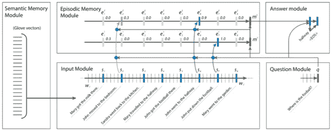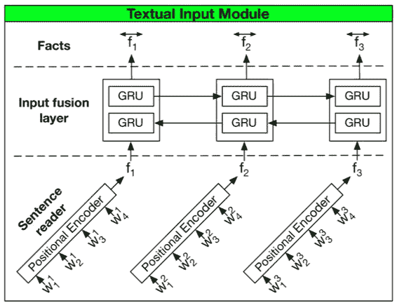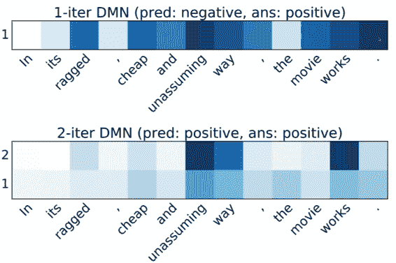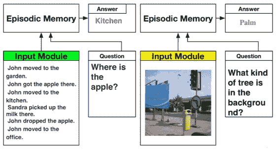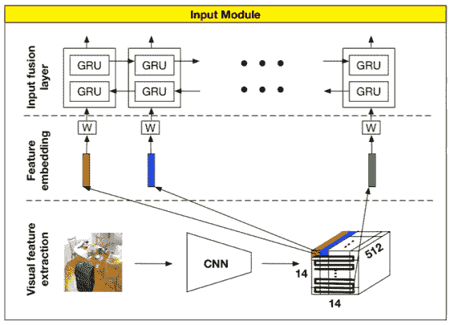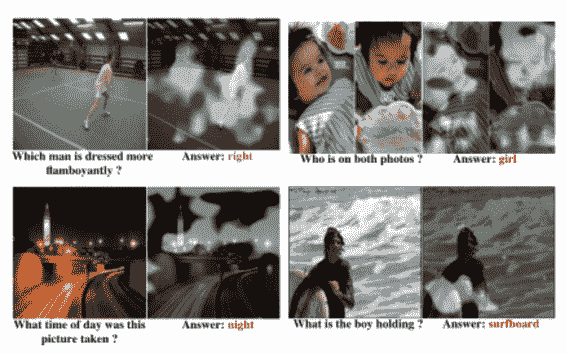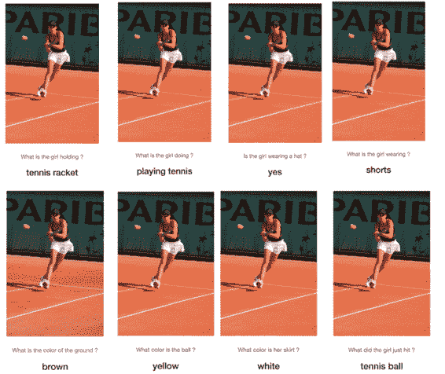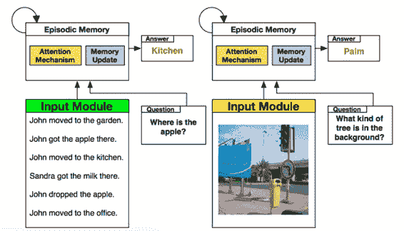最有意思的一课，将所有 NLP 任务视作 QA 问题。模仿人类粗读文章和问题，再带着问题反复阅读文章的行为，利用 DMN 这个通用框架漂亮地解决了从词性标注、情感分析到机器翻译、QA 等一系列任务。

## 是否所有 NLP 任务都可视作 QA？

问答系统举例如下：

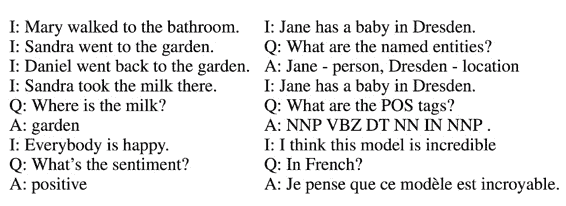

在 old-school NLP 系统中，必须手工整理一个“知识库”；然后在这个知识库上做规则推断。这节课介绍的 DMN 完全不同于这种小作坊，它能够直接从问答语料中学习所有必要的知识表达。

DMN 还可以在问答中做情感分析、词性标注和机器翻译。

所以构建一个 joint model 用于通用 QA 成为终极目标。

要实现这个目标，有两个障碍。

### 前无古人

没有任何已有研究探讨过如何让单个模型学会这么多的任务。每种任务都有独特的特点，适合不同的神经网络来做：

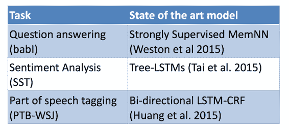

### 全才难得

第二个障碍是，Fully joint multitask learning（同一个 decoder/classifier，不仅仅共享词向量，而应该共享全部参数）非常困难。

有些不成功的研究发现，只能在低层（词向量）共享参数、如果任务之间没有直接关联则会顾此失彼。

## Dynamic Memory Networks

今天介绍的 DMN 仅仅解决了第一个问题。虽然有些超参数还是得因任务而异，但总算是个通用的架构了。

### 回答难题

假设有个阅读理解题目：

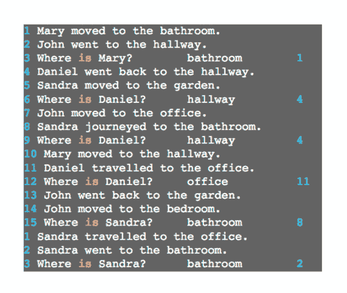

你无法记住全文，但看了问题之后，只要带着问题扫几眼原文，你就能找出答案。

这种现象启发了 DMN。

### Dynamic Memory Networks

先来看 big picture（接下来会对每个模块单独讲解）：

左边输入 input 的每个句子每个单词的词向量，送入 input module 的 GRU 中。同样对于 Question Module，也是一个 GRU，两个 GRU 可以共享权值。

Question Module 计算出一个 Question Vector 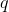，根据应用 attention 机制，回顾 input 的不同时刻。根据 attention 强度的不同，忽略了一些 input，而注意到另一些 input。这些 input 进入 Episodic Memory Module，注意到问题是关于足球位置的，那么所有与足球及位置的 input 被送入该模块。该模块每个隐藏状态输入 Answer module，softmax 得到答案序列。

有人问 DMN 能否学会新类型的问题，答案是否定的。Episodic Memory Module 中有两条线，分别代表带着问题第一次阅读 input 的记忆，以及带着问题第二次阅读的记忆。

### The Modules: Input

开始讲解每个模块的细节了。

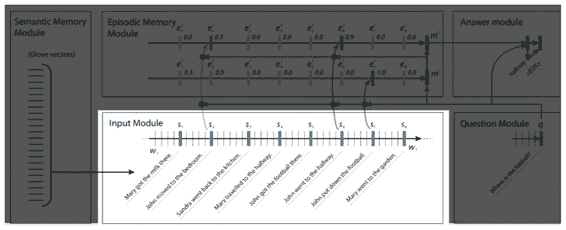

输入模块接受 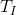 个输入单词，输出个“事实”的表示。如果输出是一系列词语，那么有；如果输出是一系列句子，那么约定表示句子的数量，表示句子中单词的数量。我们使用简单的 GRU 读入句子，得到隐藏状态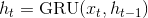，其中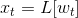，是 embedding matrix， 是时刻  的词语。

事实上，还可以将这个 Uni-GRU 升级为 Bi-GRU：

每个 fact 被表示为双向隐藏状态的拼接。

### The Modules: Question

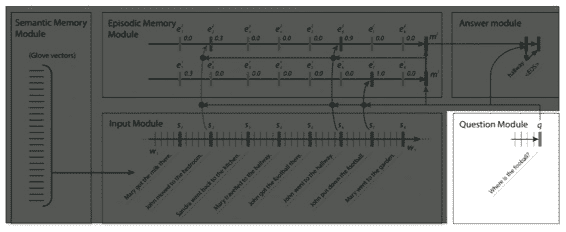

同样用一个标准的 GRU 读入问题，同样的 embedding matrix ，得到最后一个隐藏状态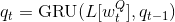。

### The Modules: Episodic Memory

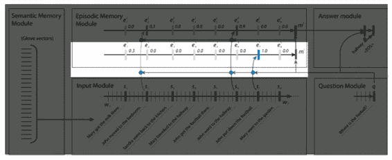

DMN 与其他网络最大的不同之处在于，它会多次阅读输入句子，每次只注意句子的 fact 表示中的一个子集。

输入模块的 Bi-GRU 产生 fact 表示，Episodic Memory 模块也使用 Bi-GRU 产生 Episodic Memory 表示。记第个 pass 产生的 episodic memory representation 为 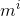 ，episode representation（由 attention mechanism 产生）为 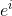。

其中，episodic memory representation 初始化为 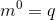，并通过 GRU 处理: 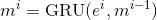。而 episode representation 使用 input module 的隐藏状态输出更新：

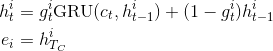

其中 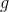 是 attention mechanism，有多种计算方式。在最初的 DMN paper (Kumar et al. 2016)中，验证了下列公式是最好的：

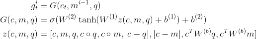

这里最重要的是的计算，通过句子向量、问题向量、上一个记忆向量之间原始形式与 element-wise 乘积（相似性）的按行拼接，得到一个超长的列向量。然后非线性激活传播一层，softmax 得到，表示每次阅读对每个时刻（句子）的关注程度。

Richard 说最初他们还尝试过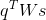，后来发现并没有什么帮助。他的忠告是，如果模型中有多余的部分，那就去掉。

这里两条线代表两个 GRU，阅读两遍。这也是个超参数。Richard 说最开始多个 pass 的 Memory 也通过 GRU 合并，后来发现只留两个 pass 直接视作两层神经网络也能解决问题，能简单就不要复杂。

### The Modules: Answer

answer module 就是一个简单的 GRU decoder，接受上次输出的单词（应该是 one-hot 向量），以及 episodic memory，输出一个单词：

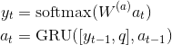

### 相关工作

有很多已有工作做了类似研究：

• Sequence to Sequence (Sutskever et al. 2014)

• Neural Turing Machines (Graves et al. 2014)

• ***Teaching Machines to Read and Comprehend (Hermann et al. 2015)***

• Learning to Transduce with Unbounded Memory (Grefenstette 2015)

• Structured Memory for Neural Turing Machines (Wei Zhang 2015)

• Memory Networks (Weston et al. 2015)

• End to end memory networks (Sukhbaatar et al. 2015) 

Richard 吐槽说他不觉得机器能像加粗的论文标题所说的，跟人一样阅读理解。也许这篇论文有点标题党了。与 DMN 联系密切的是后面两篇论文，都有 Memory Component。

### 与 MemNets 比较

**相同点**

*   都有 input, scoring, attention and response 模块

**不同点**

*   MemNets 主要使用词袋，然后有一些 embedding 去 encode 位置

*   MemNets 迭代运行 attention 和 response

这些不同点都是由于 MemNets 是个非 sequence 模型造成的。而 DMN 是个血统纯正的 neural sequence model，天然适合序列标注等任务，比 MemNets 应用范围更广。

DMN 的 sequence 能力来自 GRU，虽然一开始用的是 LSTM，后来发现 GRU 也能达到相同的效果，而且参数更少。（这回答了 GRU 和 LSTM 那节课有个学生的问题：哪个计算复杂度更低。Manning 当时回答应该是一样的，还不太相信 Richard 的答案。说明在工程上，还是做实验的一线博士更有经验）

 [知识共享署名-非商业性使用-相同方式共享](http://www.hankcs.com/license/)：[码农场](http://www.hankcs.com) » [CS224n 笔记 16 DMN 与问答系统](http://www.hankcs.com/nlp/cs224n-dmn-question-answering.html)