# CS224n 笔记 17 NLP 存在的问题与未来的架构

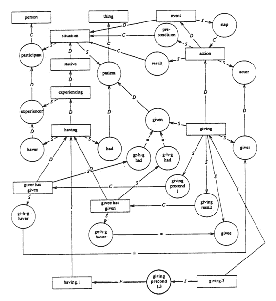课程介绍了各种各样的深度学习网络与应用，是时候从更高层次思考自然语言处理存在的问题与展望未来了。虽然 BiLSTM 与 attention 几乎统治了 NLP，但在篇章级别的理解与推断上还不尽人意。

## 新时代人们正在“解决”语言 

深度学习填平了领域鸿沟，许多计算机视觉的泰斗级学者也开始研究起自然语言处理的各种任务。

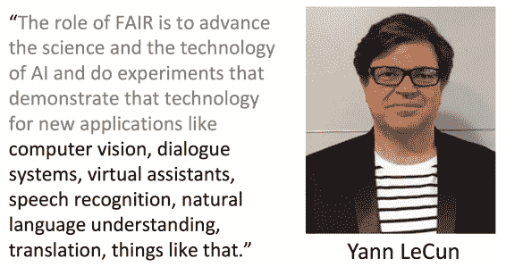

这里提到的自然语言理解、机器翻译都是较高层次、更难的任务，现有系统做得并不那么好。

## 旧时代的热血

早期 NLP 学者拥有崇高的目标，希望让机器像人一样理解语言；但奈何数据和计算力都有限，使得成效甚微。Manning 说今天我们有了海量的数据与强大的计算力，却往往自满于跑个 LSTM，而不愿意挑战这个终极目标。

AI 的师祖 Norvig (1986)的 Ph.D.论文 The unified theory of inference 中举了个例子，希望机器从一篇文章中理解如下信息：

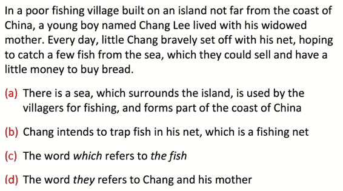

其中 a 和 b 即便是最前沿的技术也无法自动推断，因为在文本没有提到海与岛的关系，也没提到渔网，省略了太多背景知识。

所以 Norvig 认为，必须先建立一个包罗万象的知识库，才能进行自然语言理解。但最近二十年，没有知识库我们也完成了许多 NLP 任务，并且模型学到的“知识”是连续的表示，而不是“知识库”中的离散表示。

Norvig 假想的系统中含有如下 4 种推断（inference）：

1.  Elaboration：连接两个实体，表示解释说明

2.  Reference Resolution：就是指代相消

3.  View Application：比喻、活用、习语

4.  Concretization：具体化，一般化，比如 TRAVELLING is an AUTOMOBILE is an instance of DRIVING

## 基础 NLP：在进步

Norvig 写博士论文的时候，连像样的句法分析器都没有，所有句子都是手工分析的。现在我们有了[全自动的句法分析器](http://hanlp.hankcs.com/?sentence=%E5%BE%90%E5%85%88%E7%94%9F%E8%BF%98%E5%85%B7%E4%BD%93%E5%B8%AE%E5%8A%A9%E4%BB%96%E7%A1%AE%E5%AE%9A%E4%BA%86%E6%8A%8A%E7%94%BB%E9%9B%84%E9%B9%B0%E3%80%81%E6%9D%BE%E9%BC%A0%E5%92%8C%E9%BA%BB%E9%9B%80%E4%BD%9C%E4%B8%BA%E4%B8%BB%E6%94%BB%E7%9B%AE%E6%A0%87%E3%80%82)：

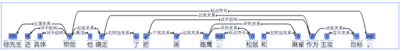

但现代 NLP 依然没有完成 Norvig 设想的宏伟目标——自动推断：

也许是时候开始挑战这个宏伟目标了。

### 我们还需要什么

现在 BiLSTMs with attention 已经统治了 NLP 领域，你可以在任何任务上应用它，得到超越其他方法的好成绩（就如同若干年前的 CRF 和 SVM 一样）。

另外神经网络方法也带来了自然语言生成领域的文艺复兴（MT、QA、自动摘要……）

这些现代突破都没有采用 Norvig 假想的“知识库”。究竟是否需要一个显式的、localist（应该指的是领域相关的）语言与知识表示和推断机制，这是一个亟待探讨的科学问题。

虽然神经网络隐含了知识表达，我们也已经取得了如此多的成就，但我们建立和访问记忆或知识的手段依然十分原始。LSTM 只是短时记忆，并不能与人类经年累月的经验与记忆相比。LSTM 只是线性地扫描最近 100 个单词而已。

另外，现有模型也无法制定和执行目标或计划。这对对话系统而言非常重要，对话应当是有意义有目标的，而不是闲扯。

虽然句子级别的分析已经可以做到很清楚，句子之间的关系（顺承、原因、转折）则无法理顺。

而且现在无论多深的网络，依然缺少理解语言解释说明的常识或背景知识（虽然模型可能不够复杂，我觉得数据量不够也是很大原因，人类从小到大接受了多少文化教育，你能提供给神经网络的标注语料能有多少个句子）。

接下来介绍一些前沿的尝试“盗火”的研究。

### Recursive Neural Networks 用于意识形态检测

作为语言学者，Manning 还是很喜欢树形模型（赞成）。他的学生尝试用 Recursive Neural Networks 检测人们在政治上是保守的还是自由激进的等等。

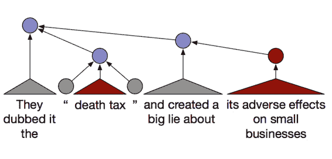

这并不是句子级别或段落级别的分析，而是文章级别的分析。一些政治术语被复合起来检测最终的政治倾向（用不同颜色表示）。红色表示保守的：

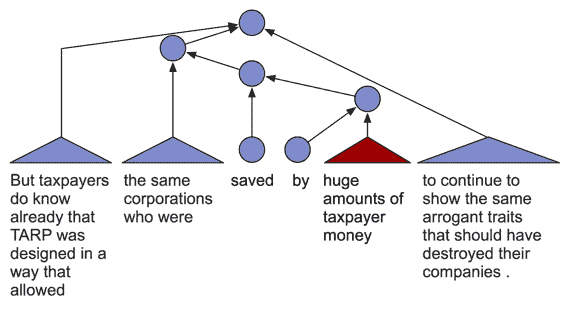

## TreeRNN

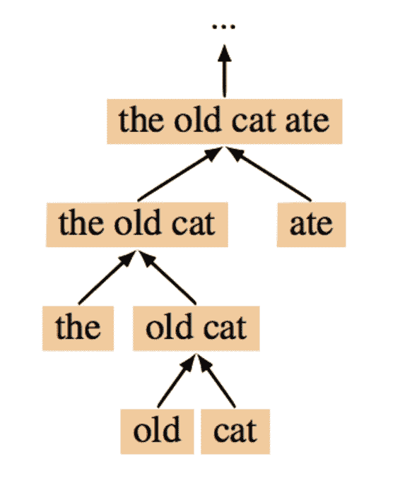

树形模型理论上很有吸引力，但非常慢，需要外部句法分析器（如果用内部的则更慢），而且也没有用到语言的线性结构。

### recurrent NN 训练快

线性结构的模型适合 batch 训练，因为对每个训练实例，模型结构都是一样的。

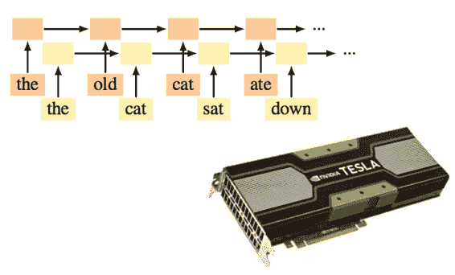

### TreeRNN 结构取决于输入

所以无法并行化，一个线程在训练某种结构的模型，其他线程得等它。

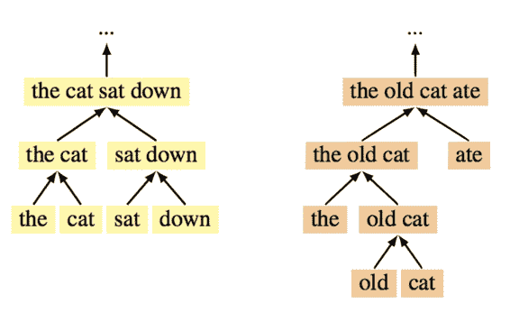

### The Shift-reduce Parser-Interpreter NN (SPINN)

为了提高 tree 模型的训练效率，人们活用 Shift-reduce 依存句法分析的思想，将模型的树形机构拆分为动作序列，得到了 25 倍的速度提升。这还产生了“线性”与“树形”模型的混血，可以离开外部句法分析器独立运行。

### binary trees = transition sequences

具体拆分方法如下：

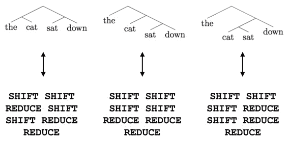

shift 入栈，reduce 合并。

### 架构

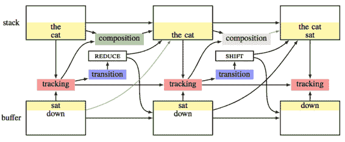

模型与 parser 类似，有 stack 和 buffer 储存单词，tracking 由 LSTM 负责 track 并决策动作，TreeRNN 负责拼装成分的表达。LSTM 还将上文的表示送给 TreeRNN 拼装，这似乎解决了树形模型无法捕捉语言的线性结构的问题。

 [知识共享署名-非商业性使用-相同方式共享](http://www.hankcs.com/license/)：[码农场](http://www.hankcs.com) » [CS224n 笔记 17 NLP 存在的问题与未来的架构](http://www.hankcs.com/nlp/cs224n-nlp-issues-architectures.html)