# CS224n 笔记 18 挑战深度学习与自然语言处理的极限

最后一课，总结了目前这两个领域中的难题，介绍了一些前沿研究：快 16 倍的 QRNN、自动设计神经网络的 NAS 等。

深度学习已经漂亮地完成了许多单项任务，但如果我们继续随机初始化模型参数，我们永远也无法得到一个可以完全理解语言的系统。模型就像蒙住眼的狗，在高原上随机游走，头撞南墙。

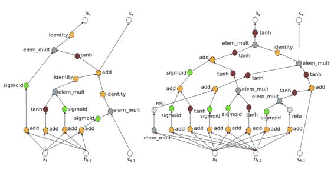

Richard 说他同样不相信独立的无监督学习能够救世（同意），虽然这个问题还存在许多争议。因为语言有许多监督与反馈，要完成的目标也多种多样。

在达到下一个层次的路上，摆在 NLP 面前有许多障碍。

## 障碍 1：通用架构 

没有单个模型能够胜任多个任务，所有模型要么结构不同，要么超参数不同。

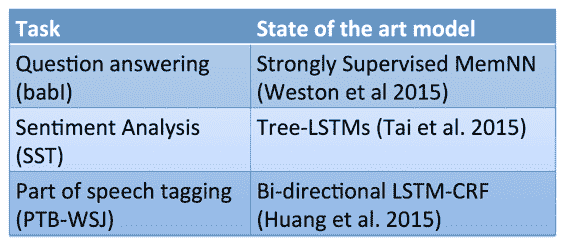

上次介绍的[DMN](http://www.hankcs.com/nlp/cs224n-dmn-question-answering.html)带来了曙光。

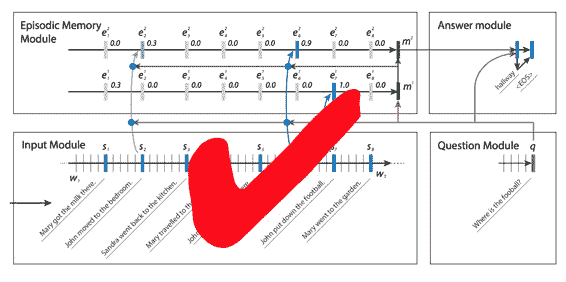

## 障碍 2：联合多任务学习

上次也提到过，同一个 decoder/classifier，对于不同的输入，只要替换 encoder 就能同样输出。

*   不像计算机视觉，只能共享低层参数

*   只在任务相关性很强的时候才会有帮助

*   否则会影响效果

### 解决方案

在第一课中提到的 MetaMind 团队提出的 A Joint Many-Task Model: Growing a Neural Network for Multiple NLP Tasks，现在详细介绍。

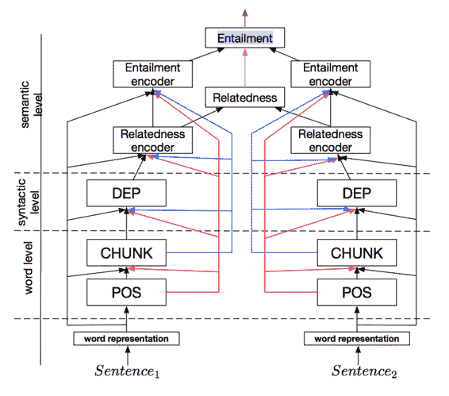

这是个怪兽一般的模型，多层 LSTM 并联，从下往上看在文本颗粒度上是越来越大，在任务上是越来越复杂。由底而上分别是词性标注、CHUNK、句法分析、两个句子的相关性、逻辑蕴涵关系。输入可能是词，也可能是字符 ngram。底层任务的隐藏状态有到其他层级的直接路径。相关性 encoder 的输出卷积一下，供逻辑关系分类器使用。

整个模型使用同一个目标函数。左右对称只是示意可以接受两个句子用于关联分析，其实是同一套参数。

### 模型细节

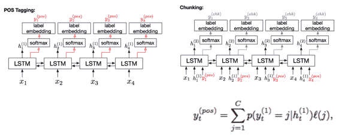

词性标注是单层 LSTM，隐藏状态 softmax 一下，乘上 label 的 embedding 得到每个单词的 pos embedding。将词性标注 LSTM 的隐藏状态、pos embedding 和单词输入 chunking 的 LSTM，执行类似的流程得到 chunk 的 embedding。

### 依存句法分析

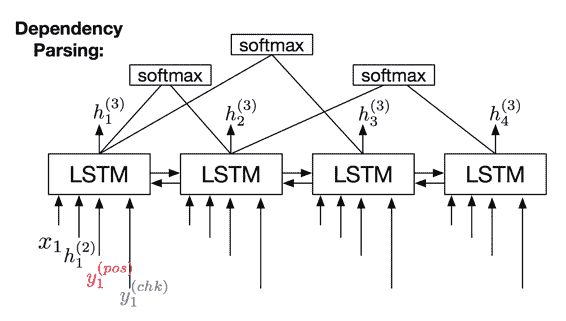

依然是单层 LSTM，每个时刻同时接受下级的输入。每两个时刻的单词做一次 softmax，判断它们的依存关系。理论上讲，该方法无法保证结果一定是合法的句法树，但 Richard 说 99%的 case 都是合法的，加上一些剪枝规则后，可以拿到最高分数（虽然论文还未发表就被另一位同行超越了）。

### 语义联系

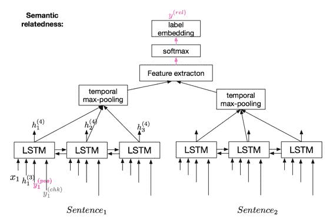

依然是类似的 BiLSTM，多了个 CNN max 池化，过一层前馈神经网络，过一层 softmax 得到两个句子的语义联系。

### 训练

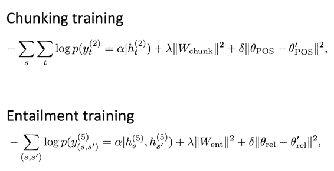

如果每个 softmax 都用交叉熵损失函数训练的话，效果并不好。这里用到了一种新奇的技巧叫做 successive regularization，在某个上层任务的损失函数中，加入一个正则化项，限制下层任务的参数不要改变太多。

在训练的时候，从低层任务出发，先专注优化一个目标函数，假装上面的东西都不存在，逐步往上。（我觉得这并不是同一个目标函数）

### 结果

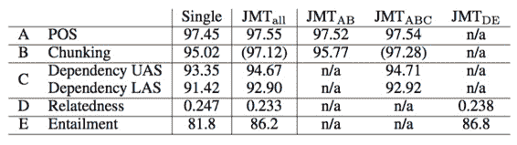

联合训练提高了每项任务的效果，任务数据越小，提升越显著。这是因为迁移学习的帮助越大。

大部分任务都拿到了最高分：

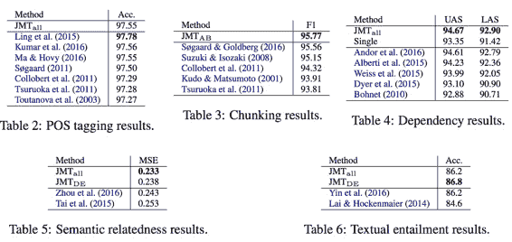

## 障碍 3：预测从未见过的词语

以前课程也讲过，[pointer copy 机制](http://www.hankcs.com/nlp/cs224n-mt-lstm-gru.html#h3-15)：

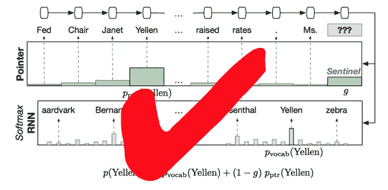

 [知识共享署名-非商业性使用-相同方式共享](http://www.hankcs.com/license/)：[码农场](http://www.hankcs.com) » [CS224n 笔记 18 挑战深度学习与自然语言处理的极限](http://www.hankcs.com/nlp/cs224n-tackling-the-limits-of-dl-for-nlp.html)