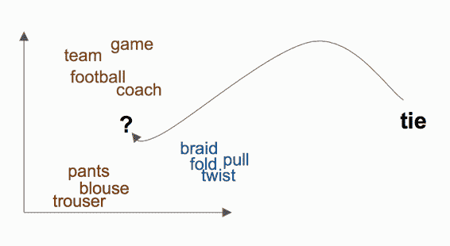
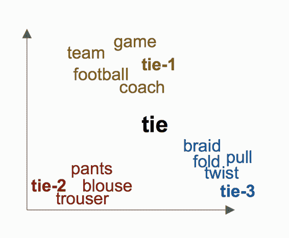
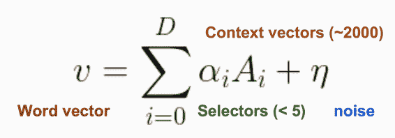
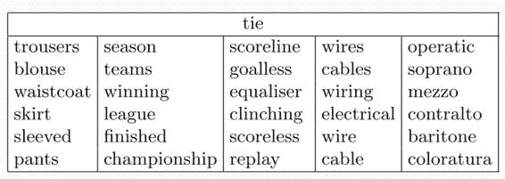
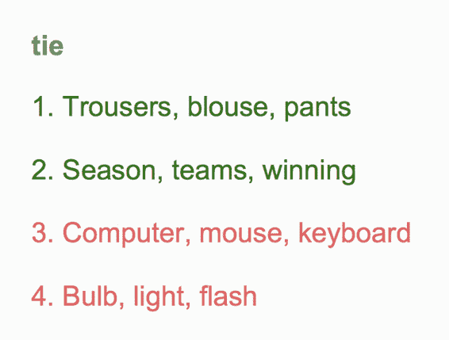
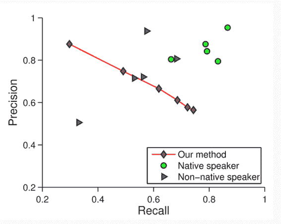

# CS224n 研究热点 2 词语义项的线性代数结构与词义消歧

词向量本身无法解决一词多义的问题，比如：

这里的 tie 可能表示球赛的平局，也可能表示领带，还可能表示绳子打结。那它的词向量究竟在哪里呢？

虽然相似的词被映射到邻近的位置，但该论文证明词向量是所有义项的平均：

它被映射到这些词语的中央，这有什么用呢，可以复原它的所有义项吗？

## 复原

研究发现义项是由如下 sparse coding 编码：

这里的是类似于 sports 之类的 Context vectors（或说义项的 vector），是某个 Context vector 的系数（hard sparsity constraint）。论文中说这些参数可以通过标准 k-SVD 算法求出。

## 复原结果

## 量化评测

是请了各国的研究生与该方法一起作为实验对象，做如下的题目：

问他们这些词语与某个词是否相关，计算 PR 值。结果证明，这种方法可以达到 non-native speaker 的水平。

## 总结

词向量是多个义项的叠加。通过复原方法，可以通过 sparse coding 的 k-SVD 算法复原词向量中的所有义项。复原水平达到 non-native English speakers 的水准。

 [知识共享署名-非商业性使用-相同方式共享](http://www.hankcs.com/license/)：[码农场](http://www.hankcs.com) » [CS224n 研究热点 2 词语义项的线性代数结构与词义消歧](http://www.hankcs.com/nlp/cs224n-word-senses.html)