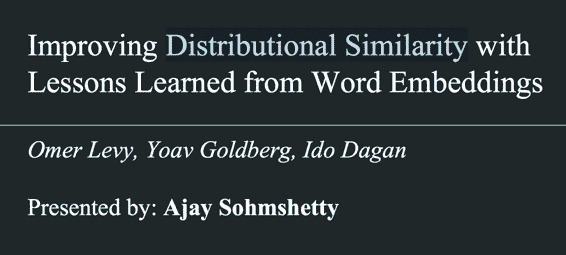
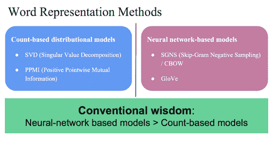
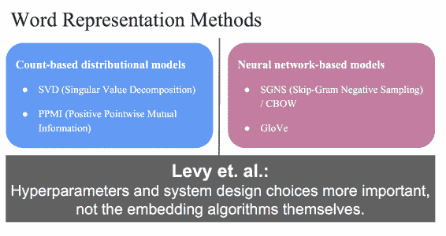
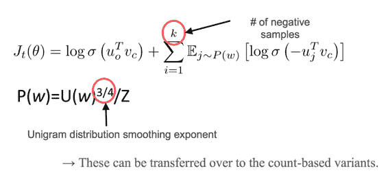
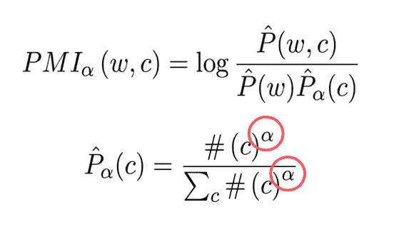
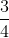
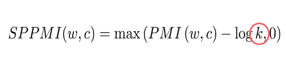
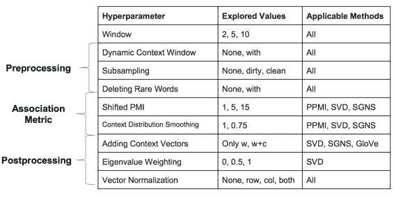
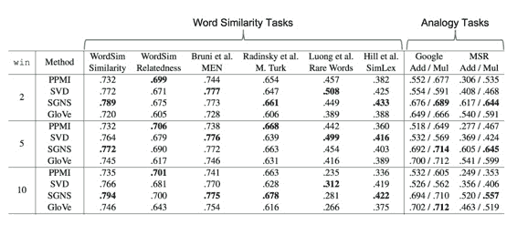

# CS224n 研究热点 4 词嵌入对传统方法的启发

主讲人是一位发音特别纯正的印度小哥，只有微量口音。这篇论文挑战了对神经网络的迷信，展示了传统模型的生命力以及调参的重要性。

## 词语表示方法

以前的课程中讲过两大类得到 dense 词语表示的方法，一般认为 NN 模型更好：

这里的 PPMI 也是一种利用共现矩阵的方法。

但 Levy 指出，超参数和实现细节比算法本身更重要：

## Skip-Gram 中的超参数

有负例的采样个数，负采样算法中的平滑指数：

## 对 PMI 的启发

PMI 中也有个类似负采样中的平滑指数的超参数：

试验证明，取恰好能得到最好的效果。

另外在一种叫 Shifted PMI 的变种中，也有类似于负采样个数的超参数：

## 可调超参数一览表

这些方法中，存在大量的超参数可供折腾：

## 调参结果

将每种方法能调的超参数调到最佳，得到如下结果：

结果表示，没有性能稳定的方法，时而是 count-based 方法胜出，时而是 NN 方法胜出。

## 结论

*   这篇文章挑战了人们对 NN 模型的迷信，展示了 NN 模型并不一定比传统模型好。

*   虽然模型设计很重要，要想拿到好的效果，调参也非常非常重要。

*   不要迷信，要勇于挑战流行的论点（小哥认为词的向量表示领域还有很大的探索空间）。

 [知识共享署名-非商业性使用-相同方式共享](http://www.hankcs.com/license/)：[码农场](http://www.hankcs.com) » [CS224n 研究热点 4 词嵌入对传统方法的启发](http://www.hankcs.com/nlp/cs224n-improve-word-embeddings.html)