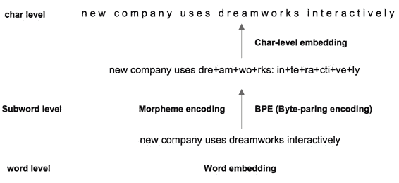
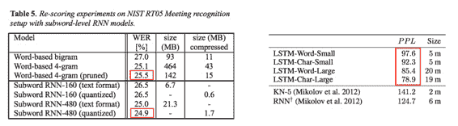
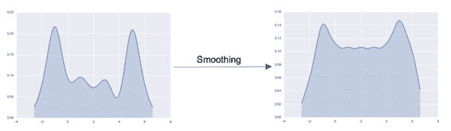
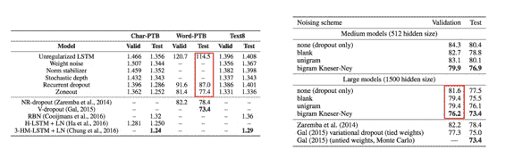
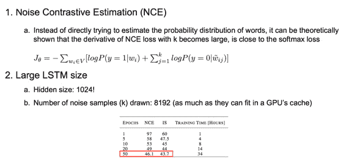
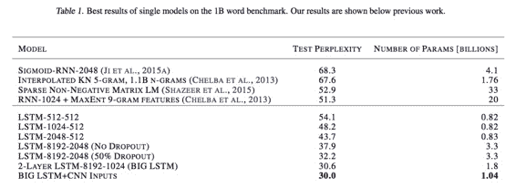

# CS224n 研究热点 7 迈向更好的语言模型

我们已经知道一些手段来改进语言模型，比如：

1.  更好的输入：词→词根→字符

2.  更好的正则化/预处理

3.  这些手段综合起来得到了更好的语言模型

## 更好的输入

文本的多种颗粒度：

更细的颗粒度相当于减小了词表，让模型更容易做对选择。试验表明的确降低了 error：

## 更好的正则化和预处理

正则化就不说了。

预处理指的是，随机地将句子中的一些单词替换成另外的单词（比如把一个地名替换为另一个），或者使用 BiGram 统计信息来生成替换。

这样会得到一个更加平滑的分布，高频词将一些出场机会匀给了低频词。

对错误率的降低效果如下（左边是正则化，右边是预处理）：

## 更好的模型？

**Noise Contrastive Estimation（NCE）**

与其用昂贵的交叉熵损失函数，不如用一种叫 NCE 损失的近似，理论证明当 k 值足够大时，两者梯度是接近的。

**更大的 LSTM 单元数**

LSTM 单元数增加到 1024，k 值越大越好，直到吃满 GPU 显存。

用上了这些种种改进之后，总算是拿到如下成绩：

 [知识共享署名-非商业性使用-相同方式共享](http://www.hankcs.com/license/)：[码农场](http://www.hankcs.com) » [CS224n 研究热点 7 迈向更好的语言模型](http://www.hankcs.com/nlp/cs224n-better-language-modeling.html)