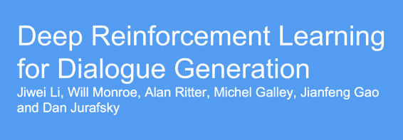
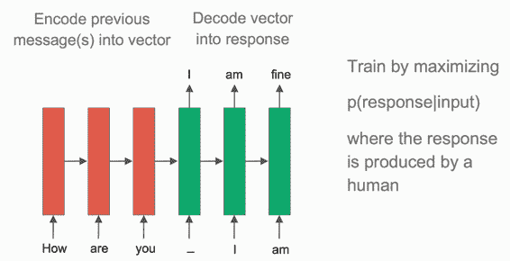
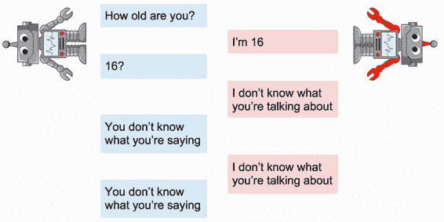
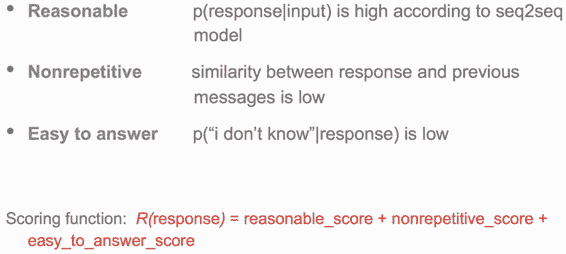
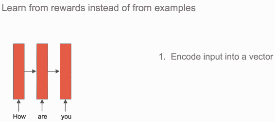
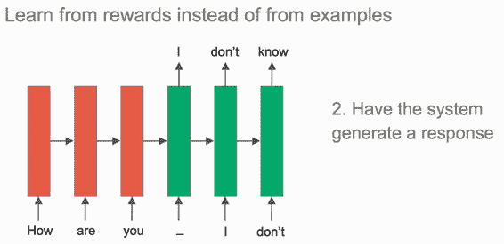
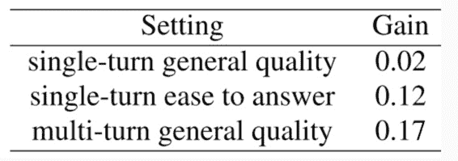
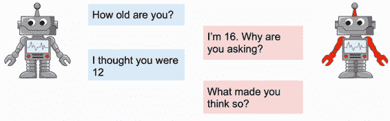
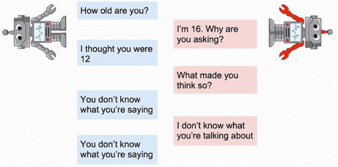

# CS224n 研究热点 11 深度强化学习用于对话生成

这篇论文研究如何训练聊天机器人进行有意义的对话，常规方法是 seq2seq：

与上几次课讲的机器翻译框架相同，encoder 与 decoder，相同的极大似然估计目标函数。

## seq2seq 的缺陷 

通过该方法训练出来的聊天机器人容易陷入死循环，比如让两个机器人聊天，本来聊得好好的：

但一两句话之后就会重复相同的内容：

其问题在于，红方“ I’m 16”缺乏指导性，没有给蓝方继续对话的话题。而“ I don’t know what you’re talking about”又是个太宽泛的大废话。虽然这些对话看起来似乎很自然，但没有内容在里面。

也就是说，一个概率大的回复并不等于好的回复，比如“我不知道你在讲什么”虽然可以应付所有的问题，在 MLE 看来概率特别高，但就是没有意义。

## 如何定义好的回复

一个好的回复应该是内容丰满、容易回答、又不重复的。论文作者据此编写了打分函数：

## 强化学习

有了打分函数，也就有了奖励机制。考虑到对话其实是连续的行为，所以轮到强化学习登场了。

强化学习不再从例子中直接学习生成最大概率的回复，而是根据激励函数的指导尝试生成最大得分的回复。第一步依然是 encoder：

第二步就不再是传入某个人类对话样本指导它学习语言模型之类，而是让它自顾自地生成一个回复。

第三步用激励函数给模型生成的回复打分，让它知道自己做得怎么样。

## 量化结果

数值结果是人工评判的，这些数值都是正数，说明强化学习得到的对话更好：

## 直观效果

回到开头的例子，现在模型能够进行更充实的对话了：

虽然几句话过后又开始死循环：

嘛，就算是人，尬聊一会儿也会无话可说吧。另外，这里衡量回复质量的打分函数也太主观了吧。

## 结论

*   强化学习可以让模型超越模仿人类标注，做一些有意义的事情。

*   NLP 领域还有更多应用了 RL 的任务，如信息抽取、QA、task-oriented 对话、指代相消、等等。

 [知识共享署名-非商业性使用-相同方式共享](http://www.hankcs.com/license/)：[码农场](http://www.hankcs.com) » [CS224n 研究热点 11 深度强化学习用于对话生成](http://www.hankcs.com/nlp/cs224n-deep-reinforcement-learning-for-dialogue-generation.html)