# CS224n 研究热点 14 自动组合神经网络做问答系统

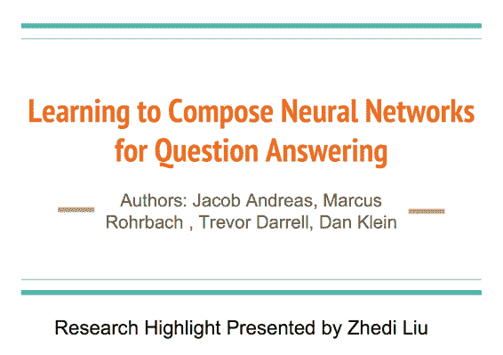

这是自我组装推断的 QA，可接受多种知识，包括图片和结构化知识库。问答具有复合性，很早就有人引入句法分析判断究竟在问什么，甚至脑洞大开想做自然语言编译器。但他们总是脱离不了手写规则的思维，白白糟蹋了性能卓越的句法分析器。而该模型自动组装多个神经网络用于逻辑推断，拿到了显著的好成绩。

## 四个 Jointly 训练的组件

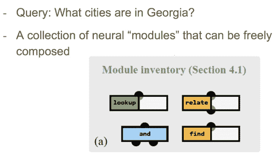

利用这四个组件可以组装分析问题的逻辑流：

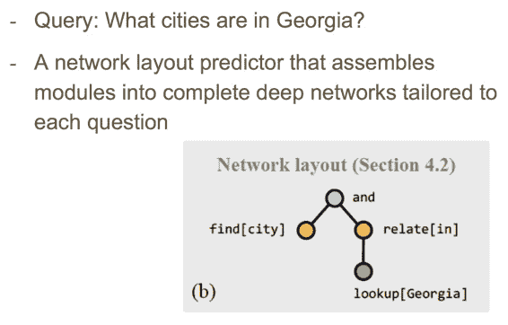

目标是训练模型自动分析 query，组装逻辑组件。

## 模型：在两个分布上构建

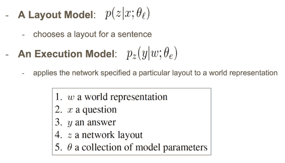

一个 Layout Model，选择问题的 layout（应该是逻辑语句的“语法树”）。一个 Execution Model，在 world representation（应该理解为 fact 的表示）上执行 layout。

## Layout Model

这个模型的训练有 3 步，首先将输入句子解析为依存句法树：

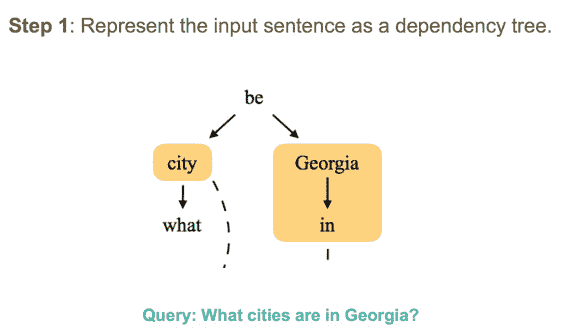

第二步，将句法树的片段分配给合适的逻辑组件：

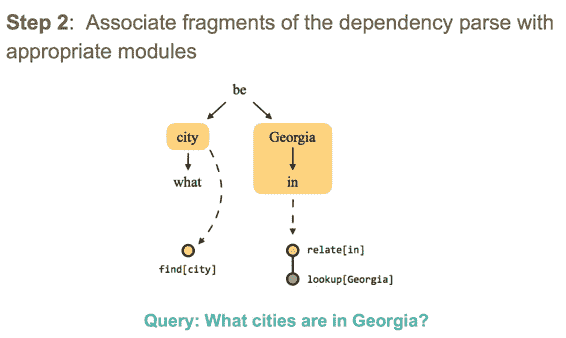

最后，将逻辑片段组装为完整的 layout：

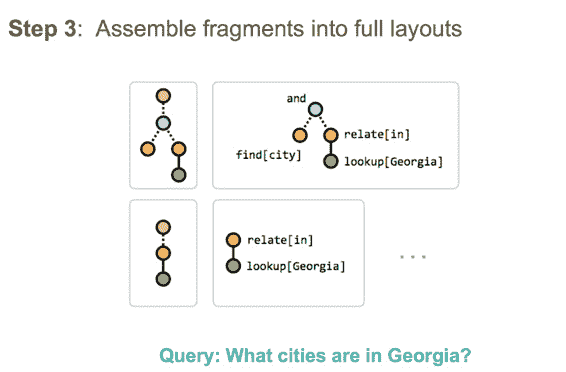

这个 layout 的 root 是 and 逻辑，每个句子可能有多个 layout，接下来介绍如何为 layout 打分

### Layout Scoring Model

得到问题的 LSTM 表示，以及特征表示，将两个表示传入多层感知机。每个时刻的梯度是 layout 的 log-probability 乘以该 layout 预测的准确率的梯度。

## Execution Model

在知识库上面执行逻辑查询，输入结构化知识库中某种实体的所有 representation，流入逻辑树输出每个备选答案的分值，取最大的那个。

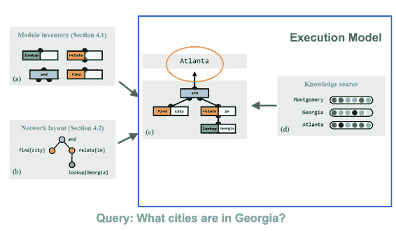

### Module: lookup

就是 lookup table，去结构化知识库（数据库）取数据，查出实体的向量表示：

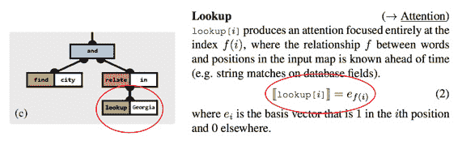

“把全部 attention 放到第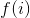个元素上”，真是清丽脱俗的说法呢。

### Module: relate

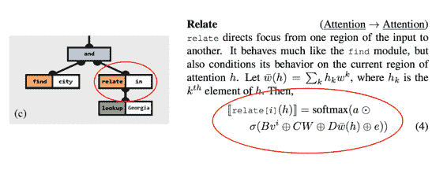

将 attention 从输入的一部分导向另一部分，条件中含有当前的 attention。公式没展开讲，详细看论文吧。

### Module: find

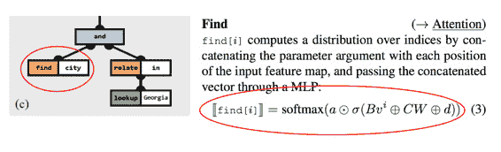

也是把输入的特征拼接起来往多层感知机里面过一下然后 softmax。这里的输入应当是遍历所有单词。

### Module: and

有点像集合运算中的交集，只不过是在多个 attention 上做的乘法：

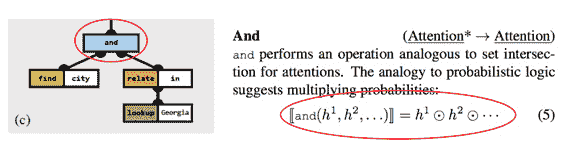

### 训练 Execution Model

目标函数是给定 world representation 和 layout 下正确答案的最大似然：

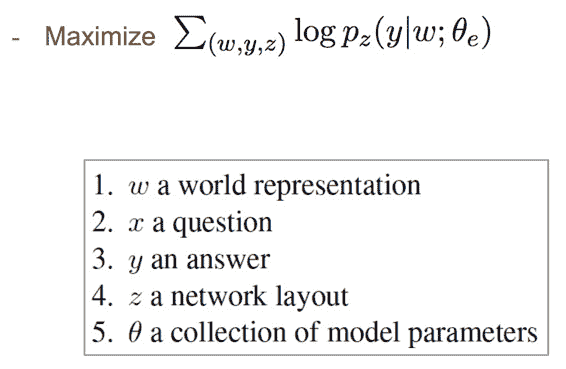

## 结果

### VQA

直观效果不错：

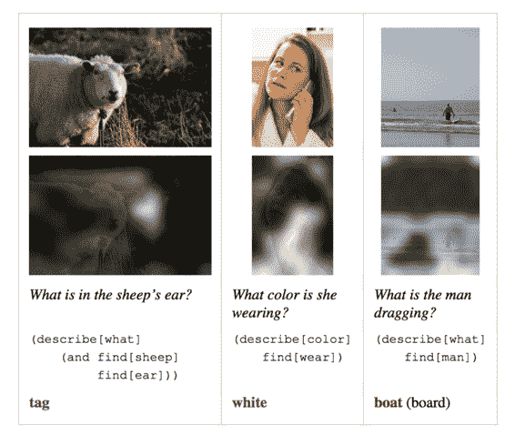

也拿到了最高分数：

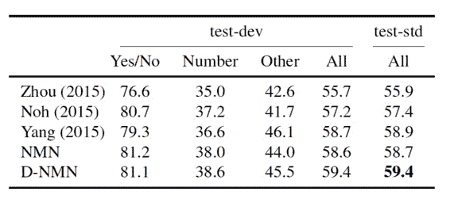

### GeoQA

在这个领域知识库上表现也很出色：

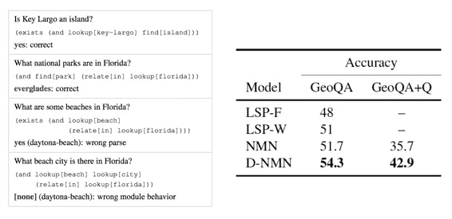

虽然在结构化知识库的手写特征利用上没有免俗，但总算自动化了“推断”这个被丑陋规则统治的部分。

 [知识共享署名-非商业性使用-相同方式共享](http://www.hankcs.com/license/)：[码农场](http://www.hankcs.com) » [CS224n 研究热点 14 自动组合神经网络做问答系统](http://www.hankcs.com/nlp/cs224n-compose-nn-for-qa.html)