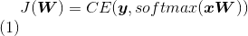

# CS224n Assignment 2

先在 TensorFlow 上实现多项逻辑斯谛回归练练手，然后增加难度实现基于神经网络的转移依存句法分析，试验 Xavier 初始化、Dropout 和 Adam 优化器。最后推导 RNN 和语言模型的困惑度、梯度、反向传播和复杂度。

Python 代码开源在[GitHub](https://github.com/hankcs/CS224n)上。正式开始利用 TensorFlow 了，这里采用最新的 TensorFlow-r1.2 和 Python2.7。如果在安装或升级 TF 的过程中遇到权限问题，比如：

```py
IOError: [Errno 13] Permission denied: '/usr/local/bin/markdown_py'
```

不如试试：

```py
pip install tensorflow --user
```

或《[从源码编译安装 TensorFlow](http://www.hankcs.com/ml/compile-and-install-tensorflow-from-source.html)》，自行编译安装得到的库效率更高。

一些 TensorFlow 函数假定输入为行向量，所以乘上权值矩阵的时候必须右乘（）而不是左乘()。

## 1 Tensorflow Softmax

以交叉熵损失函数



实现线性分类器。要求使用 TensorFlow 的自动微分功能将模型拟合到数据。

### a softmax

手写实现 softmax，不要用直接 tf.nn.softmax。如果输入是矩阵，则视作不相干的行向量集合。

```py
def softmax(x):
    """
    Compute the softmax function in tensorflow.
    You might find the tensorflow functions tf.exp, tf.reduce_max,
    tf.reduce_sum, tf.expand_dims useful. (Many solutions are possible, so you may
    not need to use all of these functions). Recall also that many common
    tensorflow operations are sugared (e.g. x * y does a tensor multiplication
    if x and y are both tensors). Make sure to implement the numerical stability
    fixes as in the previous homework!
    Args:
        x:   tf.Tensor with shape (n_samples, n_features). Note feature vectors are
                  represented by row-vectors. (For simplicity, no need to handle 1-d
                  input as in the previous homework)
    Returns:
        out: tf.Tensor with shape (n_sample, n_features). You need to construct this
                  tensor in this problem.
    """
    ### YOUR CODE HERE
    x_max = tf.reduce_max(x,1,keep_dims=True)          # find row-wise maximums
    x_sub = tf.sub(x,x_max)                            # subtract maximums
    x_exp = tf.exp(x_sub)                              # exponentiation
    sum_exp = tf.reduce_sum(x_exp,1,keep_dims=True)    # row-wise sums
    out = tf.div(x_exp,sum_exp)                        # divide
    ### END YOUR CODE
    return out
```

### b 交叉熵

```py
def cross_entropy_loss(y, yhat):
    """
    Compute the cross entropy loss in tensorflow.
    The loss should be summed over the current minibatch.
    y is a one-hot tensor of shape (n_samples, n_classes) and yhat is a tensor
    of shape (n_samples, n_classes). y should be of dtype tf.int32, and yhat should
    be of dtype tf.float32.
    The functions tf.to_float, tf.reduce_sum, and tf.log might prove useful. (Many
    solutions are possible, so you may not need to use all of these functions).
    Note: You are NOT allowed to use the tensorflow built-in cross-entropy
                functions.
    Args:
        y:    tf.Tensor with shape (n_samples, n_classes). One-hot encoded.
        yhat: tf.Tensorwith shape (n_sample, n_classes). Each row encodes a
                    probability distribution and should sum to 1.
    Returns:
        out:  tf.Tensor with shape (1,) (Scalar output). You need to construct this
                    tensor in the problem.
    """
    ### YOUR CODE HERE
    l_yhat = tf.log(yhat)                           # log yhat
    product = tf.mul(tf.to_float(y), l_yhat)        # multiply element-wise
    out = tf.neg(tf.reduce_sum(product))            # negative summation to scalar
    ### END YOUR CODE
    return out
```

### c Placeholders & Feed Dictionaries

略

assignment2/model.py 这个抽象层写得还算挺优美的。

### d Softmax & CE Loss

```py
def add_prediction_op(self):
    """Adds the core transformation for this model which transforms a batch of input
    data into a batch of predictions. In this case, the transformation is a linear layer plus a
    softmax transformation:
    y = softmax(Wx + b)
    Hint: Make sure to create tf.Variables as needed.
    Hint: For this simple use-case, it's sufficient to initialize both weights W
                and biases b with zeros.
    Args:
        input_data: A tensor of shape (batch_size, n_features).
    Returns:
        pred: A tensor of shape (batch_size, n_classes)
    """
    ### YOUR CODE HERE
    with tf.variable_scope("transformation"):
        bias = tf.Variable(tf.random_uniform([self.config.n_classes]))
        W = tf.Variable(tf.random_uniform([self.config.n_features, self.config.n_classes]))
        z = tf.matmul(self.input_placeholder, W) + bias
    pred = softmax(z)
    ### END YOUR CODE
    return pred
def add_loss_op(self, pred):
    """Adds cross_entropy_loss ops to the computational graph.
    Hint: Use the cross_entropy_loss function we defined. This should be a very
                short function.
    Args:
        pred: A tensor of shape (batch_size, n_classes)
    Returns:
        loss: A 0-d tensor (scalar)
    """
    ### YOUR CODE HERE
    loss = cross_entropy_loss(self.labels_placeholder, pred)
    ### END YOUR CODE
    return loss
```

### e Training Optimizer

```py
def add_training_op(self, loss):
    """Sets up the training Ops.
    Creates an optimizer and applies the gradients to all trainable variables.
    The Op returned by this function is what must be passed to the
    `sess.run()` call to cause the model to train. See
    https://www.tensorflow.org/versions/r0.7/api_docs/python/train.html#Optimizer
    for more information.
    Hint: Use tf.train.GradientDescentOptimizer to get an optimizer object.
                Calling optimizer.minimize() will return a train_op object.
    Args:
        loss: Loss tensor, from cross_entropy_loss.
    Returns:
        train_op: The Op for training.
    """
    ### YOUR CODE HERE
    train_op = tf.train.GradientDescentOptimizer(self.config.lr).minimize(loss)
    ### END YOUR CODE
    return train_op
```

TF 会自动求偏导数，GradientDescentOptimizer 负责更新参数。

运行后输出：

```py
Epoch 47: loss = 0.45 (0.007 sec)
Epoch 48: loss = 0.44 (0.007 sec)
Epoch 49: loss = 0.43 (0.007 sec)
Basic (non-exhaustive) classifier tests pass
```

 [知识共享署名-非商业性使用-相同方式共享](http://www.hankcs.com/license/)：[码农场](http://www.hankcs.com) » [CS224n Assignment 2](http://www.hankcs.com/nlp/cs224n-assignment-2.html)