# CS224n 笔记 1 自然语言处理与深度学习简介

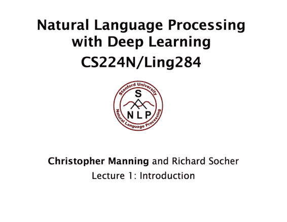

这是斯坦福 CS224n 的第一篇笔记，也是第一次系统地学习用深度学习来做自然语言处理。本文还整理了 CS224n 的全部视频课件笔记，[汇总下载](http://www.hankcs.com/nlp/cs224n-introduction-to-nlp-and-deep-learning.html#h3-1)。

虽然深度学习已经席卷各大应用领域，大量开源工具让谁都能跳过理论基础速成 demo 专家。我却一直按部就班地琢磨传统的机器学习理论，实在有些落伍了。能力有限，在[《统计学习方法》](http://www.hankcs.com/tag/%E3%80%8A%E7%BB%9F%E8%AE%A1%E5%AD%A6%E4%B9%A0%E6%96%B9%E6%B3%95%E3%80%8B/)、老版（硬核版）[CS229](http://www.hankcs.com/tag/cs229/)上断断续续挣扎了几年时间；刚刚才学完[Neural Networks for Machine Learning](http://www.hankcs.com/tag/neural-networks-for-machine-learning/)，总算是把知识更新到 2012 年了。虽然主要兴趣在自然语言处理这个应用层上，但 NLP 公开课只看过[Michael Collins 的课](http://www.hankcs.com/tag/michael-collins/)，以至于截止六月份博客上 ML 分类下的笔记比 NLP 还要多（这还算上了早期写的极其幼稚漏洞百出的 NLP 笔记）。

这并非是冷淡了 NLP，而是出于“根深才能叶茂”“把好吃的留到最后吃”的朴素想法。虽然我也能跳过理论基础，自顶而下照葫芦画瓢地实现一些算法和模型，但这不过是盲人摸象而已。现在稍微有了一点积累，终于可以开始这门激动人心的课程了。

正巧在 2017 年，旧版的 CS224d 与旧版 CS224n 合并为新版 CS224n，14 课升级为 18 课，加量不加价，也算是给有心人的一种特典奖励吧。

## 新旧 CS224 对比

这门课在 2016 年之前叫做 CS224d: Deep Learning for Natural Language Processing，之后改名为 CS224n: Natural Language Processing with Deep Learning。从两者的命名来看，旧版“为自然语言处理准备的深度学习”似乎以深度学习为中心；新版“用深度学习进行自然语言处理”似乎更贴切一些。内容上的区别，除了新版多了 4 课之外，课程表上的“for 某某 NLP 任务”也被去掉了。估计是不希望限制大家的想象力吧。实际上新版的内容是两门课程的合并：This course is a merger of Stanford's previous cs224n course (Natural Language Processing) and cs224d (Deep Learning for Natural Language Processing).

那到底应该选择哪个版本呢？亲身体会一下不就知道了。我看完了旧版的第一课和新版的第一课，直观的印象是：旧版主讲人 Richard Socher 年轻有为，刚拿到 PhD 就已是领域内的超新星；新版主讲人是泰斗 Chris Manning 和 Richard Socher，两人分别负责不同的章节。Manning 在教学上经验更丰富，章节层次感强。虽然年纪大了，但授课激情不输给年轻人。更深刻的比较现在无法给出，毕竟我也没有完整学完两版课程。但个人还是偏好新版的课程；从另一个无关紧要的角度讲，旧版的课件是投影到幕布上再录制回去的，新版是直接穿插到视频中的；新版油管上有[1080P](https://www.youtube.com/playlist?list=PL3FW7Lu3i5Jsnh1rnUwq_TcylNr7EkRe6)的，而旧版只有 720P 的，当然新版好了。

### CS224 资料

**新版 CS224n 资源（视频课件笔记）汇总：****[BT 种子（推荐）](http://file.hankcs.com/bt/cs224n.torrent)****或[百度云文件夹链接](http://pan.hankcs.com/jump.php?4) 或 [百度云压缩包链接](https://pan.baidu.com/s/1i5BYo53)**（全 18 课视频+字幕+期中复习+笔记+作业更新完毕。部分视频内嵌字幕，其他外挂 srt 字幕，总之**都有字幕**）。

文件夹链接经常被和谐，虽然有自动补档程序，仍然需要多次点击迅速转存，手快有手慢无全看人品了。压缩包链接目前很稳定，且行且珍惜。本着西学东渐的初衷，自由传播。

旧版 CS224d：[`cs224d.stanford.edu/`](http://cs224d.stanford.edu/)

新版 CS224n 官网：[`web.stanford.edu/class/cs224n/index.html`](http://web.stanford.edu/class/cs224n/index.html) 

新版 CS224n 官方笔记：[`github.com/stanfordnlp/cs224n-winter17-notes`](https://github.com/stanfordnlp/cs224n-winter17-notes)

新版 CS224n 视频地址：[`www.youtube.com/playlist?list=PL3FW7Lu3i5Jsnh1rnUwq_TcylNr7EkRe6`](https://www.youtube.com/playlist?list=PL3FW7Lu3i5Jsnh1rnUwq_TcylNr7EkRe6) 

新版 CS224n 国内在线观看：[`space.bilibili.com/34967/#!/channel/detail?cid=18192&order=1&page=1`](http://space.bilibili.com/34967/#!/channel/detail?cid=18192&order=1&page=1) 

## 免责声明

按惯例重申博客的宗旨：服务于个人备忘，不做任何保证。既不保证持续更新，也不保证内容一定客观正确，更不保证回复（根本没那个水平）。我会尽量用括号标记我的个人理解，但这也不做保证。水平有限，欢迎心平气和的指正。

文中术语并不会特意翻译为中文，如果我恰好知道中译，那么打字方便会打中文。

这门课的先决条件是修完[CS229](http://www.hankcs.com/tag/cs229/)，有一些基本的线性代数、微积分、概率论、Python 基础。既然是备忘的笔记，当然不会浪费笔墨在已经掌握的知识点上（偶尔为了完整性会写点，比如这次第一课）。

文中所有取自课件的多媒体版权属于斯坦福大学。笔记文字以 [知识共享署名-非商业性使用-相同方式共享](http://www.hankcs.com/license/)授权。

## 什么是自然语言处理

这是一门计算机科学、人工智能以及语言学的交叉学科。虽然语言只是人工智能的一部分（人工智能还包括计算机视觉等），但它是非常独特的一部分。这个星球上有许多生物拥有超过人类的视觉系统，但只有人类才拥有这么高级的语言。

自然语言处理的目标是让计算机处理或说“理解”自然语言，以完成有意义的任务，比如订机票购物或 QA 等。完全理解和表达语言是极其困难的，完美的语言理解等效于实现人工智能。

### 自然语言处理涉及的几个层次

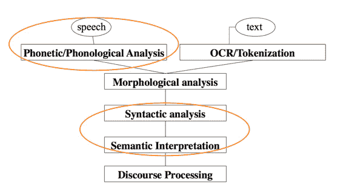

作为输入一共有两个来源，语音与文本。所以第一级是语音识别和 OCR 或分词（事实上，跳过分词虽然理所当然地不能做句法分析，但字符级也可以直接做不少应用）。接下来是形态学，援引《统计自然语言处理》中的定义：

> 形态学（morphology）：形态学（又称“词汇形态学”或“词法”）是语言学的一个分支，研究词的内部结构，包括屈折变化和构词法两个部分。由于词具有语音特征、句法特征和语义特征，形态学处于音位学、句法学和语义学的结合部位，所以形态学是每个语言学家都要关注的一门学科［Matthews,2000］。

下面的是句法分析和语义分析，最后面的在中文中似乎翻译做“对话分析”，需要根据上文语境理解下文。

这门课主要关注画圈的三个部分，其中中间的两个是重中之重，虽然深度学习在语音识别上的发力最大。

### 自然语言处理应用

一个小子集，从简单到复杂有：

*   拼写检查、关键词检索……

*   文本挖掘（产品价格、日期、时间、地点、人名、公司名）

*   文本分类

*   机器翻译

*   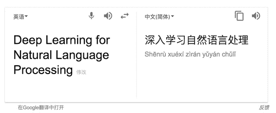

*   

*   客服系统

*   复杂对话系统

在工业界从搜索到广告投放、自动\辅助翻译、情感舆情分析、语音识别、聊天机器人\管家等等五花八门。

### 人类语言的特殊之处

与信号处理、数据挖掘不同，自然语言的随机性小而目的性强；语言是用来传输有意义的信息的，这种传输连小孩子都能很快学会。人类语言是离散的、明确的符号系统。但又允许出现各种变种，比如颜文字，随意的错误拼写“I loooove it”。这种自由性可能是因为语言的可靠性（赘余性）。所以说语言文字绝对不是形式逻辑或传统 AI 的产物。

语言符号有多种形式（声音、手势、书写），在这些不同的形式中，其意义保持不变：

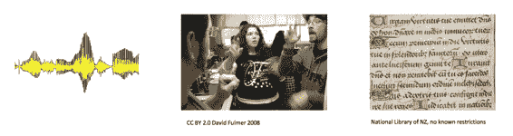

虽然人类语言是明确的符号系统，但符号传输到大脑的过程是通过连续的声学光学信号，大脑编码似乎是连续的激活值上的模式。另外巨大的词表也导致数据稀疏，不利于机器学习。这构成一种动机，是不是应该用连续的信号而不是离散的符号去处理语言。

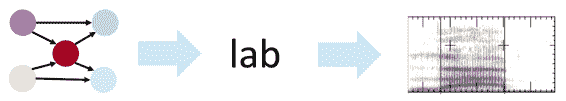

## 什么是深度学习

这是机器学习的一个子集。传统机器学习中，人类需要对专业问题理解非常透彻，才能手工设计特征。比如地名和机构名识别的特征模板：

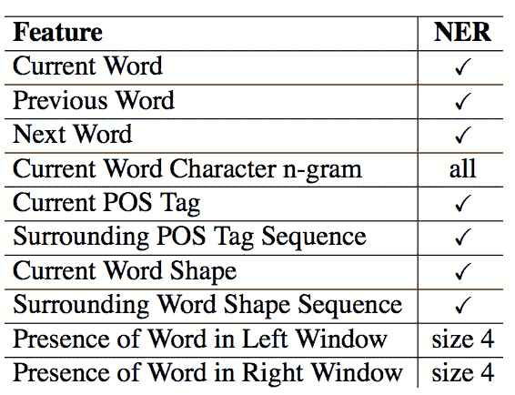

然后把特征交给某个机器学习算法，比如线性分类器。机器为这些特征调整找到合适的权值，将误差优化到最小。

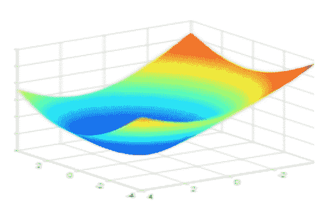

在这个过程中一直在学习的其实是人类，而不是机器。机器仅仅做了一道数值优化的题目而已。

下面这张图很好地展示了这个过程中的比例：

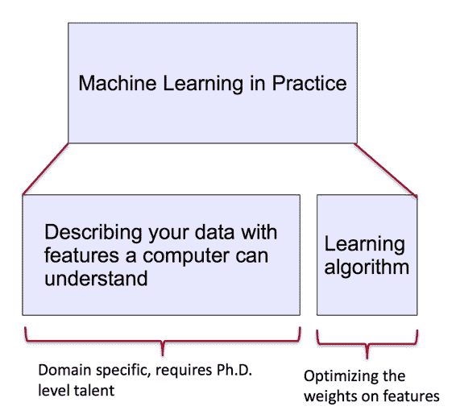

而深度学习是表示学习的一部分，用来学习原始输入的多层特征表示：

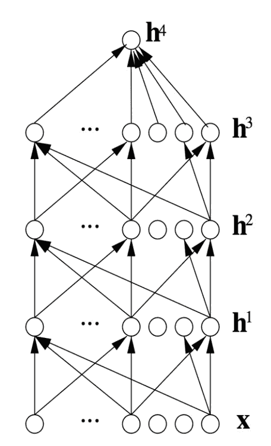

### “深度学习”的历史

虽然这个术语大部分时候指代利用各种各样多层的神经网络进行表示学习，有时候也有一些概率图模型参与。统计学家会说，哦，不过是一些逻辑斯谛回归单元的堆砌而已。也许的确如此，但这还是以偏概全的说法（电子计算机还是一堆半导体的堆砌呢，大脑还是一堆神经元的堆砌呢）。这门课不会回顾历史（像 Hinton 老爷子那样博古通今），而只会专注当前在 NLP 领域大放异彩的方法。

### 为什么需要研究深度学习

*   手工特征耗时耗力，还不易拓展

*   自动特征学习快，方便拓展

*   深度学习提供了一种通用的学习框架，可用来表示世界、视觉和语言学信息

*   深度学习既可以无监督学习，也可以监督学习

深度学习可追溯到八九十年代，但在 2010 年左右才崛起（最先是语音与图像，后来才是 NLP），那之前为什么没有呢？

与 Hinton 介绍的一样，无非是以前数据量不够，计算力太弱。当然，最近也的确有许多新模型，新算法。

### 语音识别中的深度学习

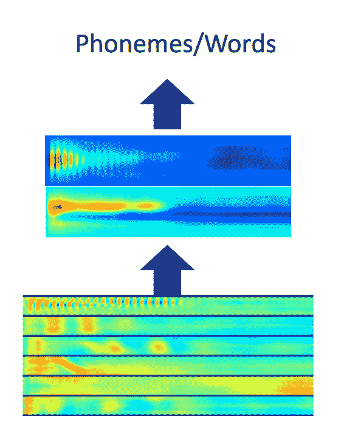

突破性研究来自 Hinton 老爷子的学生，具体参考：[`www.hankcs.com/ml/hinton-deep-neural-nets-with-generative-pre-training.html#h3-11`](http://www.hankcs.com/ml/hinton-deep-neural-nets-with-generative-pre-training.html#h3-11)

### 计算机视觉中的深度学习

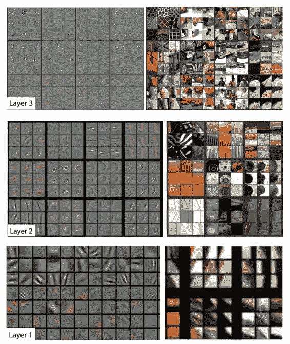

还是来自 Hinton 的学生。

## 课程相关

有 4 次编程练习，会用到 TensorFlow。

## 为什么 NLP 难

人类语言是充满歧义的，不像编程语言那样明确。编程语言中有各种变量名，但人类语言中只有少数几个代词可以用，你得思考到底指代的是谁……

人类语言的解读依赖于现实世界、常识以及上下文。由于说话速度书写速度阅读速度的限制，人类语言非常简练，省略了大量背景知识。

接下来是几个英文的歧义例子，对 native speaker 而言很有趣。为了完整性只看一个：

> The Pope’s baby steps on gays

主要歧义发生在 baby 上面，可以理解为“教皇的孩子踩了基佬”，也可以理解为“教皇在同性恋问题上裹足不前”。

旧版 CS224d 里面还有个更直观的例子，推特上关于电影明星“海瑟薇”的评论影响了保险公司哈撒韦的股价，因为两者拼写是一样的。

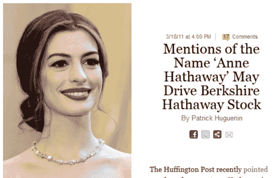

说明某些“舆情系统”没做好命名实体识别。

## Deep NLP = Deep Learning + NLP

将自然语言处理的思想与表示学习结合起来，用深度学习的手法解决 NLP 目标。这提高了许多方面的效果：

*   层次：语音、词汇、语法、语义

*   工具：词性标注、命名实体识别、句法\语义分析

*   应用：机器翻译、情感分析、客服系统、问答系统

深度学习的一个魅力之处是，它提供了一套“宇宙通用”的框架解决了各种问题。虽然工具就那么几个，但在各行各业都适用。

### word vector

老生常谈了。略过。听说接下来两课都在讲这个，希望有些更深入的收获。

### NLP 表示层次：形态级别

传统方法在形态级别的表示是词素：

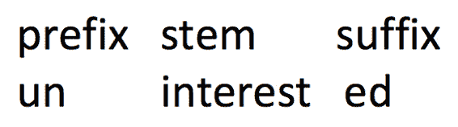

深度学习中把词素也作为向量：

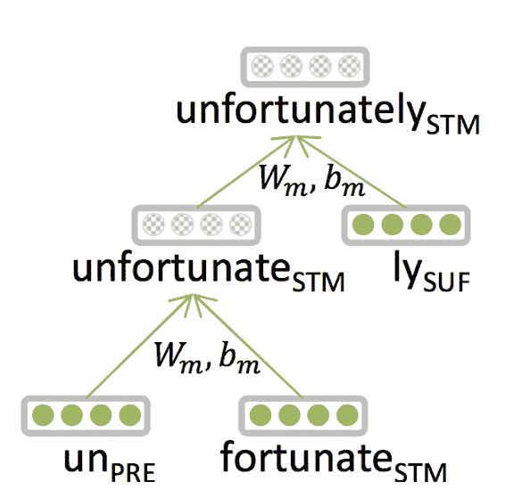

多个词素向量构成相同纬度语义更丰富的词向量。

### NLP 工具：句法分析

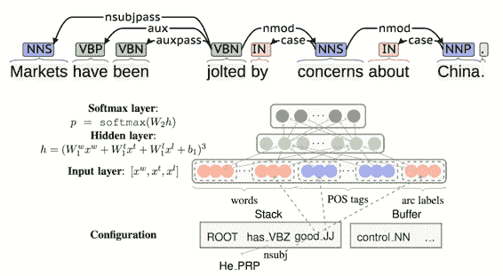

我在[《基于神经网络的高性能依存句法分析器》](http://www.hankcs.com/nlp/parsing/neural-network-based-dependency-parser.html)中分析并[移植的 LTP 句法分析器](http://hanlp.hankcs.com/?sentence=%E5%BE%90%E5%85%88%E7%94%9F%E8%BF%98%E5%85%B7%E4%BD%93%E5%B8%AE%E5%8A%A9%E4%BB%96%E7%A1%AE%E5%AE%9A%E4%BA%86%E6%8A%8A%E7%94%BB%E9%9B%84%E9%B9%B0%E3%80%81%E6%9D%BE%E9%BC%A0%E5%92%8C%E9%BA%BB%E9%9B%80%E4%BD%9C%E4%B8%BA%E4%B8%BB%E6%94%BB%E7%9B%AE%E6%A0%87%E3%80%82)，参考的就是这里介绍的 Danqi Chen 的[A Fast and Accurate Dependency Parser using Neural Networks.pdf](http://www.hankcs.com/wp-content/uploads/2015/11/A%20Fast%20and%20Accurate%20Dependency%20Parser%20using%20Neural%20Networks.pdf "A Fast and Accurate Dependency Parser using Neural Networks.pdf")。原来她是这门课的 TA。

### NLP 语义层面的表示

传统方法是手写大量的规则函数，叫做 Lambda calculus：

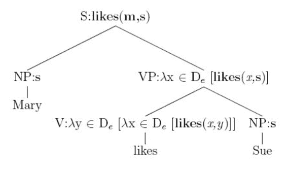

在深度学习中，每个句子、短语和逻辑表述都是向量。神经网络负责它们的合并。

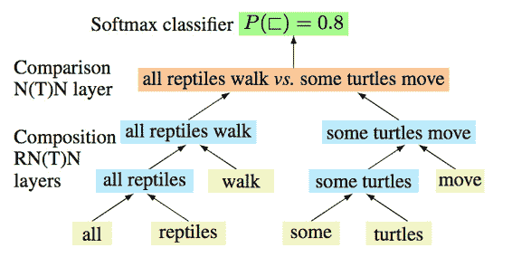

### 情感分析

传统方法是请一两百个工人，手工搜集“情感极性词典”在词袋模型上做分类器。

深度学习复用了 RNN 来解决这个问题，它可以识别“反话”的情感极性：

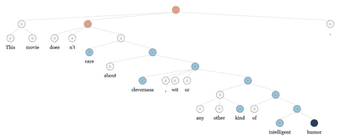

注意这只是为了方便理解的示意图，并不是 RNN 的工作流程。私以为这张图放在这里不合适，可能会误导一部分人，以为神经网络就是这样的基于规则的“决策树”模型。

### QA

传统方法是手工编写大量的逻辑规则，比如正则表达式之类：

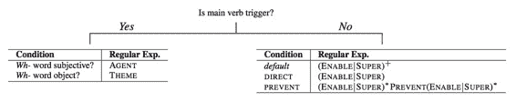

我见过这类 QA 系统的实体，挺没意思的。

深度学习依然使用了类似的学习框架，把事实储存在向量里：

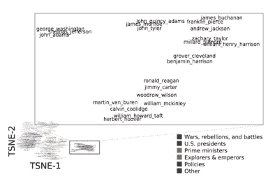

### 客服系统

最著名的例子得数 GMail 的自动回复：

[图源](https://techcrunch.com/2015/11/03/with-smart-reply-googles-inbox-can-now-respond-to-emails-for-you-automatically/)

这是 Neural Language Models 的又一次成功应用，Neural Language Models 是基于 RNN 的：

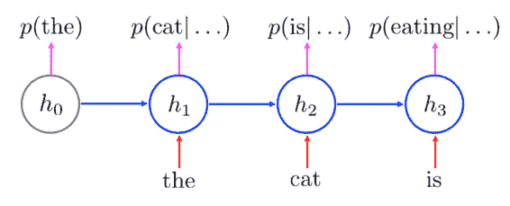

### 机器翻译

传统方法在许多层级上做了尝试，词语、语法、语义之类。这类方法试图找到一种世界通用的“国际语”（Interlingua）来作为原文和译文的桥梁。

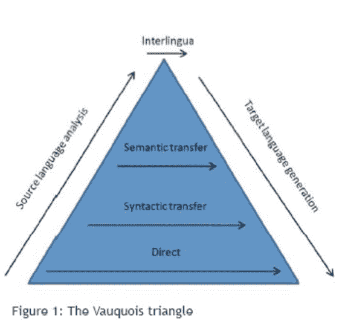

而 Neural Machine Translation 将原文映射为向量，由向量构建译文。也许可以说 Neural Machine Translation 的“国际语”是向量。

### 结论：所有层级的表示都是向量

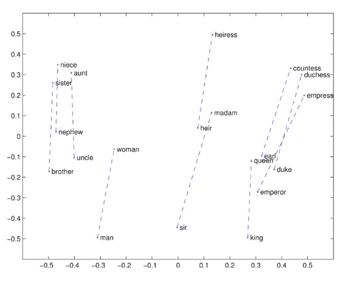

这可能是因为向量是最灵活的形式，它的维度是自由的，它可以组合成矩阵，或者更高阶的 Tensor。事实上，在实践的时候向量和矩阵没什么本质区别，经常看到为了效率或单纯的美观而 pack 成矩阵 unroll 成向量的操作。

旧版视频中 Socher 还顺便广告了一下他的创业公司 MetaMind（已被收购，人生赢家）：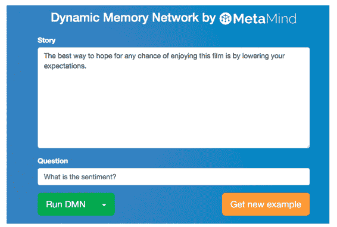

这个 demo 让我非常惊讶，因为普通 NLP 演示页面都是让人手工选择要执行的任务的。而这个 demo 竟然支持用一句话表示自己要执行的意图。不光可以执行情感分析、句法分析之类的常规任务，还可以输入一段话做推理任务。更让我惊讶的是，据说后台所有任务用的都是同一种模型，真乃神机也。据说这种模型是[Dynamic Memory Network](https://metamind.io/research/new-deep-learning-model-understands-and-answers-questions)。另外，他们又发了篇[A Joint Many-Task Model:Growing a Neural Network for Multiple NLP Tasks](https://metamind.io/research/multiple-different-natural-language-processing-tasks-in-a-single-deep-model)，不知道两者有什么联系没有。

下面两次课会详细地讲解向量表示，希望能带来新的体会。

 [知识共享署名-非商业性使用-相同方式共享](http://www.hankcs.com/license/)：[码农场](http://www.hankcs.com) » [CS224n 笔记 1 自然语言处理与深度学习简介](http://www.hankcs.com/nlp/cs224n-introduction-to-nlp-and-deep-learning.html)