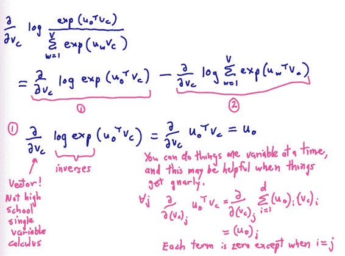

# CS224n 笔记 2 词的向量表示：word2vec

## 如何表示一个词语的意思

先来看看如何定义“意思”的意思，英文中 meaning 代表人或文字想要表达的 idea。这是个递归的定义，估计查询 idea 词典会用 meaning 去解释它。

中文中“意思”的意思更加有意思：

> 他说：“她这个人真有意思（funny）。”她说：“他这个人怪有意思的（funny）。”于是人们以为他们有了意思（wish），并让他向她意思意思（express）。他火了：“我根本没有那个意思（thought）！”她也生气了：“你们这么说是什么意思（intention）？”事后有人说：“真有意思（funny）。”也有人说：“真没意思（nonsense）”。（原文见《生活报》1994.11.13.第六版）［吴尉天，1999］
> 
> ——《统计自然语言处理》

语言学中“meaning”近似于“指代、所指、符号”。

### 计算机如何处理词语的意思

过去几个世纪里一直用的是分类词典。计算语言学中常见的方式是 WordNet 那样的词库。比如 NLTK 中可以通过 WordNet 查询熊猫的 hypernyms (is-a，上位词)，得到“食肉动物”“动物”之类的上位词。也可以查询“good”的同义词——“just 品格好”“ripe 熟了”。

### discrete representation 的问题

*   这种 discrete representation 虽然是种语言学资源，但丢失了韵味。比如这些同义词的意思实际上还是有微妙的差别：adept, expert, good, practiced, proficient, skillful

*   缺少新词

*   主观化

*   需要耗费大量人力去整理

*   无法计算准确的词语相似度

无论是规则学派，还是统计学派，绝大多数 NLP 学家都将词语作为最小单位。事实上，词语只是词表长度的 one-hot 向量，这是一种 localist representation（大概是借用 localist“局部”的意项）。

在不同的语料中，词表大小不同。Google 的 1TB 语料词汇量是 1300 万，这个向量的确太长了。

### 从 symbolic representations 到 distributed representations

词语在符号表示上体现不出意义的相似性，比如 Dell notebook battery size 和 Dell laptop battery capacity。而 one-hot 向量是正交的，无法通过任何运算得到相似度。


需要找到一种用向量直接编码含义的方法。

### Distributional similarity based representations

语言学家 J. R. Firth 提出，通过一个单词的上下文可以得到它的意思。J. R. Firth 甚至建议，如果你能把单词放到正确的上下文中去，才说明你掌握了它的意义。

这是现代统计自然语言处理最成功的思想之一：


### 通过向量定义词语的含义

通过调整一个单词及其上下文单词的向量，使得根据两个向量可以推测两个词语的相似度；或根据向量可以预测词语的上下文。这种手法也是递归的，根据向量来调整向量，与词典中意项的定义相似。

另外，distributed representations 与 symbolic representations（localist representation、one-hot representation）相对；discrete representation 则与后者及 denotation 的意思相似。切不可搞混 distributed 和 discrete 这两个单词。

### 学习神经网络 word embeddings 的基本思路

定义一个以预测某个单词的上下文的模型：


损失函数定义如下：


这里的表示的上下文（负号通常表示除了某某之外），如果完美预测，损失函数为零。

然后在一个大型语料库中的不同位置得到训练实例，调整词向量，最小化损失函数。

### 直接学习低维词向量

这其实并不是多么新潮的主意，很早就有一些研究了：

• Learning representations by back-propagating errors (Rumelhart et al., 1986)

• **A neural probabilistic language model (Bengio et al., 2003)**

• NLP (almost) from Scratch (Collobert & Weston, 2008)

• A recent, even simpler and faster model: word2vec (Mikolov et al. 2013) 

只不过以前一直没有引起重视，直到 Bengio 展示了它的用处之大。后来研究才开始火热起来，并逐渐出现了更快更工业化的模型。

## word2vec 的主要思路

通过单词和上下文彼此预测，老生常谈了。

两个算法：

*   Skip-grams (SG)：预测上下文

*   Continuous Bag of Words (CBOW)：预测目标单词

两种稍微高效一些的训练方法：

*   Hierarchical softmax

*   Negative sampling

但在这门课里，只会讲 Naïve softmax。好在我早就把两种算法和两种训练方法的四种组合过了一遍：[`www.hankcs.com/nlp/word2vec.html`](http://www.hankcs.com/nlp/word2vec.html)

### Skip-gram 预测


注意这里虽然有四条线，但模型中只有一个条件分布（因为这只是个词袋模型而已，与位置无关）。学习就是要最大化这些概率。

### word2vec 细节

目标函数定义为所有位置的预测结果的乘积：


要最大化目标函数。对其取个负对数，得到损失函数——对数似然的相反数：


### 目标函数细节

这些术语都是一样的：Loss function = cost function = objective function，不用担心用错了。对于 softmax 来讲，常用的损失函数为交叉熵。

### Word2Vec 细节

预测到的某个上下文条件概率可由 softmax 得到：


o 是输出的上下文词语中的确切某一个，c 是中间的词语。u 是对应的上下文词向量，v 是词向量。

### 点积

复习一下课程开头所说的 baby math：


公式这种画风这种配色真的有点幼儿园的感觉。

点积也有点像衡量两个向量相似度的方法，两个向量越相似，其点积越大。

### Softmax function：从实数空间到概率分布的标准映射方法


指数函数可以把实数映射成正数，然后归一化得到概率。

softmax 之所叫 softmax，是因为指数函数会导致较大的数变得更大，小数变得微不足道；这种选择作用类似于 max 函数。

### Skipgram


别看这张图有点乱，但其实条理很清晰，基本一图流地说明了问题。从左到右是 one-hot 向量，乘以 center word 的 W 于是找到词向量，乘以另一个 context word 的矩阵 W'得到对每个词语的“相似度”，对相似度取 softmax 得到概率，与答案对比计算损失。真清晰。

官方笔记里有非手写版，一样的意思：


这两个矩阵都含有 V 个词向量，也就是说同一个词有两个词向量，哪个作为最终的、提供给其他应用使用的 embeddings 呢？有两种策略，要么加起来，要么拼接起来。在 CS224n 的编程练习中，采取的是拼接起来的策略：

```py
# concatenate the input and output word vectors
wordVectors = np.concatenate(
    (wordVectors[:nWords,:], wordVectors[nWords:,:]),
    axis=0)
# wordVectors = wordVectors[:nWords,:] + wordVectors[nWords:,:]
```

他们管 W 中的向量叫 input vector，W'中的向量叫 output vector。

## 训练模型：计算参数向量的梯度

把所有参数写进向量，对 d 维的词向量和大小 V 的词表来讲，有：


由于上述两个矩阵的原因，所以的维度中有个。

模型的学习当然是梯度法了，Manning 还耐心地推导了十几分钟：





更清晰的公式参考：[`www.hankcs.com/nlp/word2vec.html#h3-5`](http://www.hankcs.com/nlp/word2vec.html#h3-5) 

### 损失/目标函数

梯度有了，参数减去梯度就能朝着最小值走了。


### 梯度下降、SGD


只有一句比较新鲜，神经网络喜欢嘈杂的算法，这可能是 SGD 成功的另一原因。

 [知识共享署名-非商业性使用-相同方式共享](http://www.hankcs.com/license/)：[码农场](http://www.hankcs.com) » [CS224n 笔记 2 词的向量表示：word2vec](http://www.hankcs.com/nlp/word-vector-representations-word2vec.html)