# CS224n 笔记 3 高级词向量表示

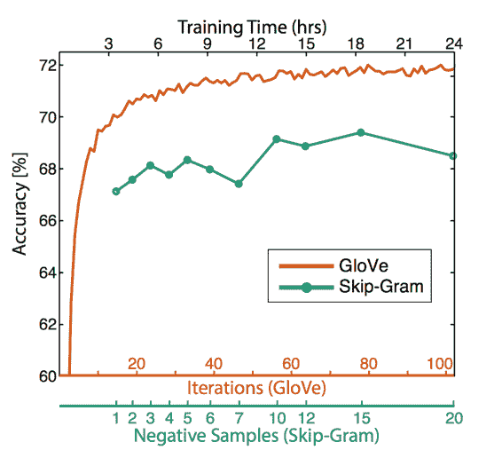这节课从传统的基于计数的全局方法出发，过渡到结合两者优势的 GloVe，并介绍了词向量的调参与评测方法。

## 复习：word2vec 的主要思路

*   遍历整个语料库中的每个词

*   预测每个词的上下文：

*   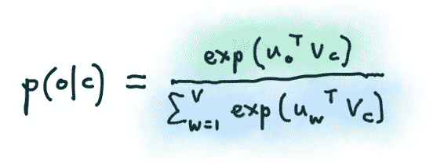

*   然后在每个窗口中计算梯度做 SGD

### SGD 与词向量

但每个窗口最多只有 2m + 1 个单词，所以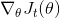会非常稀疏：

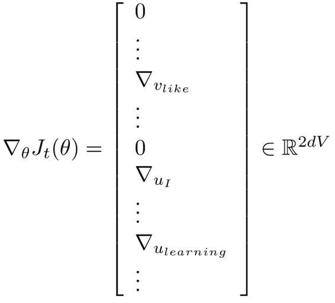

实际上有正确答案需要去对比的只有窗口中的词语。所以每次更新只更新矩阵中的少数列，或者为每个词语建立到词向量的哈希映射：

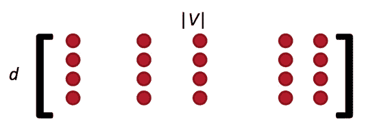

## 近似：负采样

还有一个问题亟待解决，词表 V 的量级非常大，以至于下式的分母很难计算：

于是，练习 1 中要求用 negative sampling 实现 skip-gram。这是一种采样子集简化运算的方法。具体做法是，对每个正例（中央词语及上下文中的一个词语）采样几个负例（中央词语和其他随机词语），训练 binary logistic regression（也就是二分类器）。

### negative sampling 和 skip-gram

目标函数：

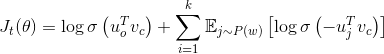

这里是某个窗口，是采样个数，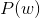是一个 unigram 分布，详见：[`www.hankcs.com/nlp/word2vec.html#h3-12`](http://www.hankcs.com/nlp/word2vec.html#h3-12) 

是 sigmoid 函数：

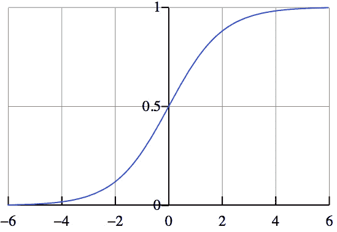

根据上次课讲的，内积可以代表相关性。那么这个目标函数就是要最大化中央词与上下文的相关概率，最小化与其他词语的概率。

word2vec 通过把相似的词语放到同一个地方附近来增大目标函数：

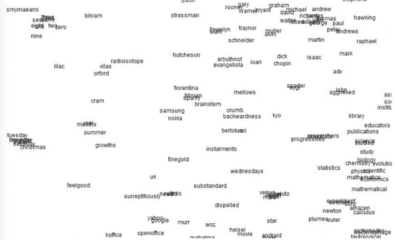

## 其他方法

word2vec 将窗口视作训练单位，每个窗口或者几个窗口都要进行一次参数更新。要知道，很多词串出现的频次是很高的。能不能遍历一遍语料，迅速得到结果呢？

早在 word2vec 之前，就已经出现了很多得到词向量的方法，这些方法是基于统计共现矩阵的方法。如果在窗口级别上统计词性和语义共现，可以得到相似的词。如果在文档级别上统计，则会得到相似的文档（潜在语义分析 LSA）。

### 基于窗口的共现矩阵

比如窗口半径为 1，在如下句子上统计共现矩阵：

*   I like deep learning. 

*   I like NLP.

*   I enjoy flying.

会得到：

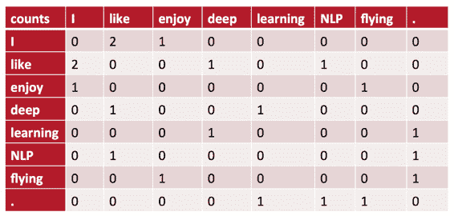

### 朴素共现向量的问题

根据这个矩阵，的确可以得到简单的共现向量。但是它存在非常多的局限性：

*   当出现新词的时候，以前的旧向量连维度都得改变

*   高纬度（词表大小）

*   高稀疏性

### 解决办法：低维向量

用 25 到 1000 的低维稠密向量来储存重要信息。如何降维呢？

SVD 吧：

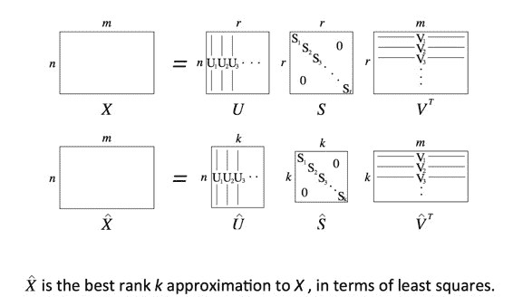

r 维降到 d 维，取奇异值最大的两列作为二维坐标可视化：

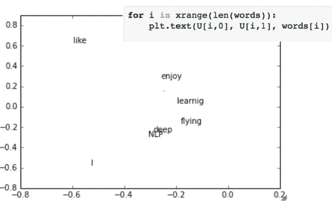

### 改进

*   限制高频词的频次，或者干脆停用词

*   根据与中央词的距离衰减词频权重

*   用皮尔逊相关系数代替词频

### 效果

方法虽然简单，但效果也还不错：

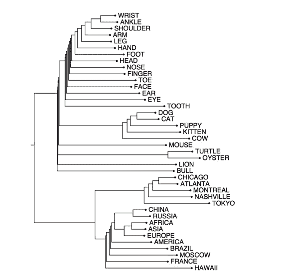

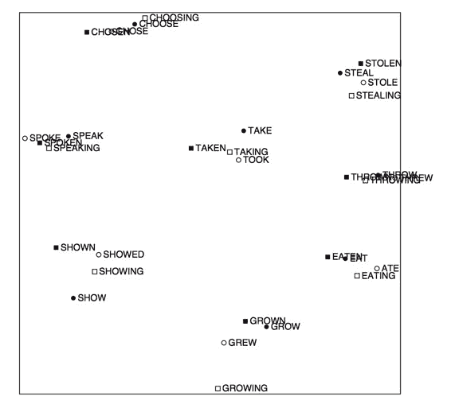

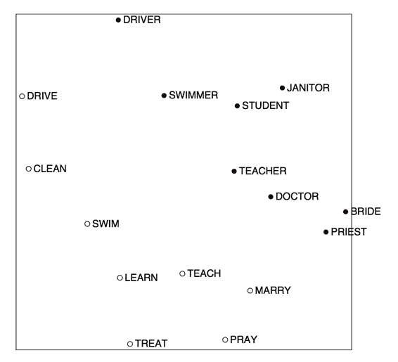

### SVD 的问题

*   计算复杂度高：对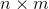的矩阵是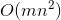

*   不方便处理新词或新文档

*   与其他 DL 模型训练套路不同

### Count based vs direct prediction

这些基于计数的方法在中小规模语料训练很快，有效地利用了统计信息。但用途受限于捕捉词语相似度，也无法拓展到大规模语料。

而 NNLM, HLBL, RNN, Skip-gram/CBOW 这类进行预测的模型必须遍历所有的窗口训练，也无法有效利用单词的全局统计信息。但它们显著地提高了上级 NLP 任务，其捕捉的不仅限于词语相似度。

## 综合两者优势：GloVe

这种模型的目标函数是：

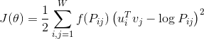

这里的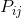是两个词共现的频次，f 是一个 max 函数：

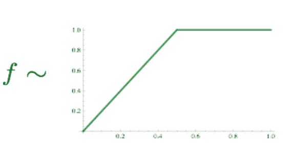

优点是训练快，可以拓展到大规模语料，也适用于小规模语料和小向量。

明眼人会发现这里面有两个向量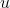和，它们都捕捉了共现信息，怎么处理呢？试验证明，最佳方案是简单地加起来：

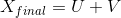

相对于 word2vec 只关注窗口内的共现，GloVe 这个命名也说明这是全局的（我觉得 word2vec 在全部语料上取窗口，也不是那么地 local，特别是负采样）。

## 评测方法

有两种方法：Intrinsic（内部） vs extrinsic（外部）

Intrinsic：专门设计单独的试验，由人工标注词语或句子相似度，与模型结果对比。好处是是计算速度快，但不知道对实际应用有无帮助。有人花了几年时间提高了在某个数据集上的分数，当将其词向量用于真实任务时并没有多少提高效果，想想真悲哀。

Extrinsic：通过对外部实际应用的效果提升来体现。耗时较长，不能排除是否是新的词向量与旧系统的某种契合度产生。需要至少两个 subsystems 同时证明。这类评测中，往往会用 pre-train 的向量在外部任务的语料上 retrain。

### Intrinsic word vector evaluation

也就是词向量类推，或说“A 对于 B 来讲就相当于 C 对于哪个词？”。这可以通过余弦夹角得到：

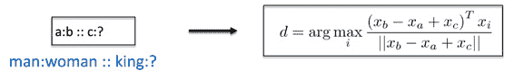

我曾经通过这些方法验证了民间很多流行的 word2vec 实现准确率比原版低几十个百分点：[`www.hankcs.com/nlp/word2vec.html#h2-15`](http://www.hankcs.com/nlp/word2vec.html#h2-15) 

这种方法可视化出来，会发现这些类推的向量都是近似平行的：

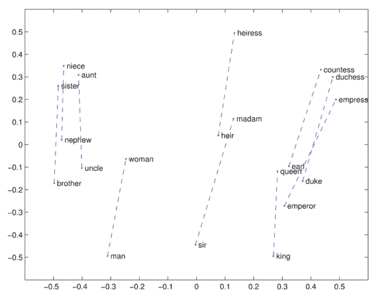

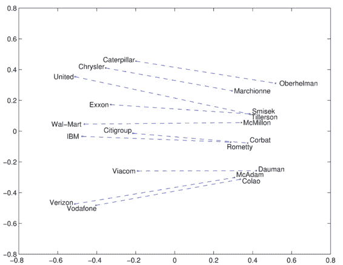

下面这张图说明 word2vec 还可以做语法上的类比：

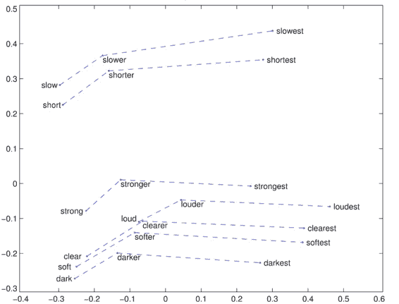

其他有趣的类比：

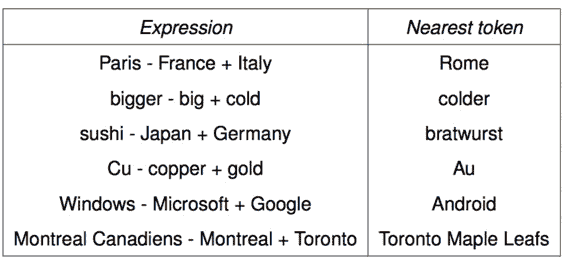

这在数学上是没有证明的。

### 结果对比

在不同大小的语料上，训练不同维度的词向量，在语义和语法数据集上的结果如下：

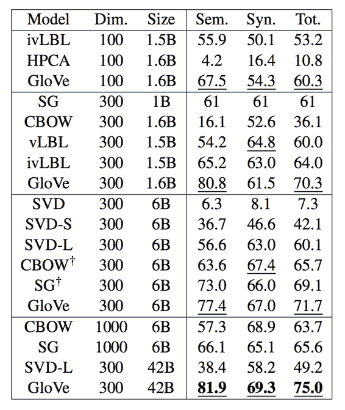

GloVe 的效果显著地更好。另外，高纬度并不一定好。而数据量越多越好。

### 调参

窗口是否对称（还是只考虑前面的单词），向量维度，窗口大小：

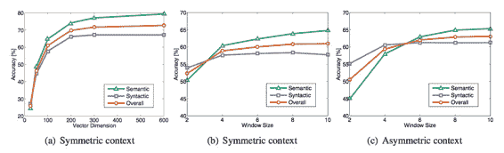

大约 300 维，窗口大小 8 的对称窗口效果挺好的，考虑到成本。

对 GloVe 来讲，迭代次数越多越小，效果很稳定：

维基百科语料上得到的效果比新闻语料要好：

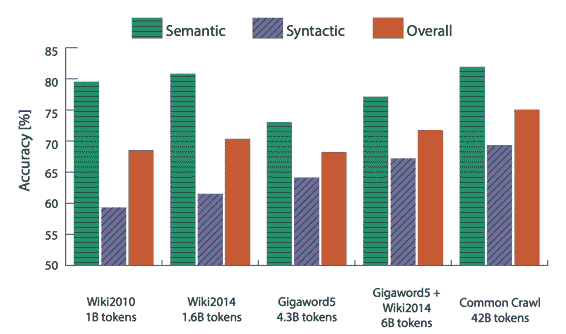

### 另一个数据集

还有直接人工标注词语相似度的：

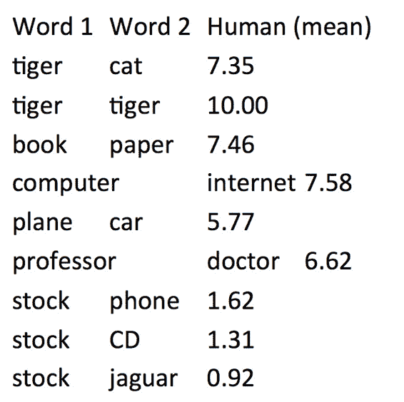

[www.cs.technion.ac.il/~gabr/resources/data/wordsim353/](http://www.cs.technion.ac.il/~gabr/resources/data/wordsim353/) 

对某个单词相似度排序后，得到最相关的词语。于是可以量化评测了。

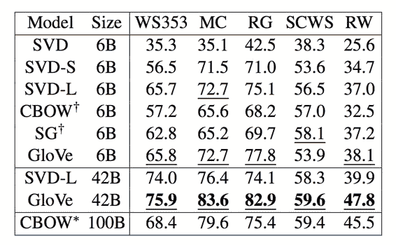

### Extrinsic word vector evaluation

做 NER 实验：

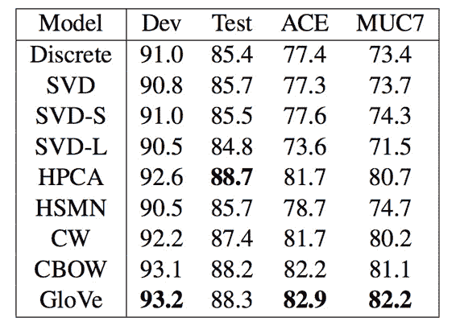

GloVe 效果依然更好，但从数据上来看只好那么一点点。

视频中还谈了谈一些适合 word vector 的任务，比如单词分类。有些不太适合的任务，比如情感分析。课件中则多了一张谈消歧的，中心思想是通过对上下文的聚类分门别类地重新训练。

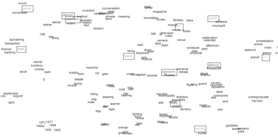

相同颜色的是同一个单词的不同义项。

TA 也讲过这个问题。

 [知识共享署名-非商业性使用-相同方式共享](http://www.hankcs.com/license/)：[码农场](http://www.hankcs.com) » [CS224n 笔记 3 高级词向量表示](http://www.hankcs.com/nlp/cs224n-advanced-word-vector-representations.html)