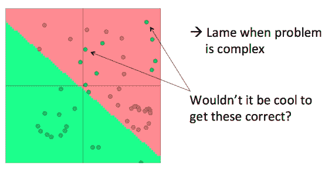
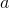
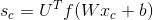

# CS224n 笔记 4 Word Window 分类与神经网络

这节课介绍了根据上下文预测单词分类的问题，与常见神经网络课程套路不同，以间隔最大化为目标函数，推导了对权值矩阵和词向量的梯度；初步展示了与传统机器学习方法不一样的风格。

## 分类问题

给定训练集

其中  是一个 -维向量， 是一个 -维 one-hot 向量，是总数。在传统的机器学习方法中，往往通过诸如逻辑斯谛回归和 SVM 找到分类决策边界：

### softmax 详细

softmax 分类函数：

计算方法分为两个步骤：取权值矩阵的某一行乘上输入向量，归一化得到概率。

### softmax 与交叉熵误差

训练的时候，可以直接最小化正确类别的概率的负对数：

其实这个损失函数等效于交叉熵：

这是因为类别是 one-hot 向量。

对 N 个数据点来讲有：

加上正则化项有：

红线是 test error，蓝线是 training error，横轴是模型复杂度或迭代次数。直线是方差偏差均衡点。

### 优化

一般的 ML 问题中，参数由权值矩阵的列组成维度不会太大。而在词向量或其他深度学习中，需要同时学习权值矩阵和词向量。参数一多，就容易过拟合：

### re-training 词向量失去泛化效果

比如有一个给单词做情感分析的小任务，在预训练的词向量中，这三个表示电视的单词都是在一起的：

但由于情感分析语料中，训练集只含有 TV 和 telly，导致 re-training 之后两者跑到别处去了：

于是在测试集上导致 television 被误分类。

这个例子说明，如果任务的语料非常小，则不必在任务语料上重新训练词向量，否则会导致词向量过拟合。

顺便介绍一下词向量相关的术语：

词向量矩阵 L 常被称作 lookup table：

Word vectors = word embeddings = word representations (mostly)

可能有些人认为“词向量”是个很俗的翻译，但根据这门课的课件，其实与“词嵌入”是等价的。而且 Rocher 也几乎是一直在用 word vector，而不是其他术语。

## Window classification

这是一种根据上下文给单个单词分类的任务，可以用于消歧或命名实体分类。上下文 Window 的向量可以通过拼接所有窗口中的词向量得到：

这是一个

的列向量。

### 最简单的分类器：softmax

对求导，注意这里的指的是窗口所有单词的词向量拼接向量。

于是就可以更新词向量了：

另一方面，对求偏导数，将所有参数的偏导数写到一起有：

在更新过程中计算代价最高的有矩阵运算和指数函数，但矩阵运算比循环要快多了（在 CPU 上快一个数量级）。

### softmax（等价于逻辑斯谛回归）效果有限

仅限于较小的数据集，能够提供一个勉强的线性分类决策边界。

## 使用神经网络

神经网络可以提供非线性的决策边界：

### 从逻辑斯谛回归到神经网络

老生常谈了，一些术语：

每个神经元是一个二分类逻辑斯谛回归单元：

神经网络同时运行多个逻辑斯谛回归，但不需要提前指定它们具体预测什么：

我们把预测结果喂给下一级逻辑斯谛回归单元，由损失函数自动决定它们预测什么：

于是就得到了一个多层网络：

### 为什么需要非线性

因为线性系统所有层等效于一层：

而非线性模型可以捕捉很复杂的数据：

### 前向传播网络

一个简单的网络：

这种红点图经常在论文里看到，大致代表单元数；中间的空格分隔开一组神经元，比如隐藏层单元数为。是隐藏层到 class 的权值矩阵：

其中是激活函数：

或：

### 间隔最大化目标函数

怎么设计目标函数呢，记代表误分类样本的得分，表示正确分类样本的得分。则朴素的思路是最大化 或最小化 。但有种方法只计算时的错误，也就是说我们只要求正确分类的得分高于错误分类的得分即可，并不要求错误分类的得分多么多么小。这得到间隔最大化目标函数：

但上述目标函数要求太低，风险太大了，没有留出足够的“缓冲区域”。可以指定该间隔的宽度 ，得到：

可以调整其他参数使得该间隔为 1：

这实际上是将函数间隔转换为几何间隔，参考 SVM：[`www.hankcs.com/ml/support-vector-machine.html#h3-3`](http://www.hankcs.com/ml/support-vector-machine.html#h3-3)

在这个分类问题中，这两个得分的计算方式为： 和 ；通常通过负采样算法得到负例。

另外，这个目标函数的好处是，随着训练的进行，可以忽略越来越多的实例，而只专注于那些难分类的实例。

## 反向传播训练

依然是老生常谈，跳过链式法则推导直接贴结果：

其中是第层的误差：

可见只要控制误差的计算方式，就可以 smoothly 地过渡到间隔最大化目标函数：

另外，对偏置的偏导数是：

最后一片拼图是对词向量的偏导数，由于连接时每个输入单元连到了多个隐藏单元，所以对某个输入单元的偏导数是求和的形式（残差来自相连的隐藏单元）：

其中，是第列，转置后得到行向量；红色部分是误差，相乘后得到一个标量，代表词向量第维的导数。那么对整个词向量的偏导数就是：

 [知识共享署名-非商业性使用-相同方式共享](http://www.hankcs.com/license/)：[码农场](http://www.hankcs.com) » [CS224n 笔记 4 Word Window 分类与神经网络](http://www.hankcs.com/nlp/cs224n-word-window-classification-and-neural-networks.html)