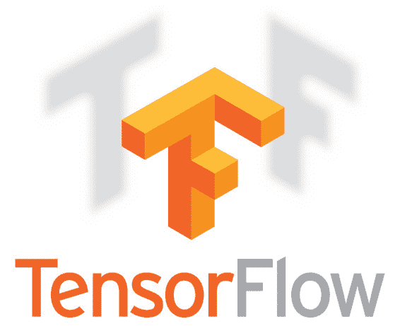
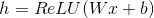
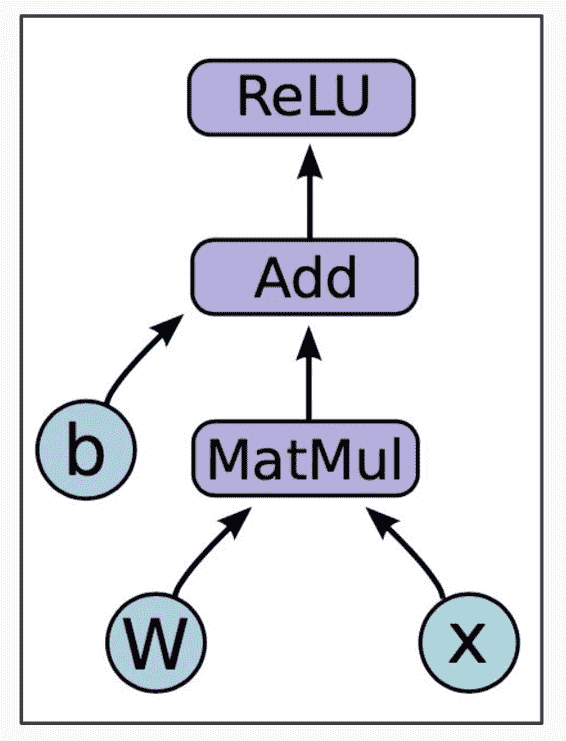
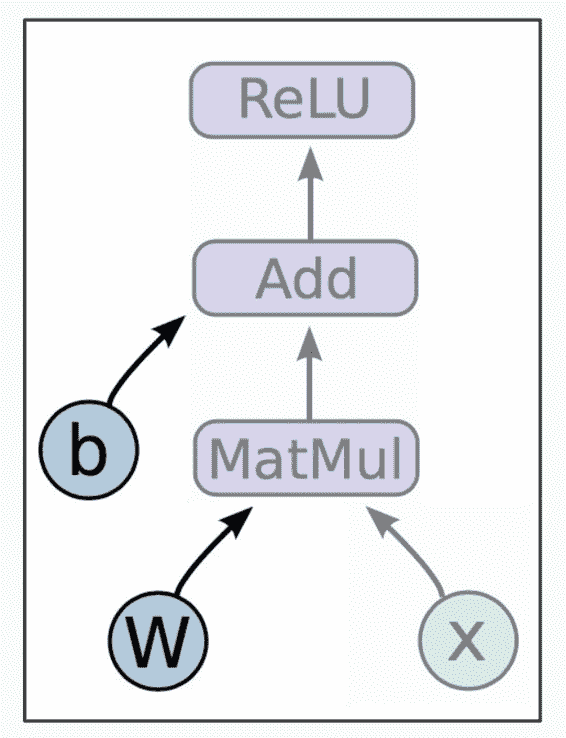
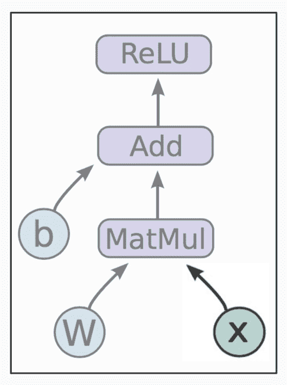
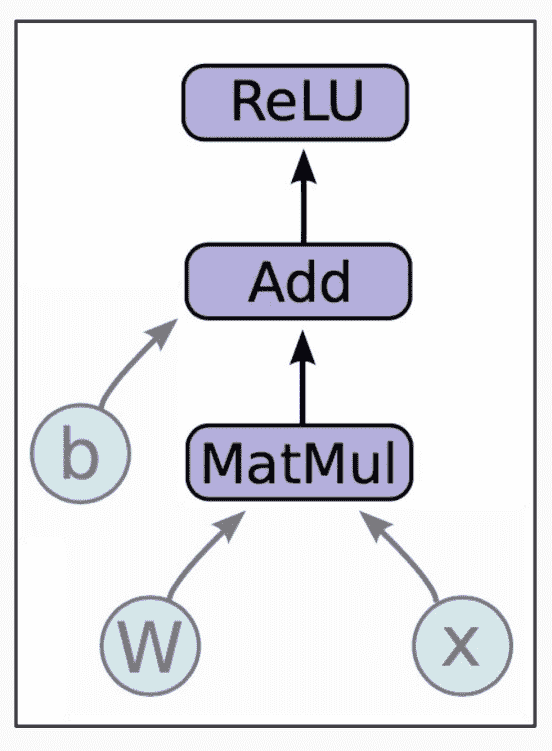
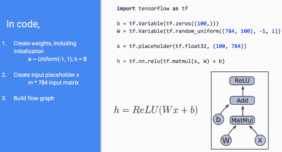
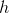
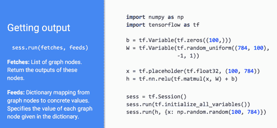
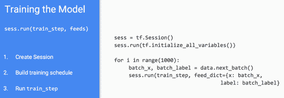

# CS224n 笔记 7 TensorFlow 入门

这节课由 TA 们介绍了 TF 里的几个基本概念（graph、variable、placeholder、session、fetch、feed），基本流程。然后现场敲代码演示如何在 TF 上跑线性回归和训练词向量。与优达学城的[《深度学习公开课》](http://www.hankcs.com/ml/notmnist.html)不同之处在于，后者是一个浮躁的快餐培训课程，看完了只知道大象是柱状的。



## 深度学习框架简介

为什么要用成熟的框架，而不是从头写一个：

*   这些框架提供了大规模机器学习算法的成熟实现

*   方便地计算梯度

*   标准化机器学习应用，方便共享交流

*   多种算法、理念、抽象、编程语言等的融合

*   提供 GPU 并行运算的接口

### TF 是什么

不是口红。


*   TensorFlow 是一个图计算的开源类库

*   最初由 Google Brain 团队开发，用来进行机器学习研究

*   “TensorFlow 是一个描述机器学习算法和实现机器学习算法的接口”

### 图计算编程模型

中心思想是将数值运算以图的形式描述。

*   图的节点是某种运算，支持任意数量的输入和输出

*   图的边是 tensor（张量，n 维数组），在节点之间流动

比如 ReLU 激活函数：



计算图如下：



其中和是变量，变量通常是模型的参数。这些数据也可看做运算节点，只不过是无输出产生输出的节点。变量可以储存下来，作为模型的一部分发布。



而只是一个 placeholder（占位符），只在执行的时候填充输入，编程的时候指定大小即可。



剩下的 3 个节点是运算单元：



要描述这样的图运算，只需编写代码：



这段代码只是构建了运算图，连输入都没有，自然无法马上获取的值。

### 图在哪里

上述代码并没有显式地声明节点和边，TensorFlow 根据数学表达式自动构造了运算图。

### 如何运行

到目前为止，我们只定义了一张图，如何执行它呢？我们可以通过 session 将这张图部署到某个执行环境（CPU、GPU、Google 的 TensorProcessingUnit……）上去。session 就是到某个软硬件执行环境的绑定。

在代码中只需新增三行：



其中第一个 run 初始化了所有变量。第二个 run 中有两个概念：

```py
sess.run(fetches, feeds)	
```

fetches 是一系列图节点（其实就是某个节点，因为图是连通的，给我一个节点总可以找到所有节点）或说变量。feeds 是一个从 placeholder 到其输入值的映射。

## 训练

前面的部分只是定义了一个图，知道如何执行它，接下来介绍如何训练模型。

定义损失

用变量定义损失，用 placeholder 定义 label：

```py
prediction = tf.nn.softmax(...)  #Output of neural network
label = tf.placeholder(tf.float32, [100, 10])

cross_entropy = -tf.reduce_sum(label * tf.log(prediction), axis=1)
```

### 如何计算梯度

先初始化一个 optimizer，然后在图中损失函数节点后面添加一个优化操作（最小化，也是一种运算节点）：

```py
train_step = tf.train.GradientDescentOptimizer(0.5).minimize(cross_entropy)
```

就像（大部分）函数都有自己的导数一样，TF 中的运算节点都附带了梯度操作。在反向传播中，TF 在计算图的逆向图上利用链式法则自动计算梯度。用户不需要编写梯度计算与参数更新的代码，而是交给 optimizer 自动完成。

在代码中是这样调用的：



### 变量共享

有时候我们想要生成一张图的多个实例，或者在多机多个 GPU 上训练同一个模型，就会带来同一个变量在不同位置出现。如何在不同位置共享同一个变量呢？

一种朴素的想法是弄个字典建立变量名到 variable 的映射：

```py
variables_dict = {
    "weights": tf.Variable(tf.random_normal([782, 100]),
                           name="weights"
                           )
)
"biases": tf.Variable(tf.zeros([100]), name="biases"
}
```

但这样容易导致变量名冲突，TF 支持命名空间：

```py
with tf.variable_scope("foo"):
    v = tf.get_variable("v", shape=[
        1])  # v.name == "foo/v:0"
with tf.variable_scope("foo", reuse=True):
    v1 = tf.get_variable("v"
                         # Shared variable found!
                         ) )
with tf.variable_scope("foo", reuse=False):
    v1 = tf.get_variable("v"
# CRASH foo/v:0 already exists!
```

## 总结

TF 的用法总结如下：

1.  创建图
    a 前向传播/预测
    b 优化操作

2.  初始化 session

3.  在 session 中执行

## 现场演示

印度小哥拿着 MBP 开始现场敲代码了，用的是 Vim，经常少敲了括号，最后跑 word2vec 死活不知道哪里敲错了，干脆把写好的 word2vec_complete.py 调出来了事。这说明：

*   至少在学习 TF 上，MBP 还是有很多人在用的

*   现场敲代码压力还是很大的

*   一个有纠错提示的 IDE 还是很重要的 

 [知识共享署名-非商业性使用-相同方式共享](http://www.hankcs.com/license/)：[码农场](http://www.hankcs.com) » [CS224n 笔记 7 TensorFlow 入门](http://www.hankcs.com/nlp/cs224n-tensorflow.html)