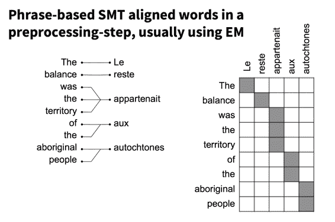
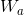
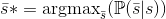

# CS224n 笔记 10 NMT 与 Attention

从 NMT 的历史谈到现代，讲解了 attention 机制的动机、原理及最新的拓展。通过实例展示谷歌翻译的变化，直言不讳指出其过度炒作。Manning 今天还换上了新 MBP，挺潮的。

## 机器翻译

*   传统衡量机器对语言理解的测试之一

*   同时涉及到语言分析与理解

*   一个每年 400 亿美金的产业

*   主要在欧洲，亚洲也在兴起

### 机器翻译的需求

*   Google 每天翻译 1000 亿单词

*   Facebook 研发了自己的翻译系统，因为通用的机器翻译系统无法适应社交领域

*   eBay 用机器翻译来促进跨境交易

## 什么是 NMT

用一个大型神经网络建模整个翻译过程的系统。

### 架构

抽象的架构就是一个 encoder 一个 decoder：

### NMT:青铜时代

80 年代神经网络是个很边缘的领域，另外计算力也很有限。当时的 NMT 系统只是个玩具：词表四五十，固定的 50 个输入（二进制编码），固定的 66 个输出，一到三层隐藏层，150 个单元……

90 年代出现了一种类似 RNN 的更复杂的框架：

### 现代 NMT 模型

之前课上也提到过，一个 RNN 做 encoder，另一个 RNN 做 decoder：

实际使用的系统更加复杂：

这里的 RNN 可视作以原文为条件的 conditional 语言模型

### RNN Encoder

最后一个隐藏层的状态 Y 是整个原文的总结。

常见的 encoder 实际上加了一些 extension，比如 GRU 或 LSTM。

### Decoder：递归语言模型

常见的做法是把 encoder 的最后一层（最后一个时刻）作为 decoder 的第一层，这样就必须用 LSTM 保持中期记忆。

另一种做法是将 encoder 最后一层喂给 decoder 的每一层，这样就不会有记忆丢失的后顾之忧了。

### MT 的发展

基于短语的 MT 就是 2016-11 之前的 Google 翻译所采用的系统，其发展是缓慢的。神经网络兴起之后，出现了一种基于 Syntax-based SMT（估计是换换词向量），发展也不快。但 NMT 的发展是最迅猛的：

### NMT 的四大优势

1.  End-to-end training
    为优化同一个损失函数调整所有参数

2.  Distributed representation
    更好地利用词语、短语之间的相似性

3.  Better exploitation of context
    利用更多上下文——原文和部分译文的上下文

4.  生成的文本更流畅
    可能跟上述优势有关

NMT 还避免了传统 MT 中的黑盒子（reorder 之类）模型。NMT 也存在弱点

*   无法显式利用语义或语法结构（依存句法分析完全用不上了，有些工作正在展开）

*   无法显式利用指代相消之类的结果

可见太统一的闭环系统也有自己的烦恼啊。

## 统计/神经网络机器翻译

Manning 说除了英语之外，学生中第二大语种是中文，而且他亮出了简体中文的例子，真是让人激动啊。他还特意在不同年份测试了 google 翻译的效果：

其中，13 年有所进步，14-16 年又退步了并且停滞了 3 年。直到 2017 年才有质的飞跃。

我觉得这个句子涉及到指代相消，MT 系统很难消解损兵的“他们”。MT 系统必须有这样的常识：兵力悬殊的两军对战，人数少的一方更容易失败。估计语料不足以给它这种知识。

### NMT 主要由工业界促进

2016-02 微软在 Android 和 iOS 上发布了离线 NMT 系统，这对境外旅游人士特别有帮助。

2016-08 Systran 发布了 NMT 模型

2016-09 Google 发布了 NMT 系统，大肆宣传了一番，并且 overclaim 比得上人工翻译质量。Manning 真是直言不讳啊。

## 介绍 Attention

朴素 encoder-decoder 的问题是，只能用固定维度的最后一刻的 encoder 隐藏层来表示源语言 Y，必须将此状态一直传递下去，这是个很麻烦的事情。事实上，早期的 NMT 在稍长一点的句子上效果就骤降。

### Attention 机制

解决方法是将 encoder 的历史状态视作随机读取内存，这样不仅增加了源语言的维度，而且增加了记忆的持续时间（LSTM 只是短时记忆）。

这种机制也与人类译员的工作流程类似：不是先把长长的一个句子暗记于心再开始闭着眼睛翻译，而是草草扫一眼全文，然后一边查看原文一边翻译。这种“一边……一边……”其实类似于语料对齐的过程，即找出哪部分原文对应哪部分译文。而 NMT 中的 attention 是隐式地做对齐的。

### 词语对齐

传统的 SMT 中需要显式地做双语对齐：

而 attention model 是在翻译的过程中隐式地对齐。

### 同时学习翻译和对齐

一个非常棒的可视化，显示 attention model 成功地对齐了法语和英语，其中一小段语序的调整也反应出来了：

### 打分

在图示问号时刻，究竟应该关注哪些时刻的 encoder 状态呢？关注的强度是多少呢？

有一种打分机制，以前一刻的 decoder 状态和某个 encoder 状态为参数，输出得分：

然后 softmax 归一化分值转化为概率，这个概率称为对齐权值（alignment weights）：

这个概率也代表模型应该将多少比例的注意力放在一个历史状态上：

加权和得到一个 context vector，作为条件之一生成 decoder 的当前状态：

而分数的获得，是通过 attention function 进行的。attention function 有多种选择，其中流行的是中间这种。给了两个向量更复杂的 interaction，而最后一种根本没有 interaction。

有一些观点认为模型不应该注意所有的事情，可能对长句子来讲比较有潜力：

但这些观点并没有取得更好的成绩：

句子特短的时候，模型们的得分都不高。这纯粹是因为语料中的短句子本来就语义隐晦，比如某个专有名词作为标题。而有 attention 的模型在句子很长的时候，效果依然没有下降，说明了 attention 的重要性。

LSTM 非常擅长生成自然的文本，但有时候译文与原文相去甚远，没有把注意力放在原文上。比如下面红色的名字不知道从哪里冒出来的：

加了 attention 好了很多，还是比不上人类，有时候会把同一个意思的词重复两遍：

### 更多 attention！覆盖范围

在图片标题生成研究中，模型通过对图片不同区域的 attention 生成了不同的词语：

如何保证不错过任何重要的区域呢？

### Doubly attention

一种思路是同时注意原文和译文：

### 用旧模型的语言学思想拓展 attention

可以利用 IBM2 等模型中的位置或 fertility(丰富程度)，因为一般而言一个词最多翻译为两三个词，如果生成了五六个词，那么模型可能在重复生成。

## decoder

模型能够在给定原文的情况下计算译文的概率之后，就来到传统的问题了，找出最可能的译文：

在 decoding 的时候，朴素想法是生成所有的翻译，用语言模型打分，然后挑最大的。但译文数量是词表大小的指数函数，无法实现。

### Ancestral sampling

在时刻，根据之前的词语生成当前词语：

可以多次 sample 取最好的。

理论上完美无缺，但实践中只会产生高方差的差效果。你也不想同一个句子每次翻译结果都不一样。

### Greedy Search

不多想了，贪婪地选取当前最可能的那个单词：

缺点显而易见，不是全局最优，走错一步会影响后面的部分。

### Beam search

老生常谈了，从不搜索到贪婪搜索到柱搜索，随处可见。

每个时刻记录个最可能的选项（剪枝），在其中进行搜索。

然后递推：

其中

也就是说把词表中的词丢进入计算概率取前个。

### 效果对比

采样要采 50 轮才得到比贪心搜索稍好的结果，但很小的柱搜索轻松超越了它们。另外，基于短语的 MT 常用的柱搜索大小是 100 到 150，可见 NMT 的优势。

 [知识共享署名-非商业性使用-相同方式共享](http://www.hankcs.com/license/)：[码农场](http://www.hankcs.com) » [CS224n 笔记 10 NMT 与 Attention](http://www.hankcs.com/nlp/cs224n-9-nmt-models-with-attention.html)