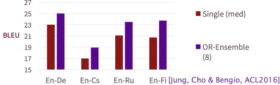
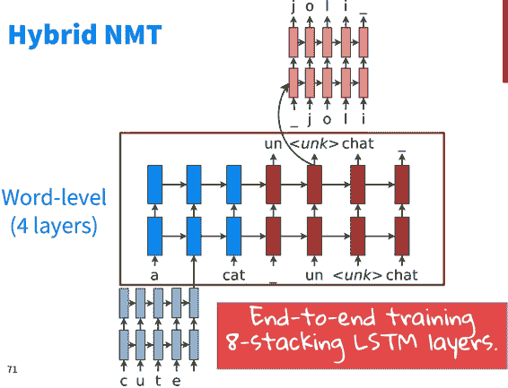

# CS224n 笔记 11 GRU 和 NMT 的进一步话题

从动机层面直观地充实了 GRU 和 LSTM 的理解，介绍了 MT 的评测方法，讨论了 NMT 中棘手的大词表问题和一些常见与最新的解决办法。

## 深入 GRU 

把 GRU 再详细讲一讲。

RNN 的梯度消失就不赘述了，红线连乘多次下溢出。

而 GRU 额外添加了一些“捷径”红线，允许梯度直接流过去，而不是连乘的方式递减过去。

### Update Gate

用来自适应学习应该把多少注意力放到前一个隐藏层状态上。

### Reset Gate

自适应地删除不需要的连接。

RNN 寄存器

朴素 RNN 读取所有寄存器，运算后存入所有寄存器，没有灵活性。

### GRU 寄存器

门多了之后，就可以灵活地选择读取部分寄存器，执行运算，写入部分寄存器。

Reset Gate 起到决定要读哪些寄存器的目的，而 Update Gate 决定要写的寄存器。这里的“决定”其实是“强度”的意思，不是绝对的。

### GRU 和 LSTM 对比

GRU 中的隐藏状态类似于 LSTM 中的 cell，而 LSTM 中的隐藏状态其实相当于一个暴露给外部世界的“显状态”。LSTM 通过给 cell 加一个获得非线性的灵活性。

另外，观察之前的系数，这里的其实是“don't reset gate”，其实是“don't forget gate”。

## 深入 LSTM

宏观上的 LSTM Cell：

将所有操作都 gate 起来，方便遗忘甚至忽略一些信息，而不是把所有东西都塞到一起。

New Memory Cell 的计算是一个非线性的过程，与朴素 RNN 一模一样：

最关键之处在于，Memory Cell 的更新中有一个加法项直接来自上一刻的 Cell，也就是说建立了和的直接线性连接（与 ResNet 类似）：

类似于 GRU 中的加法，在反向传播的时候允许原封不动地传递残差，也允许不传递残差，总之是自适应的。

有了这些改进，LSTM 的记忆可以比 RNN 持续更长的 step（大约 100）：

### 训练技巧

*   将递归权值矩阵初始化为正交

*   将其他矩阵初始化为较小的值

*   将 forget gate 偏置设为 1：默认为不遗忘

*   使用自适应的学习率算法：Adam、AdaDelta

*   裁剪梯度的长度为小于 1-5

*   在 Cell 中垂直应用 Dropout 而不是水平 Dropout

*   保持耐心，通常需要训练很长时间

### Ensemble

如果想获得额外的 2 个百分点的效果提升，可以训练多个模型，平均它们的预测。

## MT 评测

以前人们认为交给人类译员来打分是最好的，但这太主观了，10 个译员给出的翻译可能都不相同。

### BLEU

后来 IBM 发明了一种简单有效的评价策略，叫 BLEU。

通过比较标准译文与机翻译文中 NGram 的重叠比率（0 到 1 之间）来衡量机翻质量。

### Brevity Penalty

是否可以通过输出大量无意义的 the 之类来作弊？不，通过 Brevity Penalty 来防止机翻比译员译文短。

一般取 4-gram 之内参与评测，最终的分值是所有 ngram 分值的几何平均乘上一个 Brevity Penalty：

一个具体的 BLEU 重叠例子：

### Multiple Reference Translations

为了防止某篇机翻实际上很好，可就是跟人类译文用词行文不相似的情况，IBM 的论文建议多准备几篇标准答案，这样总会撞上一个：

当然了，虽然 IBM 建议准备 4 篇，实际测试中经常只有 1 篇。没有完美体现能力的考试，现实社会也是如此。

刚开始的时候，BLEU 和人工打分几乎是线性相关（一致）的：

而当人们为了 BLEU 分数费尽心机之后，两者就开始脱钩了。这也是为什么 Google 翻译的效果没有宣称的那么好的原因之一。

## 解决大词表问题

大词表问题指的是 softmax 的计算难度：

早期的 MT 系统会使用较小的词表，但这并不是解决问题，而是逃避问题。

另一种思路是，hierarchical softmax，建立树形词表，但这类方法过于复杂，让模型对树形结构敏感而不是对词语本身敏感。

另外就是上几次课见过的廉价的 NCE，这些方法对 GPU 都不友好。

### Large-vocab NMT

最新的方法是训练时每次只在词表的一个小子集上训练，因为 40%的词语只出现一次，如果把训练数据均分为许多份，则每一份中的稀有词可能都不会在其他语料中出现。然后测试时加一些技巧，待会儿详谈。

#### 训练

如何选择小词表呢？在刚才的方法上更进一步，让用词相似的文章进入同一个子集，这样每个子集的词表就更小了。

#### 测试

测试的时候先雷打不动将前个最常使用的单词加入备选词表，然后将原文中每个单词可能的前个翻译加进去。最后在备选词表上 softmax。

### 更多技巧

上上次小讲座中提到的 pointer、用词素级别来翻译 goooooood morning 之类。至此下课时间到了，后面全部是我的理解。

#### Byte Pair Encoding

这种方法试图用分词的思想去找出所有有意义的“词素”，其统计方法说来也简单，就是在词频词表里统计所有的 ngram 组合作为新的更长的 ngram：

该方法拿到了 WMT2016 的第一名，代码在：[`github.com/rsennrich/nematus`](https://github.com/rsennrich/nematus)

#### 其他

一些字符级别的 LSTM 之类。

另有一些混合动力的 NMT，大部分情况下在词语级别做翻译，只在需要的时候从字符级去翻译。这个系统的主体是词语级别的 LSTM：

在词语级别上做常规的柱搜索：

一旦产生了 unknown 词语，则在字符级别进行柱搜索：

然后提升了两个 BLEU 分值。

 [知识共享署名-非商业性使用-相同方式共享](http://www.hankcs.com/license/)：[码农场](http://www.hankcs.com) » [CS224n 笔记 11 GRU 和 NMT 的进一步话题](http://www.hankcs.com/nlp/cs224n-gru-nmt.html)