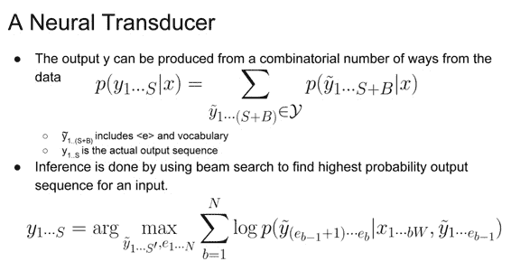
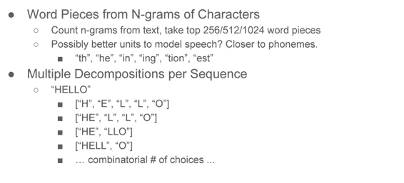
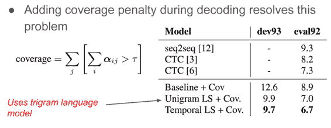

# CS224n 笔记 12 语音识别的 end-to-end 模型

这次斯坦福请到了深度学习教父 Hinton 的弟子 Navdeep 来讲语音识别，他正在英伟达工作，怪不得 N 卡在深度学习中的地位如此之高。而他本人也在用 Dell 的搭载了 N 卡的 XPS 跑 Ubuntu，一改以往“讲台必定信仰灯”的局面。

## Automatic Speech Recognition（ASR）

ASR 就是将声学信号转化为文本的系统。

语音是一种自然的用户接口：

### 传统 ASR

传统做法的主体是生成式语言模型，建模声学信号与文本的发音特征的联合概率，但 pipeline 的不同部分掺杂了不同的机器学习模型：

### 近现代 ASR

神经网络兴起之后，人们发现传统 pipeline 中的每个模型都可以被一种对应的神经网络所替代，并且取得更好的效果：

但是这么多混乱的目标函数各自为政，难免有顾此失彼的情况。这构成一种动机，为什么不用一个统一的大模型来取代这盘散沙呢？

### end-to-end ASR

直接从音频到字符的概率模型：

（上半部分与生成式模型作对比）

## Connectionist Temporal Classification

这是一种强大的概率模型，特别适用于语音识别。其主体是一个[Bidirectional RNN](http://www.hankcs.com/nlp/cs224n-rnn-and-language-models.html#h3-12)，上面是一层 softmax。

词表中还有一个空格<b>，这很重要。

由于语音片段（帧）切割时的随意性，可能导致一个字符 c 被切割为多个帧，每个帧都输出 c。为了区分字符与字符的界限，所以引入空格分隔符。在解码的时候还需要限制字符只能转移到相同的字符，或者空格。

解码时的直观演示：

灰色线条表示无输出的概率。

### 一些效果

可见识别结果听上去挺像那么回事，可拼写不正确。Google 通过在训练时集成语言模型进去修正了这些问题。而且不再使用字符级别，而是使用单词级别的大词表，识别出可能的单词后，用语言模型挑出最可能的句子。

虽然这是个 end-to-end 模型，但还是掺杂了一个语言模型。没有语言模型的帮助，该 CTC 模型无法根据已识别的单词做条件调整下次预测。

## sequence to sequence speech recognition with attention

让语言模型也成为模型天然的一部分，将音频视作 sequence，文本视作另一个 sequence，类似于 NMT 中的 encoder-decoder，LSTM 模型根据之前的 y 和全部 x 预测下一个 y：

一下子把 x 都喂进去后，对于很长的序列来讲，需要做 attention，在不同的时刻关注输入的不同部分：

由于是 RNN，所以输入 x 依然不是定长的。

### Listen Attend and Spell

定义 score 函数，接受每个历史时刻的 encoder 隐藏状态和 decoder 的当前状态，得到当前应当对每个历史时刻倾注多少注意力。softmax 归一化，加权和得到最终的 context vector，参与预测。

这里的 encoder 是树形的，因为对于较长的语音来讲，要 softmax 的 timestep 实在太多，效率不高、模型注意力被分散。通过用 softmax 把相邻的 timestep 总结一下，提高了效率和效果。

这个模型是强大的，学习到了很多 pattern：

还可能产生一个读音的不同拼写（取决于早期的预测结果，然后导致不同的 attention）：

### 效果

得到的效果虽然没有超越多年优化的旧模型，但也是一个量级的：

### LAS 的限制

*   必须等到用户说完话之后才能开始识别

*   attention 是计算瓶颈

*   输入的长度对准确率影响特别大

## 在线 seq2seq 模型

希望能够即时产生输出，并且不需要在整个 sequence 上分配 attention。

### Neural Transducer

根据一个定长的输入序列片段产生输出，不要要前一个输出，依然需要空白符，依然需要 alignment（哪些字母属于一个词）：

用空白符隔开的区块只是一个字符，究竟哪些字符成词，又回到了老生常谈的“分词”问题上来。这里采用了柱搜索找出最可能的路径。

训练的时候理论上有一个非常复杂的对数似然的梯度，但实际上经常只取对齐，不做识别上的求和：

对齐的过程类似 viterbi，但并不严格是，我们是在找最优路径，但路径与之前的每个选择都有关。柱搜索不太理想，如果记录到每个 block（字符）为止产生特定数量 token 的最大概率，则可以用动态规划解决：

### 结果

在有 attention 的情况下，窗口大小影响不大；而在无 attention 的情况下，窗口较小效果较好。

### Encoder 中的卷积

与其简单地层叠两个 timestep，不如喂给很深的卷积网络：

效果显著：

### 目标颗粒度

有很多选择：

但对语音识别来讲，更有用的是字符的 ngram（相当于音节）：

它们有指数级的组合可能，不清楚哪一种是最好的：

对于 end-to-end 模型来讲，常用的手法是由模型自动决定 ngram 的分割：

### 效果

上表的 ngram 代表“最大产生 ngram”的意思。

### 模型缺点

在句子开头和人名地名处困惑度较高：

在词语分界处的错误自信会导致搜索时的错误，连语言模型也无力回天。

### 解决办法

通过惩罚 softmax 输出概率 1 来 Entropy Regularization 正则化模型，可以克服这个问题：

与其直接 ER，不如让输出的分布尽量与 Unigram 的分布相似，这样效果更好了。

### 另一个缺点

另一个问题是，模型偏向于惩罚生成很长的输出，这对很长的输入来讲会出现提前终止输出的情况：

比如：

解决办法是在预测时惩罚那些不看输入的情况，未处理的输入越多，惩罚越大。

这种粗暴的方法还是取得了一些效果提升：

### Better Language Model Blending

标注音频-字幕数据毕竟不如海量的未标注文本多，而 end-to-end 模型是一个自治的大模型，内部隐式地存在通过标注数据学习到的语言模型。在哪里如何与外部语言模型混合呢？

答案是在 decoder 的 softmax 预测结果的对数概率上线性混合：

还有很多种混合手段，也是个新的前沿课题。

### Better Sequence Training

上节课提到的 ground truth 问题，除了 scheduled sampling 之外，还有一些拓展。比如 Reinforement Learning 之类（草草提了两句）。

## 机会

一些研究方向了。

### 多音源

鸡尾酒舞会上有很多人说话，能否都识别出来呢？以前的生成式模型心中有一个固定的模式去生成数据与输入对比，不适合这个任务。现在常用的判别式模型反过来，以输入特征预测结果，应该可以做出以前做不到的成绩。

### "同声传译"

接受法语音频，直接输出英文文本。相当于将上面提到的模型与 MT 模型 blend 到一起了：

两者分别对原文和音频的对齐是非常类似的：

 [知识共享署名-非商业性使用-相同方式共享](http://www.hankcs.com/license/)：[码农场](http://www.hankcs.com) » [CS224n 笔记 12 语音识别的 end-to-end 模型](http://www.hankcs.com/nlp/cs224n-end-to-end-asr.html)