# CS224n 笔记 13 卷积神经网络

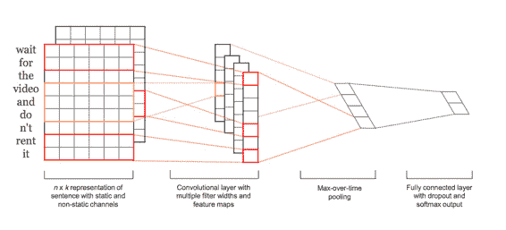

补充了 NLP 中相对冷门的 CNN，谈了谈调参与发论文的潜规则。

## 从 RNN 到 CNN

*   RNN 无法利用未来的特征预测当前单词，就算是 bi-RNN，也不过是双向重蹈覆辙而已。

*   经常把过多注意力放到最后一个单词上。

    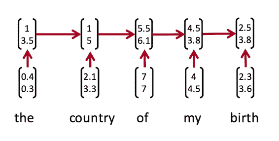

比如，如果只想得到 my birth 的向量，RNN 就无能为力了，因为它捕捉的是从左到右的“上文”。

*   与此对应，softmax 也是加在最后一个单词上的

CNN 的解决思路说来也很简单粗暴，那就计算相邻的 ngram，不管它到底是不是真正的短语，眉毛胡子一把抓地为它们计算向量。

### 什么是卷积

定义在两个矩阵上的函数，生成另一个矩阵（也许称作 tensor 会更好）。对一维矩阵（向量来讲），可以形式化地描述如下

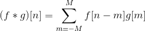

这里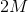是过滤器的大小。

在计算机视觉中，卷积可以提取诸如物体边缘之类的特征。一个很棒的可视化：

更多入门知识参考[《理解深度学习中的卷积》](http://www.hankcs.com/ml/understanding-the-convolution-in-deep-learning.html)。

### 单层 CNN

假设词向量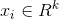，那么个单词的句子可视作词向量(列向量)的按列拼接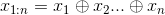。

对于个单词上的卷积过滤器 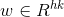 ，比如, 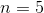, 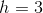，下图演示了 NLP 中的单层 CNN 工作过程：

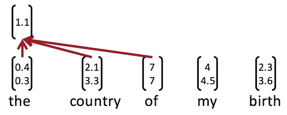

也就是说，每相邻 3 个词语的组合对应卷积结果中的一个标量。卷积过滤器的权值也是一个向量，最终得到每个卷积结果 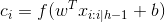 ，组合得到向量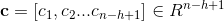。

对最后两个词语，由于不够长()，常见的技巧是补零：

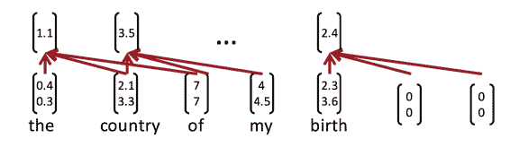

（这样得到的就不再是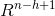的向量了

一个过滤器就是一个向量，卷积运算的子运算实际上就是与某个 ngram 的内积，内积代表相似性。于是卷积核实际上在挑选与自己相似的那种 pattern，比如正面情感的 ngram。

### 池化

卷积不是最终目的，最终目的是将卷积结果输入到其他网络中去。在不补零的情况下，卷积结果中有个数，与有关；而我们想要一个定长的输入。一个解决办法是 max-pooling，输入是 CNN 结果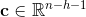，输出是一个标量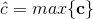，其中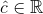。

当然也可以用 min，不过 ReLU 时经常结果是 0，所以没什么意义。max 的意义是，这个过滤器就是要过滤出最强烈的那个 ngram，作为整段话的中心意思。

为了得到多个卷积特征，简单地使用多个卷积核（不需要大小一致），然后把池化结果拼接起来。

另外，有一个关于词向量的技巧。如果任由梯度流入词向量，则词向量会根据分类任务目标而移动，丢失语义上泛化的相似性。解决办法是用两份相同的词向量，称作两个通道（channel）。一个通道可变，一个通道固定。将两个通道的卷积结果输入到 max-pool 中。

### 分类

最终个卷积核输出的特征向量是：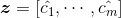

喂给最终的 softmax 层：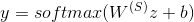

### 图示

一个漂亮的图示：

双通道词向量=>多个卷积核得到的 feature map（红色是 bigram，橙色是 trigram）=>池化得到最终特征=>softmax 分类输出。

### dropout

老生常谈了：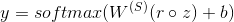

中的元素满足参数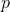的伯努利分布，最终特征向量相当于被缩放了：

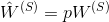

也相当于在数据上采样子集训练模型，然后平均起来（ensemble），通常可以带来 2-4%的效果提升。

直观的解释是，在情感分析任务中，并不一定要两个表示正面的 ngram 同时出现才能下结论，有时候只出现一个也可能足以说明问题。

这些训练 trick 都相当于给 GD 引入噪声，让其不再肯定地瞄准一个局部最优，而是尽可能地探索尽可能多的 landscape。以前挺有希望的高斯过程调参也不流行了，人们觉得随机采样超参数空间就已经惊人地好用了。

一般模型里面的超参数非常多，就算给定一组超参数，多数情况下也无法复现结果。往好的方向解释是作者试验了很多次，终于碰巧撞上了更好的局部最优点，而我们都没撞上去。

### 试验结果

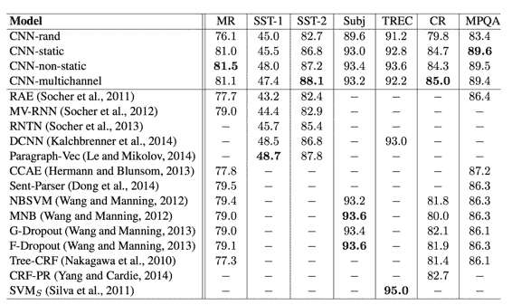

双通道不显著地带来了一点提升。这张对比表也暴露了深度学习学术界公开的“黑幕”，没有人把每个训练 trick 单独拎出来报告提升比；2014 年之前几乎没人用 Dropout，可最新发表的论文就是要跟它们比 Dropout，却不愿把它们加入 Dropout 重新实现一遍（可能费时费力还不讨好吧，万一被 baseline 反杀不就完蛋啦）。事实上，这个结果只能说明 Dropout 比不 Dropout 有 2-4%的提升，不能说明 CNN 多有效。

## CNN 花样

可以变换很多花样，比如每个 feature map 是变大了还是变小了，池化技巧等等。

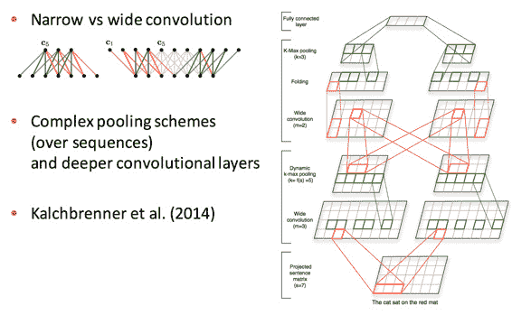

## CNN 应用：机器翻译

第一个神经网络机器翻译模型吧，用 CNN 做 encoder，RNN 做 decoder：

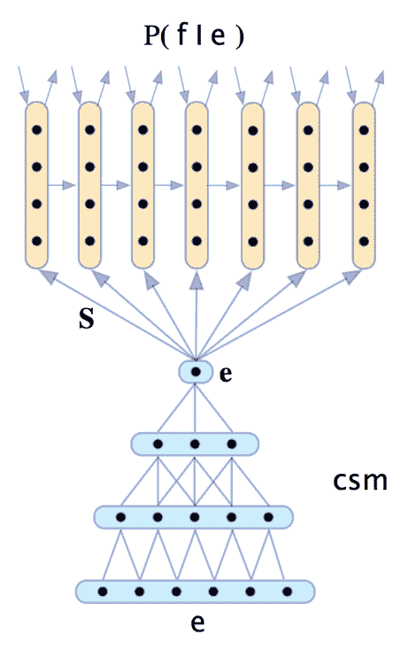

到这里就快下课了，Richard 草草讲了几句。

## 模型比较

Bag of Vectors：对分类问题来讲非常棒的基线模型，接几层 ReLU 甚至可能打败 CNN。

Window Model：对单个单词的分类来讲挺好，但不适用于需要更多上下文的任务。

CNN：适合分类，不清楚如何做短语级别的标注，对短文本需要 padding，难以用 NLP 的视角解释，容易 GPU 并行化

RNN：从左读到右，最符合认知。不是分类任务的最佳选择，比 CNN 慢，但可以做序列标注。

### Quasi-RNN

CNN 和 RNN 的混血儿，在时序数据上做卷积：

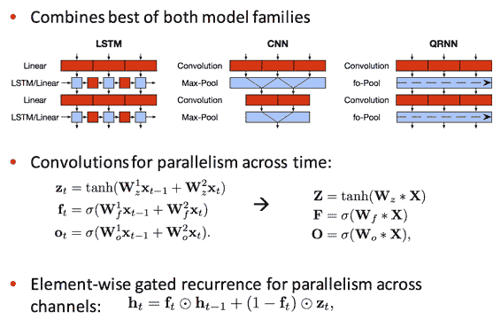

比 LSTM 速度要快，效果要好：

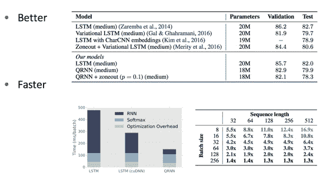

 [知识共享署名-非商业性使用-相同方式共享](http://www.hankcs.com/license/)：[码农场](http://www.hankcs.com) » [CS224n 笔记 13 卷积神经网络](http://www.hankcs.com/nlp/cs224n-convolutional-neural-networks.html)