# CS224n 笔记 14 Tree RNN 与短语句法分析

介绍了著名的复合性原理，由此启发得到树形 RNN，用于表示短语和句子级别的语义。从朴素树形 RNN 到 SU-RNN 和 MV-RNN，讨论了进化历史和各自优缺点，演示了效果和在图像等领域的拓展应用。

## 语言模型光谱 

最简陋最常用的是词袋模型，或“词向量袋模型”。最复杂的可能是短语结构树，额外再标注一些诸如指代、语义等标签。

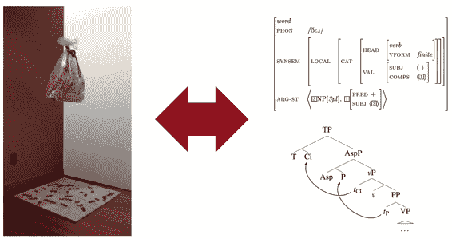

这张图很形象，词袋中装不下所有单词，散落一地。虽然词袋模型很简陋，但它依然是一个很难击败的基线模型。它简单高效，通过一些聪明的技巧可以在一些任务中胜过深度神经网络。

### 语言的语义解释——并不只是词向量

词向量只是词语级别的向量，对于下列两句话，加粗部分其实意思是一致的：

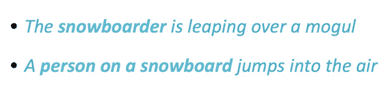

就算一个人没见过 snowboarder 这个单词，他也能明白这与下面这个短语是同一个意思。人们可以用更大颗粒度的文本来表达自己的意思，而不仅仅是词袋中的某个单词。有什么模型可以做到这一点呢？

## 语义合成性

这个问题触及的第一个层面就是语义的合成性，你可以组合小的单元来表示更复杂的语义。

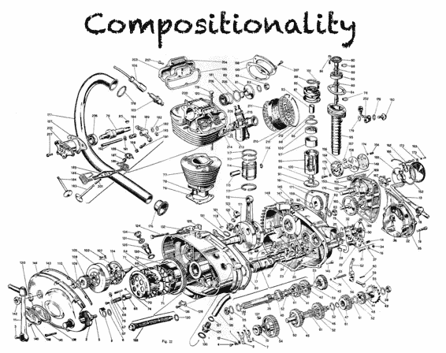

这不仅关乎语言，还关乎人类的其他认知活动。

对于图像而言，也有类似的组成性：

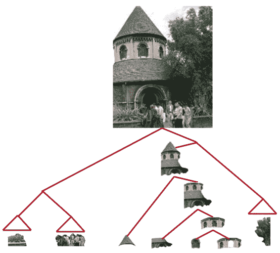

### 语言能力

以前有种主流观点认为，人类生来就具备处理语言的大脑模块，使得人类区别于其他动物，成为万物灵长。但乔姆斯基最近的工作认为，人类大脑中没有这种结构，只是因为人类学会了递归而已。有了递归的思想，人类就能利用有限的器官处理无限长度的语言序列。

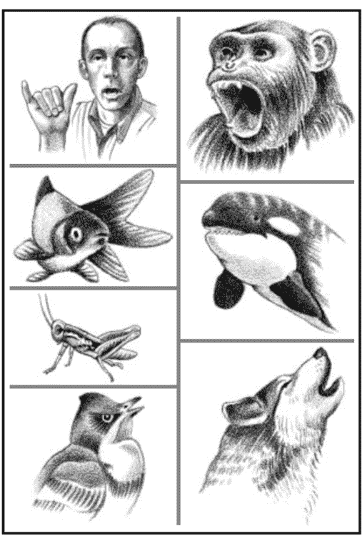

### 语言是递归的吗

在认知科学上虽然有些争议，因为一般一个句子是有长度限制的，人们几乎从不说 300 个词以上的句子。但是递归是描述语言的最佳方式，比如

[The man from [the company that you spoke with about [the project] yesterday]]

这里面一个名词短语套一个名词短语，一级级下去。从实用的角度讲

1、通过递归地描述句子（句法树），可以有效地消歧：

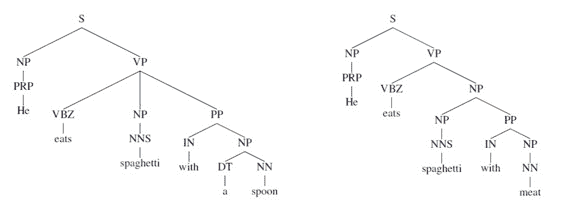

2、便于指代相消等任务。

3、便于利用语法树结构（基于短语的机器翻译）

## 在词向量空间模型上表示语义

不论句子多复杂，我们总是希望能在同一个向量空间中表示词语和短语的语义。为什么一定要这么做？回想这节课开头 snowboarder 的例子就明白了，有时候一个单词与一个短语表达的是同一个意思。

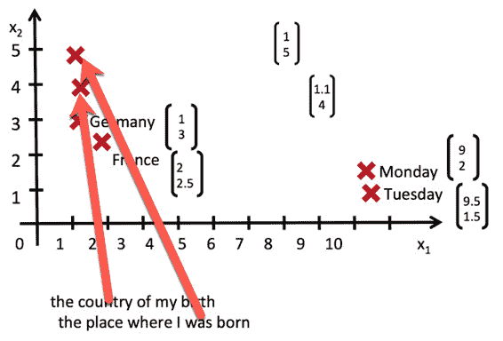

### 如何将短语映射到向量空间

根据著名的复合性原理——

> 在数学、语义学和语言哲学中，复合性原理是指，一个复杂表达式的意义是由其各组成部分的意义以及用以结合它们的规则来决定的。
> 
> ——[`dict.eudic.net/dicts/en/Principle_of_compositionality.html`](https://dict.eudic.net/dicts/en/Principle_of_compositionality.html)

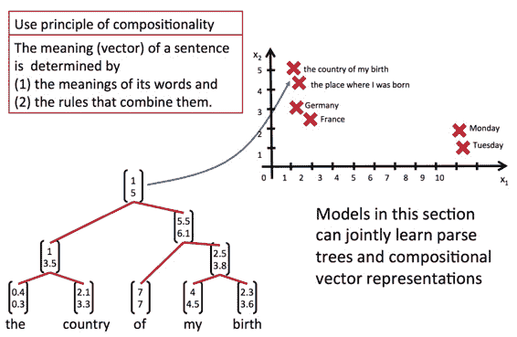

通过同时学习句法树和复合性向量表示，就可以得到短语的向量表示了。

### 短语结构分析：目的

如果我们能用短语结构树表示一个句子：

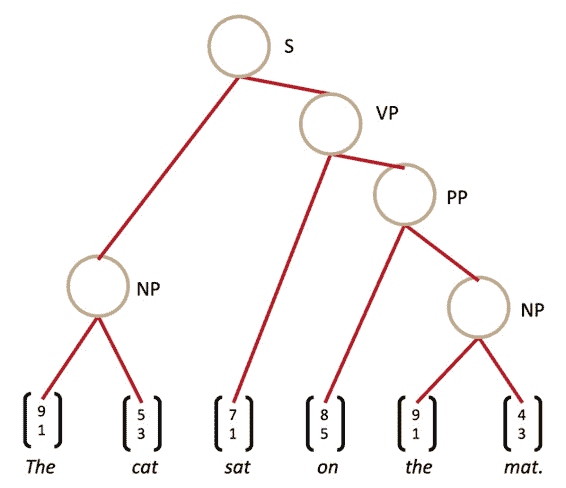

将每个 rule 视作一个算子，即可得到每个短语乃至句子的向量表示：

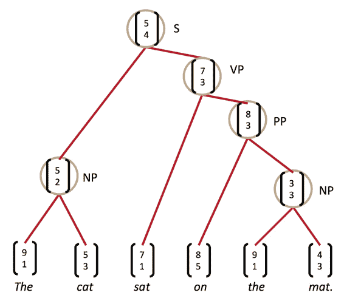

## Recursive vs. recurrent neural networks

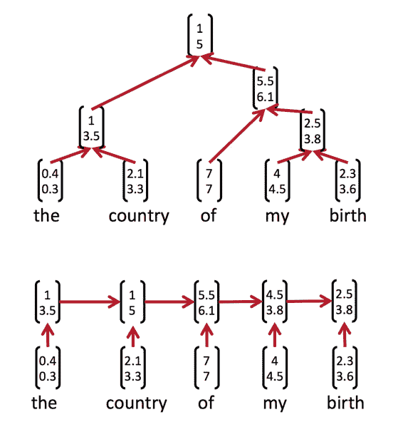

两者都是递归神经网络，只不过前者在空间上递归，后者在时间上递归。中文有时会把后者翻译为“循环神经网络”，但这明显混淆了等级，令人误解。

它们各有各的优缺点，Recursive neural net 需要分析器来得到句法树，而 Recurrent neural net 只能捕捉“前缀”“上文”无法捕捉更小的单位。

但人们还是更倾向于用后者，LSTM 之类。因为训练 Recursive neural net 之前，你需要句法树；句法树是一个离散的决策结果，无法连续地影响损失函数，也就无法简单地利用反向传播训练 Recursive neural net。另外，复杂的结构也导致 Recursive neural net 不易在 GPU 上优化。

### 从 RNNs 到 CNNs

RNN 只会为满足语法的短语计算向量，而 CNN 为每个可能的短语计算向量。从语言学和认知科学的角度来讲，CNN 并不合理。甚至 recurrent neural network 也比 tree model 和 CNN 更合理。

两者的关系可以这样想象，RNN 将 CNN 捕捉的不是短语的部分删除了：

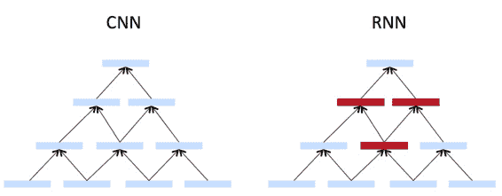

得到：

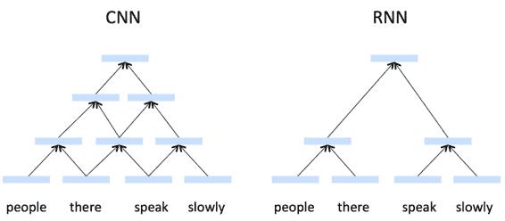

### Recursive Neural Networks 用于结构化预测

同时得到结构树和向量表示的一种任务。

输入两个候选子节点，输出两个子节点合并后的新节点语义表示，以及新节点成立的分值。

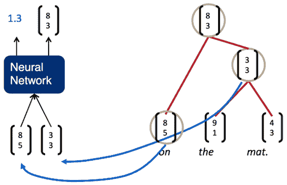

### 最简单的 Recursive Neural Network

利用单层的神经网络作为组合函数，向量内积作为打分函数，马上就可以得到一个最简单的 RNN：

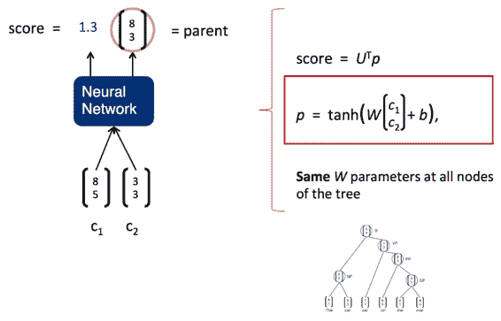

### 用 RNN 分析句子

计算任意两个单词合并的得分（虽然下图是相邻两个，但我觉得那只是绘图方便；就算是我第一次写的玩具级别的依存句法分析器，也是任意两个单词之间计算）：

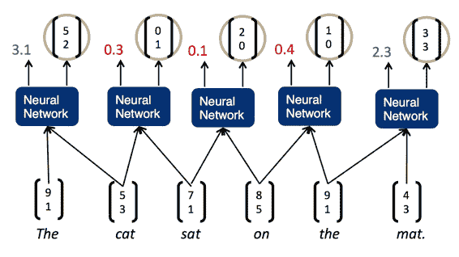

然后贪心地选择得分最大的一对合并：

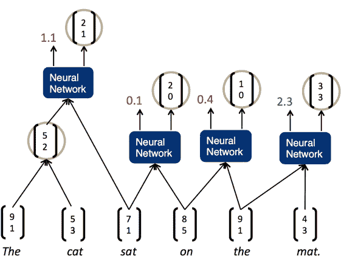

重复这一过程

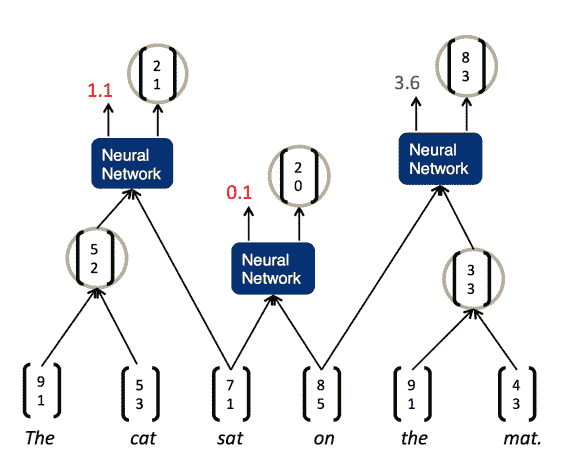

直到得到根节点：

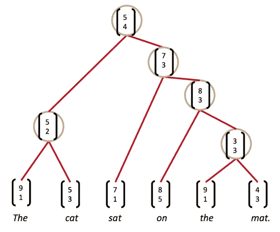

### 最大间隔

不再仅仅根据整个句子的总分挑选，而是要求每个预测分值离错误类别要尽量远。

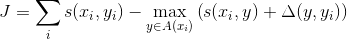

然后也不要贪心搜索，而是柱搜索。

### 结构上的反向传播

由于前向传播时每个节点的信号来自所有子节点，所以梯度也来自所有子节点。并且前向传播时父节点的信号是利用子节点信号的拼接计算的，所以梯度需要针对子节点的信号计算：

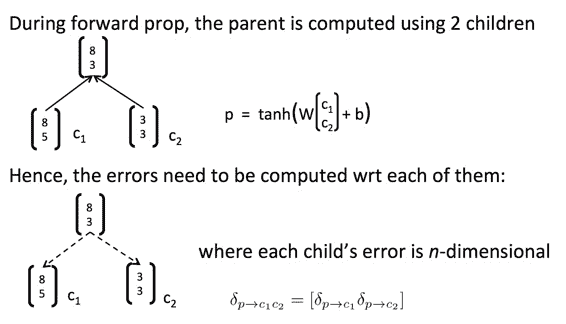

这个问题其实在 TensorFlow 那一课已经讲过了，图计算：前向传播信号流入某节点，反向传播误差就得从某节点分流到所有源节点。树只是图的一个特例：

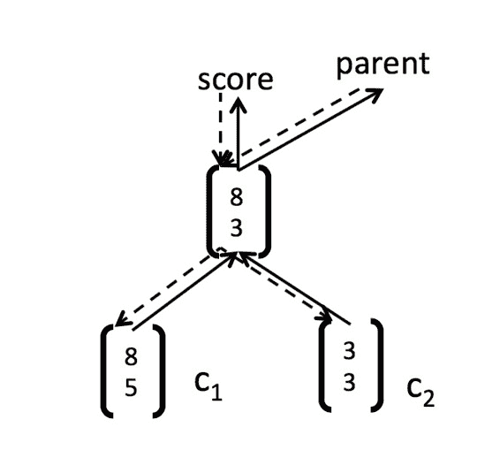

### 简单 RNN 的缺点

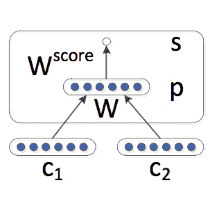

单层神经网络接受两个单词词向量的拼接，乘上权值矩阵，非线性激活。矩阵运算中可视作两个矩阵的拼接，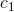和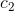其实没有发生互动。

另外，模型中只有一个合成函数，使用同一个权值矩阵处理 NP、VP、PP……这明显是不合理的。

 [知识共享署名-非商业性使用-相同方式共享](http://www.hankcs.com/license/)：[码农场](http://www.hankcs.com) » [CS224n 笔记 14 Tree RNN 与短语句法分析](http://www.hankcs.com/nlp/cs224n-tree-recursive-neural-networks-and-constituency-parsing.html)