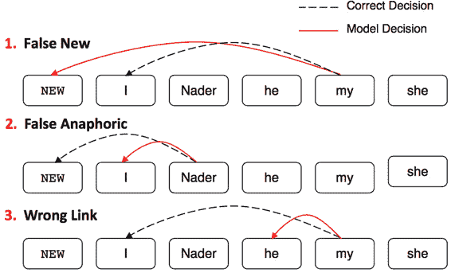
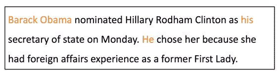
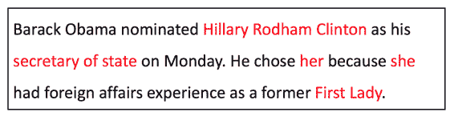
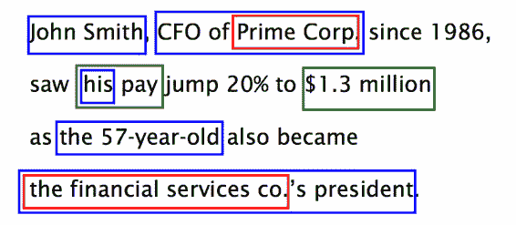
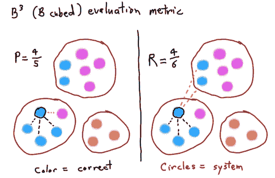
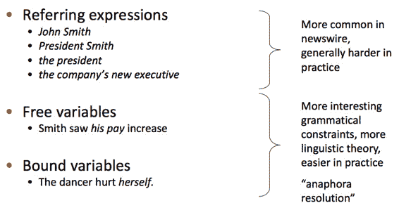
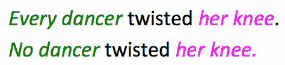
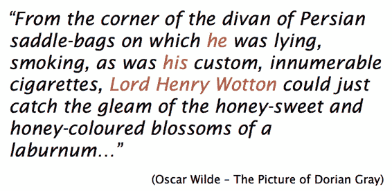
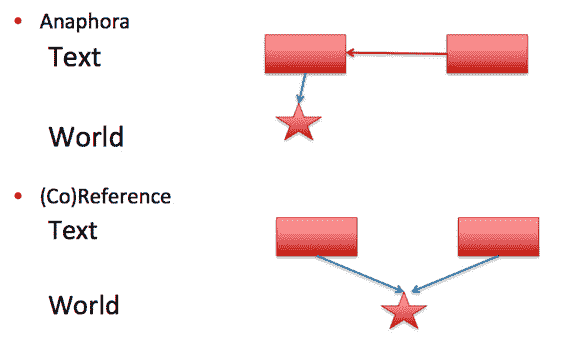
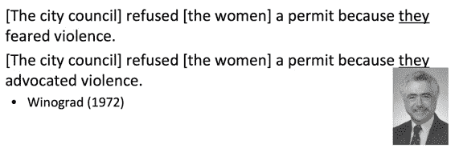

# CS224n 笔记 15 指代消解

从规则启发式代词回指消解出发，介绍了传统特征工程二分类模型、启发式损失的分类模型，过渡到利用强化学习自动缩放损失的神经网络模型。

## 什么是指代消解 

找出文本中名词短语所指代的真实世界中的事物。比如：

不只是代词能够指代其他事物，所有格和其他名词性短语也可以。

甚至还存在大量嵌套的指代：

### 应用

*   全文理解
    完整的文章中有大量的指代

*   机器翻译
    土耳其语不区分男他和女她，翻译到英文的时候必须做指代消解；当然了，当前工业线上的 MT 系统大多做不了

*   文本摘要
    使用代词会使行文更加自然

*   信息提取和 QA 系统
    比如搜索“谁娶了 Claudia Ross”，出来“He married Claudia Ross in 1971”，则系统必须消解“He”是谁。

### 指代消解评测

指代消解的结果很像聚类，所以一些聚类的评测手段可以借用：

当然实际中问题可能更复杂一些，有多个类别，而且 gold cluster 如何与 produced cluster 二分图匹配也是个 NP 问题（实际应用中有一些贪婪的算法效果也还不错）。

### 指代的类型

这个分类是语言学家定的，在 NLP 领域没见到过，顶多见到“回指”和“共指”。

### 不是所有 NP 都在指代

绿色 NP“指代”全集或空集，描述的是一种普遍规律。红色等价于绿色，所以也不是在做指代。

### Coreference, anaphors, cataphors

NLP 领域关注的其实只有上述 3 种指代类型的前 2 种，中文应当译作“共指”和“回指”，最后一种是“回指”的反义词：

一般视作“共指”处理。

那为什么回指不视作共指处理呢？因为两者在许多时候并不等效：

在 NLP 领域，也很少研究这种 bridging anaphora，后一个“票”视作另一种实体的指代，并不学习其与“演唱会”的关系。

### 共指与回指

它们是两种不同的概念：

回指中，后一个实体指代前一个实体，但两者并非指代真实世界中同一个事物。

那是不是应该区别对待它们呢？事实上，实际应用的系统几乎无法区分它们。

## 传统代词消解方法：Hobbs’ naive algorithm

这是 Hobbs 手工写的规则集，在句法树上运作。有两页的规则，类似地摊杂志上的心理算命：“如果……那么跳转第几步……否则……”该算法根据英文语言上的直觉编写，可以拿到 80%的准确率，有时候也作为其他机器学习分类器的特征之一使用。

### 基于知识库的代词消解

Winograd 和其他旧派 AI 学者认为，要做指代消解，必须有一个外部的知识库。比如：

根据常识，害怕暴力的更可能是女性，所以上述两个 they 的指代各不相同。这种“知识库”可能帮助系统消歧。

Winograd 等人的“知识库”连 Hobbs 的基线算法都没有达到。

### 几种指代消解模型

**Mention Pair models**

将所有的指代词（短语）与所有被指代的词（短语）视作一系列 pair，对每个 pair 二分类决策成立与否。

**Mention ranking models**

显式地将 mention 作为 query，对所有 candidate 做 rank

**Entity-Mention models**

一种更优雅的模型，找出所有的 entity 及其对话上下文。根据对话上下文聚类，在同一个类中的 mention 消解为同一个 entity。但这种方法其实也用得不多。

### 监督 Mention-Pair Model

这种模型用得最多，每个 mention 与之前的 mention 做二分类决策，当然如何识别 mention 是另外一个问题。

### 指代消解可用特征

大量语言学特征，人肉特征工程可用：

### 神经网络指代消解模型

虽然直觉上，联合学习所有 mention 之间的指代关系肯定比单个二分类要好，global 比 local 肯定要好。但实际上没有试验数据能够支撑这一点，所以虽然有 global RNN 等更强大的模型，效果最好的依然是 mention-pair 或 mention-ranking 模型。

 [知识共享署名-非商业性使用-相同方式共享](http://www.hankcs.com/license/)：[码农场](http://www.hankcs.com) » [CS224n 笔记 15 指代消解](http://www.hankcs.com/nlp/cs224n-coreference-resolution.html)