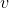

# CS224n 研究热点 1 一个简单但很难超越的 Sentence Embedding 基线方法

这门课会不定期地让 TA 介绍一些课程相关的最前沿研究，与课程进度并非流畅衔接，所以单独做笔记。这次是第二节课中场休息时，由 Danqi Chen 带来的五分钟小讲座：

## 句子 Embedding 动机

虽然这节课一直在讲词向量可以编码词的意思，但自然语言处理真正关心的是整个句子的意思。

如果我们能够拿到句子的向量表示，则可以方便地用内积计算相似度：

还可以在这些句子向量之上构建分类器做情感分析：

## 已有方法

具体怎么由词向量到句向量呢？有很多种方法，比如词袋模型中简单地线性运算：

在后面的课程中，将会用 recurrent neural network、recursive neural network，CNN 来做同样的事情。

## 新方法

但今天要介绍的这篇普林斯顿大学的论文却剑走偏锋，采用了一种简单的无监督方法。这种方法简单到只有两步：

第一步，对句子中的每个词向量，乘以一个独特的权值。这个权值是一个常数除以与该词语频率的和，也就是说高频词的权值会相对下降。求和后得到暂时的句向量。

然后计算语料库所有句向量构成的矩阵的第一个主成分，让每个句向量减去它在上的投影（类似 PCA）。其中，一个向量在另一个向量上的投影定义如下：

## 概率论解释

其原理是，给定上下文向量，一个词的出现概率由两项决定：作为平滑项的词频，以及上下文：

其中第二项的意思是，有一个平滑变动的上下文随机地发射单词。

## 效果

在句子相似度任务上超过平均水平，甚至超过部分复杂的模型。在句子分类上效果也很明显，甚至是最好成绩。

 [知识共享署名-非商业性使用-相同方式共享](http://www.hankcs.com/license/)：[码农场](http://www.hankcs.com) » [CS224n 研究热点 1 一个简单但很难超越的 Sentence Embedding 基线方法](http://www.hankcs.com/nlp/cs224n-sentence-embeddings.html)