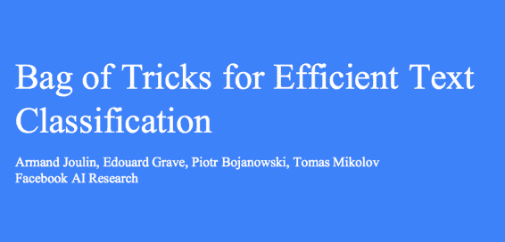
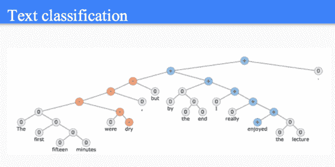
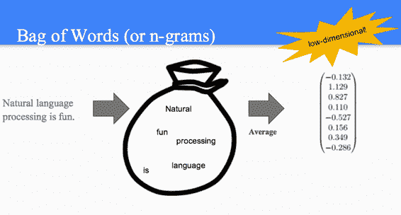
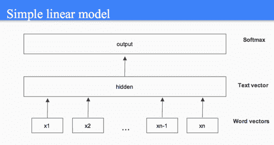
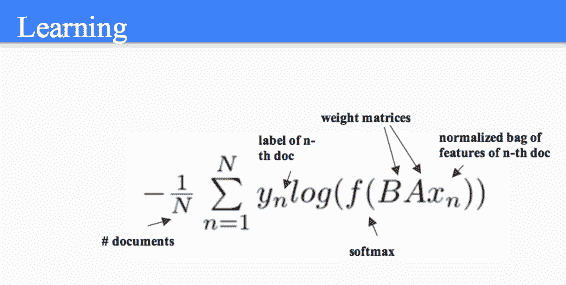
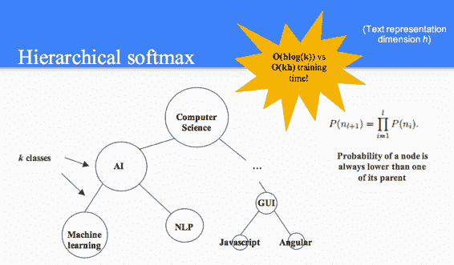
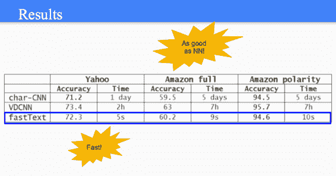

# CS224n 研究热点 3 高效文本分类的锦囊妙计

## Facebook 的 fastText 

文本分类是 NLP 中常见的任务，比如情感分析：

## 词袋模型

虽然词袋模型只是所有词向量的某种平均，但其维度可以做到很低：

为了抵抗词序丢失带来的语义丢失问题，可以用 ngram 特征来代替。

## 简单的线性模型

这并不是神经网络，因为从输入到隐藏层只是一个 look-up table，而隐藏层到输出则是一个逻辑斯谛回归线性分类器。

## 训练

用交叉熵作为损失函数：

## Hierarchical softmax

与其用一个超大的 softmax 层，不如用多个 Hierarchical softmax：

类似于[`www.hankcs.com/nlp/word2vec.html#h2-3`](http://www.hankcs.com/nlp/word2vec.html#h2-3) ，可以提高效率。

## 效果与速度

效果与最好的神经网络模型相差无几，但训练速度非常快：

## 总结

*   fastText 常常可以跟深度神经网络分类器打平。

*   但训练速度只需几秒，而不是几天。

*   还可以学习多种语言的词向量（效果比 word2vec 还要好）。

 [知识共享署名-非商业性使用-相同方式共享](http://www.hankcs.com/license/)：[码农场](http://www.hankcs.com) » [CS224n 研究热点 3 高效文本分类的锦囊妙计](http://www.hankcs.com/nlp/cs224n-bag-of-tricks-for-efficient-text-classification.html)