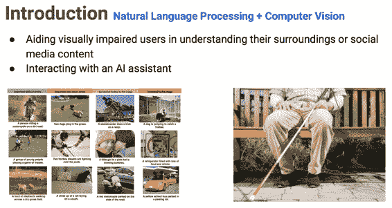
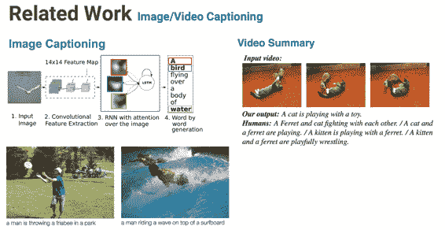
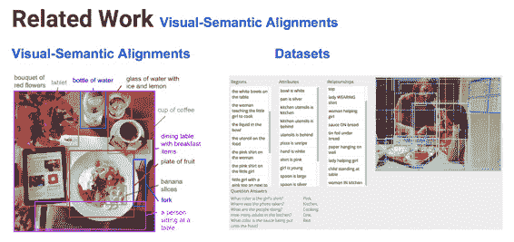
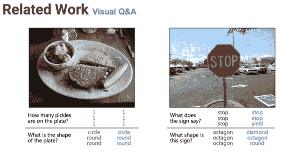
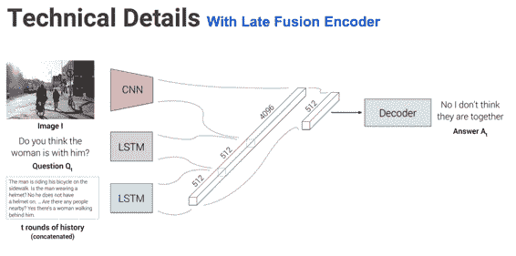
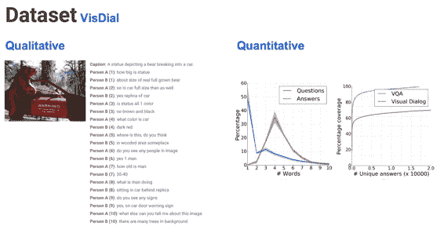
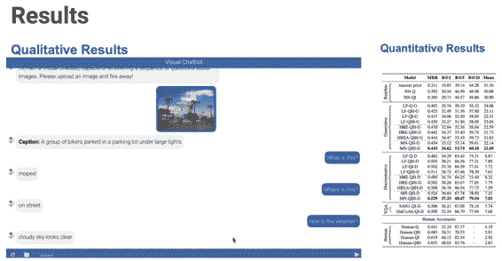

# CS224n 研究热点 5 图像对话

术语 Visual Dialog，大致这么翻译（通俗理解为斗图）。你可以给聊天机器人发送图片，它能理解图片的意思，你们可以就图片内容展开对话；除了文本之外，让图片也成为交流的一部分；这可以帮助盲人理解周围或社交媒体上的信息。

这是自然语言处理与计算机视觉的交叉应用。

## 相关工作

已经有很多工作在为图像和文本搭建桥梁了。

### 图像视频自动标题

虽然效果有限，比如右边这只猫实际上在与一只貂戏耍，而不是一个玩具。

### 图像语义对齐

也就是将一个图片中的各个物体自动框出来，自动输出物体之间的语义联系：

### 图像 QA

这种应用已经快要接近图像对话了，只不过 QA 系统一般是独立的一问一答，而且机器给出的答案一般很短：

## 贡献

这篇文章提出了这么一种新的任务：图像对话。

然后开发了一个双人对话协议，整理了一个数据库。

介绍了一系列用于图像对话的神经网络模型。

## 技术细节

用于处理图像的 CNN，用于处理问题的 LSTM，和另一个用于处理历史对话内容的 LSTM：

也没讲细节的东西。

## 数据集

数据集如下图左边所示：

右边是与 QA 数据集的对比，可见比起 QA 数据集，VD 的答案所含词语数更多，没有唯一答案的问题更多。

## 结果

有一些量化结果（但是没讲，应该是前多少个答案的准确率之类的标准）：

 [知识共享署名-非商业性使用-相同方式共享](http://www.hankcs.com/license/)：[码农场](http://www.hankcs.com) » [CS224n 研究热点 5 图像对话](http://www.hankcs.com/nlp/cs224n-visual-dialog.html)