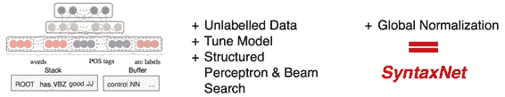
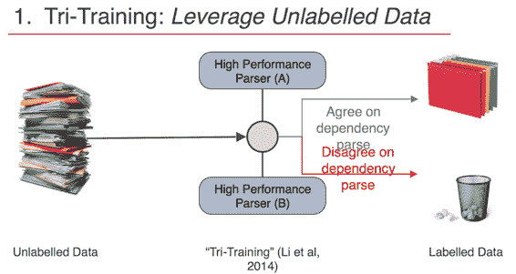
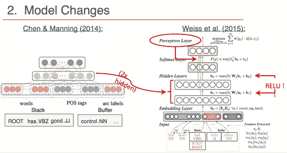
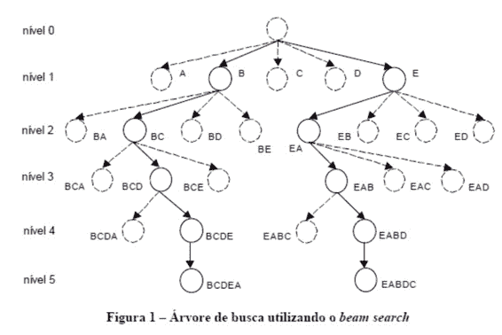
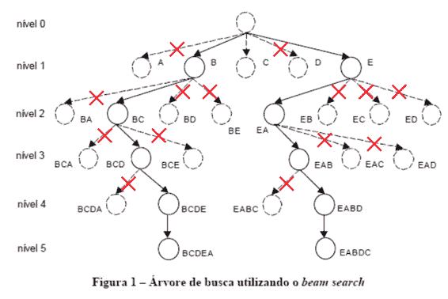
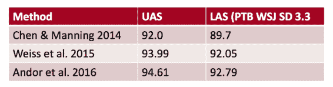

# CS224n 研究热点 6 基于转移的神经网络句法分析的结构化训练

介绍了依存句法分析最近的 3 次突破性工作。

## 什么是 SyntaxNet

这是谷歌在 16 年开源的“世界上最精准的开源句法分析器”，它基于 TF 来做句法分析，现在支持 40 种语言（不包含简体中文）。

这项工作在 Chen & Manning 的开山之作、Weiss et al 的工作上面做了一些改进：

## 3 项贡献

1.  利用未标注数据——“Tri-Training”

2.  神经网络调参

3.  最上层加了一层：结构化感知机与柱搜索

### 1 Tri-Training：利用未标注数据

其实就是两个模型分析同一个未标注句子，如果一致，则作为训练样本加入训练集中。利用得到的更大的训练集训练更精准的模型。

### 2 模型改进

在经典模型上做了如下三个改动：

1.  加了一个隐藏层

2.  激活函数（记得是立方函数）改为 ReLU

3.  最上层加了一层感知机

注意上图中感知机的输入来自从前面第一层隐藏层开始的每一层的输出。

### 3 结构化感知机训练与柱搜索

要解决的问题是：之前转移动作是贪心的决策，无法根据接下来的动作做全局（或较为全局）的决策，也无法撤销错误的决策。

解决办法：考虑接下来的决策，搜索整棵转移树：

具体做法是记录个得分最高的长度为的预测序列：

## 结论

用上了这 3 种改进之后，提高了 1 个百分点，然后 SyntaxNet 用 Global Normalization 替换了 Local Normalization 以解决标记偏置问题，这带来了 0.6 个百分点的提升。

 [知识共享署名-非商业性使用-相同方式共享](http://www.hankcs.com/license/)：[码农场](http://www.hankcs.com) » [CS224n 研究热点 6 基于转移的神经网络句法分析的结构化训练](http://www.hankcs.com/nlp/cs224n-syntaxnet.html)