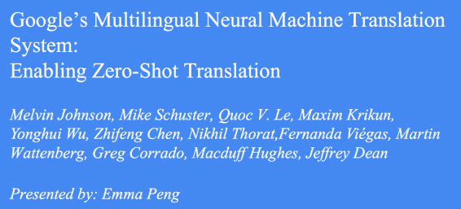
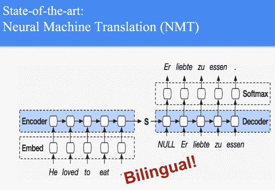
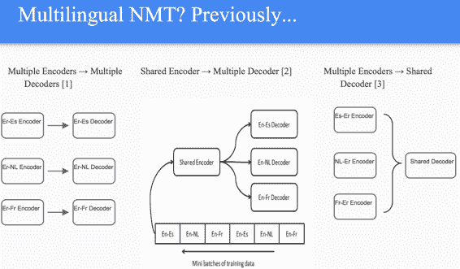
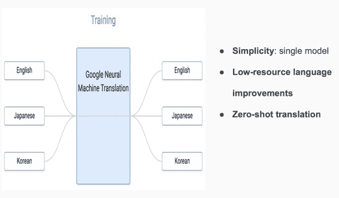
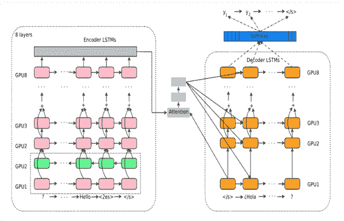
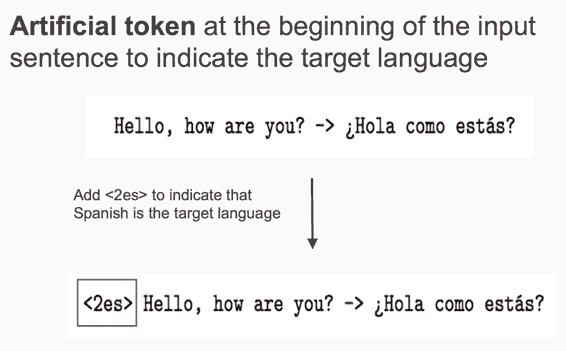
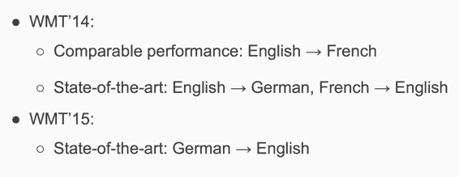
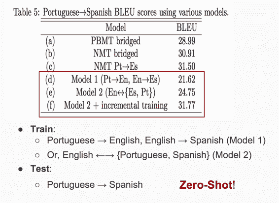

# CS224n 研究热点 8 谷歌的多语种神经网络翻译系统

## 双语 NMT

一般“瘦弱”的 NMT 系统只支持双语单向翻译，比如课上常见的这种：

如果想实现一个模型支持多语种互译怎么办呢？

## 土办法

之前的尝试是使用多对 encoder-decoder pair、一个 encoder 多个 decoder、多个 encoder 一个 decoder：

## Google 的多语种 NMT 系统

谷歌的 NMT 系统有什么不同呢？

*   单个统一的模型

*   通过对其他语种的学习可以大幅提升语料匮乏的语种的翻译效果

*   可以直接翻译训练语料中不存在的语种组合方式（通过葡萄牙语->芬兰语、芬兰语->英语学习葡萄牙语->英语的翻译）

### 架构

他们使用的架构与常见的 encoder-decoder 没有什么不同，其中 attention 会在接下来的课程中介绍。

聪明之处在于不修改网络架构，而是在输入数据上做手脚。

只需在输入平行语料 pair 中人工加入目标语种的标示符，就可以把所有语种的平行语料混合在一起训练了：

真聪明。

### 效果

### Zero-Shot Translation

啰嗦一下 Zero-Shot Translation 的细节。

在训练的时候只使用葡萄牙语到英语、英语到西班牙语的语料，就可以让模型学会葡萄牙语到西班牙语的翻译。而且效果可以与 phrase-based MT 相比。如果再加一点葡萄牙语到西班牙语的语料，该系统就可以击败上述所有模型。

 [知识共享署名-非商业性使用-相同方式共享](http://www.hankcs.com/license/)：[码农场](http://www.hankcs.com) » [CS224n 研究热点 8 谷歌的多语种神经网络翻译系统](http://www.hankcs.com/nlp/cs224n-google-nmt.html)