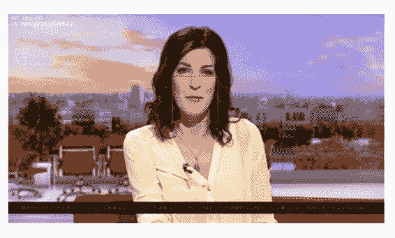
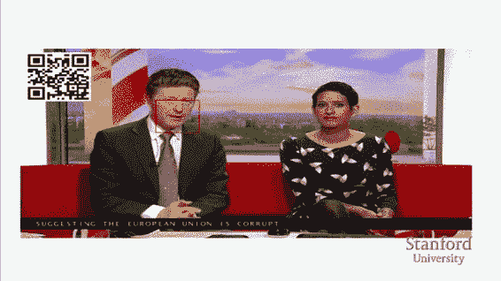

# CS224n 研究热点 9 读唇术

## 唇语翻译

将视频处理为以嘴唇为中心的图片序列，给或不给语音，预测正在讲的话。

这些数据可能来自新闻直播：

动画演示：

这里唇语和语音的识别、卡拉 OK 效果式的对齐，都是模型自动完成的。

## 架构

视觉和听觉两个模块或者混合交火或者单独使用，每次输出一个字母。

### 视觉

取嘴唇时序上的 sliding window，先喂给 CNN，再喂给 LSTM，生成一个 output vector：

### 听觉

类似地，取音频上的窗口分片：

### Attention 与 Spell

将上述两个 LSTM 输出的 output states 送入一个带两个 attention 拓展的 LSTM：

### Curriculum Learning

通常训练 seq2seq 模型时喂进去的是完整的句子，但 Curriculum Learning 的手法是，一次只喂几个单词，逐步增长。这样可以加快收敛速度，降低过拟合。

### Scheduled Sampling

通常训练递归模型的时候，使用的是前一个时刻的“标准答案”的 one-hot 向量，而这里根据前一个时刻的预测结果采样，让训练和测试统一起来。

## 数据集

来自 BBC 新闻的五千个小时的视频，对齐字幕，做了嘴唇位置等预处理。

## 结果

有趣之处在于，他们将模型效果与专业做唇语翻译的公司做了对比，发现比专业人士还要准，而且错误率低了 20 个百分点。（竟然还有公司专门做这个）

在同时输入语音和唇语的情况下，错误可以做到更低。

 [知识共享署名-非商业性使用-相同方式共享](http://www.hankcs.com/license/)：[码农场](http://www.hankcs.com) » [CS224n 研究热点 9 读唇术](http://www.hankcs.com/nlp/cs224n-lip-reading.html)