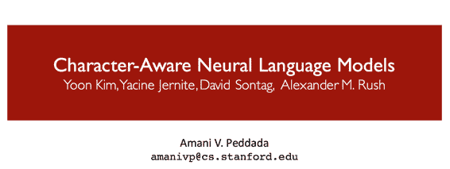
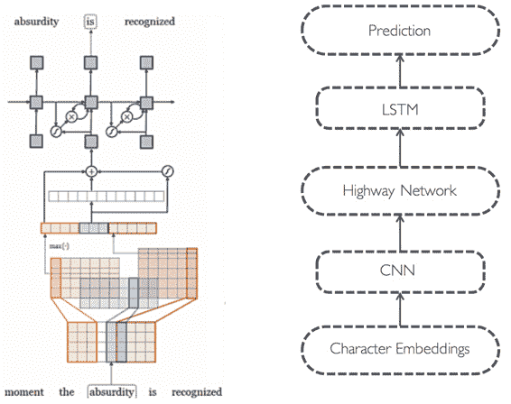
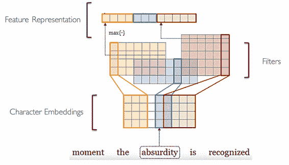
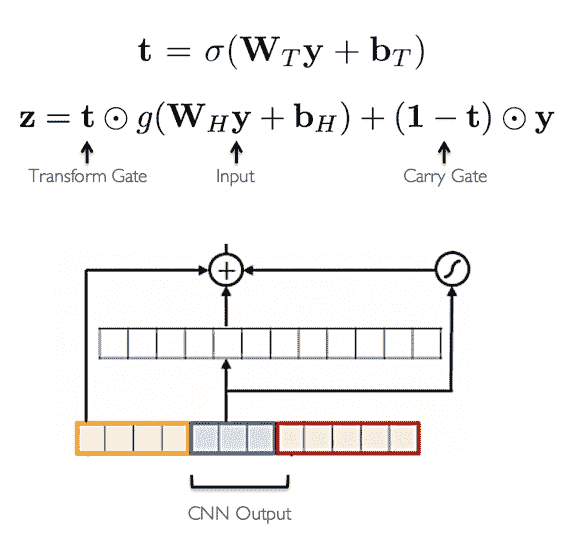
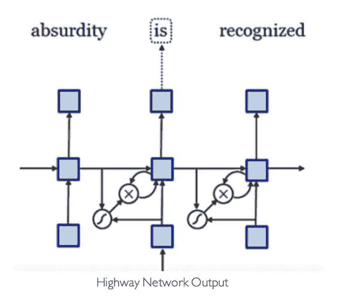
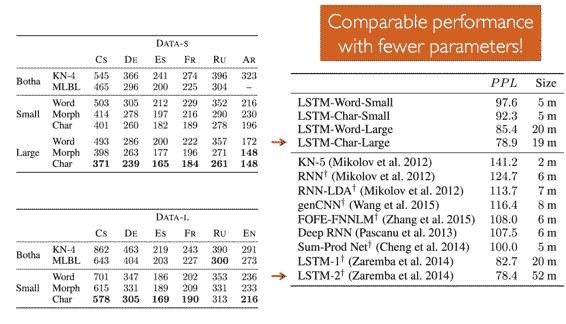
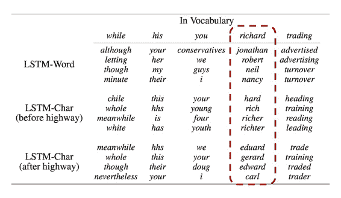
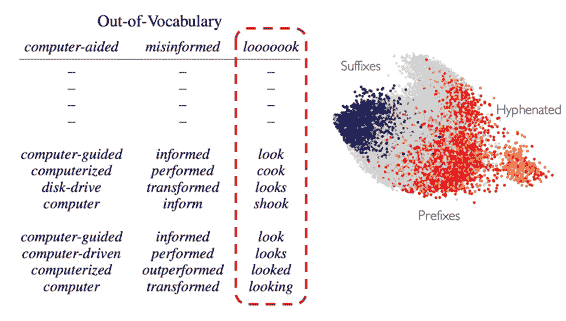

# CS224n 研究热点 10 Character-Aware 神经网络语言模型

## 动机

大多数神经网络语言模型其实并没有注意到结构类似的词语意义也类似这种语言现象，这使它们无法赋予低频词合适的表示。所以这个新模型的目标是：

*   编码词素相关性：eventful, eventfully, uneventful

*   解决低频词问题

*   用更少的参数得到 comparable 效果

## 架构

输入字符，但依然在词语级别做预测。

### 卷积层

读入字符的 embedding，做不同大小的卷积（捕捉不同的 ngram 与 subword），max 池化后得到特征向量。

### Highway Network

这种网络类似 LSTM 的 Memory Cell，对输入做一些变换，但同时保留原始信息。

### LSTM

将 Highway Network 的输出喂给 LSTM，应该类似 CBOW 预测中间词语：

## 量化结果

与最佳结果非常接近，但参数更少：

## 直观效果

可以捕捉构词类似的词语：

比如 Richard 这个名字含有 rich，hard，ar 等词素，在 highway 之前能关联到 hard、rich 这些词语上；highway 之后能关联到 Eduard、Carl 之类的名字上。不仅名字对名字，连发音、性别都有更大的相似性。

对于 OOV 的效果也是惊人地好：

## 结论

字符级别的 CNN+Highway Network 可以提取丰富的语义和结构信息。这个模型将其他网络当成积木一样，构建了更好的语言模型。

## 实现

[`github.com/mkroutikov/tf-lstm-char-cnn`](https://github.com/mkroutikov/tf-lstm-char-cnn) 

 [知识共享署名-非商业性使用-相同方式共享](http://www.hankcs.com/license/)：[码农场](http://www.hankcs.com) » [CS224n 研究热点 10 Character-Aware 神经网络语言模型](http://www.hankcs.com/nlp/cs224n-character-aware-neural-language-models.html)