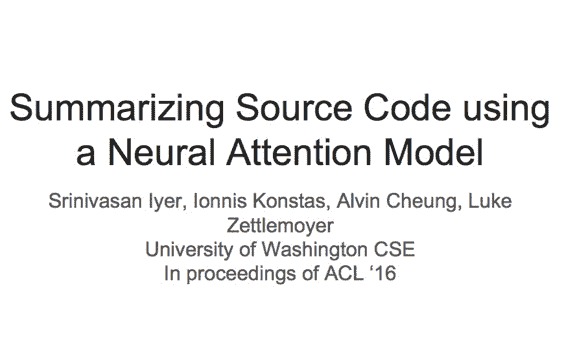
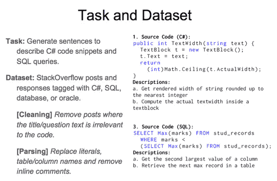
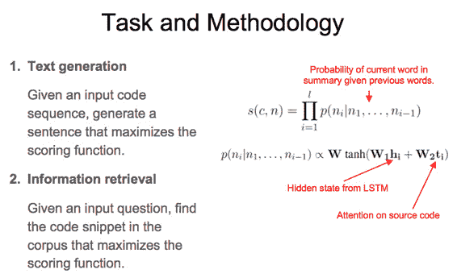
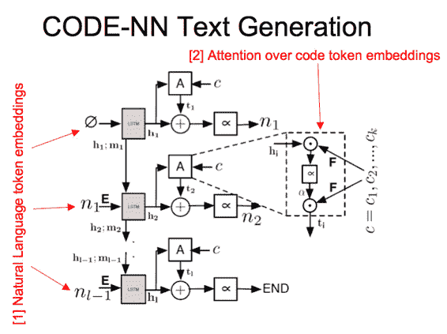
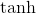
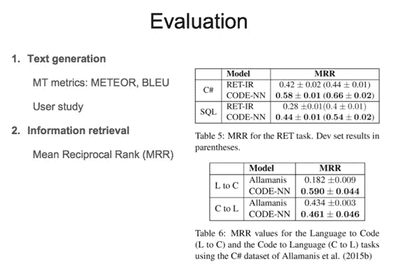
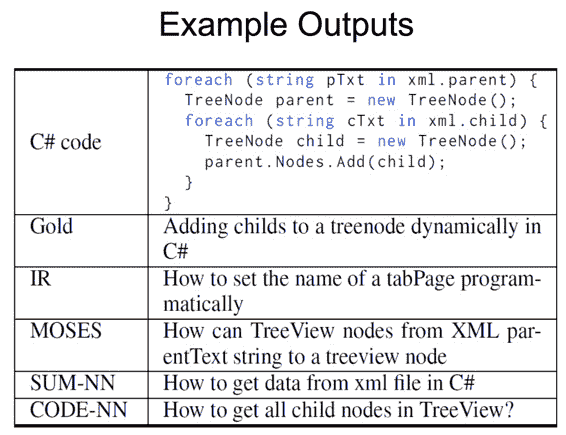
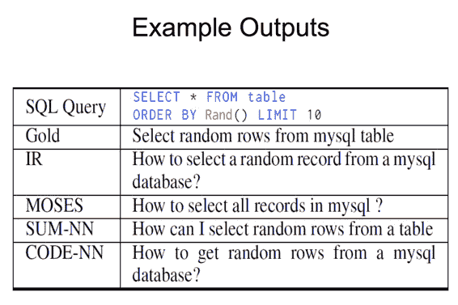

# CS224n 研究热点 12 神经网络自动代码摘要

## 任务与数据集 

自动生成 C＃和 SQL 代码的文档描述，数据集整理自 StackOverflow 上的提问。

### 子任务 

根据代码生成摘要，或根据问题检索代码。

## 网络架构 

一个 LSTM 处理已生成的文本 token，一个在整个代码 token 序列上做 attention 的单元，两者的输出求和，送入激活；得到 ngram 语言模型，预测下一个词语。

## 结果

### 量化评测

文本生成评测用到了 BLEU 等自动方法，以及人工评分，检索用到了 MRR，结果都比以前的工作要好。

### 直观效果

该模型知道代码在操作 TreeView，但没有捕捉到“add”这个动作。

对这段 SQL 代码的理解，模型是完全正确的。

 [知识共享署名-非商业性使用-相同方式共享](http://www.hankcs.com/license/)：[码农场](http://www.hankcs.com) » [CS224n 研究热点 12 神经网络自动代码摘要](http://www.hankcs.com/nlp/cs224n-summarizing-source-code.html)