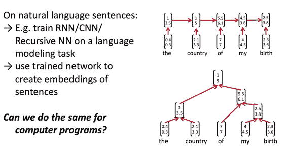

# CS224n 研究热点 13 学习代码的语义

在培训码农的时候，教师需要给学生批改代码、写反馈。学生太多时成为机械劳动，这篇论文研究自动编码程序的语义表示。数据集来自斯坦福开发的模拟操控机器人的语言。

## 表示代码 

希望得到代码的简洁表示、运行后会得到什么结果，哪怕它无法编译运行。

这门课上讲了很多编码表示句子的方法，RNN/CNN 等，是否可以活用到代码上？

## 编码解码状态

定义机器当前所处的状态为 precondition（P），代码执行后的状态为 postcondition（Q）。如果将代码每行下个断点，就会得到 precondition 与 postcondition 的 pair 序列。对此建模：

中间的矩阵是待学习的 embedding，期待它能捕捉到程序代码的语义。

## 目标函数

第一项衡量模型的预测能力，第二项希望模型能从 post-condition 重建 pre-condition。

## 利用 RecursiveNN 来生成程序 embeddings

对于复杂的循环，则无法用单个语句的 embedding 表示。程序语言已经有确定的语法树，刚好拿过来喂给 tree structure 的 RNN。

## 总结

利用 recursive neural nets 可以通过解决从 precondition 到 postcondition 的映射问题，来自动编码程序的语义。通过得到的代码表示，可以用于将学生聚类；于是可以给同一类别的学生相同的反馈，还可以追踪学生多次提交代码的进步。

## 未来工作

还有一些应用研究，预测某次代码提交后应该给提示还是教学视频或更多练习等等，甚至预测学生未来的成绩（让一些人早日从入门到放弃？）

 [知识共享署名-非商业性使用-相同方式共享](http://www.hankcs.com/license/)：[码农场](http://www.hankcs.com) » [CS224n 研究热点 13 学习代码的语义](http://www.hankcs.com/nlp/cs224n-program-embeddings.html)