# CS224n 研究热点 15 Neural Turing Machines

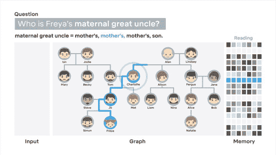    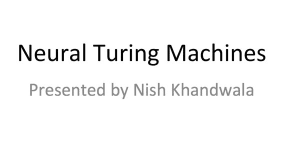

这次讲座覆盖了来自 DeepMind 的两篇论文：

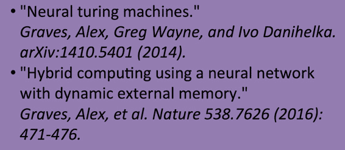

第二篇是第一篇的轻微改进，这里只关注抽象思想。

## 问题 

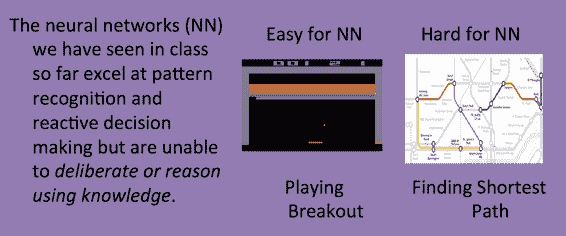

目前的神经网络擅长模式识别和动态决策，但无法使用知识进行深思或推断。比如明明可以胜任电子游戏这么复杂的问题，却无法完成最短路径这样的简单问题。

任何 DFS 算法变种都要储存当前访问过的节点，是否神经网络的问题出在记忆（或说内存）上呢？

## 记忆是解决方案吗

可是 LSTM 不是已经有 Memory 吗？事实上那只能叫 cache，不能叫 RAM。

## Neural Turing Machines

这种模型引入了可长期持续、随机读写的 RAM：

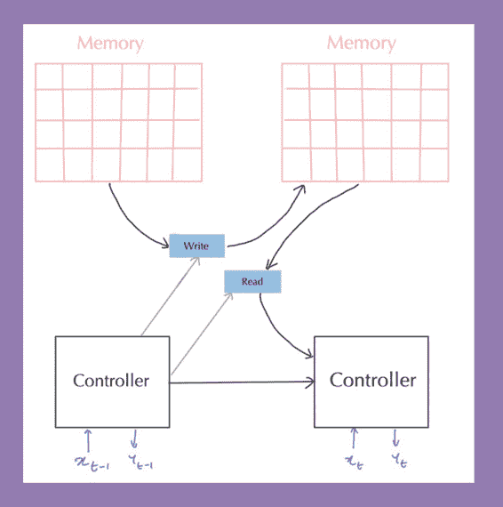

由 RNN 充当 controller 的角色：

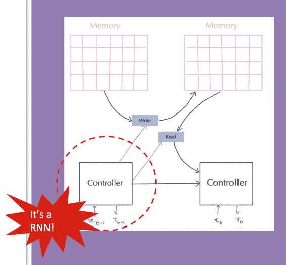

决定何时读写哪一部分：

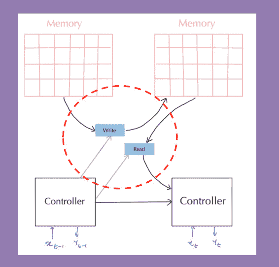

## 如何读写

如果你曾经上过计算机体系课，你就会明白内存是离散的结构，无法关于要读写的地址求导，自然无法利用反向传播优化。

解决方法是对所有地址进行不同的连续的程度读写，比如 attention 机制。

### 读内存

就是 attention 向量与 memory 矩阵的乘积：

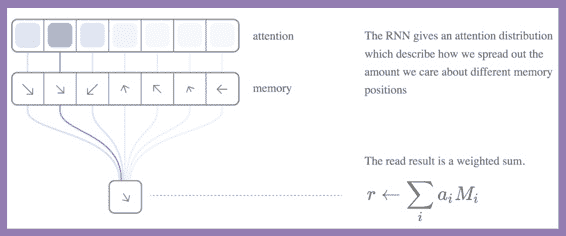

### 写内存

类似地，将要写入的值利用 attention 得到向量，写入内存的所有位置：

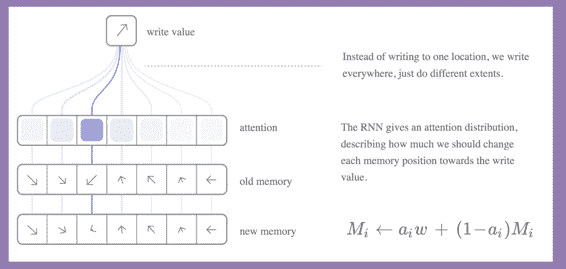

这种更新也有点像 GRU。

## attention 更新

如何得到正确的 attention 向量呢？

### 第一步

RNN controller 生成 query vector，与 memory 的每个地址做点积，得到一个强度向量，softmax 一下得到 attention 向量：

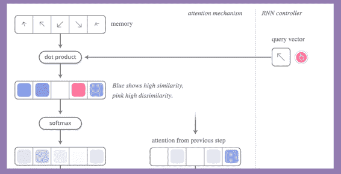

### 第二步

与前一个 attention vector 做混合：

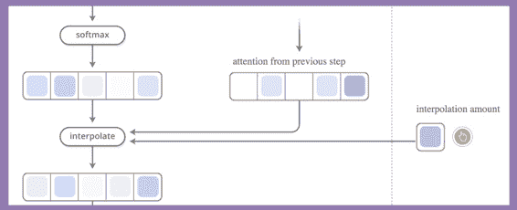

### 第三步

shift filter（允许读取 attention 集中注意的地址的邻居）一下，sharpen（锐化，使强者越强）得到最终 attention 分布，用于读写：

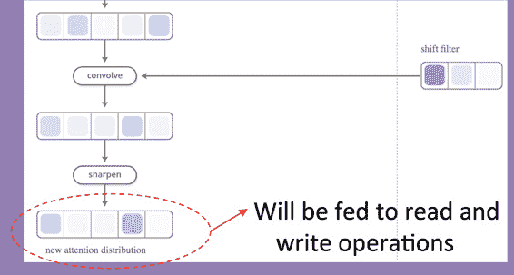

## 效果

可以在家谱知识库上做准确的推断：

## References

[`deepmind.com/blog/differentiable-neural-computers/`](https://deepmind.com/blog/differentiable-neural-computers/) 

 [知识共享署名-非商业性使用-相同方式共享](http://www.hankcs.com/license/)：[码农场](http://www.hankcs.com) » [CS224n 研究热点 15 Neural Turing Machines](http://www.hankcs.com/nlp/cs224n-neural-turing-machines.html)