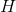
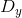

# CS224n Assignment 1

这是 LaTex 答案，Python 代码开源在[GitHub](https://github.com/hankcs/CS224n)上。先进行大量的 SG、CBOW、负采样、交叉熵损失函数推导和证明，理论基础扎实后平滑过渡到实现；在斯坦福情感树库上做情感分析、调参、分析混淆矩阵与错误。

以前看不懂公式，总觉得代码是最重要的；现在觉得代码无关紧要了。

另需注意，公式中的向量是列向量，而代码中的向量是行向量（效率更高）。

## 1：Softmax

### a softmax 常数不变性

证明 softmax 不受输入的常数偏移影响，即


解答：


### b Python 实现

利用上述的公式实现优化版的 softmax，要求既能处理向量，也能处理矩阵（视作多个不相干的行向量集合）。

```py
def softmax(x):
    """Compute the softmax function for each row of the input x.
    It is crucial that this function is optimized for speed because
    it will be used frequently in later code. You might find numpy
    functions np.exp, np.sum, np.reshape, np.max, and numpy
    broadcasting useful for this task.
    Numpy broadcasting documentation:
    http://docs.scipy.org/doc/numpy/user/basics.broadcasting.html
    You should also make sure that your code works for a single
    N-dimensional vector (treat the vector as a single row) and
    for M x N matrices. This may be useful for testing later. Also,
    make sure that the dimensions of the output match the input.
    You must implement the optimization in problem 1(a) of the
    written assignment!
    Arguments:
    x -- A N dimensional vector or M x N dimensional numpy matrix.
    Return:
    x -- You are allowed to modify x in-place
    """
    orig_shape = x.shape
    if len(x.shape) > 1:
        # Matrix
        ### YOUR CODE HERE
        exp_minmax = lambda x: np.exp(x - np.max(x))
        denom = lambda x: 1.0 / np.sum(x)
        x = np.apply_along_axis(exp_minmax, 1, x)
        denominator = np.apply_along_axis(denom, 1, x)
        if len(denominator.shape) == 1:
            denominator = denominator.reshape((denominator.shape[0], 1))
        x = x * denominator
        ### END YOUR CODE
    else:
        # Vector
        ### YOUR CODE HERE
        x_max = np.max(x)
        x = x - x_max
        numerator = np.exp(x)
        denominator = 1.0 / np.sum(numerator)
        x = numerator.dot(denominator)
        ### END YOUR CODE
    assert x.shape == orig_shape
    return x
```

为什么要费力气减掉一个最大值常量呢？参考：[《计算指数函数的和的对数》](http://www.hankcs.com/ml/computing-log-sum-exp.html)。

## 2：神经网络基础

### a sigmoid 梯度

很简单的推导：


### b 交叉熵损失函数的梯度

请推导交叉熵损失函数关于 softmax 输入  的梯度，记假设函数为 


交叉熵损失函数为：


其中是 one-hot 向量，是概率向量。

解答：

记为 softmax 函数，引入下列记号：


这里的下标表示取标量分别求导，当时:


当时：


接下来正式推导：


由于概率归一化:


### c 推导三层网络的梯度


损失函数，求 ，可使用的符号有：


记 ， ；


### d 参数数量

对于上述神经网络，一共有多少个参数。假设输入维度是，隐藏单元数为，输出维度为。

解答：


### e 实现 sigmoid 函数

太简单了：

```py
def sigmoid(x):
    """
    Compute the sigmoid function for the input here.
    Arguments:
    x -- A scalar or numpy array.
    Return:
    s -- sigmoid(x)
    """
    ### YOUR CODE HERE
    s = 1.0 / (1 + np.exp(-x))
    ### END YOUR CODE
    return s
def sigmoid_grad(s):
    """
    Compute the gradient for the sigmoid function here. Note that
    for this implementation, the input s should be the sigmoid
    function value of your original input x.
    Arguments:
    s -- A scalar or numpy array.
    Return:
    ds -- Your computed gradient.
    """
    ### YOUR CODE HERE
    ds = s * (1 - s)
    ### END YOUR CODE
    return ds
```

### f 实现梯度检查

关于梯度检查的原理参考 CS229：[`www.hankcs.com/ml/neural-networks-learning-cs229.html#h3-7`](http://www.hankcs.com/ml/neural-networks-learning-cs229.html#h3-7)

实现如下：

```py
def gradcheck_naive(f, x):
    """ Gradient check for a function f.
    Arguments:
    f -- a function that takes a single argument and outputs the
         cost and its gradients
    x -- the point (numpy array) to check the gradient at
    """
    rndstate = random.getstate()
    random.setstate(rndstate)
    fx, grad = f(x) # Evaluate function value at original point
    h = 1e-4        # Do not change this!
    # Iterate over all indexes in x
    it = np.nditer(x, flags=['multi_index'], op_flags=['readwrite'])
    while not it.finished:
        ix = it.multi_index
        # Try modifying x[ix] with h defined above to compute
        # numerical gradients. Make sure you call random.setstate(rndstate)
        # before calling f(x) each time. This will make it possible
        # to test cost functions with built in randomness later.
        ### YOUR CODE HERE:
        x[ix] += h
        random.setstate(rndstate)
        new_f1 = f(x)[0]
        x[ix] -= 2*h
        random.setstate(rndstate)
        new_f2 = f(x)[0]
        x[ix] += h
        numgrad = (new_f1 - new_f2) / (2 * h)
        ### END YOUR CODE
        # Compare gradients
        reldiff = abs(numgrad - grad[ix]) / max(1, abs(numgrad), abs(grad[ix]))
        if reldiff > 1e-5:
            print "Gradient check failed."
            print "First gradient error found at index %s" % str(ix)
            print "Your gradient: %f \t Numerical gradient: %f" % (
                grad[ix], numgrad)
            return
        it.iternext() # Step to next dimension
    print "Gradient check passed!"
```

### g 实现前向传播和反向传播

```py
def forward_backward_prop(data, labels, params, dimensions):
    """
    Forward and backward propagation for a two-layer sigmoidal network
    Compute the forward propagation and for the cross entropy cost,
    and backward propagation for the gradients for all parameters.
    Arguments:
    data -- M x Dx matrix, where each row is a training example.
    labels -- M x Dy matrix, where each row is a one-hot vector.
    params -- Model parameters, these are unpacked for you.
    dimensions -- A tuple of input dimension, number of hidden units
                  and output dimension
    """
    ### Unpack network parameters (do not modify)
    ofs = 0
    Dx, H, Dy = (dimensions[0], dimensions[1], dimensions[2])
    W1 = np.reshape(params[ofs:ofs+ Dx * H], (Dx, H))
    ofs += Dx * H
    b1 = np.reshape(params[ofs:ofs + H], (1, H))
    ofs += H
    W2 = np.reshape(params[ofs:ofs + H * Dy], (H, Dy))
    ofs += H * Dy
    b2 = np.reshape(params[ofs:ofs + Dy], (1, Dy))
    ### YOUR CODE HERE: forward propagation
    h = sigmoid(np.dot(data,W1) + b1)
    yhat = softmax(np.dot(h,W2) + b2)
    ### END YOUR CODE
    ### YOUR CODE HERE: backward propagation
    cost = np.sum(-np.log(yhat[labels==1])) / data.shape[0]
    d3 = (yhat - labels) / data.shape[0]
    gradW2 = np.dot(h.T, d3)
    gradb2 = np.sum(d3,0,keepdims=True)
    dh = np.dot(d3,W2.T)
    grad_h = sigmoid_grad(h) * dh
    gradW1 = np.dot(data.T,grad_h)
    gradb1 = np.sum(grad_h,0)
    ### END YOUR CODE
    ### Stack gradients (do not modify)
    grad = np.concatenate((gradW1.flatten(), gradb1.flatten(),
        gradW2.flatten(), gradb2.flatten()))
    return cost, grad
```

 [知识共享署名-非商业性使用-相同方式共享](http://www.hankcs.com/license/)：[码农场](http://www.hankcs.com) » [CS224n Assignment 1](http://www.hankcs.com/nlp/cs224n-assignment-1.html)