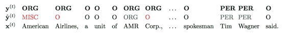
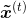
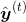

# CS224n Assignment 3

命名实体识别任务，先实现基于窗口的基线模型，然后进阶到 RNN 和 GRU。中间利用对自动机的模拟和推导展示 RNN 的缺点，演示梯度剪裁的作用。这是 Latex 解答，[代码已提交](https://github.com/hankcs/CS224n)，最后还有一个彩蛋。

## 命名实体识别初步

定位命名实体并将其分类到：

*   人名 PER

*   组织名 ORG

*   地名 LOC

*   其他 MISC

加上非命名实体 O 一共 5 类。连续的标注视为同一个实体。比如样本与标注以及预测结果：



系统一共识别出 3 个命名实体，在 token 级别和 entity 级别各有评测方法。

token 级别

*   P 值为预测出的正确非 O 标签比上预测出的全部非 O 标签，于是

*   R 值为预测出的正确非 O 标签比上正确答案的全部非 O 标签，于是

*   值是两者的调和平均：

entity 级别

*   P 值为完美（不残缺不多余）识别的实体数量比上预测出的所有实体数量，于是

*   R 值为完美识别的实体数量比上正确答案中的实体数量，于是

*   值是两者的调和平均：

## 1 A window into NER

基线模型使用半径窗口中的特征预测 ：


模型为一个以 ReLU 为激活函数的隐藏层的神经网络，输出层为 softmax，损失函数为交叉熵：


其中是词嵌入， 维度为 ， 维度 , 是词表大小， 是词嵌入维度，是隐藏层维度，是分类数目（此处为 5）。

### a 概念

请列举有歧义的命名实体？

太多了：

方地/nr, 的/ude1, 茶/n, 喝/vg, 个/q, 一罐/mq


通常命名实体中含有低频词，为了泛化必须引入除了字符之外的特征，比如词性。这次作业为了简单，只使用字符特征。

### b 维度和复杂度

如果窗口大小为，则窗口特征的维度是的行向量。是的矩阵。是的矩阵。

对长的句子来讲，计算复杂度是，这是因为从输入到隐藏层是计算瓶颈。

### c 实现基线模型

就贴个最重要的 predict 方法吧：

```py
def add_prediction_op(self):
    """Adds the 1-hidden-layer NN:
        h = Relu(xW + b1)
        h_drop = Dropout(h, dropout_rate)
        pred = h_dropU + b2
    Recall that we are not applying a softmax to pred. The softmax will instead be done in
    the add_loss_op function, which improves efficiency because we can use
    tf.nn.softmax_cross_entropy_with_logits
    When creating a new variable, use the tf.get_variable function
    because it lets us specify an initializer.
    Use tf.contrib.layers.xavier_initializer to initialize matrices.
    This is TensorFlow's implementation of the Xavier initialization
    trick we used in last assignment.
    Note: tf.nn.dropout takes the keep probability (1 - p_drop) as an argument.
        The keep probability should be set to the value of dropout_rate.
    Returns:
        pred: tf.Tensor of shape (batch_size, n_classes)
    """
    x = self.add_embedding()
    dropout_rate = self.dropout_placeholder
    ### YOUR CODE HERE (~10-20 lines)
    b1 = tf.get_variable(name='b1', shape = [self.config.hidden_size,], \
                         initializer=tf.contrib.layers.xavier_initializer(seed=1))
    b2 = tf.get_variable(name='b2', shape = [self.config.n_classes], \
                         initializer=tf.contrib.layers.xavier_initializer(seed=2))
    W = tf.get_variable(name='W', shape = [self.config.n_window_features * self.config.embed_size, self.config.hidden_size], \
                        initializer=tf.contrib.layers.xavier_initializer(seed=3))
    U = tf.get_variable(name='U', shape = [self.config.hidden_size, self.config.n_classes], \
                        initializer=tf.contrib.layers.xavier_initializer(seed=4))
    z1 = tf.matmul(x,W) + b1
    h = tf.nn.relu(z1)
    h_drop = tf.nn.dropout(h, dropout_rate)
    pred = tf.matmul(h_drop,U) + b2
    ### END YOUR CODE
    return pred
```

### d 分析结果

```py
DEBUG:Token-level confusion matrix:
go\gu   PER     ORG     LOC     MISC    O    
PER     2968    26      84      16      55   
ORG     147     1621    131     65      128  
LOC     48      88      1896    26      36   
MISC    37      40      54      1030    107  
O       42      46      18      39      42614
DEBUG:Token-level scores:
label   acc     prec    rec     f1   
PER     0.99    0.92    0.94    0.93 
ORG     0.99    0.89    0.77    0.83 
LOC     0.99    0.87    0.91    0.89 
MISC    0.99    0.88    0.81    0.84 
O       0.99    0.99    1.00    0.99 
micro   0.99    0.98    0.98    0.98 
macro   0.99    0.91    0.89    0.90 
not-O   0.99    0.89    0.87    0.88 
INFO:Entity level P/R/F1: 0.82/0.85/0.84
```

最拖后腿的是机构名识别，经常误识别为人名或非 NER。

由于窗口的限制，模型不擅长做完整连续的识别，如果增大窗口则会有所进步。

窗口=2

```py
DEBUG:Token-level confusion matrix:
go\gu   PER     ORG     LOC     MISC    O    
PER     2995    23      50      10      71   
ORG     148     1679    96      52      117  
LOC     54      65      1910    24      41   
MISC    40      51      48      1029    100  
O       34      42      25      29      42629
DEBUG:Token-level scores:
label   acc     prec    rec     f1   
PER     0.99    0.92    0.95    0.93 
ORG     0.99    0.90    0.80    0.85 
LOC     0.99    0.90    0.91    0.90 
MISC    0.99    0.90    0.81    0.85 
O       0.99    0.99    1.00    0.99 
micro   0.99    0.98    0.98    0.98 
macro   0.99    0.92    0.89    0.91 
not-O   0.99    0.91    0.88    0.90 
INFO:Entity level P/R/F1: 0.85/0.87/0.86
```

 [知识共享署名-非商业性使用-相同方式共享](http://www.hankcs.com/license/)：[码农场](http://www.hankcs.com) » [CS224n Assignment 3](http://www.hankcs.com/nlp/ner/cs224n-assignment-3.html)