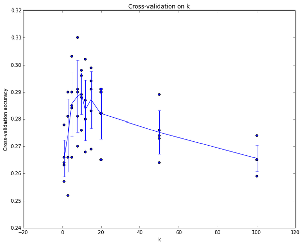
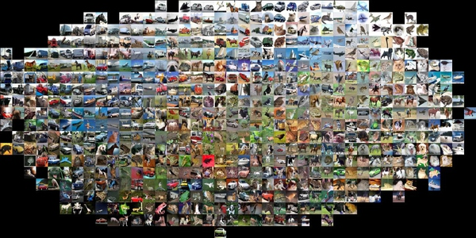

# CS231n 课程笔记翻译：图像分类笔记（下）

> 来源：[`zhuanlan.zhihu.com/p/20870307`](https://zhuanlan.zhihu.com/p/20900216)

译者注：本文[智能单元](https://zhuanlan.zhihu.com/intelligentunit)首发，翻译自斯坦福 CS231n 课程笔记[image classification notes](https://link.zhihu.com/?target=http%3A//cs231n.github.io/classification)*，课程教师[Andrej Karpathy](https://link.zhihu.com/?target=http%3A//cs.stanford.edu/people/karpathy/)*授权翻译。本篇教程由[杜客](https://www.zhihu.com/people/du-ke)进行翻译，[ShiqingFan](https://www.zhihu.com/people/sqfan)和[巩子嘉](https://www.zhihu.com/people/gong-zi-jia-57)进行校对修改。译文含公式和代码，建议 PC 端阅读。

点击[查看图像分类笔记（上）](https://zhuanlan.zhihu.com/p/20894041?refer=intelligentunit)。

## 内容列表

*   图像分类、数据驱动方法和流程

*   Nearest Neighbor 分类器

*   k-Nearest Neighbor

*   验证集、交叉验证集和超参数调优 ***译者注：下篇翻译起始处***

*   Nearest Neighbor 的优劣

*   小结

*   小结：应用 kNN 实践

*   拓展阅读

## 用于超参数调优的验证集

k-NN 分类器需要设定 k 值，那么选择哪个 k 值最合适的呢？我们可以选择不同的距离函数，比如 L1 范数和 L2 范数等，那么选哪个好？还有不少选择我们甚至连考虑都没有考虑到（比如：点积）。所有这些选择，被称为**超参数（hyperparameter）**。在基于数据进行学习的机器学习算法设计中，超参数是很常见的。一般说来，这些超参数具体怎么设置或取值并不是显而易见的。

你可能会建议尝试不同的值，看哪个值表现最好就选哪个。好主意！我们就是这么做的，但这样做的时候要非常细心。特别注意：**决不能使用测试集来进行调优**。当你在设计机器学习算法的时候，应该把测试集看做非常珍贵的资源，不到最后一步，绝不使用它。如果你使用测试集来调优，而且算法看起来效果不错，那么真正的危险在于：算法实际部署后，性能可能会远低于预期。这种情况，称之为算法对测试集**过拟合**。从另一个角度来说，如果使用测试集来调优，实际上就是把测试集当做训练集，由测试集训练出来的算法再跑测试集，自然性能看起来会很好。这其实是过于乐观了，实际部署起来效果就会差很多。所以，最终测试的时候再使用测试集，可以很好地近似度量你所设计的分类器的泛化性能（在接下来的课程中会有很多关于泛化性能的讨论）。

> 测试数据集只使用一次，即在训练完成后评价最终的模型时使用。

好在我们有不用测试集调优的方法。其思路是：从训练集中取出一部分数据用来调优，我们称之为**验证集（****validation set****）**。以 CIFAR-10 为例，我们可以用 49000 个图像作为训练集，用 1000 个图像作为验证集。验证集其实就是作为假的测试集来调优。下面就是代码：

```py
# assume we have Xtr_rows, Ytr, Xte_rows, Yte as before
# recall Xtr_rows is 50,000 x 3072 matrix
Xval_rows = Xtr_rows[:1000, :] # take first 1000 for validation
Yval = Ytr[:1000]
Xtr_rows = Xtr_rows[1000:, :] # keep last 49,000 for train
Ytr = Ytr[1000:]

# find hyperparameters that work best on the validation set
validation_accuracies = []
for k in [1, 3, 5, 10, 20, 50, 100]:

  # use a particular value of k and evaluation on validation data
  nn = NearestNeighbor()
  nn.train(Xtr_rows, Ytr)
  # here we assume a modified NearestNeighbor class that can take a k as input
  Yval_predict = nn.predict(Xval_rows, k = k)
  acc = np.mean(Yval_predict == Yval)
  print 'accuracy: %f' % (acc,)

  # keep track of what works on the validation set
  validation_accuracies.append((k, acc)) 
```

程序结束后，我们会作图分析出哪个 k 值表现最好，然后用这个 k 值来跑真正的测试集，并作出对算法的评价。

> 把训练集分成训练集和验证集。使用验证集来对所有超参数调优。最后只在测试集上跑一次并报告结果。

**交叉验证**。有时候，训练集数量较小（因此验证集的数量更小），人们会使用一种被称为**交叉验证**的方法，这种方法更加复杂些。还是用刚才的例子，如果是交叉验证集，我们就不是取 1000 个图像，而是将训练集平均分成 5 份，其中 4 份用来训练，1 份用来验证。然后我们循环着取其中 4 份来训练，其中 1 份来验证，最后取所有 5 次验证结果的平均值作为算法验证结果。

—————————————————————————————————————————

这就是 5 份交叉验证对 k 值调优的例子。针对每个 k 值，得到 5 个准确率结果，取其平均值，然后对不同 k 值的平均表现画线连接。本例中，当 k=7 的时算法表现最好（对应图中的准确率峰值）。如果我们将训练集分成更多份数，直线一般会更加平滑（噪音更少）。

—————————————————————————————————————————

**实际应用**。在实际情况下，人们不是很喜欢用交叉验证，主要是因为它会耗费较多的计算资源。一般直接把训练集按照 50%-90%的比例分成训练集和验证集。但这也是根据具体情况来定的：如果超参数数量多，你可能就想用更大的验证集，而验证集的数量不够，那么最好还是用交叉验证吧。至于分成几份比较好，一般都是分成 3、5 和 10 份。

—————————————————————————————————————————

常用的数据分割模式。给出训练集和测试集后，训练集一般会被均分。这里是分成 5 份。前面 4 份用来训练，黄色那份用作验证集调优。如果采取交叉验证，那就各份轮流作为验证集。最后模型训练完毕，超参数都定好了，让模型跑一次（而且只跑一次）测试集，以此测试结果评价算法。

—————————————————————————————————————————

## Nearest Neighbor 分类器的优劣

现在对 Nearest Neighbor 分类器的优缺点进行思考。首先，Nearest Neighbor 分类器易于理解，实现简单。其次，算法的训练不需要花时间，因为其训练过程只是将训练集数据存储起来。然而测试要花费大量时间计算，因为每个测试图像需要和所有存储的训练图像进行比较，这显然是一个缺点。在实际应用中，我们关注测试效率远远高于训练效率。其实，我们后续要学习的卷积神经网络在这个权衡上走到了另一个极端：虽然训练花费很多时间，但是一旦训练完成，对新的测试数据进行分类非常快。这样的模式就符合实际使用需求。

Nearest Neighbor 分类器的计算复杂度研究是一个活跃的研究领域，若干**Approximate Nearest Neighbor** (ANN)算法和库的使用可以提升 Nearest Neighbor 分类器在数据上的计算速度（比如：[FLANN](https://link.zhihu.com/?target=http%3A//www.cs.ubc.ca/research/flann/)*）。这些算法可以在准确率和时空复杂度之间进行权衡，并通常依赖一个预处理/索引过程，这个过程中一般包含 kd 树的创建和 k-means 算法的运用。*

 *Nearest Neighbor 分类器在某些特定情况（比如数据维度较低）下，可能是不错的选择。但是在实际的图像分类工作中，很少使用。因为图像都是高维度数据（他们通常包含很多像素），而高维度向量之间的距离通常是反直觉的。下面的图片展示了基于像素的相似和基于感官的相似是有很大不同的：

—————————————————————————————————————————

在高维度数据上，基于像素的的距离和感官上的非常不同。上图中，右边 3 张图片和左边第 1 张原始图片的 L2 距离是一样的。很显然，基于像素比较的相似和感官上以及语义上的相似是不同的。

—————————————————————————————————————————

这里还有个视觉化证据，可以证明使用像素差异来比较图像是不够的。z 这是一个叫做[t-SNE](https://link.zhihu.com/?target=http%3A//lvdmaaten.github.io/tsne/)*的可视化技术，它将 CIFAR-10 中的图片按照二维方式排布，这样能很好展示图片之间的像素差异值。在这张图片中，排列相邻的图片 L2 距离就小。* 

 *—————————————————————————————————————————

上图使用 t-SNE 的可视化技术将 CIFAR-10 的图片进行了二维排列。排列相近的图片 L2 距离小。可以看出，图片的排列是被背景主导而不是图片语义内容本身主导。

——————————————————————————————————————————

具体说来，这些图片的排布更像是一种颜色分布函数，或者说是基于背景的，而不是图片的语义主体。比如，狗的图片可能和青蛙的图片非常接近，这是因为两张图片都是白色背景。从理想效果上来说，我们肯定是希望同类的图片能够聚集在一起，而不被背景或其他不相关因素干扰。为了达到这个目的，我们不能止步于原始像素比较，得继续前进。

## 小结

简要说来：

*   介绍了**图像分类**问题。在该问题中，给出一个由被标注了分类标签的图像组成的集合，要求算法能预测没有标签的图像的分类标签，并根据算法预测准确率进行评价。
*   介绍了一个简单的图像分类器：**最近邻分类器(Nearest Neighbor classifier)**。分类器中存在不同的超参数(比如 k 值或距离类型的选取)，要想选取好的超参数不是一件轻而易举的事。
*   选取超参数的正确方法是：将原始训练集分为训练集和**验证集**，我们在验证集上尝试不同的超参数，最后保留表现最好那个。
*   如果训练数据量不够，使用**交叉验证**方法，它能帮助我们在选取最优超参数的时候减少噪音。
*   一旦找到最优的超参数，就让算法以该参数在测试集跑且只跑一次，并根据测试结果评价算法。
*   最近邻分类器能够在 CIFAR-10 上得到将近 40%的准确率。该算法简单易实现，但需要存储所有训练数据，并且在测试的时候过于耗费计算能力。
*   最后，我们知道了仅仅使用 L1 和 L2 范数来进行像素比较是不够的，图像更多的是按照背景和颜色被分类，而不是语义主体分身。

在接下来的课程中，我们将专注于解决这些问题和挑战，并最终能够得到超过 90%准确率的解决方案。该方案能够在完成学习就丢掉训练集，并在一毫秒之内就完成一张图片的分类。

## 小结：实际应用 k-NN

如果你希望将 k-NN 分类器用到实处（最好别用到图像上，若是仅仅作为练手还可以接受），那么可以按照以下流程：

1.  预处理你的数据：对你数据中的特征进行归一化（normalize），让其具有零平均值（zero mean）和单位方差（unit variance）。在后面的小节我们会讨论这些细节。本小节不讨论，是因为图像中的像素都是同质的，不会表现出较大的差异分布，也就不需要标准化处理了。
2.  如果数据是高维数据，考虑使用降维方法，比如 PCA([wiki ref](https://link.zhihu.com/?target=http%3A//en.wikipedia.org/wiki/Principal_component_analysis)*, [CS229ref](https://link.zhihu.com/?target=http%3A//cs229.stanford.edu/notes/cs229-notes10.pdf)*, [blog ref](https://link.zhihu.com/?target=http%3A//www.bigdataexaminer.com/understanding-dimensionality-reduction-principal-component-analysis-and-singular-value-decomposition/)*)或[随机投影](https://link.zhihu.com/?target=http%3A//scikit-learn.org/stable/modules/random_projection.html)*。****
****   将数据随机分入训练集和验证集。按照一般规律，70%-90% 数据作为训练集。这个比例根据算法中有多少超参数，以及这些超参数对于算法的预期影响来决定。如果需要预测的超参数很多，那么就应该使用更大的验证集来有效地估计它们。如果担心验证集数量不够，那么就尝试交叉验证方法。如果计算资源足够，使用交叉验证总是更加安全的（份数越多，效果越好，也更耗费计算资源）。*   在验证集上调优，尝试足够多的 k 值，尝试 L1 和 L2 两种范数计算方式。*   如果分类器跑得太慢，尝试使用 Approximate Nearest Neighbor 库（比如[FLANN](https://link.zhihu.com/?target=http%3A//www.cs.ubc.ca/research/flann/)*）来加速这个过程，其代价是降低一些准确率。***   对最优的超参数做记录。记录最优参数后，是否应该让使用最优参数的算法在完整的训练集上运行并再次训练呢？因为如果把验证集重新放回到训练集中（自然训练集的数据量就又变大了），有可能最优参数又会有所变化。在实践中，**不要这样做**。千万不要在最终的分类器中使用验证集数据，这样做会破坏对于最优参数的估计。**直接使用测试集来测试用最优参数设置好的最优模型**，得到测试集数据的分类准确率，并以此作为你的 kNN 分类器在该数据上的性能表现。****

## 拓展阅读

下面是一些你可能感兴趣的拓展阅读链接：

*   [A Few Useful Things to Know about Machine Learning](https://link.zhihu.com/?target=http%3A//homes.cs.washington.edu/%257Epedrod/papers/cacm12.pdf)*，文中第 6 节与本节相关，但是整篇文章都强烈推荐。* 
**   [Recognizing and Learning Object Categories](https://link.zhihu.com/?target=http%3A//people.csail.mit.edu/torralba/shortCourseRLOC/index.html)*，ICCV 2005 上的一节关于物体分类的课程。** 

 ****图像分类笔记全文翻译完毕**。

## 译者反馈

1.  感谢知友们鼓励支持。力争信达雅，敬请批评指正；

2.  得知友厚爱而飘飘然。向英语专业的妹纸炫耀，被批翻译腔，力戒之；
3.  感谢知友[曾家建](https://www.zhihu.com/people/ceng-jia-jian-28)的仔细阅读和批评指正。*********