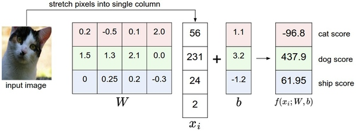
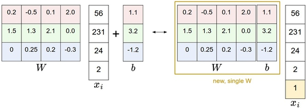

# CS231n 课程笔记翻译：线性分类笔记（上）

> 来源：[`zhuanlan.zhihu.com/p/20870307`](https://zhuanlan.zhihu.com/p/20918580)

**译者注**：本文[智能单元](https://zhuanlan.zhihu.com/intelligentunit)首发，译自斯坦福 CS231n 课程笔记[Linear Classification Note](https://link.zhihu.com/?target=http%3A//cs231n.github.io/linear-classify/)*，课程教师[Andrej Karpathy](https://link.zhihu.com/?target=http%3A//cs.stanford.edu/people/karpathy/)*授权翻译。本篇教程由[杜客](https://www.zhihu.com/people/du-ke)翻译完成，[巩子嘉](https://www.zhihu.com/people/gong-zi-jia-57)和[堃堃](https://www.zhihu.com/people/kun-kun-97-81)进行校对修改。译文含公式和代码，建议 PC 端阅读。

## 原文如下

内容列表：

*   线性分类器简介
*   线性评分函数
*   阐明线性分类器 ***译者注：上篇翻译截止处***
*   损失函数

*   多类 SVM
*   Softmax 分类器
*   SVM 和 Softmax 的比较

*   基于 Web 的可交互线性分类器原型
*   小结

## 线性分类

上一篇笔记介绍了图像分类问题。图像分类的任务，就是从已有的固定分类标签集合中选择一个并分配给一张图像。我们还介绍了 k-Nearest Neighbor （k-NN）分类器，该分类器的基本思想是通过将测试图像与训练集带标签的图像进行比较，来给测试图像打上分类标签。k-Nearest Neighbor 分类器存在以下不足：

*   分类器必须*记住*所有训练数据并将其存储起来，以便于未来测试数据用于比较。这在存储空间上是低效的，数据集的大小很容易就以 GB 计。
*   对一个测试图像进行分类需要和所有训练图像作比较，算法计算资源耗费高。

**概述**：我们将要实现一种更强大的方法来解决图像分类问题，该方法可以自然地延伸到神经网络和卷积神经网络上。这种方法主要有两部分组成：一个是**评分函数（score function）**，它是原始图像数据到类别分值的映射。另一个是**损失函数（loss function）**，它是用来量化预测分类标签的得分与真实标签之间一致性的。该方法可转化为一个最优化问题，在最优化过程中，将通过更新评分函数的参数来最小化损失函数值。

## 从图像到标签分值的参数化映射

该方法的第一部分就是定义一个评分函数，这个函数将图像的像素值映射为各个分类类别的得分，得分高低代表图像属于该类别的可能性高低。下面会利用一个具体例子来展示该方法。现在假设有一个包含很多图像的训练集，每个图像都有一个对应的分类标签。这里并且。这就是说，我们有**N**个图像样例，每个图像的维度是**D**，共有**K**种不同的分类。

举例来说，在 CIFAR-10 中，我们有一个**N**=50000 的训练集，每个图像有**D**=32x32x3=3072 个像素，而**K**=10，这是因为图片被分为 10 个不同的类别（狗，猫，汽车等）。我们现在定义评分函数为：，该函数是原始图像像素到分类分值的映射。

**线性分类器**：在本模型中，我们从最简单的概率函数开始，一个线性映射：

在上面的公式中，假设每个图像数据都被拉长为一个长度为 D 的列向量，大小为[D x 1]。其中大小为[K x D]的矩阵**W**和大小为[K x 1]列向量**b**为该函数的**参数（****parameters****）**。还是以 CIFAR-10 为例，就包含了第 i 个图像的所有像素信息，这些信息被拉成为一个[3073 x 1]的列向量，**W**大小为[10x3073]，**b**的大小为[10x1]。因此，3073 个数字（原始像素数值）输入函数，函数输出 10 个数字（不同分类得到的分值）。参数**W**被称为**权重（weights）**。**b**被称为**偏差向量（bias vector）**，这是因为它影响输出数值，但是并不和原始数据产生关联。在实际情况中，人们常常混用**权重**和**参数**这两个术语。

需要注意的几点：

*   首先，一个单独的矩阵乘法就高效地并行评估 10 个不同的分类器（每个分类器针对一个分类），其中每个类的分类器就是 W 的一个行向量。
*   注意我们认为输入数据是给定且不可改变的，但参数**W**和**b**是可控制改变的。我们的目标就是通过设置这些参数，使得计算出来的分类分值情况和训练集中图像数据的真实类别标签相符。在接下来的课程中，我们将详细介绍如何做到这一点，但是目前只需要直观地让正确分类的分值比错误分类的分值高即可。
*   该方法的一个优势是训练数据是用来学习到参数**W**和**b**的，一旦训练完成，训练数据就可以丢弃，留下学习到的参数即可。这是因为一个测试图像可以简单地输入函数，并基于计算出的分类分值来进行分类。
*   最后，注意只需要做一个矩阵乘法和一个矩阵加法就能对一个测试数据分类，这比 k-NN 中将测试图像和所有训练数据做比较的方法快多了。

> *预告：卷积神经网络映射图像像素值到分类分值的方法和上面一样，但是映射**(f)**就要复杂多了，其包含的参数也更多。*

## 理解线性分类器

线性分类器计算图像中 3 个颜色通道中所有像素的值与权重的矩阵乘，从而得到分类分值。根据我们对权重设置的值，对于图像中的某些位置的某些颜色，函数表现出喜好或者厌恶（根据每个权重的符号而定）。举个例子，可以想象“船”分类就是被大量的蓝色所包围（对应的就是水）。那么“船”分类器在蓝色通道上的权重就有很多的正权重（它们的出现提高了“船”分类的分值），而在绿色和红色通道上的权重为负的就比较多（它们的出现降低了“船”分类的分值）。

————————————————————————————————————————

一个将图像映射到分类分值的例子。为了便于可视化，假设图像只有 4 个像素（都是黑白像素，这里不考虑 RGB 通道），有 3 个分类（红色代表猫，绿色代表狗，蓝色代表船，注意，这里的红、绿和蓝 3 种颜色仅代表分类，和 RGB 通道没有关系）。首先将图像像素拉伸为一个列向量，与 W 进行矩阵乘，然后得到各个分类的分值。需要注意的是，这个 W 一点也不好：猫分类的分值非常低。从上图来看，算法倒是觉得这个图像是一只狗。

————————————————————————————————————————

**将图像看做高维度的点**：既然图像被伸展成为了一个高维度的列向量，那么我们可以把图像看做这个高维度空间中的一个点（即每张图像是 3072 维空间中的一个点）。整个数据集就是一个点的集合，每个点都带有 1 个分类标签。

既然定义每个分类类别的分值是权重和图像的矩阵乘，那么每个分类类别的分数就是这个空间中的一个线性函数的函数值。我们没办法可视化 3072 维空间中的线性函数，但假设把这些维度挤压到二维，那么就可以看看这些分类器在做什么了：

——————————————————————————————————————————

图像空间的示意图。其中每个图像是一个点，有 3 个分类器。以红色的汽车分类器为例，红线表示空间中汽车分类分数为 0 的点的集合，红色的箭头表示分值上升的方向。所有红线右边的点的分数值均为正，且线性升高。红线左边的点分值为负，且线性降低。

—————————————————————————————————————————

从上面可以看到，**W**的每一行都是一个分类类别的分类器。对于这些数字的几何解释是：如果改变其中一行的数字，会看见分类器在空间中对应的直线开始向着不同方向旋转。而偏差**b**，则允许分类器对应的直线平移。需要注意的是，如果没有偏差，无论权重如何，在时分类分值始终为 0。这样所有分类器的线都不得不穿过原点。

**将线性分类器看做模板匹配**：关于权重**W**的另一个解释是**它**的每一行对应着一个分类的模板（有时候也叫作*原型*）。一张图像对应不同分类的得分，是通过使用内积（也叫*点积*）来比较图像和模板，然后找到和哪个模板最相似。从这个角度来看，线性分类器就是在利用学习到的模板，针对图像做模板匹配。从另一个角度来看，可以认为还是在高效地使用 k-NN，不同的是我们没有使用所有的训练集的图像来比较，而是每个类别只用了一张图片（这张图片是我们学习到的，而不是训练集中的某一张），而且我们会使用（负）内积来计算向量间的距离，而不是使用 L1 或者 L2 距离。

————————————————————————————————————————

将课程进度快进一点。这里展示的是以 CIFAR-10 为训练集，学习结束后的权重的例子。注意，船的模板如期望的那样有很多蓝色像素。如果图像是一艘船行驶在大海上，那么这个模板利用内积计算图像将给出很高的分数。

————————————————————————————————————————

可以看到马的模板看起来似乎是两个头的马，这是因为训练集中的马的图像中马头朝向各有左右造成的。线性分类器将这两种情况融合到一起了。类似的，汽车的模板看起来也是将几个不同的模型融合到了一个模板中，并以此来分辨不同方向不同颜色的汽车。这个模板上的车是红色的，这是因为 CIFAR-10 中训练集的车大多是红色的。线性分类器对于不同颜色的车的分类能力是很弱的，但是后面可以看到神经网络是可以完成这一任务的。神经网络可以在它的隐藏层中实现中间神经元来探测不同种类的车（比如绿色车头向左，蓝色车头向前等）。而下一层的神经元通过计算不同的汽车探测器的权重和，将这些合并为一个更精确的汽车分类分值。

**偏差和权重的****合并****技巧**：在进一步学习前，要提一下这个经常使用的技巧。它能够将我们常用的参数和合二为一。回忆一下，分类评分函数定义为：

分开处理这两个参数（权重参数和偏差参数）有点笨拙，一般常用的方法是把两个参数放到同一个矩阵中，同时向量就要增加一个维度，这个维度的数值是常量 1，这就是默认的*偏差维度*。这样新的公式就简化成下面这样：

还是以 CIFAR-10 为例，那么的大小就变成**[3073x1]**，而不是[3072x1]了，多出了包含常量 1 的 1 个维度）。W 大小就是**[10x3073]**了。中多出来的这一列对应的就是偏差值，具体见下图：

————————————————————————————————————————
偏差技巧的示意图。左边是先做矩阵乘法然后做加法，右边是将所有输入向量的维度增加 1 个含常量 1 的维度，并且在权重矩阵中增加一个偏差列，最后做一个矩阵乘法即可。左右是等价的。通过右边这样做，我们就只需要学习一个权重矩阵，而不用去学习两个分别装着权重和偏差的矩阵了。

—————————————————————————————————————————

**图像数据预处理**：在上面的例子中，所有图像都是使用的原始像素值（从 0 到 255）。在机器学习中，对于输入的特征做归一化（normalization）处理是常见的套路。而在图像分类的例子中，图像上的每个像素可以看做一个特征。在实践中，对每个特征减去平均值来**中心化**数据是非常重要的。在这些图片的例子中，该步骤意味着根据训练集中所有的图像计算出一个平均图像值，然后每个图像都减去这个平均值，这样图像的像素值就大约分布在[-127, 127]之间了。下一个常见步骤是，让所有数值分布的区间变为[-1, 1]。**零均值的中心化**是很重要的，等我们理解了梯度下降后再来详细解释。

**线性分类笔记（上）完**。

## 译者反馈

1.  允许转载，须全文转载并注明原文链接；
2.  请读者们通过评论和私信等方式批评指正，贡献者均会补充提及；
3.  感谢知友[盛玉娇](https://www.zhihu.com/people/sheng-yu-jiao)的细节修改评论。**