# CS231n 课程笔记翻译：线性分类笔记（中）

> 来源：[`zhuanlan.zhihu.com/p/20870307`](https://zhuanlan.zhihu.com/p/20945670)

译者注：本文[智能单元](https://zhuanlan.zhihu.com/intelligentunit)首发，译自斯坦福 CS231n 课程笔记[Linear Classification Note](https://link.zhihu.com/?target=http%3A//cs231n.github.io/linear-classify/)*，课程教师[Andrej Karpathy](https://link.zhihu.com/?target=http%3A//cs.stanford.edu/people/karpathy/)*授权翻译。本篇教程由[杜客](https://www.zhihu.com/people/du-ke)翻译完成，[ShiqingFan](https://www.zhihu.com/people/sqfan)和[堃堃](https://www.zhihu.com/people/kun-kun-97-81)进行校对修改。译文含公式和代码，建议 PC 端阅读。

## 原文如下

内容列表：

*   线性分类器简介
*   线性评分函数
*   阐明线性分类器
*   损失函数

*   多类 SVM ***译者注：中篇翻译截止处***
*   Softmax 分类器
*   SVM 和 Softmax 的比较

*   基于 Web 的可交互线性分类器原型
*   小结

## 损失函数 Loss function

在上一节定义了从图像像素值到所属类别的评分函数（score function），该函数的参数是权重矩阵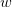。在函数中，数据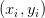是给定的，不能修改。但是我们可以调整权重矩阵这个参数，使得评分函数的结果与训练数据集中图像的真实类别一致，即评分函数在正确的分类的位置应当得到最高的评分（score）。

回到之前那张猫的图像分类例子，它有针对“猫”，“狗”，“船”三个类别的分数。我们看到例子中权重值非常差，因为猫分类的得分非常低（-96.8），而狗（437.9）和船（61.95）比较高。我们将使用**损失函数（****Loss Function）**（有时也叫**代价函数****Cost Function**或**目标函数****Objective**）来衡量我们对结果的不满意程度。直观地讲，当评分函数输出结果与真实结果之间差异越大，损失函数输出越大，反之越小。

## 多类支持向量机损失 Multiclass Support Vector Machine Loss

损失函数的具体形式多种多样。首先，介绍常用的多类支持向量机（SVM）损失函数。SVM 的损失函数想要 SVM 在正确分类上的得分始终比不正确分类上的得分高出一个边界值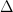。我们可以把损失函数想象成一个人，这位 SVM 先生（或者女士）对于结果有自己的品位，如果某个结果能使得损失值更低，那么 SVM 就更加喜欢它。

让我们更精确一些。回忆一下，第 i 个数据中包含图像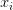的像素和代表正确类别的标签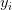。评分函数输入像素数据，然后通过公式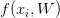来计算不同分类类别的分值。这里我们将分值简写为。比如，针对第 j 个类别的得分就是第 j 个元素：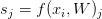。针对第 i 个数据的多类 SVM 的损失函数定义如下：

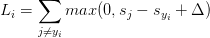

**举例**：用一个例子演示公式是如何计算的。假设有 3 个分类，并且得到了分值![s=[13,-7,11]](../Images/7119c19109461d91e8ce30e5b0092a78.png)。其中第一个类别是正确类别，即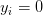。同时假设是 10（后面会详细介绍该超参数）。上面的公式是将所有不正确分类（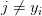）加起来，所以我们得到两个部分：

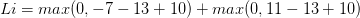

可以看到第一个部分结果是 0，这是因为[-7-13+10]得到的是负数，经过函数处理后得到 0。这一对类别分数和标签的损失值是 0，这是因为正确分类的得分 13 与错误分类的得分-7 的差为 20，高于边界值 10。而 SVM 只关心差距至少要大于 10，更大的差值还是算作损失值为 0。第二个部分计算[11-13+10]得到 8。虽然正确分类的得分比不正确分类的得分要高（13>11），但是比 10 的边界值还是小了，分差只有 2，这就是为什么损失值等于 8。简而言之，SVM 的损失函数想要正确分类类别的分数比不正确类别分数高，而且至少要高。如果不满足这点，就开始计算损失值。

那么在这次的模型中，我们面对的是线性评分函数（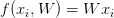），所以我们可以将损失函数的公式稍微改写一下：

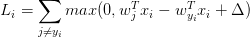

其中是权重的第 j 行，被变形为列向量。然而，一旦开始考虑更复杂的评分函数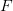公式，这样做就不是必须的了。

在结束这一小节前，还必须提一下的属于是关于 0 的阀值：函数，它常被称为**折叶损失（hinge loss）**。有时候会听到人们使用平方折叶损失 SVM（即 L2-SVM），它使用的是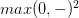，将更强烈（平方地而不是线性地）地惩罚过界的边界值。不使用平方是更标准的版本，但是在某些数据集中，平方折叶损失会工作得更好。可以通过交叉验证来决定到底使用哪个。

> 我们对于预测训练集数据分类标签的情况总有一些不满意的，而损失函数就能将这些不满意的程度量化。

—————————————————————————————————————————

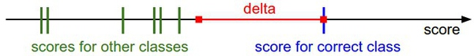多类 SVM“想要”正确类别的分类分数比其他不正确分类类别的分数要高，而且至少高出 delta 的边界值。如果其他分类分数进入了红色的区域，甚至更高，那么就开始计算损失。如果没有这些情况，损失值为 0。我们的目标是找到一些权重，它们既能够让训练集中的数据样例满足这些限制，也能让总的损失值尽可能地低。

—————————————————————————————————————————

**正则化（Regularization）：**上面损失函数有一个问题。假设有一个数据集和一个权重集**W**能够正确地分类每个数据（即所有的边界都满足，对于所有的 i 都有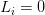）。问题在于这个**W**并不唯一：可能有很多相似的**W**都能正确地分类所有的数据。一个简单的例子：如果**W**能够正确分类所有数据，即对于每个数据，损失值都是 0。那么当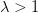时，任何数乘都能使得损失值为 0，因为这个变化将所有分值的大小都均等地扩大了，所以它们之间的绝对差值也扩大了。举个例子，如果一个正确分类的分值和举例它最近的错误分类的分值的差距是 15，对**W**乘以 2 将使得差距变成 30。

换句话说，我们希望能向某些特定的权重**W**添加一些偏好，对其他权重则不添加，以此来消除模糊性。这一点是能够实现的，方法是向损失函数增加一个**正则化惩罚（regularization penalty）**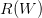部分。最常用的正则化惩罚是 L2 范式，L2 范式通过对所有参数进行逐元素的平方惩罚来抑制大数值的权重：

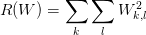

上面的表达式中，将中所有元素平方后求和。注意正则化函数不是数据的函数，仅基于权重。包含正则化惩罚后，就能够给出完整的多类 SVM 损失函数了，它由两个部分组成：**数据损失（data loss）**，即所有样例的的平均损失，以及**正则化损失（regularization loss）**。完整公式如下所示：

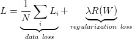

将其展开完整公式是：

![L=\frac{1}{N}\sum_i\sum_{j\not=y_i}[max(0,f(x_i;W)_j-f(x_i;W)_{y_i}+\Delta)]+\lambda \sum_k \sum_l W²_{k,l}](../Images/282675fffd60f8c808200fffddd57c4c.png)

其中，是训练集的数据量。现在正则化惩罚添加到了损失函数里面，并用超参数来计算其权重。该超参数无法简单确定，需要通过交叉验证来获取。

除了上述理由外，引入正则化惩罚还带来很多良好的性质，这些性质大多会在后续章节介绍。比如引入了 L2 惩罚后，SVM 们就有了**最大边界（****max margin）**这一良好性质。（如果感兴趣，可以查看[CS229 课程](https://link.zhihu.com/?target=http%3A//cs229.stanford.edu/notes/cs229-notes3.pdf)*）。*

 *其中最好的性质就是对大数值权重进行惩罚，可以提升其泛化能力，因为这就意味着没有哪个维度能够独自对于整体分值有过大的影响。举个例子，假设输入向量![x=[1,1,1,1]](../Images/04dd9c4b4b60d34cbe497421ac8d5cbd.png)，两个权重向量![w_1=[1,0,0,0]](../Images/2c7ec9997f6d539826ed0806259c5ef7.png)，![w_2=[0.25,0.25,0.25,0.25]](../Images/6f5d088ffbd676dac86c18853b9177e7.png)。那么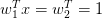，两个权重向量都得到同样的内积，但是的 L2 惩罚是 1.0，而的 L2 惩罚是 0.25。因此，根据 L2 惩罚来看，更好，因为它的正则化损失更小。从直观上来看，这是因为的权重值更小且更分散。既然 L2 惩罚倾向于更小更分散的权重向量，这就会鼓励分类器最终将所有维度上的特征都用起来，而不是强烈依赖其中少数几个维度。在后面的课程中可以看到，这一效果将会提升分类器的泛化能力，并避免*过拟合*。

需要注意的是，和权重不同，偏差没有这样的效果，因为它们并不控制输入维度上的影响强度。因此通常只对权重正则化，而不正则化偏差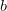。在实际操作中，可发现这一操作的影响可忽略不计。最后，因为正则化惩罚的存在，不可能在所有的例子中得到 0 的损失值，这是因为只有当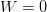的特殊情况下，才能得到损失值为 0。

**代码**：下面是一个无正则化部分的损失函数的 Python 实现，有非向量化和半向量化两个形式：

```py
def L_i(x, y, W):
  """
 unvectorized version. Compute the multiclass svm loss for a single example (x,y)
 - x is a column vector representing an image (e.g. 3073 x 1 in CIFAR-10)
 with an appended bias dimension in the 3073-rd position (i.e. bias trick)
 - y is an integer giving index of correct class (e.g. between 0 and 9 in CIFAR-10)
 - W is the weight matrix (e.g. 10 x 3073 in CIFAR-10)
 """
  delta = 1.0 # see notes about delta later in this section
  scores = W.dot(x) # scores becomes of size 10 x 1, the scores for each class
  correct_class_score = scores[y]
  D = W.shape[0] # number of classes, e.g. 10
  loss_i = 0.0
  for j in xrange(D): # iterate over all wrong classes
    if j == y:
      # skip for the true class to only loop over incorrect classes
      continue
    # accumulate loss for the i-th example
    loss_i += max(0, scores[j] - correct_class_score + delta)
  return loss_i

def L_i_vectorized(x, y, W):
  """
 A faster half-vectorized implementation. half-vectorized
 refers to the fact that for a single example the implementation contains
 no for loops, but there is still one loop over the examples (outside this function)
 """
  delta = 1.0
  scores = W.dot(x)
  # compute the margins for all classes in one vector operation
  margins = np.maximum(0, scores - scores[y] + delta)
  # on y-th position scores[y] - scores[y] canceled and gave delta. We want
  # to ignore the y-th position and only consider margin on max wrong class
  margins[y] = 0
  loss_i = np.sum(margins)
  return loss_i

def L(X, y, W):
  """
 fully-vectorized implementation :
 - X holds all the training examples as columns (e.g. 3073 x 50,000 in CIFAR-10)
 - y is array of integers specifying correct class (e.g. 50,000-D array)
 - W are weights (e.g. 10 x 3073)
 """
  # evaluate loss over all examples in X without using any for loops
  # left as exercise to reader in the assignment 
```

在本小节的学习中，一定要记得 SVM 损失采取了一种特殊的方法，使得能够衡量对于训练数据预测分类和实际分类标签的一致性。还有，对训练集中数据做出准确分类预测和让损失值最小化这两件事是等价的。

> 接下来要做的，就是找到能够使损失值最小化的权重了。

## 实际考虑

**设置 Delta**：你可能注意到上面的内容对超参数及其设置是一笔带过，那么它应该被设置成什么值？需要通过交叉验证来求得吗？现在看来，该超参数在绝大多数情况下设为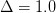都是安全的。超参数和看起来是两个不同的超参数，但实际上他们一起控制同一个权衡：即损失函数中的数据损失和正则化损失之间的权衡。理解这一点的关键是要知道，权重的大小对于分类分值有直接影响（当然对他们的差异也有直接影响）：当我们将中值缩小，分类分值之间的差异也变小，反之亦然。因此，不同分类分值之间的边界的具体值（比如或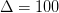）从某些角度来看是没意义的，因为权重自己就可以控制差异变大和缩小。也就是说，真正的权衡是我们允许权重能够变大到何种程度（通过正则化强度来控制）。

**与二元支持向量机（****Binary Support Vector Machine****）的关系**：在学习本课程前，你可能对于二元支持向量机有些经验，它对于第 i 个数据的损失计算公式是：

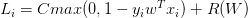

其中，是一个超参数，并且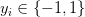。可以认为本章节介绍的 SVM 公式包含了上述公式，上述公式是多类支持向量机公式只有两个分类类别的特例。也就是说，如果我们要分类的类别只有两个，那么公式就化为二元 SVM 公式。这个公式中的和多类 SVM 公式中的都控制着同样的权衡，而且它们之间的关系是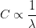

**备注：在初始形式中进行最优化**。如果在本课程之前学习过 SVM，那么对 kernels，duals，SMO 算法等将有所耳闻。在本课程（主要是神经网络相关）中，损失函数的最优化的始终在非限制初始形式下进行。很多这些损失函数从技术上来说是不可微的（比如当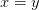时，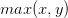函数就不可微分），但是在实际操作中并不存在问题，因为通常可以使用次梯度。

**备注：其他多类 SVM 公式**。需要指出的是，本课中展示的多类 SVM 只是多种 SVM 公式中的一种。另一种常用的公式是*One-Vs-All*（OVA）SVM，它针对每个类和其他类训练一个独立的二元分类器。还有另一种更少用的叫做*All-Vs-All*（AVA）策略。我们的公式是按照[Weston and Watkins 1999 (pdf)](https://link.zhihu.com/?target=https%3A//www.elen.ucl.ac.be/Proceedings/esann/esannpdf/es1999-461.pdf)*版本，比 OVA 性能更强（在构建有一个多类数据集的情况下，这个版本可以在损失值上取到 0，而 OVA 就不行。感兴趣的话在论文中查阅细节）。最后一个需要知道的公式是 Structured SVM，它将正确分类的分类分值和非正确分类中的最高分值的边界最大化。理解这些公式的差异超出了本课程的范围。本课程笔记介绍的版本可以在实践中安全使用，而被论证为最简单的 OVA 策略在实践中看起来也能工作的同样出色（在 Rikin 等人 2004 年的论文[In Defense of One-Vs-All Classification (pdf)](https://link.zhihu.com/?target=http%3A//www.jmlr.org/papers/volume5/rifkin04a/rifkin04a.pdf)*中可查）。**

 ****线性分类笔记（中）完**。

## 译者反馈

1.  **允许转载，须全文转载并注明原文链接；**
2.  近期发现某些**微信公众号转载时有删除贡献者们名字，或不注明原链接，或截取段落等不良转载行为**，请**停止以上不良转载行为，全文转载并注明原文链接**。否则我们保留维权的权利，下一步将委托维权骑士进行版权保护；
3.  请知友们通过评论和私信等方式批评指正，贡献者均会补充提及。*****