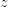
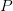
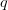
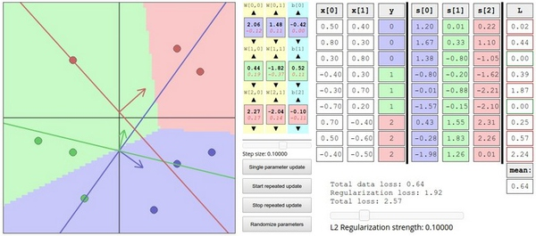

# CS231n 课程笔记翻译：线性分类笔记（下）

> 来源：[`zhuanlan.zhihu.com/p/20870307`](https://zhuanlan.zhihu.com/p/21102293)

译者注：本文[智能单元](https://zhuanlan.zhihu.com/intelligentunit)首发，译自斯坦福 CS231n 课程笔记[Linear Classification Note](https://link.zhihu.com/?target=http%3A//cs231n.github.io/linear-classify/)*，课程教师[Andrej Karpathy](https://link.zhihu.com/?target=http%3A//cs.stanford.edu/people/karpathy/)*授权翻译。本篇教程由[杜客](https://www.zhihu.com/people/du-ke)翻译完成，[堃堃](https://www.zhihu.com/people/kun-kun-97-81)进行校对修改。译文含公式和代码，建议 PC 端阅读。

## 原文如下

内容列表：

*   线性分类器简介
*   线性评分函数
*   阐明线性分类器
*   损失函数

*   多类 SVM
*   Softmax 分类器 ***译者注：下篇翻译起始处***
*   SVM 和 Softmax 的比较

*   基于 Web 的可交互线性分类器原型
*   小结

## Softmax 分类器

SVM 是最常用的两个分类器之一，而另一个就是**Softmax 分类器，**它的损失函数与 SVM 的损失函数不同。对于学习过二元逻辑回归分类器的读者来说，Softmax 分类器就可以理解为逻辑回归分类器面对多个分类的一般化归纳。SVM 将输出作为每个分类的评分（因为无定标，所以难以直接解释）。与 SVM 不同，Softmax 的输出（归一化的分类概率）更加直观，并且从概率上可以解释，这一点后文会讨论。在 Softmax 分类器中，函数映射保持不变，但将这些评分值视为每个分类的未归一化的对数概率，并且将*折叶损失（hinge loss）*替换为**交叉熵损失**（**cross-entropy loss）**。公式如下：

 或等价的 

在上式中，使用来表示分类评分向量中的第 j 个元素。和之前一样，整个数据集的损失值是数据集中所有样本数据的损失值的均值与正则化损失之和。其中函数被称作**softmax 函数**：其输入值是一个向量，向量中元素为任意实数的评分值（中的），函数对其进行压缩，输出一个向量，其中每个元素值在 0 到 1 之间，且所有元素之和为 1。所以，包含 softmax 函数的完整交叉熵损失看起唬人，实际上还是比较容易理解的。

**信息理论视角**：在“真实”分布和估计分布之间的*交叉熵*定义如下：


因此，Softmax 分类器所做的就是最小化在估计分类概率（就是上面的）和“真实”分布之间的交叉熵，在这个解释中，“真实”分布就是所有概率密度都分布在正确的类别上（比如：![p=[0,...1,...,0]](../Images/bfb6ef551dfc8591d7bb307e97bb0492.png)中在的位置就有一个单独的 1）。还有，既然交叉熵可以写成熵和相对熵（Kullback-Leibler divergence），并且 delta 函数的熵是 0，那么就能等价的看做是对两个分布之间的相对熵做最小化操作。换句话说，交叉熵损失函数“想要”预测分布的所有概率密度都在正确分类上。

***译者注**：Kullback-Leibler 差异（Kullback-Leibler Divergence）也叫做相对熵（Relative Entropy），它衡量的是相同事件空间里的两个概率分布的差异情况。*

**概率论解释**：先看下面的公式：


可以解释为是给定图像数据，以为参数，分配给正确分类标签的归一化概率。为了理解这点，请回忆一下 Softmax 分类器将输出向量中的评分值解释为没有归一化的对数概率。那么以这些数值做指数函数的幂就得到了没有归一化的概率，而除法操作则对数据进行了归一化处理，使得这些概率的和为 1。从概率论的角度来理解，我们就是在最小化正确分类的负对数概率，这可以看做是在进行*最大似然估计*（MLE）。该解释的另一个好处是，损失函数中的正则化部分可以被看做是权重矩阵的高斯先验，这里进行的是最大后验估计（MAP）而不是最大似然估计。提及这些解释只是为了让读者形成直观的印象，具体细节就超过本课程范围了。

**实操事项：数值稳定。**编程实现 softmax 函数计算的时候，中间项和因为存在指数函数，所以数值可能非常大。除以大数值可能导致数值计算的不稳定，所以学会使用归一化技巧非常重要。如果在分式的分子和分母都乘以一个常数，并把它变换到求和之中，就能得到一个从数学上等价的公式：


的值可自由选择，不会影响计算结果，通过使用这个技巧可以提高计算中的数值稳定性。通常将设为。该技巧简单地说，就是应该将向量中的数值进行平移，使得最大值为 0。代码实现如下：

```py
f = np.array([123, 456, 789]) # 例子中有 3 个分类，每个评分的数值都很大
p = np.exp(f) / np.sum(np.exp(f)) # 不妙：数值问题，可能导致数值爆炸

# 那么将 f 中的值平移到最大值为 0：
f -= np.max(f) # f becomes [-666, -333, 0]
p = np.exp(f) / np.sum(np.exp(f)) # 现在 OK 了，将给出正确结果 
```

**让人迷惑的命名规则**：精确地说，SVM 分类器使用的是*折叶损失（hinge loss）*，有时候又被称为*最大边界损失（max-margin loss）*。Softmax 分类器使用的是*交叉熵损失（corss-entropy loss）*。Softmax 分类器的命名是从*softmax 函数*那里得来的，softmax 函数将原始分类评分变成正的归一化数值，所有数值和为 1，这样处理后交叉熵损失才能应用。注意从技术上说“softmax 损失（softmax loss）”是没有意义的，因为 softmax 只是一个压缩数值的函数。但是在这个说法常常被用来做简称。

## SVM 和 Softmax 的比较

下图有助于区分这 Softmax 和 SVM 这两种分类器：

————————————————————————————————————————


针对一个数据点，SVM 和 Softmax 分类器的不同处理方式的例子。两个分类器都计算了同样的分值向量**f**（本节中是通过矩阵乘来实现）。不同之处在于对**f**中分值的解释：SVM 分类器将它们看做是分类评分，它的损失函数鼓励正确的分类（本例中是蓝色的类别 2）的分值比其他分类的分值高出至少一个边界值。Softmax 分类器将这些数值看做是每个分类没有归一化的**对数概率**，鼓励正确分类的归一化的对数概率变高，其余的变低。SVM 的最终的损失值是 1.58，Softmax 的最终的损失值是 0.452，但要注意这两个数值没有可比性。只在给定同样数据，在同样的分类器的损失值计算中，它们才有意义。

————————————————————————————————————————

**Softmax 分类器为每个分类提供了“可能性”**：SVM 的计算是无标定的，而且难以针对所有分类的评分值给出直观解释。Softmax 分类器则不同，它允许我们计算出对于所有分类标签的可能性。举个例子，针对给出的图像，SVM 分类器可能给你的是一个[12.5, 0.6, -23.0]对应分类“猫”，“狗”，“船”。而 softmax 分类器可以计算出这三个标签的”可能性“是[0.9, 0.09, 0.01]，这就让你能看出对于不同分类准确性的把握。为什么我们要在”可能性“上面打引号呢？这是因为可能性分布的集中或离散程度是由正则化参数λ直接决定的，λ是你能直接控制的一个输入参数。举个例子，假设 3 个分类的原始分数是[1, -2, 0]，那么 softmax 函数就会计算：

![[1,-2,0]\to[e¹,e^{-2},e⁰]=[2.71,0.14,1]\to[0.7,0.04,0.26]](../Images/84015538eea499f7b6ec9f178c53510d.png)

现在，如果正则化参数λ更大，那么权重 W 就会被惩罚的更多，然后他的权重数值就会更小。这样算出来的分数也会更小，假设小了一半吧[0.5, -1, 0]，那么 softmax 函数的计算就是：

![[0.5,-1,0]\to[e^{0.5},e^{-1},e⁰]=[1.65,0.73,1]\to[0.55,0.12,0.33]](../Images/6d98608f0042615e336d1c87942ec9df.png)

现在看起来，概率的分布就更加分散了。还有，随着正则化参数λ不断增强，权重数值会越来越小，最后输出的概率会接近于均匀分布。这就是说，softmax 分类器算出来的概率最好是看成一种对于分类正确性的自信。和 SVM 一样，数字间相互比较得出的大小顺序是可以解释的，但其绝对值则难以直观解释**。**

**在实际使用中，SVM 和 Softmax 经常是相似的**：通常说来，两种分类器的表现差别很小，不同的人对于哪个分类器更好有不同的看法。相对于 Softmax 分类器，SVM 更加“局部目标化（local objective）”，这既可以看做是一个特性，也可以看做是一个劣势。考虑一个评分是[10, -2, 3]的数据，其中第一个分类是正确的。那么一个 SVM（）会看到正确分类相较于不正确分类，已经得到了比边界值还要高的分数，它就会认为损失值是 0。SVM 对于数字个体的细节是不关心的：如果分数是[10, -100, -100]或者[10, 9, 9]，对于 SVM 来说没设么不同，只要满足超过边界值等于 1，那么损失值就等于 0。

对于 softmax 分类器，情况则不同。对于[10, 9, 9]来说，计算出的损失值就远远高于[10, -100, -100]的。换句话来说，softmax 分类器对于分数是永远不会满意的：正确分类总能得到更高的可能性，错误分类总能得到更低的可能性，损失值总是能够更小。但是，SVM 只要边界值被满足了就满意了，不会超过限制去细微地操作具体分数。这可以被看做是 SVM 的一种特性。举例说来，一个汽车的分类器应该把他的大量精力放在如何分辨小轿车和大卡车上，而不应该纠结于如何与青蛙进行区分，因为区分青蛙得到的评分已经足够低了。

## 交互式的网页 Demo

————————————————————————————————————————

我们实现了一个交互式的网页原型，来帮助读者直观地理解线性分类器。原型将损失函数进行可视化，画面表现的是对于 2 维数据的 3 种类别的分类。原型在课程进度上稍微超前，展现了最优化的内容，最优化将在下一节课讨论。

————————————————————————————————————————

## 小结

总结如下：

*   定义了从图像像素映射到不同类别的分类评分的评分函数。在本节中，评分函数是一个基于权重**W**和偏差**b**的线性函数。
*   与 kNN 分类器不同，**参数方法**的优势在于一旦通过训练学习到了参数，就可以将训练数据丢弃了。同时该方法对于新的测试数据的预测非常快，因为只需要与权重**W**进行一个矩阵乘法运算。
*   介绍了偏差技巧，让我们能够将偏差向量和权重矩阵合二为一，然后就可以只跟踪一个矩阵。
*   定义了损失函数（介绍了 SVM 和 Softmax 线性分类器最常用的 2 个损失函数）。损失函数能够衡量给出的参数集与训练集数据真实类别情况之间的一致性。在损失函数的定义中可以看到，对训练集数据做出良好预测与得到一个足够低的损失值这两件事是等价的。

现在我们知道了如何基于参数，将数据集中的图像映射成为分类的评分，也知道了两种不同的损失函数，它们都能用来衡量算法分类预测的质量。但是，如何高效地得到能够使损失值最小的参数呢？这个求得最优参数的过程被称为最优化，将在下节课中进行介绍。

## 拓展阅读

下面的内容读者可根据兴趣选择性阅读。

*   [Deep Learning using Linear Support Vector Machines](https://link.zhihu.com/?target=http%3A//arxiv.org/abs/1306.0239)*一文的作者是 Tang Charlie，论文写于 2013 年，展示了一些 L2SVM 比 Softmax 表现更出色的结果。*

 ***线性分类笔记全文翻译完毕**。

## 译者反馈

1.  转载须全文转载并注明原文链接，否则保留维权权利；
2.  接受知友建议，将示例代码中的注释也进行了翻译；
3.  请知友们通过评论和私信等方式批评指正，贡献者均会补充提及。
4.  感谢[@马会超](https://www.zhihu.com/people/8c846dceb4672d13cf38d44ad278bce8)和@[Bron](https://www.zhihu.com/people/bron23)的批评指正！

## 特别感谢

**知友[智靖远](https://www.zhihu.com/people/zhi-liang-72)贡献了课程 Lecture 1 的字幕，并提出了关于合力进行字幕翻译的倡议，具体情况将专门发一篇短文来进行说明。*****