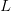
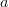

# CS231n 课程笔记翻译：最优化笔记（上）

> 来源：[`zhuanlan.zhihu.com/p/20870307`](https://zhuanlan.zhihu.com/p/21360434)

译者注：本文[智能单元](https://zhuanlan.zhihu.com/intelligentunit)首发，译自斯坦福 CS231n 课程笔记[Optimization Note](https://link.zhihu.com/?target=http%3A//cs231n.github.io/optimization-1/)*，课程教师[Andrej Karpathy](https://link.zhihu.com/?target=http%3A//cs.stanford.edu/people/karpathy/)*授权翻译。本篇教程由[杜客](https://www.zhihu.com/people/du-ke)翻译完成，[堃堃](https://www.zhihu.com/people/kun-kun-97-81)和[李艺颖](https://www.zhihu.com/people/li-yi-ying-73)进行校对修改。译文含公式和代码，建议 PC 端阅读。

## 原文如下

内容列表：

*   简介

*   损失函数可视化
*   最优化

*   策略#1：随机搜索
*   策略#2：随机局部搜索
*   策略#3：跟随梯度 ***译者注：上篇截止处***

*   梯度计算

*   使用有限差值进行数值计算
*   微分计算梯度

*   梯度下降
*   小结

## 简介

在上一节中，我们介绍了图像分类任务中的两个关键部分：

1.  基于参数的**评分函数。**该函数将原始图像像素映射为分类评分值（例如：一个线性函数）。
2.  **损失函数**。该函数能够根据分类评分和训练集图像数据实际分类的一致性，衡量某个具体参数集的质量好坏。损失函数有多种版本和不同的实现方式（例如：Softmax 或 SVM）。

上节中，线性函数的形式是，而 SVM 实现的公式是：

![L=\displaystyle\frac{1}{N}\sum_i\sum_{j\not= y_i}[max(0,f(x_i;W)_j-f(x_i;W)_{y_i}+1)]+\alpha R(W)](../Images/58f65e39bd891f1bdfe999e508ad5666.png)

对于图像数据，如果基于参数集做出的分类预测与真实情况比较一致，那么计算出来的损失值就很低。现在介绍第三个，也是最后一个关键部分：**最优化 Optimization**。最优化是寻找能使得损失函数值最小化的参数的过程。

**铺垫**：一旦理解了这三个部分是如何相互运作的，我们将会回到第一个部分（基于参数的函数映射），然后将其拓展为一个远比线性函数复杂的函数：首先是神经网络，然后是卷积神经网络。而损失函数和最优化过程这两个部分将会保持相对稳定。

## 损失函数可视化

本课中讨论的损失函数一般都是定义在高维度的空间中（比如，在 CIFAR-10 中一个线性分类器的权重矩阵大小是[10x3073]，就有 30730 个参数），这样要将其可视化就很困难。然而办法还是有的，在 1 个维度或者 2 个维度的方向上对高维空间进行切片，就能得到一些直观感受。例如，随机生成一个权重矩阵，该矩阵就与高维空间中的一个点对应。然后沿着某个维度方向前进的同时记录损失函数值的变化。换句话说，就是生成一个随机的方向并且沿着此方向计算损失值，计算方法是根据不同的值来计算。这个过程将生成一个图表，其 x 轴是值，y 轴是损失函数值。同样的方法还可以用在两个维度上，通过改变来计算损失值，从而给出二维的图像。在图像中，可以分别用 x 和 y 轴表示，而损失函数的值可以用颜色变化表示：

————————————————————————————————————————

一个无正则化的多类 SVM 的损失函数的图示。左边和中间只有一个样本数据，右边是 CIFAR-10 中的 100 个数据。**左**：a 值变化在某个维度方向上对应的的损失值变化。**中和右**：两个维度方向上的损失值切片图，蓝色部分是低损失值区域，红色部分是高损失值区域。注意损失函数的分段线性结构。多个样本的损失值是总体的平均值，所以右边的碗状结构是很多的分段线性结构的平均（比如中间这个就是其中之一）。

—————————————————————————————————————————

我们可以通过数学公式来解释损失函数的分段线性结构。对于一个单独的数据，有损失函数的计算公式如下：

![Li=\sum_{j\not=y_i}[max(0,w^T_jx_i-w^T_{y_i}x_i+1)]](../Images/0f21b2cbc7a02d608e94374815721683.png)

通过公式可见，每个样本的数据损失值是以为参数的线性函数的总和（零阀值来源于函数）。的每一行（即），有时候它前面是一个正号（比如当它对应错误分类的时候），有时候它前面是一个负号（比如当它是是正确分类的时候）。为进一步阐明，假设有一个简单的数据集，其中包含有 3 个只有 1 个维度的点，数据集数据点有 3 个类别。那么完整的无正则化 SVM 的损失值计算如下：


因为这些例子都是一维的，所以数据和权重都是数字。观察，可以看到上面的式子中一些项是的线性函数，且每一项都会与 0 比较，取两者的最大值。可作图如下：——————————————————————————————————————

从一个维度方向上对数据损失值的展示。x 轴方向就是一个权重，y 轴就是损失值。数据损失是多个部分组合而成。其中每个部分要么是某个权重的独立部分，要么是该权重的线性函数与 0 阀值的比较。完整的 SVM 数据损失就是这个形状的 30730 维版本。

——————————————————————————————————————

需要多说一句的是，你可能根据 SVM 的损失函数的碗状外观猜出它是一个[凸函数](https://link.zhihu.com/?target=https%3A//en.wikipedia.org/wiki/Convex_function)*。关于如何高效地最小化凸函数的论文有很多，你也可以学习斯坦福大学关于（[凸函数最优化](https://link.zhihu.com/?target=http%3A//stanford.edu/%7Eboyd/cvxbook/)*）的课程。但是一旦我们将函数扩展到神经网络，目标函数就就不再是凸函数了，图像也不会像上面那样是个碗状，而是凹凸不平的复杂地形形状。** 

 ***不可导的损失函数。*作为一个技术笔记，你要注意到：由于 max 操作，损失函数中存在一些*不可导点（kinks），*这些点使得损失函数不可微，因为在这些不可导点，梯度是没有定义的。但是[次梯度（subgradient）](https://link.zhihu.com/?target=https%3A//en.wikipedia.org/wiki/Subderivative)*依然存在且常常被使用。在本课中，我们将交换使用*次梯度*和*梯度*两个术语。* 

## 最优化 Optimization

重申一下：损失函数可以量化某个具体权重集**W**的质量。而最优化的目标就是找到能够最小化损失函数值的**W** 。我们现在就朝着这个目标前进，实现一个能够最优化损失函数的方法。对于有一些经验的同学，这节课看起来有点奇怪，因为使用的例子（SVM 损失函数）是一个凸函数问题。但是要记得，最终的目标是不仅仅对凸函数做最优化，而是能够最优化一个神经网络，而对于神经网络是不能简单的使用凸函数的最优化技巧的。

**策略#1：一个差劲的初始方案：随机搜索**

既然确认参数集**W**的好坏蛮简单的，那第一个想到的（差劲）方法，就是可以随机尝试很多不同的权重，然后看其中哪个最好。过程如下：

```py
# 假设 X_train 的每一列都是一个数据样本（比如 3073 x 50000）
# 假设 Y_train 是数据样本的类别标签（比如一个长 50000 的一维数组）
# 假设函数 L 对损失函数进行评价

bestloss = float("inf") # Python assigns the highest possible float value
for num in xrange(1000):
  W = np.random.randn(10, 3073) * 0.0001 # generate random parameters
  loss = L(X_train, Y_train, W) # get the loss over the entire training set
  if loss < bestloss: # keep track of the best solution
    bestloss = loss
    bestW = W
  print 'in attempt %d the loss was %f, best %f' % (num, loss, bestloss)

# 输出:
# in attempt 0 the loss was 9.401632, best 9.401632
# in attempt 1 the loss was 8.959668, best 8.959668
# in attempt 2 the loss was 9.044034, best 8.959668
# in attempt 3 the loss was 9.278948, best 8.959668
# in attempt 4 the loss was 8.857370, best 8.857370
# in attempt 5 the loss was 8.943151, best 8.857370
# in attempt 6 the loss was 8.605604, best 8.605604
# ... (trunctated: continues for 1000 lines) 
```

在上面的代码中，我们尝试了若干随机生成的权重矩阵**W**，其中某些的损失值较小，而另一些的损失值大些。我们可以把这次随机搜索中找到的最好的权重**W**取出，然后去跑测试集：

```py
# 假设 X_test 尺寸是[3073 x 10000], Y_test 尺寸是[10000 x 1]
scores = Wbest.dot(Xte_cols) # 10 x 10000, the class scores for all test examples
# 找到在每列中评分值最大的索引（即预测的分类）
Yte_predict = np.argmax(scores, axis = 0)
# 以及计算准确率
np.mean(Yte_predict == Yte)
# 返回 0.1555 
```

验证集上表现最好的权重**W**跑测试集的准确率是**15.5%，**而完全随机猜的准确率是 10%，如此看来，这个准确率对于这样一个不经过大脑的策略来说，还算不错嘛！

**核心思路：迭代优化**。当然，我们肯定能做得更好些。核心思路是：虽然找到最优的权重**W**非常困难，甚至是不可能的（尤其当**W**中存的是整个神经网络的权重的时候），但如果问题转化为：对一个权重矩阵集**W**取优，使其损失值稍微减少。那么问题的难度就大大降低了。换句话说，我们的方法从一个随机的**W**开始，然后对其迭代取优，每次都让它的损失值变得更小一点。

> 我们的策略是从随机权重开始，然后迭代取优，从而获得更低的损失值。

**蒙眼徒步者的比喻**：一个助于理解的比喻是把你自己想象成一个蒙着眼睛的徒步者，正走在山地地形上，目标是要慢慢走到山底。在 CIFAR-10 的例子中，这山是 30730 维的（因为**W**是 3073x10）。我们在山上踩的每一点都对应一个的损失值，该损失值可以看做该点的海拔高度。

**策略#2：随机本地搜索**

第一个策略可以看做是每走一步都尝试几个随机方向，如果某个方向是向山下的，就向该方向走一步。这次我们从一个随机开始，然后生成一个随机的扰动 ，只有当的损失值变低，我们才会更新。这个过程的具体代码如下：

```py
W = np.random.randn(10, 3073) * 0.001 # 生成随机初始 W
bestloss = float("inf")
for i in xrange(1000):
  step_size = 0.0001
  Wtry = W + np.random.randn(10, 3073) * step_size
  loss = L(Xtr_cols, Ytr, Wtry)
  if loss < bestloss:
    W = Wtry
    bestloss = loss
  print 'iter %d loss is %f' % (i, bestloss) 
```

使用同样的数据（1000），这个方法可以得到**21.4%**的分类准确率。这个比策略一好，但是依然过于浪费计算资源。

**策略#3：跟随梯度**

前两个策略中，我们是尝试在权重空间中找到一个方向，沿着该方向能降低损失函数的损失值。其实不需要随机寻找方向，因为可以直接计算出最好的方向，这就是从数学上计算出最陡峭的方向。这个方向就是损失函数的**梯度（gradient）**。在蒙眼徒步者的比喻中，这个方法就好比是感受我们脚下山体的倾斜程度，然后向着最陡峭的下降方向下山。

在一维函数中，斜率是函数在某一点的瞬时变化率。梯度是函数的斜率的一般化表达，它不是一个值，而是一个向量。在输入空间中，梯度是各个维度的斜率组成的向量（或者称为导数**derivatives**）。对一维函数的求导公式如下：


当函数有多个参数的时候，我们称导数为偏导数。而梯度就是在每个维度上偏导数所形成的向量。

**最优化笔记（上）完。**

## 译者反馈

1.  **转载须全文转载并注明原文链接，否则保留维权权利**；

2.  请知友们通过评论和私信等方式批评指正，贡献者均会补充提及。*****