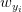
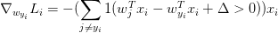
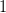
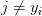
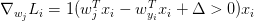

# CS231n 课程笔记翻译：最优化笔记（下）

> 来源：[`zhuanlan.zhihu.com/p/20870307`](https://zhuanlan.zhihu.com/p/21387326)

译者注：本文[智能单元](https://zhuanlan.zhihu.com/intelligentunit)首发，译自斯坦福 CS231n 课程笔记[Optimization Note](https://link.zhihu.com/?target=http%3A//cs231n.github.io/optimization-1/)*，课程教师[Andrej Karpathy](https://link.zhihu.com/?target=http%3A//cs.stanford.edu/people/karpathy/)*授权翻译。本篇教程由[杜客](https://www.zhihu.com/people/du-ke)翻译完成，[李艺颖](https://www.zhihu.com/people/li-yi-ying-73)和[堃堃](https://www.zhihu.com/people/kun-kun-97-81)进行校对修改。译文含公式和代码，建议 PC 端阅读。

## 原文如下

内容列表：

*   简介

*   损失函数可视化
*   最优化

*   策略#1：随机搜索
*   策略#2：随机局部搜索
*   策略#3：跟随梯度

*   梯度计算 ***译者注：下篇起始处***

*   使用有限差值进行数值计算
*   微分分析计算梯度

*   梯度下降
*   小结

## 梯度计算

计算梯度有两种方法：一个是缓慢的近似方法（**数值梯度法**），但实现相对简单。另一个方法（**分析梯度法**）计算迅速，结果精确，但是实现时容易出错，且需要使用微分。现在对两种方法进行介绍：

**利用有限差值计算梯度**

上节中的公式已经给出数值计算梯度的方法。下面代码是一个输入为函数**f**和向量**x，**计算**f**的梯度的通用函数，它返回函数**f**在点**x 处**的梯度：

```py
def eval_numerical_gradient(f, x):
  """ 
 一个 f 在 x 处的数值梯度法的简单实现
 - f 是只有一个参数的函数
 - x 是计算梯度的点
 """ 

  fx = f(x) # 在原点计算函数值
  grad = np.zeros(x.shape)
  h = 0.00001

  # 对 x 中所有的索引进行迭代
  it = np.nditer(x, flags=['multi_index'], op_flags=['readwrite'])
  while not it.finished:

    # 计算 x+h 处的函数值
    ix = it.multi_index
    old_value = x[ix]
    x[ix] = old_value + h # 增加 h
    fxh = f(x) # 计算 f(x + h)
    x[ix] = old_value # 存到前一个值中 (非常重要)

    # 计算偏导数
    grad[ix] = (fxh - fx) / h # 坡度
    it.iternext() # 到下个维度

  return grad 
```

根据上面的梯度公式，代码对所有维度进行迭代，在每个维度上产生一个很小的变化 h，通过观察函数值变化，计算函数在该维度上的偏导数。最后，所有的梯度存储在变量**grad**中。

**实践考量**：注意在数学公式中，**h**的取值是趋近于 0 的，然而在实际中，用一个很小的数值（比如例子中的 1e-5）就足够了。在不产生数值计算出错的理想前提下，你会使用尽可能小的 h。还有，实际中用**中心差值公式（****centered difference formula）**![[f(x+h)-f(x-h)]/2h](../Images/71961dbe8475cd050bed61367e913306.png)效果较好。细节可查看[wiki](https://link.zhihu.com/?target=https%3A//en.wikipedia.org/wiki/Numerical_differentiation)*。*

 *可以使用上面这个公式来计算任意函数在任意点上的梯度。下面计算权重空间中的某些随机点上，CIFAR-10 损失函数的梯度：

```py
# 要使用上面的代码我们需要一个只有一个参数的函数
# (在这里参数就是权重)所以也包含了 X_train 和 Y_train
def CIFAR10_loss_fun(W):
  return L(X_train, Y_train, W)

W = np.random.rand(10, 3073) * 0.001 # 随机权重向量
df = eval_numerical_gradient(CIFAR10_loss_fun, W) # 得到梯度 
```

梯度告诉我们损失函数在每个维度上的斜率，以此来进行更新：

```py
loss_original = CIFAR10_loss_fun(W) # 初始损失值
print 'original loss: %f' % (loss_original, )

# 查看不同步长的效果
for step_size_log in [-10, -9, -8, -7, -6, -5,-4,-3,-2,-1]:
  step_size = 10 ** step_size_log
  W_new = W - step_size * df # 权重空间中的新位置
  loss_new = CIFAR10_loss_fun(W_new)
  print 'for step size %f new loss: %f' % (step_size, loss_new)

# 输出:
# original loss: 2.200718
# for step size 1.000000e-10 new loss: 2.200652
# for step size 1.000000e-09 new loss: 2.200057
# for step size 1.000000e-08 new loss: 2.194116
# for step size 1.000000e-07 new loss: 2.135493
# for step size 1.000000e-06 new loss: 1.647802
# for step size 1.000000e-05 new loss: 2.844355
# for step size 1.000000e-04 new loss: 25.558142
# for step size 1.000000e-03 new loss: 254.086573
# for step size 1.000000e-02 new loss: 2539.370888
# for step size 1.000000e-01 new loss: 25392.214036 
```

**在梯度负方向上更新**：在上面的代码中，为了计算**W_new**，要注意我们是向着梯度**df**的负方向去更新，这是因为我们希望损失函数值是降低而不是升高。

**步长的影响**：梯度指明了函数在哪个方向是变化率最大的，但是没有指明在这个方向上应该走多远。在后续的课程中可以看到，选择步长（也叫作*学习率*）将会是神经网络训练中最重要（也是最头痛）的超参数设定之一。还是用蒙眼徒步者下山的比喻，这就好比我们可以感觉到脚朝向的不同方向上，地形的倾斜程度不同。但是该跨出多长的步长呢？不确定。如果谨慎地小步走，情况可能比较稳定但是进展较慢（这就是步长较小的情况）。相反，如果想尽快下山，那就大步走吧，但结果也不一定尽如人意。在上面的代码中就能看见反例，在某些点如果步长过大，反而可能越过最低点导致更高的损失值。

————————————————————————————————————————


将步长效果视觉化的图例。从某个具体的点 W 开始计算梯度（白箭头方向是负梯度方向），梯度告诉了我们损失函数下降最陡峭的方向。小步长下降稳定但进度慢，大步长进展快但是风险更大。采取大步长可能导致错过最优点，让损失值上升。步长（后面会称其为**学习率**）将会是我们在调参中最重要的超参数之一。

————————————————————————————————————————

**效率问题**：你可能已经注意到，计算数值梯度的复杂性和参数的量线性相关。在本例中有 30730 个参数，所以损失函数每走一步就需要计算 30731 次损失函数的梯度。现代神经网络很容易就有上千万的参数，因此这个问题只会越发严峻。显然这个策略不适合大规模数据，我们需要更好的策略。

### 微分分析计算梯度

使用有限差值近似计算梯度比较简单，但缺点在于终究只是近似（因为我们对于*h*值是选取了一个很小的数值，但真正的梯度定义中*h*趋向 0 的极限），且耗费计算资源太多。第二个梯度计算方法是利用微分来分析，能得到计算梯度的公式（不是近似），用公式计算梯度速度很快，唯一不好的就是实现的时候容易出错。为了解决这个问题，在实际操作时常常将分析梯度法的结果和数值梯度法的结果作比较，以此来检查其实现的正确性，这个步骤叫做**梯度检查**。

用 SVM 的损失函数在某个数据点上的计算来举例：

![L_i=\displaystyle\sum_{j\not =y_i}[max(0,w^T_jx_i-w^T_{y_i}x_i+\Delta)]](../Images/6761cf8b6a43f430647095a04893c0da.png)

可以对函数进行微分。比如，对进行微分得到：



***译者注：原公式中 1 为空心字体，尝试\mathbb{}等多种方法仍无法实现，请知友指点。*** 

其中是一个示性函数，如果括号中的条件为真，那么函数值为 1，如果为假，则函数值为 0。虽然上述公式看起来复杂，但在代码实现的时候比较简单：只需要计算没有满足边界值的分类的数量（因此对损失函数产生了贡献），然后乘以就是梯度了。注意，这个梯度只是对应正确分类的 W 的行向量的梯度，那些行的梯度是：



一旦将梯度的公式微分出来，代码实现公式并用于梯度更新就比较顺畅了。

## 梯度下降

现在可以计算损失函数的梯度了，程序重复地计算梯度然后对参数进行更新，这一过程称为*梯度下降*，他的**普通**版本是这样的：

```py
# 普通的梯度下降

while True:
  weights_grad = evaluate_gradient(loss_fun, data, weights)
  weights += - step_size * weights_grad # 进行梯度更新 
```

这个简单的循环在所有的神经网络核心库中都有。虽然也有其他实现最优化的方法（比如 LBFGS），但是到目前为止，梯度下降是对神经网络的损失函数最优化中最常用的方法。课程中，我们会在它的循环细节增加一些新的东西（比如更新的具体公式），但是核心思想不变，那就是我们一直跟着梯度走，直到结果不再变化。

**小批量数据梯度下降（****Mini-batch gradient descent****）**：在大规模的应用中（比如 ILSVRC 挑战赛），训练数据可以达到百万级量级。如果像这样计算整个训练集，来获得仅仅一个参数的更新就太浪费了。一个常用的方法是计算训练集中的**小批量（batches）**数据。例如，在目前最高水平的卷积神经网络中，一个典型的小批量包含 256 个例子，而整个训练集是多少呢？一百二十万个。这个小批量数据就用来实现一个参数更新：

```py
# 普通的小批量数据梯度下降

while True:
  data_batch = sample_training_data(data, 256) # 256 个数据
  weights_grad = evaluate_gradient(loss_fun, data_batch, weights)
  weights += - step_size * weights_grad # 参数更新 
```

这个方法之所以效果不错，是因为训练集中的数据都是相关的。要理解这一点，可以想象一个极端情况：在 ILSVRC 中的 120 万个图像是 1000 张不同图片的复制（每个类别 1 张图片，每张图片有 1200 张复制）。那么显然计算这 1200 张复制图像的梯度就应该是一样的。对比 120 万张图片的数据损失的均值与只计算 1000 张的子集的数据损失均值时，结果应该是一样的。实际情况中，数据集肯定不会包含重复图像，那么小批量数据的梯度就是对整个数据集梯度的一个近似。因此，在实践中通过计算小批量数据的梯度可以实现更快速地收敛，并以此来进行更频繁的参数更新。

小批量数据策略有个极端情况，那就是每个批量中只有 1 个数据样本，这种策略被称为**随机梯度下降（****Stochastic Gradient Descent 简称 SGD****）**，有时候也被称为在线梯度下降。这种策略在实际情况中相对少见，因为向量化操作的代码一次计算 100 个数据 比 100 次计算 1 个数据要高效很多。即使 SGD 在技术上是指每次使用 1 个数据来计算梯度，你还是会听到人们使用 SGD 来指代小批量数据梯度下降（或者用 MGD 来指代小批量数据梯度下降，而 BGD 来指代则相对少见）。小批量数据的大小是一个超参数，但是一般并不需要通过交叉验证来调参。它一般由存储器的限制来决定的，或者干脆设置为同样大小，比如 32，64，128 等。之所以使用 2 的指数，是因为在实际中许多向量化操作实现的时候，如果输入数据量是 2 的倍数，那么运算更快。

## 小结

————————————————————————————————————————


信息流的总结图例。数据集中的(x,y)是给定的。权重从一个随机数字开始，且可以改变。在前向传播时，评分函数计算出类别的分类评分并存储在向量**f**中。损失函数包含两个部分：数据损失和正则化损失。其中，数据损失计算的是分类评分 f 和实际标签 y 之间的差异，正则化损失只是一个关于权重的函数。在梯度下降过程中，我们计算权重的梯度（如果愿意的话，也可以计算数据上的梯度），然后使用它们来实现参数的更新。

—————————————————————————————————————————

在本节课中：

*   将损失函数比作了一个**高维度的最优化地形**，并尝试到达它的最底部。最优化的工作过程可以看做一个蒙着眼睛的徒步者希望摸索着走到山的底部。在例子中，可见 SVM 的损失函数是分段线性的，并且是碗状的。

*   提出了迭代优化的思想，从一个随机的权重开始，然后一步步地让损失值变小，直到最小。

*   函数的**梯度**给出了该函数最陡峭的上升方向。介绍了利用有限的差值来近似计算梯度的方法，该方法实现简单但是效率较低（有限差值就是*h*，用来计算数值梯度）。

*   参数更新需要有技巧地设置**步长**。也叫学习率。如果步长太小，进度稳定但是缓慢，如果步长太大，进度快但是可能有风险。

*   讨论权衡了数值梯度法和分析梯度法。数值梯度法计算简单，但结果只是近似且耗费计算资源。分析梯度法计算准确迅速但是实现容易出错，而且需要对梯度公式进行推导的数学基本功。因此，在实际中使用分析梯度法，然后使用**梯度检查**来检查其实现正确与否，其本质就是将分析梯度法的结果与数值梯度法的计算结果对比。

*   介绍了**梯度下降**算法，它在循环中迭代地计算梯度并更新参数。

**预告**：这节课的核心内容是：理解并能计算损失函数关于权重的梯度，是设计、训练和理解神经网络的核心能力。下节中，将介绍如何使用链式法则来高效地计算梯度，也就是通常所说的**反向传播（****backpropagation）机制**。该机制能够对包含卷积神经网络在内的几乎所有类型的神经网络的损失函数进行高效的最优化。

**最优化笔记全文翻译完**。

## 译者反馈

1.  **转载须全文转载并注明原文链接**，否则保留维权权利；

2.  请知友们通过评论和私信等方式批评指正，贡献者均会补充提及
3.  感谢知友[roach sinai](https://www.zhihu.com/people/roachsinai)的评论。***