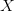
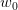
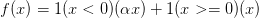

# CS231n 课程笔记翻译：神经网络笔记 1（上）

> 来源：[`zhuanlan.zhihu.com/p/20870307`](https://zhuanlan.zhihu.com/p/21462488)

译者注：本文[智能单元](https://zhuanlan.zhihu.com/intelligentunit)首发，译自斯坦福 CS231n 课程笔记[Neural Nets notes 1](https://link.zhihu.com/?target=http%3A//cs231n.github.io/neural-networks-1/)*，课程教师[Andrej Karpathy](https://link.zhihu.com/?target=http%3A//cs.stanford.edu/people/karpathy/)*授权翻译。本篇教程由[杜客](https://www.zhihu.com/people/du-ke)翻译完成，[巩子嘉](https://www.zhihu.com/people/hmonkey)和[堃堃](https://www.zhihu.com/people/kun-kun-97-81)进行校对修改。译文含公式和代码，建议 PC 端阅读。

## 原文如下

内容列表：

*   不用大脑做类比的快速简介
*   单个神经元建模
    *   生物动机和连接
    *   作为线性分类器的单个神经元
    *   常用的激活函数 ***译者注：上篇翻译截止处***
*   神经网络结构
    *   层组织
    *   前向传播计算例子
    *   表达能力
    *   设置层的数量和尺寸
*   小节
*   参考文献

## 快速简介

在不诉诸大脑的类比的情况下，依然是可以对神经网络算法进行介绍的。在线性分类一节中，在给出图像的情况下，是使用来计算不同视觉类别的评分，其中是一个矩阵，是一个输入列向量，它包含了图像的全部像素数据。在使用数据库 CIFAR-10 的案例中，是一个[3072x1]的列向量，是一个[10x3072]的矩阵，所以输出的评分是一个包含 10 个分类评分的向量。

神经网络算法则不同，它的计算公式是。其中的含义是这样的：举个例子来说，它可以是一个[100x3072]的矩阵，其作用是将图像转化为一个 100 维的过渡向量。函数是非线性的，它会作用到每个元素。这个非线性函数有多种选择，后续将会学到。但这个形式是一个最常用的选择，它就是简单地设置阈值，将所有小于 0 的值变成 0。最终，矩阵的尺寸是[10x100]，因此将得到 10 个数字，这 10 个数字可以解释为是分类的评分。注意非线性函数在计算上是至关重要的，如果略去这一步，那么两个矩阵将会合二为一，对于分类的评分计算将重新变成关于输入的线性函数。这个非线性函数就是*改变*的关键点。参数将通过随机梯度下降来学习到，他们的梯度在反向传播过程中，通过链式法则来求导计算得出。

一个三层的神经网络可以类比地看做，其中是需要进行学习的参数。中间隐层的尺寸是网络的超参数，后续将学习如何设置它们。现在让我们先从神经元或者网络的角度理解上述计算。

## 单个神经元建模

神经网络算法领域最初是被对生物神经系统建模这一目标启发，但随后与其分道扬镳，成为一个工程问题，并在机器学习领域取得良好效果。然而，讨论将还是从对生物系统的一个高层次的简略描述开始，因为神经网络毕竟是从这里得到了启发。

## 生物动机与连接

大脑的基本计算单位是**神经元（****neuron****）**。人类的神经系统中大约有 860 亿个神经元，它们被大约 10¹⁴-10¹⁵ 个**突触（****synapses****）**连接起来。下面图表的左边展示了一个生物学的神经元，右边展示了一个常用的数学模型。每个神经元都从它的**树突**获得输入信号，然后沿着它唯一的**轴突（****axon****）**产生输出信号。轴突在末端会逐渐分枝，通过突触和其他神经元的树突相连。

在神经元的计算模型中，沿着轴突传播的信号（比如）将基于突触的突触强度（比如），与其他神经元的树突进行乘法交互（比如）。其观点是，突触的强度（也就是权重），是可学习的且可以控制一个神经元对于另一个神经元的影响强度（还可以控制影响方向：使其兴奋（正权重）或使其抑制（负权重））。在基本模型中，树突将信号传递到细胞体，信号在细胞体中相加。如果最终之和高于某个阈值，那么神经元将会*激活*，向其轴突输出一个峰值信号。在计算模型中，我们假设峰值信号的准确时间点不重要，是激活信号的频率在交流信息。基于这个*速率编码*的观点，将神经元的激活率建模为**激活函数（****activation function****）**，它表达了轴突上激活信号的频率。由于历史原因，激活函数常常选择使用**sigmoid 函数**，该函数输入实数值（求和后的信号强度），然后将输入值压缩到 0-1 之间。在本节后面部分会看到这些激活函数的各种细节。

————————————————————————————————————————

左边是生物神经元，右边是数学模型。

————————————————————————————————————————

一个神经元前向传播的实例代码如下：

```py
class Neuron(object):
  # ... 
  def forward(inputs):
    """ 假设输入和权重是 1-D 的 numpy 数组，偏差是一个数字 """
    cell_body_sum = np.sum(inputs * self.weights) + self.bias
    firing_rate = 1.0 / (1.0 + math.exp(-cell_body_sum)) # sigmoid 激活函数
    return firing_rate 
```

换句话说，每个神经元都对它的输入和权重进行点积，然后加上偏差，最后使用非线性函数（或称为激活函数）。本例中使用的是 sigmoid 函数。在本节的末尾部分将介绍不同激活函数的细节。

**粗糙模型**：要注意这个对于生物神经元的建模是非常粗糙的：在实际中，有很多不同类型的神经元，每种都有不同的属性。生物神经元的树突可以进行复杂的非线性计算。突触并不就是一个简单的权重，它们是复杂的非线性动态系统。很多系统中，输出的峰值信号的精确时间点非常重要，说明速率编码的近似是不够全面的。鉴于所有这些已经介绍和更多未介绍的简化，如果你画出人类大脑和神经网络之间的类比，有神经科学背景的人对你的板书起哄也是非常自然的。如果你对此感兴趣，可以看看这份[评论](https://link.zhihu.com/?target=https%3A//physics.ucsd.edu/neurophysics/courses/physics_171/annurev.neuro.28.061604.135703.pdf)*或者最新的[另一份](https://link.zhihu.com/?target=http%3A//www.sciencedirect.com/science/article/pii/S0959438814000130)*。**

 **## 作为线性分类器的单个神经元

神经元模型的前向计算数学公式看起来可能比较眼熟。就像在线性分类器中看到的那样，神经元有能力“喜欢”（激活函数值接近 1），或者不喜欢（激活函数值接近 0）输入空间中的某些线性区域。因此，只要在神经元的输出端有一个合适的损失函数，就能让单个神经元变成一个线性分类器。

**二分类 Softmax 分类器**。举例来说，可以把看做其中一个分类的概率，其他分类的概率为，因为它们加起来必须为 1。根据这种理解，可以得到交叉熵损失，这个在线性分一节中已经介绍。然后将它最优化为二分类的 Softmax 分类器（也就是逻辑回归）。因为 sigmoid 函数输出限定在 0-1 之间，所以分类器做出预测的基准是神经元的输出是否大于 0.5。

**二分类 SVM 分类器**。或者可以在神经元的输出外增加一个最大边界折叶损失（max-margin hinge loss）函数，将其训练成一个二分类的支持向量机。

**理解正则化**。在 SVM/Softmax 的例子中，正则化损失从生物学角度可以看做*逐渐遗忘*，因为它的效果是让所有突触权重在参数更新过程中逐渐向着 0 变化。

> 一个单独的神经元可以用来实现一个二分类分类器，比如二分类的 Softmax 或者 SVM 分类器。

## 常用激活函数

每个激活函数（或非线性函数）的输入都是一个数字，然后对其进行某种固定的数学操作。下面是在实践中可能遇到的几种激活函数：

————————————————————————————————————————

左边是 Sigmoid 非线性函数，将实数压缩到[0,1]之间。右边是 tanh 函数，将实数压缩到[-1,1]。

————————————————————————————————————————

**Sigmoid。**sigmoid 非线性函数的数学公式是，函数图像如上图的左边所示。在前一节中已经提到过，它输入实数值并将其“挤压”到 0 到 1 范围内。更具体地说，很大的负数变成 0，很大的正数变成 1。在历史上，sigmoid 函数非常常用，这是因为它对于神经元的激活频率有良好的解释：从完全不激活（0）到在求和后的最大频率处的完全饱和（**saturated**）的激活（1）。然而现在 sigmoid 函数已经不太受欢迎，实际很少使用了，这是因为它有两个主要缺点：

*   *Sigmoid 函数饱和使梯度消失*。sigmoid 神经元有一个不好的特性，就是当神经元的激活在接近 0 或 1 处时会饱和：在这些区域，梯度几乎为 0。回忆一下，在反向传播的时候，这个（局部）梯度将会与整个损失函数关于该门单元输出的梯度相乘。因此，如果局部梯度非常小，那么相乘的结果也会接近零，这会有效地“杀死”梯度，几乎就有没有信号通过神经元传到权重再到数据了。还有，为了防止饱和，必须对于权重矩阵初始化特别留意。比如，如果初始化权重过大，那么大多数神经元将会饱和，导致网络就几乎不学习了。
*   *Sigmoid 函数的输出不是零中心的*。这个性质并不是我们想要的，因为在神经网络后面层中的神经元得到的数据将不是零中心的。这一情况将影响梯度下降的运作，因为如果输入神经元的数据总是正数（比如在中每个元素都），那么关于的梯度在反向传播的过程中，将会要么全部是正数，要么全部是负数（具体依整个表达式而定）。这将会导致梯度下降权重更新时出现 z 字型的下降。然而，可以看到整个批量的数据的梯度被加起来后，对于权重的最终更新将会有不同的正负，这样就从一定程度上减轻了这个问题。因此，该问题相对于上面的神经元饱和问题来说只是个小麻烦，没有那么严重。

**Tanh。**tanh 非线性函数图像如上图右边所示。它将实数值压缩到[-1,1]之间。和 sigmoid 神经元一样，它也存在饱和问题，但是和 sigmoid 神经元不同的是，它的输出是零中心的。因此，在实际操作中，*tanh 非线性函数比 sigmoid 非线性函数更受欢迎*。注意 tanh 神经元是一个简单放大的 sigmoid 神经元，具体说来就是：。

————————————————————————————————————————

左边是 ReLU（校正线性单元：Rectified Linear Unit）激活函数，当时函数值为 0。当函数的斜率为 1。右边是从 [Krizhevsky](https://link.zhihu.com/?target=http%3A//www.cs.toronto.edu/%7Efritz/absps/imagenet.pdf)*等的论文中截取的图表，指明使用 ReLU 比使用 tanh 的收敛快 6 倍。*

 *————————————————————————————————————————

**ReLU。**在近些年 ReLU 变得非常流行。它的函数公式是。换句话说，这个激活函数就是一个关于 0 的阈值（如上图左侧）。使用 ReLU 有以下一些优缺点：

*   优点：相较于 sigmoid 和 tanh 函数，ReLU 对于随机梯度下降的收敛有巨大的加速作用（ [Krizhevsky](https://link.zhihu.com/?target=http%3A//www.cs.toronto.edu/%7Efritz/absps/imagenet.pdf) *等的论文指出有 6 倍之多）。据称这是由它的线性，非饱和的公式导致的。*
**   优点：sigmoid 和 tanh 神经元含有指数运算等耗费计算资源的操作，而 ReLU 可以简单地通过对一个矩阵进行阈值计算得到。*   缺点：在训练的时候，ReLU 单元比较脆弱并且可能“死掉”。举例来说，当一个很大的梯度流过 ReLU 的神经元的时候，可能会导致梯度更新到一种特别的状态，在这种状态下神经元将无法被其他任何数据点再次激活。如果这种情况发生，那么从此所以流过这个神经元的梯度将都变成 0。也就是说，这个 ReLU 单元在训练中将不可逆转的死亡，因为这导致了数据多样化的丢失。例如，如果学习率设置得太高，可能会发现网络中 40%的神经元都会死掉（在整个训练集中这些神经元都不会被激活）。通过合理设置学习率，这种情况的发生概率会降低。*

 ***Leaky ReLU。**Leaky ReLU 是为解决“ReLU 死亡”问题的尝试。ReLU 中当 x<0 时，函数值为 0。而 Leaky ReLU 则是给出一个很小的负数梯度值，比如 0.01。所以其函数公式为其中是一个小的常量。有些研究者的论文指出这个激活函数表现很不错，但是其效果并不是很稳定。Kaiming He 等人在 2015 年发布的论文[Delving Deep into Rectifiers](https://link.zhihu.com/?target=http%3A//arxiv.org/abs/1502.01852)*中介绍了一种新方法 PReLU，把负区间上的斜率当做每个神经元中的一个参数。然而该激活函数在在不同任务中均有益处的一致性并没有特别清晰。*

 ***Maxout。**一些其他类型的单元被提了出来，它们对于权重和数据的内积结果不再使用函数形式。一个相关的流行选择是 Maxout（最近由[Goodfellow](https://link.zhihu.com/?target=http%3A//www-etud.iro.umontreal.ca/%7Egoodfeli/maxout.html)*等发布）神经元。Maxout 是对 ReLU 和 leaky ReLU 的一般化归纳，它的函数是：。ReLU 和 Leaky ReLU 都是这个公式的特殊情况（比如 ReLU 就是当的时候）。这样 Maxout 神经元就拥有 ReLU 单元的所有优点（线性操作和不饱和），而没有它的缺点（死亡的 ReLU 单元）。然而和 ReLU 对比，它每个神经元的参数数量增加了一倍，这就导致整体参数的数量激增。*

 *以上就是一些常用的神经元及其激活函数。最后需要注意一点：在同一个网络中混合使用不同类型的神经元是非常少见的，虽然没有什么根本性问题来禁止这样做。

**一句话**：“*那么该用那种呢？*”用 ReLU 非线性函数。注意设置好学习率，或许可以监控你的网络中死亡的神经元占的比例。如果单元死亡问题困扰你，就试试 Leaky ReLU 或者 Maxout，不要再用 sigmoid 了。也可以试试 tanh，但是其效果应该不如 ReLU 或者 Maxout。

**神经网络笔记 1（上）完。**

## 译者反馈

1.  转载须全文转载注明原文链接，否则保留维权权利；
2.  请知友们通过评论和私信等方式批评指正，贡献者均会补充提及；
3.  感谢[张一凡](https://www.zhihu.com/people/zhang-yifan-34-60)的细节提醒。********