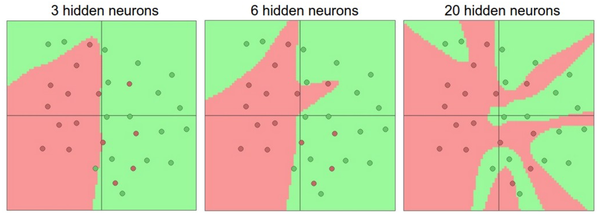
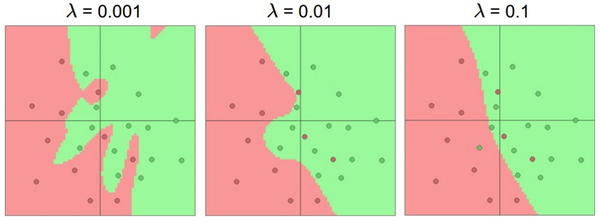

# CS231n 课程笔记翻译：神经网络笔记 1（下）

> 来源：[`zhuanlan.zhihu.com/p/20870307`](https://zhuanlan.zhihu.com/p/21513367)

译者注：本文[智能单元](https://zhuanlan.zhihu.com/intelligentunit)首发，译自斯坦福 CS231n 课程笔记[Neural Nets notes 1](https://link.zhihu.com/?target=http%3A//cs231n.github.io/neural-networks-1/)*，课程教师[Andrej Karpathy](https://link.zhihu.com/?target=http%3A//cs.stanford.edu/people/karpathy/)*授权翻译。本篇教程由[杜客](https://www.zhihu.com/people/du-ke)翻译完成，[李艺颖](https://www.zhihu.com/people/li-yi-ying-73)和[堃堃](https://www.zhihu.com/people/kun-kun-97-81)进行校对修改。译文含公式和代码，建议 PC 端阅读。

## 原文如下

内容列表：

*   不用大脑做类比的快速简介
*   单个神经元建模
    *   生物动机和连接
    *   作为线性分类器的单个神经元
    *   常用的激活函数
*   神经网络结构 ***译者注：下篇翻译起始处***
    *   层组织
    *   前向传播计算例子
    *   表达能力
    *   设置层的数量和尺寸
*   小节
*   参考文献

## 神经网络结构

## 灵活地组织层

**将神经网络算法以神经元的形式图形化。**神经网络被建模成神经元的集合，神经元之间以无环图的形式进行连接。也就是说，一些神经元的输出是另一些神经元的输入。在网络中是不允许循环的，因为这样会导致前向传播的无限循环。通常神经网络模型中神经元是分层的，而不是像生物神经元一样聚合成大小不一的团状。对于普通神经网络，最普通的层的类型是**全连接层（****fully-connected layer****）**。全连接层中的神经元与其前后两层的神经元是完全成对连接的，但是在同一个全连接层内的神经元之间没有连接。下面是两个神经网络的图例，都使用的全连接层：

————————————————————————————————————————

左边是一个 2 层神经网络，隐层由 4 个神经元（也可称为单元（unit））组成，输出层由 2 个神经元组成，输入层是 3 个神经元。右边是一个 3 层神经网络，两个含 4 个神经元的隐层。注意：层与层之间的神经元是全连接的，但是层内的神经元不连接。

————————————————————————————————————————

**命名规则。**当我们说 N 层神经网络的时候，我们没有把输入层算入。因此，单层的神经网络就是没有隐层的（输入直接映射到输出）。因此，有的研究者会说逻辑回归或者 SVM 只是单层神经网络的一个特例。研究者们也会使用*人工神经网络（*Artificial Neural Networks *缩写 ANN）*或者*多层感知器（*Multi-Layer Perceptrons *缩写**MLP）*来指代神经网络。很多研究者并不喜欢神经网络算法和人类大脑之间的类比，他们更倾向于用*单元（unit）*而不是神经元作为术语。

**输出层。**和神经网络中其他层不同，输出层的神经元一般是不会有激活函数的（或者也可以认为它们有一个线性相等的激活函数）。这是因为最后的输出层大多用于表示分类评分值，因此是任意值的实数，或者某种实数值的目标数（比如在回归中）。

**确定网络尺寸。**用来度量神经网络的尺寸的标准主要有两个：一个是神经元的个数，另一个是参数的个数，用上面图示的两个网络举例：

*   第一个网络有 4+2=6 个神经元（输入层不算），[3x4]+[4x2]=20 个权重，还有 4+2=6 个偏置，共 26 个可学习的参数。
*   第二个网络有 4+4+1=9 个神经元，[3x4]+[4x4]+[4x1]=32 个权重，4+4+1=9 个偏置，共 41 个可学习的参数。

为了方便对比，现代卷积神经网络能包含约 1 亿个参数，可由 10-20 层构成（这就是深度学习）。然而，*有效（effective）*连接的个数因为参数共享的缘故大大增多。在后面的卷积神经网络内容中我们将学习更多。

## 前向传播计算举例

*不断重复的矩阵乘法与激活函数交织*。将神经网络组织成层状的一个主要原因，就是这个结构让神经网络算法使用矩阵向量操作变得简单和高效。用上面那个 3 层神经网络举例，输入是[3x1]的向量。一个层所有连接的强度可以存在一个单独的矩阵中。比如第一个隐层的权重**W1**是[4x3]，所有单元的偏置储存在**b1**中，尺寸[4x1]。这样，每个神经元的权重都在**W1**的一个行中，于是矩阵乘法**np.dot(W1, x)**就能计算该层中所有神经元的激活数据。类似的，**W2**将会是[4x4]矩阵，存储着第二个隐层的连接，**W3**是[1x4]的矩阵，用于输出层。完整的 3 层神经网络的前向传播就是简单的 3 次矩阵乘法，其中交织着激活函数的应用。

```py
# 一个 3 层神经网络的前向传播:
f = lambda x: 1.0/(1.0 + np.exp(-x)) # 激活函数(用的 sigmoid)
x = np.random.randn(3, 1) # 含 3 个数字的随机输入向量(3x1)
h1 = f(np.dot(W1, x) + b1) # 计算第一个隐层的激活数据(4x1)
h2 = f(np.dot(W2, h1) + b2) # 计算第二个隐层的激活数据(4x1)
out = np.dot(W3, h2) + b3 # 神经元输出(1x1) 
```

在上面的代码中，**W1，W2，W3，b1，b2，b3**都是网络中可以学习的参数。注意**x**并不是一个单独的列向量，而可以是一个批量的训练数据（其中每个输入样本将会是**x**中的一列），所有的样本将会被并行化的高效计算出来。注意神经网络最后一层通常是没有激活函数的（例如，在分类任务中它给出一个实数值的分类评分）。

> 全连接层的前向传播一般就是先进行一个矩阵乘法，然后加上偏置并运用激活函数。

## 表达能力

理解具有全连接层的神经网络的一个方式是：可以认为它们定义了一个由一系列函数组成的函数族，网络的权重就是每个函数的参数。如此产生的问题是：该函数族的表达能力如何？存在不能被神经网络表达的函数吗？

现在看来，拥有至少一个隐层的神经网络是一个*通用的近似器*。在研究（例如 1989 年的论文[Approximation by Superpositions of Sigmoidal Function](https://link.zhihu.com/?target=http%3A//www.dartmouth.edu/%257Egvc/Cybenko_MCSS.pdf)*，或者[Michael Nielsen](https://link.zhihu.com/?target=http%3A//neuralnetworksanddeeplearning.com/chap4.html)*的这个直观解释。）中已经证明，给出任意连续函数和任意，均存在一个至少含 1 个隐层的神经网络（并且网络中有合理选择的非线性激活函数，比如 sigmoid），对于，使得。换句话说，神经网络可以近似任何连续函数。**

 **既然一个隐层就能近似任何函数，那为什么还要构建更多层来将网络做得更深？答案是：虽然一个 2 层网络在数学理论上能完美地近似所有连续函数，但在实际操作中效果相对较差。在一个维度上，虽然以为参数向量“指示块之和”函数也是通用的近似器，但是谁也不会建议在机器学习中使用这个函数公式。神经网络在实践中非常好用，是因为它们表达出的函数不仅平滑，而且对于数据的统计特性有很好的拟合。同时，网络通过最优化算法（例如梯度下降）能比较容易地学习到这个函数。类似的，虽然在理论上深层网络（使用了多个隐层）和单层网络的表达能力是一样的，但是就实践经验而言，深度网络效果比单层网络好。

另外，在实践中 3 层的神经网络会比 2 层的表现好，然而继续加深（做到 4，5，6 层）很少有太大帮助。卷积神经网络的情况却不同，在卷积神经网络中，对于一个良好的识别系统来说，深度是一个极端重要的因素（比如数十(以 10 为量级)个可学习的层）。对于该现象的一种解释观点是：因为图像拥有层次化结构（比如脸是由眼睛等组成，眼睛又是由边缘组成），所以多层处理对于这种数据就有直观意义。

全面的研究内容还很多，近期研究的进展也很多。如果你对此感兴趣，我么推荐你阅读下面文献：

*   [Deep Learning](https://link.zhihu.com/?target=http%3A//www.deeplearningbook.org/)*的[Chapter6.4](https://link.zhihu.com/?target=http%3A//www.deeplearningbook.org/contents/mlp.html)*，作者是 Bengio 等。**
***   [Do Deep Nets Really Need to be Deep?](https://link.zhihu.com/?target=http%3A//arxiv.org/abs/1312.6184)**   [FitNets: Hints for Thin Deep Nets](https://link.zhihu.com/?target=http%3A//arxiv.org/abs/1412.6550)***

 ***## 设置层的数量和尺寸

在面对一个具体问题的时候该确定网络结构呢？到底是不用隐层呢？还是一个隐层？两个隐层或更多？每个层的尺寸该多大？

首先，要知道当我们增加层的数量和尺寸时，网络的容量上升了。即神经元们可以合作表达许多复杂函数，所以表达函数的空间增加。例如，如果有一个在二维平面上的二分类问题。我们可以训练 3 个不同的神经网络，每个网络都只有一个隐层，但是每层的神经元数目不同：

————————————————————————————————————————

更大的神经网络可以表达更复杂的函数。数据是用不同颜色的圆点表示他们的不同类别，决策边界是由训练过的神经网络做出的。你可以在[ConvNetsJS demo](https://link.zhihu.com/?target=http%3A//cs.stanford.edu/people/karpathy/convnetjs/demo/classify2d.html)*上练练手。*

 *————————————————————————————————————————

在上图中，可以看见有更多神经元的神经网络可以表达更复杂的函数。然而这既是优势也是不足，优势是可以分类更复杂的数据，不足是可能造成对训练数据的过拟合。**过拟合****（Overfitting）**是网络对数据中的噪声有很强的拟合能力，而没有重视数据间（假设）的潜在基本关系。举例来说，有 20 个神经元隐层的网络拟合了所有的训练数据，但是其代价是把决策边界变成了许多不相连的红绿区域。而有 3 个神经元的模型的表达能力只能用比较宽泛的方式去分类数据。它将数据看做是两个大块，并把个别在绿色区域内的红色点看做噪声。在实际中，这样可以在测试数据中获得更好的**泛****化（generalization）**能力。

基于上面的讨论，看起来如果数据不是足够复杂，则似乎小一点的网络更好，因为可以防止过拟合。然而并非如此，防止神经网络的过拟合有很多方法（L2 正则化，dropout 和输入噪音等），后面会详细讨论。在实践中，使用这些方法来控制过拟合比减少网络神经元数目要好得多。

不要减少网络神经元数目的主要原因在于小网络更难使用梯度下降等局部方法来进行训练：虽然小型网络的损失函数的局部极小值更少，也比较容易收敛到这些局部极小值，但是这些最小值一般都很差，损失值很高。相反，大网络拥有更多的局部极小值，但就实际损失值来看，这些局部极小值表现更好，损失更小。因为神经网络是非凸的，就很难从数学上研究这些特性。即便如此，还是有一些文章尝试对这些目标函数进行理解，例如[The Loss Surfaces of Multilayer Networks](https://link.zhihu.com/?target=http%3A//arxiv.org/abs/1412.0233)*这篇论文。在实际中，你将发现如果训练的是一个小网络，那么最终的损失值将展现出多变性：某些情况下运气好会收敛到一个好的地方，某些情况下就收敛到一个不好的极值。从另一方面来说，如果你训练一个大的网络，你将发现许多不同的解决方法，但是最终损失值的差异将会小很多。这就是说，所有的解决办法都差不多，而且对于随机初始化参数好坏的依赖也会小很多。*

 *重申一下，正则化强度是控制神经网络过拟合的好方法。看下图结果：

————————————————————————————————————————

不同正则化强度的效果：每个神经网络都有 20 个隐层神经元，但是随着正则化强度增加，它的决策边界变得更加平滑。你可以在[ConvNetsJS demo](https://link.zhihu.com/?target=http%3A//cs.stanford.edu/people/karpathy/convnetjs/demo/classify2d.html)*上练练手。* 

 *————————————————————————————————————————

需要记住的是：不应该因为害怕出现过拟合而使用小网络。相反，应该进尽可能使用大网络，然后使用正则化技巧来控制过拟合。

## 小结

小结如下：

*   介绍了生物神经元的粗略模型；
*   讨论了几种不同类型的激活函数，其中 ReLU 是最佳推荐；
*   介绍了**神经网络**，神经元通过**全连接层**连接，层间神经元两两相连，但是层内神经元不连接；
*   理解了分层的结构能够让神经网络高效地进行矩阵乘法和激活函数运算；
*   理解了神经网络是一个**通用函数近似器**，但是该性质与其广泛使用无太大关系。之所以使用神经网络，是因为它们对于实际问题中的函数的公式能够某种程度上做出“正确”假设。
*   讨论了更大网络总是更好的这一事实。然而更大容量的模型一定要和更强的正则化（比如更高的权重衰减）配合，否则它们就会过拟合。在后续章节中我们讲学习更多正则化的方法，尤其是 dropout。

    ## 参考资料

*   使用 Theano 的[deeplearning.net tutorial](https://link.zhihu.com/?target=http%3A//www.deeplearning.net/tutorial/mlp.html)
**   [ConvNetJS](https://link.zhihu.com/?target=http%3A//www.deeplearning.net/tutorial/mlp.html)**   [Michael Nielsen's tutorials](https://link.zhihu.com/?target=http%3A//neuralnetworksanddeeplearning.com/chap1.html)**

 ***## 译者反馈

1.  **转载须全文转载且注明原文链接**，否则保留维权权利；
2.  请知友们通过评论和私信等方式批评指正，贡献者均会补充提及。*************