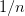
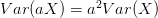
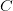

# CS231n 课程笔记翻译：神经网络笔记 2

> 来源：[`zhuanlan.zhihu.com/p/20870307`](https://zhuanlan.zhihu.com/p/21560667)

译者注：本文[智能单元](https://zhuanlan.zhihu.com/intelligentunit)首发，译自斯坦福 CS231n 课程笔记[Neural Nets notes 2](https://link.zhihu.com/?target=http%3A//cs231n.github.io/neural-networks-2/)*，课程教师[Andrej Karpathy](https://link.zhihu.com/?target=http%3A//cs.stanford.edu/people/karpathy/)*授权翻译。本篇教程由[杜客](https://www.zhihu.com/people/du-ke)翻译完成，[堃堃](https://www.zhihu.com/people/kun-kun-97-81)进行校对修改。译文含公式和代码，建议 PC 端阅读。

## 原文如下

内容列表：

*   设置数据和模型
    *   数据预处理
    *   权重初始化
    *   批量归一化（Batch Normalization）
    *   正则化（L2/L1/Maxnorm/Dropout）
*   损失函数
*   小结

## 设置数据和模型

在上一节中介绍了神经元的模型，它在计算内积后进行非线性激活函数计算，神经网络将这些神经元组织成各个层。这些做法共同定义了**评分****函数（score function）**的新形式，该形式是从前面线性分类章节中的简单线性映射发展而来的。具体来说，神经网络就是进行了一系列的线性映射与非线性激活函数交织的运算。本节将讨论更多的算法设计选项，比如数据预处理，权重初始化和损失函数。

## 数据预处理

关于数据预处理我们有 3 个常用的符号，数据矩阵**X**，假设其尺寸是**[N x D]**（**N**是数据样本的数量，**D**是数据的维度）。

**均值减法（****Mean subtraction****）**是预处理最常用的形式。它对数据中每个独立*特征*减去平均值，从几何上可以理解为在每个维度上都将数据云的中心都迁移到原点。在 numpy 中，该操作可以通过代码**X -= np.mean(X, axis=0)**实现。而对于图像，更常用的是对所有像素都减去一个值，可以用**X -= np.mean(X)**实现，也可以在 3 个颜色通道上分别操作。

**归一化（****Normalization****）**是指将数据的所有维度都归一化，使其数值范围都近似相等。有两种常用方法可以实现归一化。第一种是先对数据做零中心化（zero-centered）处理，然后每个维度都除以其标准差，实现代码为**X /= np.std(X, axis=0)**。第二种方法是对每个维度都做归一化，使得每个维度的最大和最小值是 1 和-1。这个预处理操作只有在确信不同的输入特征有不同的数值范围（或计量单位）时才有意义，但要注意预处理操作的重要性几乎等同于学习算法本身。在图像处理中，由于像素的数值范围几乎是一致的（都在 0-255 之间），所以进行这个额外的预处理步骤并不是很必要。

——————————————————————————————————————————

一般数据预处理流程：**左边：**原始的 2 维输入数据。**中间：**在每个维度上都减去平均值后得到零中心化数据，现在数据云是以原点为中心的。**右边：**每个维度都除以其标准差来调整其数值范围。红色的线指出了数据各维度的数值范围，在中间的零中心化数据的数值范围不同，但在右边归一化数据中数值范围相同。

——————————————————————————————————————————

**PCA 和白化（****Whitening****）**是另一种预处理形式。在这种处理中，先对数据进行零中心化处理，然后计算协方差矩阵，它展示了数据中的相关性结构。

```py
# 假设输入数据矩阵 X 的尺寸为[N x D]
X -= np.mean(X, axis = 0) # 对数据进行零中心化(重要)
cov = np.dot(X.T, X) / X.shape[0] # 得到数据的协方差矩阵 
```

数据协方差矩阵的第(i, j)个元素是数据第 i 个和第 j 个维度的*协方差*。具体来说，该矩阵的对角线上的元素是方差。还有，协方差矩阵是对称和[半正定](https://link.zhihu.com/?target=https%3A//en.wikipedia.org/wiki/Positive-definite_matrix%23Negative-definite.2C_semidefinite_and_indefinite_matrices)*的。我们可以对数据协方差矩阵进行 SVD（奇异值分解）运算。* 

 *```py
U,S,V = np.linalg.svd(cov) 
```

U 的列是特征向量，S 是装有奇异值的 1 维数组（因为 cov 是对称且半正定的，所以 S 中元素是特征值的平方）。为了去除数据相关性，将已经零中心化处理过的原始数据投影到特征基准上：

```py
Xrot = np.dot(X,U) # 对数据去相关性 
```

注意 U 的列是标准正交向量的集合（范式为 1，列之间标准正交），所以可以把它们看做标准正交基向量。因此，投影对应 x 中的数据的一个旋转，旋转产生的结果就是新的特征向量。如果计算**Xrot**的协方差矩阵，将会看到它是对角对称的。**np.linalg.svd**的一个良好性质是在它的返回值**U**中，特征向量是按照特征值的大小排列的。我们可以利用这个性质来对数据降维，只要使用前面的小部分特征向量，丢弃掉那些包含的数据没有**方差**的维度。 这个操作也被称为主成分分析（ [Principal Component Analysis](https://link.zhihu.com/?target=http%3A//en.wikipedia.org/wiki/Principal_component_analysis) *简称 PCA）降维：*

 *```py
Xrot_reduced = np.dot(X, U[:,:100]) # Xrot_reduced 变成 [N x 100] 
```

经过上面的操作，将原始的数据集的大小由[N x D]降到了[N x 100]，留下了数据中包含最大**方差**的 100 个维度。通常使用 PCA 降维过的数据训练线性分类器和神经网络会达到非常好的性能效果，同时还能节省时间和存储器空间。

最后一个在实践中会看见的变换是**白化（****whitening****）**。白化操作的输入是特征基准上的数据，然后对每个维度除以其特征值来对数值范围进行归一化。该变换的几何解释是：如果数据服从多变量的高斯分布，那么经过白化后，数据的分布将会是一个均值为零，且协方差相等的矩阵。该操作的代码如下：

```py
# 对数据进行白化操作:
# 除以特征值 
Xwhite = Xrot / np.sqrt(S + 1e-5) 
```

*警告：夸大的噪声*。注意分母中添加了 1e-5（或一个更小的常量）来防止分母为 0。该变换的一个缺陷是在变换的过程中可能会夸大数据中的噪声，这是因为它将所有维度都拉伸到相同的数值范围，这些维度中也包含了那些只有极少差异性(方差小)而大多是噪声的维度。在实际操作中，这个问题可以用更强的平滑来解决（例如：采用比 1e-5 更大的值）。

——————————————————————————————————————————

PCA/白化。**左边**是二维的原始数据。**中间**：经过 PCA 操作的数据。可以看出数据首先是零中心的，然后变换到了数据协方差矩阵的基准轴上。这样就对数据进行了解相关（协方差矩阵变成对角阵）。**右边**：每个维度都被特征值调整数值范围，将数据协方差矩阵变为单位矩阵。从几何上看，就是对数据在各个方向上拉伸压缩，使之变成服从高斯分布的一个数据点分布。

——————————————————————————————————————————

我们可以使用 CIFAR-10 数据将这些变化可视化出来。CIFAR-10 训练集的大小是 50000x3072，其中每张图片都可以拉伸为 3072 维的行向量。我们可以计算[3072 x 3072]的协方差矩阵然后进行奇异值分解（比较耗费计算性能），那么经过计算的特征向量看起来是什么样子呢？

—————————————————————————————————————————

**最左**：一个用于演示的集合，含 49 张图片。**左二**：3072 个特征值向量中的前 144 个。靠前面的特征向量解释了数据中大部分的方差，可以看见它们与图像中较低的频率相关。**第三张**是 49 张经过了 PCA 降维处理的图片，展示了 144 个特征向量。这就是说，展示原始图像是每个图像用 3072 维的向量，向量中的元素是图片上某个位置的像素在某个颜色通道中的亮度值。而现在每张图片只使用了一个 144 维的向量，其中每个元素表示了特征向量对于组成这张图片的贡献度。为了让图片能够正常显示，需要将 144 维度重新变成基于像素基准的 3072 个数值。因为 U 是一个旋转，可以通过乘以 U.transpose()[:144,:]来实现，然后将得到的 3072 个数值可视化。可以看见图像变得有点模糊了，这正好说明前面的特征向量获取了较低的频率。然而，大多数信息还是保留了下来。**最右**：将“白化”后的数据进行显示。其中 144 个维度中的方差都被压缩到了相同的数值范围。然后 144 个白化后的数值通过乘以 U.transpose()[:144,:]转换到图像像素基准上。现在较低的频率（代表了大多数方差）可以忽略不计了，较高的频率（代表相对少的方差）就被夸大了。

——————————————————————————————————————————

**实践操作。**在这个笔记中提到 PCA 和白化主要是为了介绍的完整性，实际上在卷积神经网络中并不会采用这些变换。然而对数据进行零中心化操作还是非常重要的，对每个像素进行归一化也很常见。

**常见错误。**进行预处理很重要的一点是：任何预处理策略（比如数据均值）都只能在训练集数据上进行计算，算法训练完毕后再应用到验证集或者测试集上。例如，如果先计算整个数据集图像的平均值然后每张图片都减去平均值，最后将整个数据集分成训练/验证/测试集，那么这个做法是错误的。**应该怎么做呢？应该先分成训练/验证/测试集，只是从训练集中求图片平均值，然后各个集（训练/验证/测试集）中的图像再减去这个平均值。**

***译者注：此处确为初学者常见错误，请务必注意！***

## 权重初始化

我们已经看到如何构建一个神经网络的结构并对数据进行预处理，但是在开始训练网络之前，还需要初始化网络的参数。

**错误：全零初始化。**让我们从应该避免的错误开始。在训练完毕后，虽然不知道网络中每个权重的最终值应该是多少，但如果数据经过了恰当的归一化的话，就可以假设所有权重数值中大约一半为正数，一半为负数。这样，一个听起来蛮合理的想法就是把这些权重的初始值都设为 0 吧，因为在期望上来说 0 是最合理的猜测。这个做法错误的！因为如果网络中的每个神经元都计算出同样的输出，然后它们就会在反向传播中计算出同样的梯度，从而进行同样的参数更新。换句话说，如果权重被初始化为同样的值，神经元之间就失去了不对称性的源头。

**小随机数初始化。**因此，权重初始值要非常接近 0 又不能等于 0。解决方法就是将权重初始化为很小的数值，以此来*打破对称性*。其思路是：如果神经元刚开始的时候是随机且不相等的，那么它们将计算出不同的更新，并将自身变成整个网络的不同部分。小随机数权重初始化的实现方法是：**W = 0.01 * np.random.randn(D,H)。**其中**randn**函数是基于零均值和标准差的一个高斯分布（***译者注：国内教程一般习惯称均值参数为期望***）来生成随机数的。根据这个式子，每个神经元的权重向量都被初始化为一个随机向量，而这些随机向量又服从一个多变量高斯分布，这样在输入空间中，所有的神经元的指向是随机的。也可以使用均匀分布生成的随机数，但是从实践结果来看，对于算法的结果影响极小。

***警告**。*并不是小数值一定会得到好的结果。例如，一个神经网络的层中的权重值很小，那么在反向传播的时候就会计算出非常小的梯度（因为梯度与权重值是成比例的）。这就会很大程度上减小反向传播中的“梯度信号”，在深度网络中，就会出现问题。

**使用 1/sqrt(n)校准方差****。**上面做法存在一个问题，随着输入数据量的增长，随机初始化的神经元的输出数据的分布中的方差也在增大。我们可以除以输入数据量的平方根来调整其数值范围，这样神经元输出的方差就归一化到 1 了。也就是说，建议将神经元的权重向量初始化为：**w = np.random.randn(n) / sqrt(n)。**其中**n**是输入数据的数量。这样就保证了网络中所有神经元起始时有近似同样的输出分布。实践经验证明，这样做可以提高收敛的速度。

上述结论的推导过程如下：假设权重和输入之间的内积为，这是还没有进行非线性激活函数运算之前的原始数值。我们可以检查的方差：


![\displaystyle =\sum^n_i[E(w_i)]²Var(x_i)+E[(x_i)]²Var(w_i)+Var(xIi)Var(w_i)](../Images/c6026ee82299ae5d91360deb8c59ddbb.png)


在前两步，使用了[方差的性质](https://link.zhihu.com/?target=http%3A//en.wikipedia.org/wiki/Variance)*。在第三步，因为假设输入和权重的平均值都是 0，所以![E[x_i]=E[w_i]=0](../Images/2f231af7bbc8b91a732cc6cadd34c57f.png)。注意这并不是一般化情况，比如在 ReLU 单元中均值就为正。在最后一步，我们假设所有的都服从同样的分布。从这个推导过程我们可以看见，如果想要有和输入一样的方差，那么在初始化的时候必须保证每个权重的方差是。又因为对于一个随机变量和标量，有，这就说明可以基于一个标准高斯分布，然后除以，使其方差为，于是得出：**w = np.random.randn(n) / sqrt(n)**。*

 *Glorot 等在论文[Understanding the difficulty of training deep feedforward neural networks](https://link.zhihu.com/?target=http%3A//jmlr.org/proceedings/papers/v9/glorot10a/glorot10a.pdf)*中作出了类似的分析。在论文中，作者推荐初始化公式为，其中是在前一层和后一层中单元的个数。这是基于妥协和对反向传播中梯度的分析得出的结论。该主题下最新的一篇论文是：[Delving Deep into Rectifiers: Surpassing Human-Level Performance on ImageNet Classification](https://link.zhihu.com/?target=http%3A//arxiv-web3.library.cornell.edu/abs/1502.01852)*，作者是 He 等人。文中给出了一种针对 ReLU 神经元的特殊初始化，并给出结论：网络中神经元的方差应该是。代码为**w = np.random.randn(n) * sqrt(2.0/n)**。这个形式是神经网络算法使用 ReLU 神经元时的当前最佳推荐。**

 ****稀疏初始化（****Sparse initialization****）。**另一个处理非标定方差的方法是将所有权重矩阵设为 0，但是为了打破对称性，每个神经元都同下一层固定数目的神经元随机连接（其权重数值由一个小的高斯分布生成）。一个比较典型的连接数目是 10 个。

**偏置（biases）的初始化。**通常将偏置初始化为 0，这是因为随机小数值权重矩阵已经打破了对称性。对于 ReLU 非线性激活函数，有研究人员喜欢使用如 0.01 这样的小数值常量作为所有偏置的初始值，这是因为他们认为这样做能让所有的 ReLU 单元一开始就激活，这样就能保存并传播一些梯度。然而，这样做是不是总是能提高算法性能并不清楚（有时候实验结果反而显示性能更差），所以通常还是使用 0 来初始化偏置参数。

**实践。**当前的推荐是使用 ReLU 激活函数，并且使用**w = np.random.randn(n) * sqrt(2.0/n)**来进行权重初始化，关于这一点，[这篇文章](https://link.zhihu.com/?target=http%3A//arxiv-web3.library.cornell.edu/abs/1502.01852)*有讨论。*

 ***批量归一化（****Batch Normalization****）。**[批量归一化](https://link.zhihu.com/?target=http%3A//arxiv.org/abs/1502.03167)*是 loffe 和 Szegedy 最近才提出的方法，该方法减轻了如何合理初始化神经网络这个棘手问题带来的头痛：），其做法是让激活数据在训练开始前通过一个网络，网络处理数据使其服从标准高斯分布。因为归一化是一个简单可求导的操作，所以上述思路是可行的。在实现层面，应用这个技巧通常意味着全连接层（或者是卷积层，后续会讲）与激活函数之间添加一个 BatchNorm 层。对于这个技巧本节不会展开讲，因为上面的参考文献中已经讲得很清楚了，需要知道的是在神经网络中使用批量归一化已经变得非常常见。在实践中，使用了批量归一化的网络对于不好的初始值有更强的鲁棒性。最后一句话总结：批量归一化可以理解为在网络的每一层之前都做预处理，只是这种操作以另一种方式与网络集成在了一起。搞定！*

## 正则化 Regularization

有不少方法是通过控制神经网络的容量来防止其过拟合的：

**L2 正则化**可能是最常用的正则化方法了。可以通过惩罚目标函数中所有参数的平方将其实现。即对于网络中的每个权重，向目标函数中增加一个，其中是正则化强度。前面这个很常见，是因为加上后，该式子关于梯度就是而不是了。L2 正则化可以直观理解为它对于大数值的权重向量进行严厉惩罚，倾向于更加分散的权重向量。在线性分类章节中讨论过，由于输入和权重之间的乘法操作，这样就有了一个优良的特性：使网络更倾向于使用所有输入特征，而不是严重依赖输入特征中某些小部分特征。最后需要注意在梯度下降和参数更新的时候，使用 L2 正则化意味着所有的权重都以**w += -lambda * W**向着 0 线性下降。

**L1 正则化**是另一个相对常用的正则化方法。对于每个我们都向目标函数增加一个。L1 和 L2 正则化也可以进行组合：，这也被称作[Elastic net regularizaton](https://link.zhihu.com/?target=http%3A//web.stanford.edu/%257Ehastie/Papers/B67.2%2520%25282005%2529%2520301-320%2520Zou%2520%26%2520Hastie.pdf)*。L1 正则化有一个有趣的性质，它会让权重向量在最优化的过程中变得稀疏（即非常接近 0）。也就是说，使用 L1 正则化的神经元最后使用的是它们最重要的输入数据的稀疏子集，同时对于噪音输入则几乎是不变的了。相较 L1 正则化，L2 正则化中的权重向量大多是分散的小数字。在实践中，如果不是特别关注某些明确的特征选择，一般说来 L2 正则化都会比 L1 正则化效果好。*

 ***最大范式约束（Max norm constraints）。**另一种形式的正则化是给每个神经元中权重向量的量级设定上限，并使用投影梯度下降来确保这一约束。在实践中，与之对应的是参数更新方式不变，然后要求神经元中的权重向量必须满足这一条件，一般值为 3 或者 4。有研究者发文称在使用这种正则化方法时效果更好。这种正则化还有一个良好的性质，即使在学习率设置过高的时候，网络中也不会出现数值“爆炸”，这是因为它的参数更新始终是被限制着的。

**随机失活（Dropout）**是一个简单又极其有效的正则化方法。该方法由 Srivastava 在论文[Dropout: A Simple Way to Prevent Neural Networks from Overfitting](https://link.zhihu.com/?target=http%3A//www.cs.toronto.edu/%257Ersalakhu/papers/srivastava14a.pdf)*中提出的，与 L1 正则化，L2 正则化和最大范式约束等方法互为补充。在训练的时候，随机失活的实现方法是让神经元以超参数的概率被激活或者被设置为 0。* 

 *—————————————————————————————————————————

图片来源自[论文](https://link.zhihu.com/?target=http%3A//www.cs.toronto.edu/%7Ersalakhu/papers/srivastava14a.pdf)*，展示其核心思路。在训练过程中，随机失活可以被认为是对完整的神经网络抽样出一些子集，每次基于输入数据只更新子网络的参数（然而，数量巨大的子网络们并不是相互独立的，因为它们都共享参数）。在测试过程中不使用随机失活，可以理解为是对数量巨大的子网络们做了模型集成（model ensemble），以此来计算出一个平均的预测。* 

 *—————————————————————————————————————————

一个 3 层神经网络的普通版随机失活可以用下面代码实现：

```py
""" 普通版随机失活: 不推荐实现 (看下面笔记) """

p = 0.5 # 激活神经元的概率. p 值更高 = 随机失活更弱

def train_step(X):
  """ X 中是输入数据 """

  # 3 层 neural network 的前向传播
  H1 = np.maximum(0, np.dot(W1, X) + b1)
  U1 = np.random.rand(*H1.shape) < p # 第一个随机失活遮罩
  H1 *= U1 # drop!
  H2 = np.maximum(0, np.dot(W2, H1) + b2)
  U2 = np.random.rand(*H2.shape) < p # 第二个随机失活遮罩
  H2 *= U2 # drop!
  out = np.dot(W3, H2) + b3

  # 反向传播:计算梯度... (略)
  # 进行参数更新... (略)

def predict(X):
  # 前向传播时模型集成
  H1 = np.maximum(0, np.dot(W1, X) + b1) * p # 注意：激活数据要乘以 p
  H2 = np.maximum(0, np.dot(W2, H1) + b2) * p # 注意：激活数据要乘以 p
  out = np.dot(W3, H2) + b3 
```

在上面的代码中，**train_step**函数在第一个隐层和第二个隐层上进行了两次随机失活。在输入层上面进行随机失活也是可以的，为此需要为输入数据**X 创建**一个二值的遮罩。反向传播保持不变，但是肯定需要将遮罩**U1**和**U2**加入进去。

注意：在**predict**函数中不进行随机失活，但是对于两个隐层的输出都要乘以，调整其数值范围。这一点非常重要，因为在测试时所有的神经元都能看见它们的输入，因此我们想要神经元的输出与训练时的预期输出是一致的。以为例，在测试时神经元必须把它们的输出减半，这是因为在训练的时候它们的输出只有一半。为了理解这点，先假设有一个神经元的输出，那么进行随机失活的时候，该神经元的输出就是，这是有的概率神经元的输出为 0。在测试时神经元总是激活的，就必须调整来保持同样的预期输出。在测试时会在所有可能的二值遮罩（也就是数量庞大的所有子网络）中迭代并计算它们的协作预测，进行这种减弱的操作也可以认为是与之相关的。

上述操作不好的性质是必须在测试时对激活数据要按照进行数值范围调整。既然测试性能如此关键，实际更倾向使用**反向随机失活（inverted dropout）**，它是在训练时就进行数值范围调整，从而让前向传播在测试时保持不变。这样做还有一个好处，无论你决定是否使用随机失活，预测方法的代码可以保持不变。反向随机失活的代码如下：

```py
""" 
反向随机失活: 推荐实现方式.
在训练的时候 drop 和调整数值范围，测试时不做任何事.
"""

p = 0.5 # 激活神经元的概率. p 值更高 = 随机失活更弱

def train_step(X):
  # 3 层 neural network 的前向传播
  H1 = np.maximum(0, np.dot(W1, X) + b1)
  U1 = (np.random.rand(*H1.shape) < p) / p # 第一个随机失活遮罩. 注意/p!
  H1 *= U1 # drop!
  H2 = np.maximum(0, np.dot(W2, H1) + b2)
  U2 = (np.random.rand(*H2.shape) < p) / p # 第二个随机失活遮罩. 注意/p!
  H2 *= U2 # drop!
  out = np.dot(W3, H2) + b3

  # 反向传播:计算梯度... (略)
  # 进行参数更新... (略)

def predict(X):
  # 前向传播时模型集成
  H1 = np.maximum(0, np.dot(W1, X) + b1) # 不用数值范围调整了
  H2 = np.maximum(0, np.dot(W2, H1) + b2)
  out = np.dot(W3, H2) + b3 
```

在随机失活发布后，很快有大量研究为什么它的实践效果如此之好，以及它和其他正则化方法之间的关系。如果你感兴趣，可以看看这些文献：

*   [Dropout paper](https://link.zhihu.com/?target=http%3A//www.cs.toronto.edu/%257Ersalakhu/papers/srivastava14a.pdf) *by Srivastava et al. 2014.*

**   [Dropout Training as Adaptive Regularization](https://link.zhihu.com/?target=http%3A//papers.nips.cc/paper/4882-dropout-training-as-adaptive-regularization.pdf)*：“我们认为：在使用费希尔信息矩阵（[fisher information matrix](https://link.zhihu.com/?target=https%3A//en.wikipedia.org/wiki/Fisher_information_metric)*）的对角逆矩阵的期望对特征进行数值范围调整后，再进行 L2 正则化这一操作，与随机失活正则化是一阶相等的。”*** 

 *****前向传播中的噪音。**在更一般化的分类上，随机失活属于网络在前向传播中有随机行为的方法。测试时，通过*分析法*（在使用随机失活的本例中就是乘以）或*数值法*（例如通过抽样出很多子网络，随机选择不同子网络进行前向传播，最后对它们取平均）将噪音边缘化。在这个方向上的另一个研究是[DropConnect](https://link.zhihu.com/?target=http%3A//cs.nyu.edu/%257Ewanli/dropc/)*，它在前向传播的时候，一系列权重被随机设置为 0。提前说一下，卷积神经网络同样会吸取这类方法的优点，比如随机汇合（stochastic pooling），分级汇合（fractional pooling），数据增长（data augmentation）。我们在后面会详细介绍。*

 ***偏置正则化。**在线性分类器的章节中介绍过，对于偏置参数的正则化并不常见，因为它们在矩阵乘法中和输入数据并不产生互动，所以并不需要控制其在数据维度上的效果。然而在实际应用中（使用了合理数据预处理的情况下），对偏置进行正则化也很少会导致算法性能变差。这可能是因为相较于权重参数，偏置参数实在太少，所以分类器需要它们来获得一个很好的数据损失，那么还是能够承受的。

**每层正则化。**对于不同的层进行不同强度的正则化很少见（可能除了输出层以外），关于这个思路的相关文献也很少。

**实践**：通过交叉验证获得一个全局使用的 L2 正则化强度是比较常见的。在使用 L2 正则化的同时在所有层后面使用随机失活也很常见。值一般默认设为 0.5，也可能在验证集上调参。

## 损失函数

我们已经讨论过损失函数的正则化损失部分，它可以看做是对模型复杂程度的某种惩罚。损失函数的第二个部分是*数据损失*，它是一个有监督学习问题，用于衡量分类算法的预测结果（即分类评分）和真实标签结果之间的一致性。数据损失是对所有样本的数据损失求平均。也就是说，中，是训练集数据的样本数。让我们把神经网络中输出层的激活函数简写为，在实际中你可能需要解决以下几类问题：

**分类问题**是我们一直讨论的。在该问题中，假设有一个装满样本的数据集，每个样本都有一个唯一的正确标签（是固定分类标签之一）。在这类问题中，一个最常见的损失函数就是 SVM（是 Weston Watkins 公式）：


之前简要提起过，有些学者的论文中指出平方折叶损失（即使用）算法的结果会更好。第二个常用的损失函数是 Softmax 分类器，它使用交叉熵损失：


**问题：类别数目巨大。**当标签集非常庞大（例如字典中的所有英语单词，或者 ImageNet 中的 22000 种分类），就需要使用*分层 Softmax（**Hierarchical Softmax**）*了（[参考文献](https://link.zhihu.com/?target=http%3A//arxiv.org/pdf/1310.4546.pdf)*）。分层 softmax 将标签分解成一个树。每个标签都表示成这个树上的一个路径，这个树的每个节点处都训练一个 Softmax 分类器来在左和右分枝之间做决策。树的结构对于算法的最终结果影响很大，而且一般需要具体问题具体分析。*

 ***属性（Attribute）分类。**上面两个损失公式的前提，都是假设每个样本只有一个正确的标签。但是如果是一个二值向量，每个样本可能有，也可能没有某个属性，而且属性之间并不相互排斥呢？比如在 Instagram 上的图片，就可以看成是被一个巨大的标签集合中的某个子集打上标签，一张图片上可能有多个标签。在这种情况下，一个明智的方法是为每个属性创建一个独立的二分类的分类器。例如，针对每个分类的二分类器会采用下面的公式：


上式中，求和是对所有分类，的值为 1 或者-1，具体根据第 i 个样本是否被第 j 个属性打标签而定，当该类别被正确预测并展示的时候，分值向量为正，其余情况为负。可以发现，当一个正样本的得分小于+1，或者一个负样本得分大于-1 的时候，算法就会累计损失值。

另一种方法是对每种属性训练一个独立的逻辑回归分类器。二分类的逻辑回归分类器只有两个分类（0，1），其中对于分类 1 的概率计算为：


因为类别 0 和类别 1 的概率和为 1，所以类别 0 的概率为：。这样，如果或者，那么样本就要被分类成为正样本（y=1）。然后损失函数最大化这个对数似然函数，问题可以简化为：


上式中，假设标签非 0 即 1，就是 sigmoid 函数。上面的公式看起来吓人，但是的梯度实际上非常简单：（你可以自己求导来验证）。

**回归问题**是预测实数的值的问题，比如预测房价，预测图片中某个东西的长度等。对于这种问题，通常是计算预测值和真实值之间的损失。然后用 L2 平方范式或 L1 范式度量差异。对于某个样本，L2 范式计算如下：


之所以在目标函数中要进行平方，是因为梯度算起来更加简单。因为平方是一个单调运算，所以不用改变最优参数。L1 范式则是要将每个维度上的绝对值加起来：


在上式中，如果有多个数量被预测了，就要对预测的所有维度的预测求和，即。观察第 i 个样本的第 j 维，用表示预测值与真实值之间的差异。关于该维度的梯度（也就是）能够轻松地通过被求导为 L2 范式的或。这就是说，评分值的梯度要么与误差中的差值直接成比例，要么是固定的并从差值中继承 sign。

*注意*：L2 损失比起较为稳定的 Softmax 损失来，其最优化过程要困难很多。直观而言，它需要网络具备一个特别的性质，即对于每个输入（和增量）都要输出一个确切的正确值。而在 Softmax 中就不是这样，每个评分的准确值并不是那么重要：只有当它们量级适当的时候，才有意义。还有，L2 损失鲁棒性不好，因为异常值可以导致很大的梯度。所以在面对一个回归问题时，先考虑将输出变成二值化是否真的不够用。例如，如果对一个产品的星级进行预测，使用 5 个独立的分类器来对 1-5 星进行打分的效果一般比使用一个回归损失要好很多。分类还有一个额外优点，就是能给出关于回归的输出的分布，而不是一个简单的毫无把握的输出值。如果确信分类不适用，那么使用 L2 损失吧，但是一定要谨慎：L2 非常脆弱，在网络中使用随机失活（尤其是在 L2 损失层的上一层）不是好主意。

> 当面对一个回归任务，首先考虑是不是必须这样。一般而言，尽量把你的输出变成二分类，然后对它们进行分类，从而变成一个分类问题。

**结构化预测（s****tructured prediction****）。**结构化损失是指标签可以是任意的结构，例如图表、树或者其他复杂物体的情况。通常这种情况还会假设结构空间非常巨大，不容易进行遍历。结构化 SVM 背后的基本思想就是在正确的结构和得分最高的非正确结构之间画出一个边界。解决这类问题，并不是像解决一个简单无限制的最优化问题那样使用梯度下降就可以了，而是需要设计一些特殊的解决方案，这样可以有效利用对于结构空间的特殊简化假设。我们简要地提一下这个问题，但是详细内容就超出本课程范围。

## 小结

小结如下：

*   推荐的预处理操作是对数据的每个特征都进行零中心化，然后将其数值范围都归一化到[-1,1]范围之内。
*   使用标准差为的高斯分布来初始化权重，其中是输入的神经元数。例如用 numpy 可以写作：**w = np.random.randn(n) * sqrt(2.0/n)**。
*   使用 L2 正则化和随机失活的倒置版本。
*   使用批量归一化。
*   讨论了在实践中可能要面对的不同任务，以及每个任务对应的常用损失函数。

现在，我们预处理了数据，初始化了模型。在下一节中，我们将讨论算法的学习过程及其运作特性。

## 译者反馈

1.  **转载须全文转载且注明原文链接**，否则保留维权权利；
2.  感谢知友@[陈狄](https://www.zhihu.com/people/chen-di-cd)和@[韩劼群](https://www.zhihu.com/people/han-jie-qun)的建议，本系列对于**model ensemble**将固定翻译为**模型集成**；
3.  感谢知友@[天堂之拳](https://www.zhihu.com/people/clarkzdyhit)的细致指正和讨论，本系列对于**pooling**将固定翻译为**汇合；**
4.  感谢知友@[陈狄](https://www.zhihu.com/people/chen-di-cd)和@[韩劼群](https://www.zhihu.com/people/han-jie-qun)的建议，本系列对于**dropout**将固定翻译为**随机失活**；
5.  针对部分知友建议保留英文不做翻译的建议，请参考下方我的回复中关于 Emil Cioran 名句的引用，以及我的个人态度；
6.  请知友们通过评论和私信等方式批评指正，贡献者均会补充提及。*****************