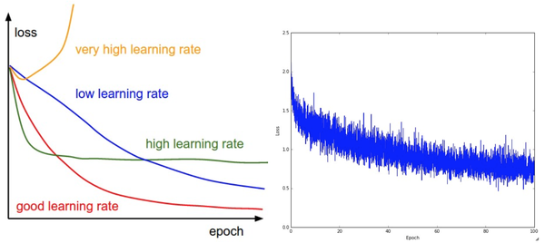
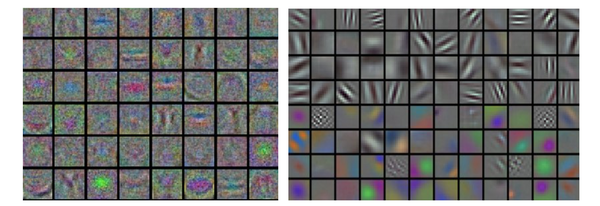

# CS231n 课程笔记翻译：神经网络笔记 3（上）

> 来源：[`zhuanlan.zhihu.com/p/20870307`](https://zhuanlan.zhihu.com/p/21741716)

译者注：本文[智能单元](https://zhuanlan.zhihu.com/intelligentunit)首发，译自斯坦福 CS231n 课程笔记[Neural Nets notes 3](https://link.zhihu.com/?target=http%3A//cs231n.github.io/neural-networks-3/)*，课程教师[Andrej Karpathy](https://link.zhihu.com/?target=http%3A//cs.stanford.edu/people/karpathy/)*授权翻译。本篇教程由[杜客](https://www.zhihu.com/people/du-ke)翻译完成，[堃堃](https://www.zhihu.com/people/kun-kun-97-81)和[巩子嘉](https://www.zhihu.com/people/hmonkey)进行校对修改。译文含公式和代码，建议 PC 端阅读。

## 原文如下

内容列表：

*   梯度检查
*   合理性（Sanity）检查
*   检查学习过程
    *   损失函数
    *   训练集与验证集准确率
    *   权重：更新比例
    *   每层的激活数据与梯度分布
    *   可视化 ***译者注：上篇翻译截止处***
*   参数更新
    *   一阶（随机梯度下降）方法，动量方法，Nesterov 动量方法
    *   学习率退火
    *   二阶方法
    *   逐参数适应学习率方法（Adagrad，RMSProp）
*   超参数调优
*   评价
    *   模型集成
*   总结
*   拓展引用

## 学习过程

在前面章节中，我们讨论了神经网络的静态部分：如何创建网络的连接、数据和损失函数。本节将致力于讲解神经网络的动态部分，即神经网络学习参数和搜索最优超参数的过程。

## 梯度检查

理论上将进行梯度检查很简单，就是简单地把解析梯度和数值计算梯度进行比较。然而从实际操作层面上来说，这个过程更加复杂且容易出错。下面是一些提示、技巧和需要仔细注意的事情：

**使用中心化公式。**在使用有限差值近似来计算数值梯度的时候，常见的公式是：


其中是一个很小的数字，在实践中近似为 1e-5。在实践中证明，使用*中心化*公式效果更好：


该公式在检查梯度的每个维度的时候，会要求计算两次损失函数（所以计算资源的耗费也是两倍），但是梯度的近似值会准确很多。要理解这一点，对和使用泰勒展开，可以看到第一个公式的误差近似，第二个公式的误差近似（是个二阶近似）。***（译者注：泰勒展开相关内容可阅读《高等数学》第十二章第四节：函数展开成幂级数。）***

**使用相对误差来比较**。比较数值梯度和解析梯度的细节有哪些？如何得知此两者不匹配？你可能会倾向于监测它们的差的绝对值或者差的平方值，然后定义该值如果超过某个规定阈值，就判断梯度实现失败。然而该思路是有问题的。想想，假设这个差值是 1e-4，如果两个梯度值在 1.0 左右，这个差值看起来就很合适，可以认为两个梯度是匹配的。然而如果梯度值是 1e-5 或者更低，那么 1e-4 就是非常大的差距，梯度实现肯定就是失败的了。因此，使用*相对误差*总是更合适一些：


上式考虑了差值占两个梯度绝对值的比例。注意通常相对误差公式只包含两个式子中的一个（任意一个均可），但是我更倾向取两个式子的最大值或者取两个式子的和。这样做是为了防止在其中一个式子为 0 时，公式分母为 0（这种情况，在 ReLU 中是经常发生的）。然而，还必须注意两个式子都为零且通过梯度检查的情况。在实践中：

*   相对误差>1e-2：通常就意味着梯度可能出错。

*   1e-2>相对误差>1e-4：要对这个值感到不舒服才行。

*   1e-4>相对误差：这个值的相对误差对于有不可导点的目标函数是 OK 的。但如果目标函数中没有 kink（使用 tanh 和 softmax），那么相对误差值还是太高。

*   1e-7 或者更小：好结果，可以高兴一把了。

要知道的是网络的深度越深，相对误差就越高。所以如果你是在对一个 10 层网络的输入数据做梯度检查，那么 1e-2 的相对误差值可能就 OK 了，因为误差一直在累积。相反，如果一个可微函数的相对误差值是 1e-2，那么通常说明梯度实现不正确。

**使用双精度。**一个常见的错误是使用单精度浮点数来进行梯度检查。这样会导致即使梯度实现正确，相对误差值也会很高（比如 1e-2）。在我的经验而言，出现过使用单精度浮点数时相对误差为 1e-2，换成双精度浮点数时就降低为 1e-8 的情况。

**保持在浮点数的有效范围。**建议通读《[What Every Computer Scientist Should Konw About Floating-Point Artthmetic](https://link.zhihu.com/?target=http%3A//docs.oracle.com/cd/E19957-01/806-3568/ncg_goldberg.html)*》一文，该文将阐明你可能犯的错误，促使你写下更加细心的代码。例如，在神经网络中，在一个批量的数据上对损失函数进行归一化是很常见的。但是，如果每个数据点的梯度很小，然后又用数据点的数量去除，就使得数值更小，这反过来会导致更多的数值问题。这就是我为什么总是会把原始的解析梯度和数值梯度数据打印出来，确保用来比较的数字的值不是过小（通常绝对值小于 1e-10 就绝对让人担心）。如果确实过小，可以使用一个常数暂时将损失函数的数值范围扩展到一个更“好”的范围，在这个范围中浮点数变得更加致密。比较理想的是 1.0 的数量级上，即当浮点数指数为 0 时。*

 ***目标函数的不可导点（kinks）**。在进行梯度检查时，一个导致不准确的原因是不可导点问题。不可导点是指目标函数不可导的部分，由 ReLU（）等函数，或 SVM 损失，Maxout 神经元等引入。考虑当的时，对 ReLU 函数进行梯度检查。因为，所以解析梯度在该点的梯度为 0。然而，在这里数值梯度会突然计算出一个非零的梯度值，因为可能越过了不可导点(例如：如果)，导致了一个非零的结果。你可能会认为这是一个极端的案例，但实际上这种情况很常见。例如，一个用 CIFAR-10 训练的 SVM 中，因为有 50,000 个样本，且根据目标函数每个样本产生 9 个式子，所以包含有 450,000 个式子。而一个用 SVM 进行分类的神经网络因为采用了 ReLU，还会有更多的不可导点。

注意，在计算损失的过程中是可以知道不可导点有没有被越过的。在具有形式的函数中持续跟踪所有“赢家”的身份，就可以实现这一点。其实就是看在前向传播时，到底 x 和 y 谁更大。如果在计算和的时候，至少有一个“赢家”的身份变了，那就说明不可导点被越过了，数值梯度会不准确。

**使用少量数据点。**解决上面的不可导点问题的一个办法是使用更少的数据点。因为含有不可导点的损失函数(例如：因为使用了 ReLU 或者边缘损失等函数)的数据点越少，不可导点就越少，所以在计算有限差值近似时越过不可导点的几率就越小。还有，如果你的梯度检查对 2-3 个数据点都有效，那么基本上对整个批量数据进行梯度检查也是没问题的。所以使用很少量的数据点，能让梯度检查更迅速高效。

**谨慎设置步长 h。**在实践中 h 并不是越小越好，因为当特别小的时候，就可能就会遇到数值精度问题。有时候如果梯度检查无法进行，可以试试将调到 1e-4 或者 1e-6，然后突然梯度检查可能就恢复正常。这篇[维基百科文章](https://link.zhihu.com/?target=https%3A//en.wikipedia.org/wiki/Numerical_differentiation)*中有一个图表，其 x 轴为值，y 轴为数值梯度误差。*

 ***在操作的特性模式中梯度检查。**有一点必须要认识到：梯度检查是在参数空间中的一个特定（往往还是随机的）的单独点进行的。即使是在该点上梯度检查成功了，也不能马上确保全局上梯度的实现都是正确的。还有，一个随机的初始化可能不是参数空间最优代表性的点，这可能导致进入某种病态的情况，即梯度看起来是正确实现了，实际上并没有。例如，SVM 使用小数值权重初始化，就会把一些接近于 0 的得分分配给所有的数据点，而梯度将会在所有的数据点上展现出某种模式。一个不正确实现的梯度也许依然能够产生出这种模式，但是不能泛化到更具代表性的操作模式，比如在一些的得分比另一些得分更大的情况下就不行。因此为了安全起见，最好让网络学习（“预热”）一小段时间，等到损失函数开始下降的之后再进行梯度检查。在第一次迭代就进行梯度检查的危险就在于，此时可能正处在不正常的边界情况，从而掩盖了梯度没有正确实现的事实。

**不要让正则化吞没数据。**通常损失函数是数据损失和正则化损失的和（例如 L2 对权重的惩罚）。需要注意的危险是正则化损失可能吞没掉数据损失，在这种情况下梯度主要来源于正则化部分（正则化部分的梯度表达式通常简单很多）。这样就会掩盖掉数据损失梯度的不正确实现。因此，推荐先关掉正则化对数据损失做单独检查，然后对正则化做单独检查。对于正则化的单独检查可以是修改代码，去掉其中数据损失的部分，也可以提高正则化强度，确认其效果在梯度检查中是无法忽略的，这样不正确的实现就会被观察到了。

**记得关闭随机失活（dropout）和数据扩张（augmentation）**。在进行梯度检查时，记得关闭网络中任何不确定的效果的操作，比如随机失活，随机数据扩展等。不然它们会在计算数值梯度的时候导致巨大误差。关闭这些操作不好的一点是无法对它们进行梯度检查（例如随机失活的反向传播实现可能有错误）。因此，一个更好的解决方案就是在计算和前强制增加一个特定的随机种子，在计算解析梯度时也同样如此。

**检查少量的维度。**在实际中，梯度可以有上百万的参数，在这种情况下只能检查其中一些维度然后假设其他维度是正确的。**注意****：**确认在所有不同的参数中都抽取一部分来梯度检查。在某些应用中，为了方便，人们将所有的参数放到一个巨大的参数向量中。在这种情况下，例如偏置就可能只占用整个向量中的很小一部分，所以不要随机地从向量中取维度，一定要把这种情况考虑到，确保所有参数都收到了正确的梯度。

## 学习之前：合理性检查的提示与技巧

在进行费时费力的最优化之前，最好进行一些合理性检查：

*   **寻找特定情况的正确损失值。**在使用小参数进行初始化时，确保得到的损失值与期望一致。最好先单独检查数据损失（让正则化强度为 0）。例如，对于一个跑 CIFAR-10 的 Softmax 分类器，一般期望它的初始损失值是 2.302，这是因为初始时预计每个类别的概率是 0.1（因为有 10 个类别），然后 Softmax 损失值正确分类的负对数概率：-ln(0.1)=2.302。对于 Weston Watkins SVM，假设所有的边界都被越过（因为所有的分值都近似为零），所以损失值是 9（因为对于每个错误分类，边界值是 1）。如果没看到这些损失值，那么初始化中就可能有问题。

*   第二个合理性检查：提高正则化强度时导致损失值变大。

*   **对小数据子集过拟合。**最后也是最重要的一步，在整个数据集进行训练之前，尝试在一个很小的数据集上进行训练（比如 20 个数据），然后确保能到达 0 的损失值。进行这个实验的时候，最好让正则化强度为 0，不然它会阻止得到 0 的损失。除非能通过这一个正常性检查，不然进行整个数据集训练是没有意义的。但是注意，能对小数据集进行过拟合并不代表万事大吉，依然有可能存在不正确的实现。比如，因为某些错误，数据点的特征是随机的，这样算法也可能对小数据进行过拟合，但是在整个数据集上跑算法的时候，就没有任何泛化能力。

## 检查整个学习过程

在训练神经网络的时候，应该跟踪多个重要数值。这些数值输出的图表是观察训练进程的一扇窗口，是直观理解不同的超参数设置效果的工具，从而知道如何修改超参数以获得更高效的学习过程。

在下面的图表中，x 轴通常都是表示**周期（epochs）**单位，该单位衡量了在训练中每个样本数据都被观察过次数的期望（一个周期意味着每个样本数据都被观察过了一次）。相较于迭代次数（iterations），一般更倾向跟踪周期，这是因为迭代次数与数据的批尺寸（batchsize）有关，而批尺寸的设置又可以是任意的。

## 损失函数

训练期间第一个要跟踪的数值就是损失值，它在前向传播时对每个独立的批数据进行计算。下图展示的是随着损失值随时间的变化，尤其是曲线形状会给出关于学习率设置的情况：

————————————————————————————————————————

**左图**展示了不同的学习率的效果。过低的学习率导致算法的改善是线性的。高一些的学习率会看起来呈几何指数下降，更高的学习率会让损失值很快下降，但是接着就停在一个不好的损失值上（绿线）。这是因为最优化的“能量”太大，参数在混沌中随机震荡，不能最优化到一个很好的点上。**右图**显示了一个典型的随时间变化的损失函数值，在 CIFAR-10 数据集上面训练了一个小的网络，这个损失函数值曲线看起来比较合理（虽然可能学习率有点小，但是很难说），而且指出了批数据的数量可能有点太小（因为损失值的噪音很大）。

————————————————————————————————————————

损失值的震荡程度和批尺寸（batch size）有关，当批尺寸为 1，震荡会相对较大。当批尺寸就是整个数据集时震荡就会最小，因为每个梯度更新都是单调地优化损失函数（除非学习率设置得过高）。

有的研究者喜欢用对数域对损失函数值作图。因为学习过程一般都是采用指数型的形状，图表就会看起来更像是能够直观理解的直线，而不是呈曲棍球一样的曲线状。还有，如果多个交叉验证模型在一个图上同时输出图像，它们之间的差异就会比较明显。

有时候损失函数看起来很有意思：[lossfunctions.tumblr.com](https://link.zhihu.com/?target=http%3A//lossfunctions.tumblr.com)*。*

### 训练集和验证集准确率

在训练分类器的时候，需要跟踪的第二重要的数值是验证集和训练集的准确率。这个图表能够展现知道模型过拟合的程度：

————————————————————————————————————————

在训练集准确率和验证集准确率中间的空隙指明了模型过拟合的程度。在图中，蓝色的验证集曲线显示相较于训练集，验证集的准确率低了很多，这就说明模型有很强的过拟合。遇到这种情况，就应该增大正则化强度（更强的 L2 权重惩罚，更多的随机失活等）或收集更多的数据。另一种可能就是验证集曲线和训练集曲线如影随形，这种情况说明你的模型容量还不够大：应该通过增加参数数量让模型容量更大些。

————————————————————————————————————————

### 权重更新比例

最后一个应该跟踪的量是权重中更新值的数量和全部值的数量之间的比例。注意：是*更新的*，而不是原始梯度（比如，在普通 sgd 中就是梯度乘以学习率）。需要对每个参数集的更新比例进行单独的计算和跟踪。一个经验性的结论是这个比例应该在 1e-3 左右。如果更低，说明学习率可能太小，如果更高，说明学习率可能太高。下面是具体例子：

```py
# 假设参数向量为 W，其梯度向量为 dW
param_scale = np.linalg.norm(W.ravel())
update = -learning_rate*dW # 简单 SGD 更新
update_scale = np.linalg.norm(update.ravel())
W += update # 实际更新
print update_scale / param_scale # 要得到 1e-3 左右 
```

相较于跟踪最大和最小值，有研究者更喜欢计算和跟踪梯度的范式及其更新。这些矩阵通常是相关的，也能得到近似的结果。

### 每层的激活数据及梯度分布

一个不正确的初始化可能让学习过程变慢，甚至彻底停止。还好，这个问题可以比较简单地诊断出来。其中一个方法是输出网络中所有层的激活数据和梯度分布的柱状图。直观地说，就是如果看到任何奇怪的分布情况，那都不是好兆头。比如，对于使用 tanh 的神经元，我们应该看到激活数据的值在整个[-1,1]区间中都有分布。如果看到神经元的输出全部是 0，或者全都饱和了往-1 和 1 上跑，那肯定就是有问题了。

## 第一层可视化

最后，如果数据是图像像素数据，那么把第一层特征可视化会有帮助：

————————————————————————————————————————

将神经网络第一层的权重可视化的例子。**左图**中的特征充满了噪音，这暗示了网络可能出现了问题：网络没有收敛，学习率设置不恰当，正则化惩罚的权重过低。**右图**的特征不错，平滑，干净而且种类繁多，说明训练过程进行良好。

————————————————————————————————————————

**神经网络笔记 3 （上）结束。**

## 译者反馈

1.  **转载须全文转载且注明原文链接**，否则保留维权权利；
2.  请知友们通过评论和私信等方式批评指正，贡献者均会补充提及；
3.  CS231n 的翻译即将进入尾声，**欢迎知友们建议后续的翻译方向；**
4.  知友@[猪皮](https://www.zhihu.com/people/ksma)建议下一步的翻译方向是领域内的一些经典论文；
5.  知友@[一蓑烟灰](https://www.zhihu.com/people/nan-tian-qi-6)在评论中详细解释了自己学习 CS231n 及本科毕设相关情况，建议下一步的翻译方向是课程作业解析。*****